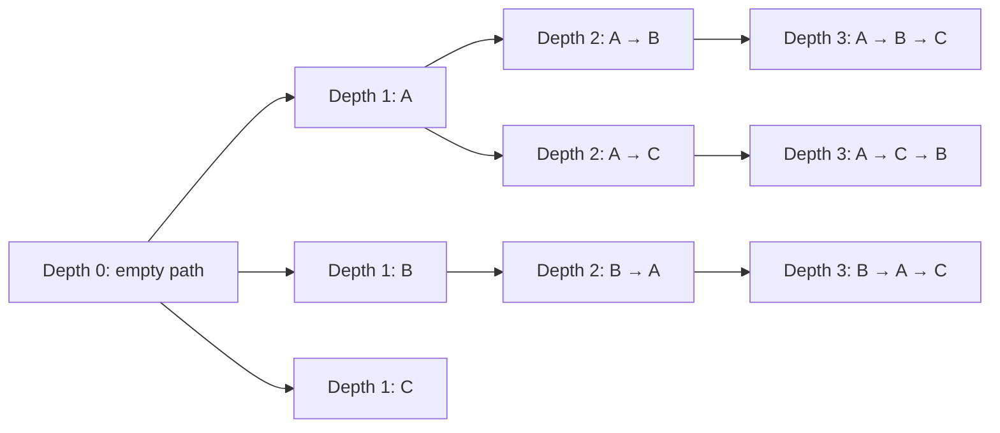
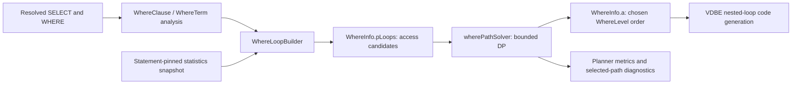
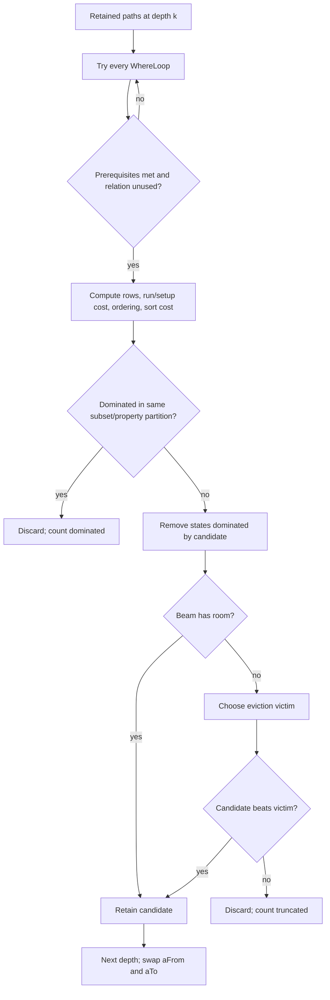

# Bounded DP Planner and Cost Model

This document describes the **current SQL WHERE planner** in
[`where.c`](../../src/box/sql/where.c) and its private structures in
[`whereInt.h`](../../src/box/sql/whereInt.h), as implemented on 2026-10-03.
It is an implementation specification, not a proposal for DPhyp or the new
single-table physical-plan producer. The planner enumerates access loops,
constructs left-deep nested-loop join orders with bounded **dynamic
programming (DP)**, and emits the chosen loop order to the existing VDBE code
generator.

## What “dynamic programming” means here

Dynamic programming solves a larger optimization problem by building on
solutions to smaller subproblems. Here the larger problem is: **choose one
access method for each FROM relation, and choose their outer-to-inner join
order, minimizing estimated work while respecting dependencies and requested
ordering**. A smaller subproblem is a partial join plan covering a subset of
relations. Its stored result is not just one cost: it includes estimated
output rows and ordering properties, because those change the cost of adding
the next relation.

The search is **bottom-up, not top-down**. It begins with an empty path, then
builds paths containing one relation, two relations, and so on until every
relation is present. At depth *k*, it extends each retained *k*-relation
path with every legal access loop for a relation not yet used. It never starts
with the full join and recursively asks for the best smaller join.

For a three-relation query, the search has this shape (some arrows may be
illegal because a loop needs another relation to run first):



`A → B` and `B → A` cover the same subset, but are different left-deep
execution orders. For example, if A has 1,000 rows and B has five, placing B
outside a keyed lookup into A may require only five lookups; placing A outside
may require 1,000. The model prices both *when their prefixes survive* and
can pick the cheaper complete path. Each partial path carries its accumulated
cost and row estimate forward, avoiding a fresh cost calculation for its
entire prefix every time another relation is appended.

**Does it examine every plan? No.** It tries every available WhereLoop against
every *retained* prefix at the next depth, but it does not retain every prefix.
It first removes dominated states and then applies a global beam-width cap.
If a promising prefix is discarded at depth *k*, none of its length-*k + 1*
or longer descendants is explored. The selected plan is therefore the least
estimated-cost plan **among retained complete paths**, not necessarily the
least-cost plan in the entire legal search space. The one-/two-/many-relation
beam defaults are 1/5/10, not `2^N` states or `N!` join orders.

**Where is the memo?** There is no persistent hash table keyed by every
relation subset, and no exhaustive per-subset memo. `wherePathSolver()`
uses two bounded arrays of `WherePath` records: `aFrom` is the retained
frontier at depth *k*; `aTo` collects depth *k + 1*. Each record stores the
prefix's relation mask, loop sequence, costs, row estimate, and order/reverse
properties. These records are the temporary, memo-like reuse of subproblem
results. Within a depth, paths with the same `(relation mask, satisfied order,
reverse-scan mask)` form a comparison partition; a path is dropped only if
another is no worse in total cost, unsorted cost, **and** output rows. Several
incomparable paths for one partition may survive. After the round, the arrays
swap roles; older-depth states are reused/overwritten, not kept as a complete
history. The global beam can also evict a partition entirely.

This is best described as **beam-limited, bottom-up join-order DP**: it reuses
partial solutions like dynamic programming, but sacrifices exhaustive search
and optimality guarantees for bounded planning work and memory.

## Scope and terminology

- A **relation** is one `FROM` item. Each item has a bit in a `Bitmask`.
- A **WhereLoop** is one possible access method for one relation: for example,
  a primary scan, a secondary-index equality lookup, a range scan, or an
  automatic-index lookup. Several loops may exist for the same relation.
- A **WherePath** is an ordered sequence of WhereLoops with no repeated
  relation. Its sequence is the outer-to-inner order of a nested-loop plan.
- A **beam** is the bounded set of partial WherePaths retained after one
  join-depth round. The beam is global, not one beam per relation subset.
- **DP** stands for dynamic programming; the concrete bottom-up and bounded
  behavior is described above.
- **LogEst** represents roughly `10 × log2(value)`. Ordinary addition of two
  LogEst values represents multiplication of their underlying linear values;
  `sqlLogEstAdd(x, y)` represents addition of those linear values. Values are
  rounded estimates, not measured runtime or calibrated time units.

The current WHERE DP and the newer M3 single-table physical producer are
different planner paths. The latter has limited cost-ranked secondary access
selection in `sql_physical_plan.c`; it does not replace this join-order DP.
The E1 decision about wider beam defaults and corpus-level plan quality is
also separate from whether the present DP cost model functions.

## Join coverage, size limit, and fallback behavior

The WHERE planner uses this DP to choose the outer-to-inner order for a
multi-relation `FROM` list. Its physical join operator is always a nested
loop: a `WhereLoop` specifies how to access the next relation, not a choice
between nested-loop, hash, and merge join algorithms. This distinction also
means that a supported SQL join is not necessarily freely reorderable.

| SQL construct | DP treatment |
| --- | --- |
| `INNER JOIN` and comma join | Supported; orders may be rearranged when predicate dependencies permit. |
| `CROSS JOIN` | Supported, but a prerequisite mask preserves the relevant left-to-right boundary. |
| `LEFT [OUTER] JOIN` | Supported with NULL-extension semantics; prerequisite masks prevent illegal movement of its right side ahead of the required left side. |
| `NATURAL JOIN` and `USING` | Supported; join/column resolution occurs before the WHERE planner sees the resulting predicates. Their underlying join type still determines ordering legality. |
| `RIGHT JOIN` and `FULL OUTER JOIN` | Rejected as unsupported before this DP runs. |
| Explicit `SEMI JOIN` or `ANTI JOIN` syntax | Unsupported. `EXISTS`, `NOT EXISTS`, and `IN` can express related semantics through subquery/set machinery; they are not additional physical join families in this DP. |

`sqlWhereBegin()` accepts at most `BMS = sizeof(Bitmask) * 8` `FROM` entries
in one planning invocation. The normal `u64` Bitmask makes this **64
relations**, or at most 63 binary join edges in a single flat join tree.
The limit applies to that invocation, not to a sum across separately planned
query blocks. Subquery flattening can change which entries end up in one
invocation. A build that overrides `SQL_BITMASK_TYPE` changes the limit with
the bitmask width. Exceeding the limit raises the SQL parser-limit error; it
does not invoke a different optimizer.

For every multi-relation invocation, `sqlWhereBegin()` builds WhereLoop
candidates and runs `wherePathSolver()`; a one-relation shortcut may bypass
it. There is **no relation-count threshold that switches from DP to a greedy,
genetic, or other faster join-order algorithm**. Instead, the DP is bounded
at *every* depth: by default it retains at most five paths for two relations
and ten paths for three through 64 relations. Thus 64 is a capacity limit,
not a promise to enumerate all legal orders or find a global optimum.



## Main data structures

| Structure | Relevant fields | Purpose |
| --- | --- | --- |
| `WhereTerm` | `pExpr`, `eOperator`, `truthProb`, `prereqRight`, `prereqAll`, `leftCursor` | One analyzed predicate or subterm. Dependency masks say which other relations must already be available before using it as an index constraint. |
| `WhereClause` | `a`, `nTerm`, `pOuter`, `pWInfo` | Container for analyzed terms, including nested OR/AND clauses. |
| `WhereLoopBuilder` | `pWC`, `pWInfo`, `pNew`, `pOrSet` | Mutable template and context used to generate and insert access candidates. `pOrSet` is the small special-purpose OR-cost accumulator. |
| `WhereLoop` | `iTab`, `maskSelf`, `prereq`, `index_def`, `wsFlags`, `aLTerm`, `nEq`, `rSetup`, `rRun`, `nOut`, `iSortIdx` | One access alternative. `rSetup` is one-time setup cost, `rRun` is per-invocation cost, and `nOut` is rows produced per invocation, all in LogEst units. |
| `WherePath` | `maskLoop`, `aLoop`, `nRow`, `rUnsorted`, `rCost`, `isOrdered`, `revLoop` | A partial or complete join plan. `aLoop` is the ordered access sequence; `maskLoop` is its relation subset; the remaining fields are accumulated cardinality, costs, and order properties. |
| `WhereInfo` | `pLoops`, `pTabList`, `pOrderBy`, `nLevel`, `a`, `nRowOut`, `nOBSat` | Whole WHERE-planning invocation. `pLoops` owns candidate loops; `a` receives the winning order as `WhereLevel` records for code generation. |
| `WhereLevel` | `pWLoop`, `iFrom`, VDBE cursor/jump fields | One chosen executable loop level. `WhereInfo.a[0]` is outermost. |

`WhereLoop` candidates are held in a linked list at `WhereInfo.pLoops`.
`whereLoopInsert()` discards or replaces dominated access alternatives before
the path solver starts, provided their relation, sort property, prerequisites,
setup/run costs, and output estimates make the comparison valid. This is a
separate pruning stage from WherePath beam admission. OR branches use
`WhereOrSet`, which retains at most `N_OR_COST = 3` prerequisite/run/output
entries before constructing an OR access alternative.
`WhereMaskSet` maps sparse VDBE cursor numbers onto dense relation bits; the
join size is limited by the width of those dependency masks (normally 64).
`isOrdered` is the satisfied ORDER BY prefix length, or `-1` while unknown;
`revLoop` tracks which loop traversals must run backward.

The solver allocates two arrays of `WherePath` entries, `aFrom` and `aTo`,
plus contiguous storage for each entry's `aLoop` pointers. It swaps the two
arrays after every depth. An optional `aSortCost` array caches sorting costs
by number of ORDER BY terms already satisfied. Peak solver-frontier storage
is proportional to `2 × beam_width × join_depth`, plus the sort cache and
the separately allocated WhereLoop list.

## Candidate generation and statistics

`whereLoopAddAll()` generates alternatives for each relation. The B-tree
builder considers full scans, index equality and range constraints, and
eligible automatic indexes. A loop's `prereq` includes dependencies from
join terms: a lookup using `inner.key = outer.key` cannot be placed before
the outer relation. The planner also retains alternatives with different
ordering properties when neither dominates the other.

For ordinary index loops, `whereLoopAddBtreeIndex()` estimates rows visited
and then computes `rRun`. The current model uses:

1. Index/relation population and average rows per index-key prefix from the
   VDBE's immutable, schema-validated statistics snapshot when available.
   `index_field_tuple_est_with_snapshot(index, 0)` estimates the population;
   higher prefix lengths estimate matching rows. Missing or stale entries
   retain the legacy default estimates.
2. For a supported literal equality on the leading part of a non-unique
   index, the pinned SpaceSaving MCV interval midpoint can replace the
   prefix average. The supported literal types are integer/unsigned,
   Boolean, and binary-collated string. The estimate has a one-row floor.
   Bind parameters, computed constants, and unsupported types keep the
   existing estimate. An explicit `likelihood()` truth probability takes
   precedence over this MCV path.
3. Range and residual predicates use existing reduction heuristics;
   histogram-backed range selectivity and join-correlation estimation are
   not yet integrated into this cost model.

The B-tree cost is heuristic. In the code's approximate linear interpretation,
a full scan is proportional to rows visited, with a penalty for a secondary
index scan. A constrained index lookup pays a seek term plus row-visitation
cost; a non-covering lookup also pays main-table fetch cost. `IN` multiplies
the estimated number of seeks. Automatic indexes carry an `rSetup` cost for
building the transient index. The code converts these terms to LogEst and
combines them with `sqlLogEstAdd()`. These costs are relative scores, not
durations in microseconds. The precise constants and branches are in
`whereLoopAddBtree()` and `whereLoopAddBtreeIndex()`; they are intentionally
subject to calibration rather than a stable external API.

## DP state transition

`wherePathSolver()` receives the complete candidate list and a requested
output-row estimate for sorting. It starts with one empty path. The seed's
`nRow` is `min(pParse->nQueryLoop, LogEst(28))`: this accounts for the number
of times the WHERE subprogram may be invoked from an outer context and caps
the automatic-index payback horizon. For each join depth it tries every
retained path with every WhereLoop.

A candidate extension is legal only if:

- every bit in `loop.prereq` is already in `path.maskLoop`;
- `loop.maskSelf` is not yet in `path.maskLoop`;
- an automatic-index loop is not used when the outer path is estimated to run
  fewer than two times.

Join predicates and outer-join restrictions feed the prerequisite masks, so
the solver cannot fix a dependency violation by assigning a low cost to an
otherwise illegal order. Each legal extension adds exactly one new relation.

The central recurrence, in the code's LogEst arithmetic, is:

```text
new_subset      = old.maskLoop | loop.maskSelf
new_rows        = old.nRow + loop.nOut
new_unsorted    = logAdd(loop.rSetup,
                         loop.rRun + old.nRow)
new_unsorted    = logAdd(new_unsorted, old.rUnsorted)
new_cost        = logAdd(new_unsorted, sort_cost)
                  if the required ordering is not fully satisfied;
                  otherwise new_unsorted
```

Here `logAdd` means `sqlLogEstAdd`. Thus `loop.rRun + old.nRow` models running
the inner access once per estimated outer row; `new_rows` models the product
of outer and per-invocation output cardinality. `rSetup` is charged once for
that loop, and prior work remains in `old.rUnsorted`. The planner then checks
ORDER BY satisfaction (including possible reverse index traversal), assigns
`isOrdered`/`revLoop`, and adds sorting cost when needed. Sorting estimates
follow roughly `3 × N × log(N)`, scaled for an already-sorted prefix and
limited by eligible LIMIT information.

The search loop can be summarized without its VDBE-specific bookkeeping:

```text
frontier = { empty_path }
for depth = 1 .. relation_count:
    next = {}
    for path in frontier:
        for loop in WhereInfo.pLoops:
            if dependencies_are_met(path, loop) and relation_is_unused(path, loop):
                candidate = extend_and_price(path, loop)
                admit_by_partition_dominance_and_global_beam(next, candidate)
    frontier = next
winner = first_minimum(frontier, path.rCost)
copy winner.aLoop into WhereInfo.a
```



## Dominance and bounded admission

Two paths are comparable for path-level dominance only when they have the
same relation-subset mask, same number of satisfied ORDER BY terms, and same
reverse-scan mask. Inside that partition, a path dominates another when its
`rCost`, `rUnsorted`, **and** `nRow` are all no greater. An incomparable path
can be worth retaining even if it currently costs more: it may have a smaller
intermediate result or unsorted cost that pays off after a future loop.

The beam width is global for each depth. Defaults are **1** for one relation,
**5** for two, and **10** for three or more. Process-start environment values
`SQL_PATH_SOLVER_WIDTH_ONE`, `_TWO`, and `_MANY` may override these with
integers in `1..64`; malformed or out-of-range values use the defaults. They
are read lazily once per process, not changed per SQL session.

When a full beam receives a non-dominated candidate, admission first prefers
evicting the worst member of a partition with at least two retained paths.
If every path is a partition singleton, it considers the globally worst path.
"Worst" compares `rCost`, then `nRow`. The new candidate replaces the victim
only when it wins that comparison; otherwise the new candidate is truncated.
This rule encourages subset/property diversity but does **not** promise that
every partition survives. At the final depth, the solver chooses the
retained path with the lowest `rCost`; an equal-cost tie keeps the earlier
retained path. Enumeration/insertion order therefore remains relevant to
ties; there is no independent canonical-fingerprint tie-break for joins.

The beam prevents the factorial number of join orders from being retained.
Each round still scans every retained prefix against the candidate-loop list,
and the full-beam duplicate-partition victim search compares retained pairs.
With beam width `B`, `L` candidate loops, and `J` relation levels, the solver
uses `O(B × J)` frontier pointers and has a coarse worst-case search bound of
`O(J × B × L × B²)` before accounting for ordering checks. The bound is an
implementation upper bound, not a claim of exhaustive DP optimality.

## ORDER BY, shortcut, and output

When an ORDER BY clause is present, `sqlWhereBegin()` calls the solver twice.
The first call uses `nRowEst = 0` and ignores sorting to estimate output rows;
the second uses that estimate and includes order/sort costs. The second
selection supplies the executable plan. A one-relation shortcut may bypass
the general WhereLoop enumeration and solver; multi-relation joins use it.

After the last round, each winning `aLoop[i]` is copied to
`WhereInfo.a[i].pWLoop`, with the matching FROM position and cursor. The
order of `WhereInfo.a` is the outer-to-inner VDBE loop nesting; the chosen
`nRow` becomes `WhereInfo.nRowOut`. The solver itself does not execute a
query. The WHERE code generator opens cursors, emits seeks/iterations and
predicate tests, and closes the loops using this chosen plan.

Per-statement instrumentation counts paths **generated**, **dominated**,
**truncated**, and **retained**. `EXPLAIN (planner = 'snapshot')` can expose
those metrics. The final-path replay-candidate capture is narrower than the
DP: it records only an ordinary one-relation final beam, not joins or OR
sub-solvers. Its fingerprints and selected-path metadata must not be treated
as a complete multi-relation DP trace.

## Observed behavior and remaining limits

[`sql_stats_test.lua`](../../test/sql-luatest/sql_stats_test.lua) contains live
volatile-ANALYZE regressions on both memtx
and Vinyl. With 100 rows joined to five rows, a no-statistics plan starts at
the first table; after ANALYZE the DP starts at the five-row table. A second
same-size, skewed fixture changes from an approximately ten-row index lookup
on the first table to an MCV-backed approximately one-row lookup on the
second. Both keep the same SQL result. A schema change that stales the
snapshot restores the default plan. These tests demonstrate that statistics
alter WhereLoop costs **and** the bounded DP's chosen join order.

| Two-relation fixture | Without fresh statistics | After volatile ANALYZE | Result |
| --- | --- | --- | --- |
| 100-row `a` joined to five-row `b` on primary key | Scan `a` first; default scan estimate ~1,048,576 rows | Scan `b` first; estimate ~5 rows | IDs 1–5 in both plans |
| Equally sized tables, `a.v = 1` matches 90 rows, `b.v = 1` matches one | Start with `a`'s index; default equality estimate ~10 rows | Start with `b`'s index; MCV estimate ~1 row | ID 1 in both plans |

They do not establish globally optimal plans, calibrated I/O/CPU units,
correlated-join estimates, histogram range estimates, end-to-end speedup, or
E1 acceptance. In particular, persistent statistics formats remain behind
their separate human sign-off gate; the demonstrated collection path is the
volatile TEST_BUILD ANALYZE implementation. The current production beam
defaults remain 1/5/10 until the workload-level quality and latency gates in
[`roadmap.md`](roadmap.md) are reviewed.
