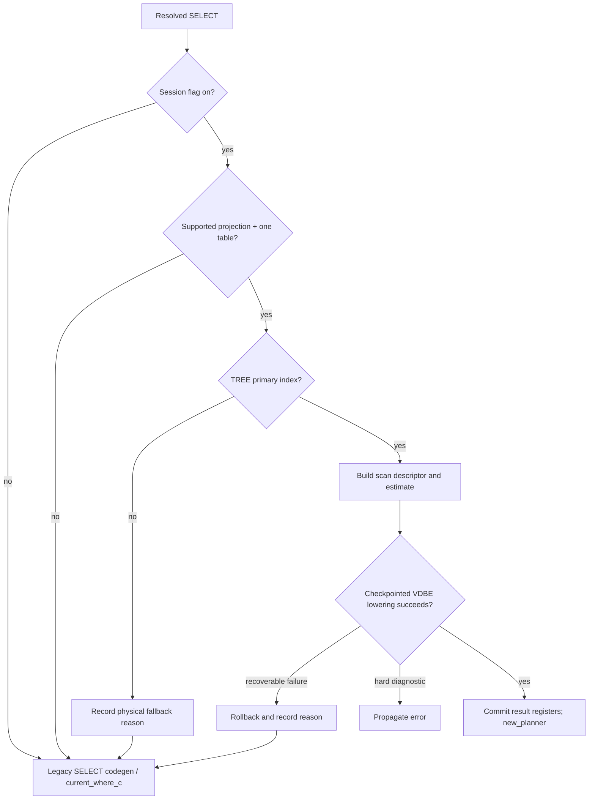

# Physical Plan Descriptor

## Expression normalization prerequisite

`sql_expr_canonicalize()` returns an owned structural encoding for resolved
columns, NULL/integer/finite-float/string/BLOB/boolean constants, and a fixed
scalar operator set. The narrow executable single-table route uses it to own
projection and residual-filter expression references and to resolve those
references back to the original SELECT expressions during VDBE lowering. It
rejects function calls, reduced/token-only nodes, flags outside its allowlist,
and unknown operators.
For resolved column references only, `EP_Lookup2` and `EP_NoReduce` are
accepted because they retain no semantic effect after name resolution; the
same bits remain rejected on other operators.
Expr exposes function source tokens but does not by itself prove a stable
function identity or absence of side effects. The helper is not wired into
descriptor expression references, resolver routing, or lowering. Column
encoding requires a caller-supplied cursor-to-logical-relation ordinal map
and emits that ordinal, not Expr.iTable. Stability therefore holds only
under the same relation binding; this is not a universal cross-statement
fingerprint and does not by itself prove that arbitrary expression evaluation
is safe for planner execution.

## Status

`PROTOTYPE` — the immutable C descriptor API validates and deep-copies the
single-table v1 shape and is connected to a feature-gated producer/lowering
route for a bounded subset of SELECTs. Complete producer coverage, broader
operator and access-path support, full parity acceptance, and general
MsgPack/YAML plan serialization remain open. Joins, aggregates, and subqueries
extend the schema in later versions.

M3.3 adds a separately testable physical selector: given a supported logical
chain and access candidates supplied by fixed/current estimates, it chooses
the least estimated total cost (stable ties by access kind then index ID) and
builds this descriptor. It handles primary/secondary point lookup, range,
index full scan, and table full scan. This remains an explicit candidate
interface, not SQL expression analysis or `where.c` routing; the current
logical IR does not consume the isolated `sql_expr_canonicalize()` helper.
Descriptor expression references therefore still lack stable normalized
identities, and this selector is not a detached normalized-input model for
M1 replay.

M3.4 adds `sql_plan_lower()`, an ordered callback contract over a descriptor:
scan, each residual filter, projection, each finalize operator (sort/limit),
then result. The unit test fixes ordering and callback error propagation. This
is not an executable bytecode builder and does not call Tarantool's VDBE APIs.
In particular, expression compilation, cursor allocation/opening, engine
specific seek loops, sorter setup/comparison, limit registers, and SQL result
delivery are not implemented. It is a boundary prototype only; parity and
production `where.c` routing remain mandatory before M3 can be considered
integrated.

#### M3.4 executable-lowering feasibility audit (historical, 2026-09-27)

This source audit predates the production SELECT route described below and is
retained as implementation history, not current status. Its statement that no
safe executable slice exists is superseded by the later producer/lowering
sections.

No safe executable-lowering slice can currently be added as an isolated
consumer of the descriptor. The code-path boundary is concrete:

- `sql_select_record_fallback()` in `select.c` builds a logical plan only for
  classification and immediately deletes it; it does not build or retain a
  physical descriptor. `sql_plan_producer_result_init()` is only a result
  wrapper and has unit-test callers, not a production SELECT caller.
- `sql_physical_plan_from_logical()` requires its caller to supply a candidate
  array and candidate-owned expressions. Its repository callers are tests;
  there is no production access-candidate provider or mapping from resolved
  `Expr` trees to descriptor expression references.
- The actual SELECT bytecode path in `select.c` calls `sqlWhereBegin()`
  (ordinary SELECT loop), `selectInnerLoop()` (row/filter/projection/result
  work), and `sqlWhereEnd()`. `sqlWhereBegin()` in `where.c` owns legacy
  cursor/loop selection and emits code while preparing that path. The current
  callback lowerer has no VDBE, `Parse`, cursor, or result-destination
  context, and a callback failure after emission cannot be rolled back into
  `where.c` safely.

Therefore even a table-full-scan-only route needs a production producer that
constructs and validates a descriptor before any bytecode is emitted, a
statement-lifetime expression/register mapping, explicit engine cursor/open/
iteration semantics, and a transactional dispatch boundary that guarantees
fallback only before emission. Without these, claiming all-or-nothing
lowering or parity would be false. Keep the contract prototype, but keep
executable M3.4, successful new-planner routing, and the M3.7 feature flag
open. The next independently testable step is a VDBE builder contract with
preflight validation and explicit emission-failure semantics; live routing
must wait until the producer and expression bindings exist.

#### Smallest candidate and blocking VDBE primitive

The smallest plausible single-table candidate is `SELECT c FROM t` with no
predicate, ordering, or limit and an ordinary output destination. It would
need to produce one complete VDBE loop: open the base-space primary index,
rewind, load column `c`, return a row, advance, and halt. Existing equivalents
are split across three owners: `sqlWhereBegin()` in `where.c` opens the table
cursor via `vdbe_emit_open_cursor()` (`OP_OpenSpace` plus `OP_IteratorOpen`);
`wherecode.c` emits the full-scan `OP_Rewind`/`OP_Next` loop; and
`selectInnerLoop()` in `select.c` compiles the projection and
`OP_ResultRow`. The cursor number, result register range, loop labels, and
destination semantics come from `Parse`/`SrcList`/`WhereInfo`, not from the
current descriptor. The descriptor also has no binding from canonical
expression refs back to resolved `Expr` nodes, so even column `c` cannot yet
be compiled from descriptor contents.

The failure-safety primitive now exists as `vdbe_codegen_checkpoint`: it
captures the opcode boundary and the relevant `Parse` register/cursor,
label, expression-cache, temporary-register, and abort state. Rollback frees
owned P4/comment payloads and clears the speculative opcode suffix. It restores
`Parse.is_aborted` when the fiber diagnostic is unchanged, but preserves hard
failure state when that diagnostic differs from the checkpoint boundary. The
boundary error is retained while the checkpoint is live, so an unchanged
pre-existing diagnostic is not mistaken for a new failure. Rollback cannot
silently turn a codegen error into legacy fallback. Focused unit tests cover
these cases and commit.
This checkpoint intentionally does not cover arbitrary parser/AST mutations,
schema side effects, or VDBE metadata, so it is not yet sufficient to wrap
the complete SELECT integration path. Producer/expression/cursor/result
bindings and boundaries around other mutable state remain limitations. This
is not a claim that existing VDBE opcodes cannot express the scan.

`sql_plan_lower_vdbe_table_scan()` is a first opcode-emitting backend slice.
For a `SQL_PLAN_TABLE_FULL_SCAN` descriptor with direct projection columns and
no filters or finalizers, it emits the cursor loop and result-row opcode.
Ascending scans use `OP_Rewind`/`OP_Next`; descending scans use
`OP_Last`/`OP_Prev`. The caller remains responsible for opening the cursor,
allocating the output register range, and setting SQL result metadata. Shape
and integer-range validation happen before emission; codegen failures roll
back the opcode suffix through the checkpoint. Twelve unit checks inspect the
actual opcode sequence and reject unsupported shapes without VDBE mutation.
At this initial backend checkpoint it had no active SQL caller and had not
been validated against storage. Later sections record the feature-gated
producer integration and subsequent result-parity evidence; this original
unit evidence is not itself the parity or M3.4 closure gate.

The point-lookup lowerer also has a deterministic recoverable rejection after
emission: a descriptor with a `UINT32_MAX` projection column emits its key
constant and `OP_NotFound`, then rejects the column before emitting it. The
unit regression uses the wide-key P4 form and checks that rollback restores
the relevant `Parse` register/cursor/label/cache counters and column-cache
bytes, preserves the preexisting final opcode, and clears both speculative
opcode slots (including P4 ownership). This exercises the real rejection path;
there is no test-only production hook and no simulated `sqlVdbeAddOp*`
allocation failure. It checks only the state covered by
`vdbe_codegen_checkpoint`; arbitrary parser/AST/schema mutations and VDBE
metadata are outside that rollback contract.

#### `sqlSelect()` preflight prerequisite

`sql_select_preflight_table_scan()` is a side-effect-free predicate for the
narrow producer class: a resolved one-base-table SELECT, direct column
references bound to that source cursor, and `SRT_Output` destination, with no
unsupported shape. Its bounded filter grammar admits primary-key bounds,
unary `IS NULL` / `IS NOT NULL` column tests, and direct comparison operators
(`=`, `<>`, `<`, `<=`, `>`, `>=`) between a source column and a constant
expression accepted by the canonicalizer and containing no column, variable,
or function reference. This includes scalar literals and supported
literal-only arithmetic/concatenation expressions. Direct `BETWEEN` and
`NOT BETWEEN` use two such bounds. Direct `IN` / `NOT IN` lists contain one
or more canonical constant expressions; `IN (SELECT ...)` remains unsupported.
Reversed constant/column comparisons are
preserved as expressions and evaluated by SQL expression codegen. The
primary-key NULL tests use
the schema invariant (identity or empty result); direct non-primary column
tests on a full scan are represented as typed residual filters and lowered
with `Column` plus a null-branch opcode. Up to eight such non-primary residual
filters may be combined with a supported point, one-part range, or composite
prefix scan/range. Up to eight scalar-comparison residuals may likewise be
combined with supported access bounds. A compound `AND`/`OR` tree, or unary
`NOT` over that tree, is admitted as one expression filter only when each leaf
is a direct source-column comparison, BETWEEN with supported constant
expression bounds, IN with canonical constant-list members, or a direct
`IS NULL` / `IS NOT NULL` test. Expression
filters are referenced by
the immutable descriptor and resolved against the original WHERE tree only
when lowering; their bytecode executes before projection, and `IfNot` rejects
both false and NULL results. Simple primary-key conjuncts continue through the
bound grammar; comparisons inside an admitted compound boolean filter tree
are evaluated as residual expressions. Column-to-column comparisons,
collated expressions, function calls, and boolean trees with unsupported
leaves are not admitted.
On a prefix scan, equality-prefix and range-end guards run before residual
checks; a rejected in-range row jumps to the cursor step, not
the loop exit. IN forms outside the direct-column/constant-list contract,
BETWEEN forms outside the direct-column/two-constant contract, and compound
predicates outside that bounded boolean grammar remain unsupported. In an AND
conjunction, `IS NOT NULL` on any composite primary-key
part is redundant and is omitted; `IS NULL` on a composite key inside a
conjunction remains a stable fallback rather than allowing the invariant to
hide an unsupported sibling. Literal nonnegative LIMIT and optional OFFSET
are passed to the producer for range validation. It runs at
`sqlSelect()` entry before the select ID is advanced or that function emits
preamble VDBE.
Explicit reject values distinguish unresolved input, destination, relation,
shape, projection, and column-binding failures. The unit test asserts accepted
and rejected classes and byte-for-byte input immutability. A SQL regression
exercises an eligible query and rejected filtered/computed forms; all still
execute through legacy codegen and report `current_where_c` where applicable.
Positive certification skips the pre-optimization structural fallback walk,
which cannot reject this exact query shape; it does not select alternate
codegen. It does not establish rollback completeness, VDBE parity, or M3.4
completion.

#### Producer-side full-scan slice

`sql_physical_table_scan_from_select()` now derives a table-full-scan
descriptor for resolved `SELECT column[, ...] FROM t` statements with no
predicate. Ordering is accepted only for one direct reference to the single
primary-key part; scan direction then satisfies the order without a sorter.
It accepts a nonnegative signed-64-bit integer-literal LIMIT and optional
OFFSET, retaining them as a `Limit` finalizer. Values above `INT_MAX` use
unsigned `OP_Int64` counter initialization; larger descriptor values are
rejected before VDBE mutation. Other LIMIT/OFFSET expressions fail closed. It
validates every projected
column's cursor binding and ordinal before creating the descriptor, and requires
caller-supplied statement-time estimates. Unit coverage checks projection
order, access kind, cursor binding, and rejection before descriptor creation
for a filtered statement or mismatched cursor. It is now consumed by a
separate narrow `sqlSelect()` integration when
`sql_new_planner_single_table` is enabled. That route supplies the statement
estimate from the primary index size, allocates projection registers,
opens/closes the cursor, invokes the VDBE table-scan lowering under a codegen
checkpoint, and commits `SelectDest` metadata only after successful emission.
Focused SQL execution passes for memtx and Vinyl, including NULL,
empty-table, `LIMIT 0`, `LIMIT 1`, `LIMIT 1 OFFSET 1`, and descending primary-
key order with LIMIT cases. `primary_key_part IS NOT NULL` retains the full
scan, while `primary_key_part IS NULL` lowers as a zero-row `Limit` finalizer;
both invariants apply to non-leading parts of composite primary keys. Direct
non-primary `IS NULL` and `IS NOT NULL` predicates are also supported on full
scans; descriptor filter operations distinguish expression, null, and
non-null tests, and the VDBE branch skips to the next cursor row. A single
direct non-primary NULL test may also be conjoined with one or two bounds on a
single-part INTEGER/UNSIGNED primary key. For bounded ranges, the range-end
check precedes residual filtering so rows outside the access interval always
terminate the walk; rejected in-range rows skip to `Next`. SQL tests pin exact
flag-off/on/off parity on memtx and Vinyl, with exact generated/CnP snapshot
parity (85 snapshots per engine). Literal LIMIT/OFFSET is applied only after
the key-range and NULL predicates; a duplicate residual NULL test stays on
the `UNSUPPORTED_FILTER` fallback. Composite-prefix scan/range tests cover
`IS NULL` and `IS NOT NULL`, including descending scans and LIMIT/OFFSET, on
memtx and Vinyl with exact generated/CnP snapshots. Direct non-primary
comparisons to scalar literals or supported constant expressions use the
expression filter form. Memtx/Vinyl coverage includes equality, inequality,
ordered/reversed operands, BLOB and boolean literals, constant
arithmetic/concatenation, BETWEEN/NOT BETWEEN, IN/NOT IN (including NULL list
members and OR combinations), bounded OR/NOT trees, and mixed primary-key-bound
and composite-prefix access cases with exact generated/CnP parity (655 snapshots
per engine). Boolean trees with unsupported leaves and other scalar
expressions remain on legacy codegen. A TEXT
primary key also uses the ordered
new-planner scan path and preserves descending order with LIMIT on memtx and
Vinyl. The disabled route currently classifies this ordered scan as
`fallback / UNSUPPORTED_EXPRESSION`; a successful enabled route has no
fallback reason.
M3.4 remains open: estimates are coarse, only direct projections over primary
table scans and bounded primary/secondary integer access paths are routed,
broader storage/parity/capture coverage remains, and the checkpoint does not
restore arbitrary AST/schema mutations. This producer does not alter
replay-envelope completeness.

#### Integer primary-key point lookup

The executable producer also accepts narrowly constrained equality filters.
For a one-part primary key, the predicate must compare its INTEGER or UNSIGNED
column with a resolved integer literal in that type's range (signed 64-bit or
unsigned 64-bit, respectively). For a composite primary key, it accepts a
conjunction containing one equality for every key part, provided all key parts
are INTEGER or UNSIGNED and the complete conjunction has at most 255 terms;
term order is independent of key order. The immutable descriptor owns one
typed key value and equality bound per key part. VDBE lowering emits one key
register per part, a `NotFound` seek with the composite arity, direct
projected-column reads, and `ResultRow`. Equality on the leading part alone
remains a prefix range rather than a point lookup. Literal LIMIT/OFFSET are
supported: positive LIMIT with no offset
returns the matching row, while LIMIT 0 or positive OFFSET skips the seek and
result. ORDER BY is accepted only on the primary-key column and is redundant
for the single-row result. Other filter shapes remain on legacy codegen (with
the stable UNSUPPORTED_FILTER reason for unsupported filters). The SQL
regression exercises hit, miss, positive and negative wide signed keys,
UNSIGNED keys above `INT64_MAX` through `UINT64_MAX`, negative UNSIGNED
fallback, and SQL rejection of literals above `UINT64_MAX`, LIMIT/OFFSET,
primary-key ordering, and unsupported-filter fallback cases on both memtx and
Vinyl. Composite point tests cover two- and three-part keys on both engines,
including predicate reordering, an unsigned maximum, a hit/miss, and an
incomplete-key fallback. Parameters and expression evaluation remain
unsupported.

#### Secondary-index equality scan

The executable route supports equality on a TREE secondary index with either
one key part or a complete composite key of INTEGER/UNSIGNED parts. Every key
part must have a direct equality predicate to a resolved integer literal in
that field type's range, including `UINT64_MAX` for UNSIGNED fields. Composite
predicates may appear in any order; partial composite keys are not access
paths. The descriptor identifies the index and the typed equality bounds in
index-part order. Lowering seeks to the start of the equality run using the
complete key arity, stops when the indexed key changes, extracts the complete
primary key for each secondary entry, then fetches the base tuple before
evaluating residual filters or projecting columns. This is an equality *scan*,
not a point lookup:
non-unique indexes must return every matching tuple. Other predicates in an
AND conjunction remain residual filters. Duplicate-key, reverse-operand,
miss, SQL-NULL fail-closed, contradictory equality, primary-key conjunction,
residual-filter, and LIMIT/OFFSET cases are covered on memtx and Vinyl.
Partial composite equality keys, collation overrides, OR/IN access, and
non-integer key values remain unsupported and use the legacy path.

#### Secondary-index range scan

The range route supports one-sided or two-sided literal bounds on the first
key part of an ascending or descending TREE secondary index, including the
leading part of a composite index. That part must be INTEGER or UNSIGNED; predicates may use
either operand order, and multiple bounds on the same side are reduced to the
strongest endpoint while the remaining predicates stay as residual filters.
The lowerer seeks at the selected endpoint, walks in index order (or backward
for an upper-only range), resolves the full primary key, fetches the base row,
then applies residual filters and LIMIT/OFFSET. Upper-only reverse walks stop
at NULL keys so SQL three-valued comparison semantics are preserved. Focused
memtx/Vinyl off/on/off tests cover exclusive and inclusive endpoints, bounded
and one-sided ranges, signed/unsigned keys including `UINT64_MAX`, duplicate
values, residual bounds, LIMIT/OFFSET, and selected-index evidence from
`EXPLAIN QUERY PLAN`. Collation overrides, non-integer key parts, and ranges on
non-leading composite parts remain outside this route. A one-term `ORDER BY`
on the indexed leading field is also satisfied when the scan can start at its
available endpoint: lower-only ranges support logical ASC, upper-only ranges
support logical DESC, and bounded ranges support either direction. Physical
cursor direction is mapped through the index key's declared ASC/DESC order;
for DESC keys, seek comparison operators are inverted while strict/inclusive
SQL endpoints and the opposite-bound guard retain their logical meaning.
Bounded and upper-only scans stop at the opposite endpoint or a NULL key so
SQL three-valued comparison semantics are preserved. Focused
tests cover both logical range directions and ensure NULL keys do not leak
through reverse traversal.

For a composite TREE index, the range may instead target the first unfixed
part after one or more complete leading INTEGER/UNSIGNED equality parts. The
descriptor carries each typed prefix value separately from the suffix range
bounds; the lowerer seeks with prefix-plus-range arity and independently
guards both the equality prefix and the bounded endpoint. A one-sided range
walk is accepted only when its effective SQL direction proceeds into the
qualifying interval. A single-term `ORDER BY` on the ranged suffix is
supported when it matches the available traversal. Incomplete prefixes,
unsupported key types, and ranges that skip an index part remain on legacy
codegen. Focused memtx/Vinyl coverage checks bounded and upper-only suffix
ranges, duplicate prefix matches, suffix ordering, and both ascending and
descending composite index definitions. A three-part `(INTEGER, UNSIGNED,
INTEGER)` index fixture also exercises two equality-prefix values before the
ranged suffix. The VDBE unit pins seek arity and prefix/range guards.

#### Secondary-index ordered full scan

A single-table SELECT may satisfy an `ORDER BY` matching a
leading prefix of a TREE secondary index when the requested per-term
directions match the index's declared directions or their complete inverse,
provided no more
selective primary/secondary point, range, or prefix access path is applicable.
With no WHERE predicate this is a predicate-free full scan; a supported
residual predicate is evaluated after each secondary entry has been resolved
to its base row (direct string equality/inequality and `IN` are covered).
Every term must match its index key part in order. Mixed directions are
supported only when they match the key definition (or invert every term for a
reverse walk); arbitrary mixed patterns still fall back. The
full-scan access descriptor carries the selected index ID and produced-order
terms; its direction chooses `Rewind`/`Next` or `Last`/`Prev`. Each secondary
entry is resolved through its complete primary key before projection. The
route applies literal LIMIT/OFFSET after residual filtering, but does not claim
support for arbitrary predicates or non-prefix order. The scan direction is
mapped relative to each matched index part, so both uniform and mixed key
directions can be walked forward or backward as one physical traversal. The preflight derives order capacity from
the matched secondary key, not the (possibly shorter) primary key. Mixed-
direction patterns that do not match the key definition remain unsupported.
Memtx/Vinyl tests cover one- and
two-term orders in both directions, including a descending-only composite
index, duplicate key values, an unsigned maximum suffix, NULL placement at
both ends of the order (including a nullable descending-only index), and
LIMIT/OFFSET.

For a composite key with at least three parts, equality on a proper leading
prefix of two or more INTEGER/UNSIGNED parts uses a dedicated prefix scan. It
seeks with the entire prefix key and compares each prefix column on every row,
exiting at the first mismatch. Literal LIMIT/OFFSET are supported, including
zero LIMIT (no seek) and positive OFFSET. The same ascending key walk satisfies
an ascending ORDER BY over either the unfixed contiguous suffix or a contiguous
leading key prefix (including the equality-fixed parts). For a prefix scan with
at least one unfixed key part, descending order over the contiguous suffix is
also supported: it seeks with `OP_SeekLE` on the equality prefix, walks with
`Prev`, and exits at the first prefix mismatch. Literal LIMIT/OFFSET apply to
the reverse walk. Mixed directions and unrelated orderings remain on legacy
codegen with a stable fallback reason.
Memtx/Vinyl tests cover reordered
equalities, empty and non-empty prefixes, UINT64_MAX, LIMIT/OFFSET, and
non-leading fallback.

A contiguous equality prefix may also be followed by one or more lower bounds,
one or more upper bounds, or both on the next INTEGER/UNSIGNED primary-key
part. Same-side bounds are intersected to retain the strongest endpoint. The
descriptor retains prefix equalities separately from suffix bounds. The lower
endpoint extends the composite `SeekGT` / `SeekGE` key; an upper bound stops the
ascending walk after the equality-prefix guard. Descending ordering is also
supported when the suffix has an upper endpoint: the producer seeks from that
endpoint and walks with `Prev`, stopping at the lower endpoint for a bounded
range or at the equality-prefix boundary for an upper-only range. A descending
lower-only range seeks with `OP_SeekLE` using only the equality-prefix key,
then walks backward. The prefix and lower-bound guards stop before projection
when the cursor leaves the prefix or crosses the bound; no synthetic maximum
suffix key is needed. The isolated `planner_composite_prefix_range_test.lua`
covers each bound form off/on/off on memtx and Vinyl, including descending
upper-only, lower-only, and bounded ranges, inclusive/exclusive endpoints,
unsigned values above `INT64_MAX`, a three-part suffix range, and a literal-left
comparison whose resolved expression is commuted by the parser. The same
fixture checks descending suffix order over an equality-only prefix, including
LIMIT/OFFSET, on both engines. The expanded
fixture passes generated, CnP, and repeated-generated capture on both engines
with exact 240/240 snapshot parity for both comparisons; CnP execution was
observed. LLVM was not run because this build has JIT disabled. Gaps in the
equality prefix remain unsupported.

The composite suffix-range producer also accepts multiple literal bounds on
the same suffix part. It intersects same-side bounds by retaining the strongest
endpoint, with strictness taking precedence at equal values. Focused
memtx/Vinyl off/on tests cover stronger/weaker lower and upper bounds, mixed
strict/inclusive duplicates, and an empty intersection. Generated/CnP capture
validates 312 statements per engine with exact 312/312 parity and observed CnP
execution. The same bound reducer now handles single-part primary-key ranges
and ranges on the leading part of a composite key. Additional memtx/Vinyl tests
cover lower/upper intersections, strongest-bound selection, strictness,
descending upper-only scans, and empty intersections; generated/CnP capture
validates 408 statements per engine with exact 408/408 parity and observed CnP
execution. Range predicates split across multiple key parts remain unsupported.

The production route also supports one-sided and two-sided INTEGER and
UNSIGNED primary-key literal ranges (`>`, `>=`, `<`, `<=`), including reversed
operand order. A two-sided range must be a conjunction of one lower and one
upper literal bound on the same primary-key part; repeated bounds on that part
are intersected by retaining the strongest endpoint. Bounds split across
different key parts and equality/range mixtures on one part fall back. It seeks
from the endpoint matching scan direction and checks the
opposite endpoint before projecting each row. One-sided scans emit
`OP_SeekGT`/`OP_SeekGE`/`OP_SeekLT`/`OP_SeekLE` followed by `Next` or `Prev`;
an explicit primary-key order must agree with the natural one-sided direction.
UNSIGNED keys retain their full uint64 representation in the seek register,
including values above `INT64_MAX`. Negative UNSIGNED values fail closed to
legacy codegen; a literal above `UINT64_MAX` is rejected by SQL parsing before
planning. LIMIT and OFFSET share the scan-loop implementation. Parameters,
expressions, bounds split across multiple key parts, equality/range mixtures,
and non-primary columns remain fallback cases. Focused memtx/Vinyl SQL regressions
cover strict/inclusive one- and two-sided bounds, reversed operands, ascending
and descending output, mixed-filter fallback, and LIMIT/OFFSET. M3.4 remains
open pending broader range semantics, injected opcode-failure coverage, and
corpus parity.

M3.5 now has a producer-contract prototype in `sql_plan_fallback.{h,c}`.
It maps the existing logical and physical reject enums to append-only numeric
`sql_plan_fallback_reason` values and stable names, and returns an observable
`sql_plan_producer_result`: either a borrowed new-planner descriptor with
`path_class=new_planner`, or no descriptor with
`path_class=fallback` and a reason. Logical-shape rejection takes precedence
over physical candidate rejection. Unit tests cover every current mapping,
the external name, and success/fallback result construction.

M3.5's SQL producer path also walks the resolved expression tree before
flattening. Ordinary function expressions without the resolver's
`EP_ConstFunc` marker (from `func_def.is_deterministic`) are classified as
`UNSUPPORTED_NONDETERMINISTIC`; tests cover built-in `random()`, a
non-deterministic SQL UDF, deterministic `abs()`, and the reason counter.
This metadata has no separate side-effect bit and can miss argument-dependent
volatility, so it is not yet proof that every effectful expression is gated.
Explicit `INDEXED BY` and `NOT INDEXED` clauses are also rejected as
`UNSUPPORTED_ACCESS_HINT` until access constraints are represented in the
logical/physical IR.

This remains a producer prototype, not new-planner execution routing: no new
resolver caller consumes a descriptor and statements are not dispatched to a
new lowering path. Current `where.c` execution records supported scalar
volatility/structural fallback metadata and reason counters; M0 snapshot
capture and broader route coverage are tracked separately under M3.6. The
missing new-planner success path and complete fallback coverage keep M3.5 open.

The physical-reject mapping is not runtime fallback accounting. A repository
caller audit shows `sql_physical_plan_from_logical()` is called only by its
unit tests. `sql_plan_fallback_from_physical()` is called by the producer
contract helper, but that helper itself has only unit-test callers. Production
SQL does not currently construct the candidate array or call the selector.
Consequently there is no observed
physical reject to attach to the existing VDBE fallback counters, and adding
`NO_ACCESS_PATH` (or another physical reason) at the current legacy route
would mislabel a route that never attempted the new physical selector.
Close this only with the future SQL producer integration: build the logical
input and candidates, invoke the selector, and, on a rejected result, record
the mapped reason at the code path that actually dispatches to `where.c`.
Until then, unit coverage proves mapping semantics only; it does not prove
SQL routing or runtime counter coverage.

### M3.7 feature flag — partial implementation

`sql_new_planner_single_table` is a default-off session setting. When enabled,
`sqlSelect()` attempts the narrow direct-column route after resolved-shape
preflight. Supported access paths are a TREE primary-index full scan, an
INTEGER/UNSIGNED primary-key point lookup, one-sided primary-key literal
ranges, complete composite INTEGER/UNSIGNED primary-key point lookups through
255 parts, multi-part equality scans over a proper leading prefix of a longer
composite key, and intersected lower/upper bounds on one primary-key part.
Direct projections,
compatible primary-key ordering, and literal LIMIT/OFFSET are supported in
the applicable paths. The descriptor estimate and checkpointed VDBE lowering
must succeed before the statement reports `new_planner`.
Physical rejection and recoverable speculative codegen failure record a
stable reason and continue on the legacy route; a hard diagnostic is not
converted into fallback. The focused integration regression verifies
off/on/off behavior and row parity on memtx and Vinyl. With the flag off,
supported statements are classified as `current_where_c`, not as fallback.

The flag does not govern the general physical candidate selector, remaining
secondary range shapes, non-leading composite secondary ranges, joins,
aggregates, or other descriptor operators. Single-part and complete composite
INTEGER/UNSIGNED secondary equality scans and supported leading-part ranges
are covered above.
Default-off compatibility, broad parity, capture/counter completeness, and
acceptance remain open. Scope is session-local for this prototype; no
instance-level configuration or rollout policy is implied.



## Purpose

The physical plan descriptor is the **stable contract between the planner
and VDBE lowering**. The planner produces a descriptor; lowering consumes
it and emits VDBE bytecode. Neither side reaches across this boundary.

Why this matters beyond "good layering":

- **Baseline format that survives executor change.** The roadmap's M0
  parity corpus defers L4 (access summary) and L5 (algorithm choice) until
  this descriptor exists. Once it does, those layers can be captured in a
  format that survives any future executor swap. VDBE bytecode is
  disposable; the descriptor is not.
- **Per-query path-class tracking.** Each descriptor carries an explicit
  `path_class` field naming which planner produced it. That is how the
  roadmap measures migration progress per query class.
- **JIT-agnostic.** The descriptor mentions no JIT backend. CnP and LLVM
  consume the bytecode that lowering emits; they never see the descriptor.

## Non-goals

- Not a runtime intermediate representation. Operators in the descriptor
  do not execute; they are lowered to VDBE.
- Not a relational algebra IR with rewrites. Rewrites belong to a
  logical-plan layer above this; the descriptor is the *output* of the
  physical-plan phase, not its working format.
- Not a serialization format for cross-version compatibility. Schema
  evolution is allowed; old snapshots may need re-baselining when the
  version field changes.

## Format

Two surfaces, one schema:

- **Runtime form** — MsgPack object built in the statement-lifetime arena.
  Consumed by VDBE lowering; never persisted.
- **Baseline form** — canonical YAML written to
  `test/sql-baselines/snapshots/.../q<N>.<engine>.yaml` under the
  optional `plan:` key once M3 emits a descriptor. Persisted, diffed,
  reviewed. M0-A/M0-B snapshots do not require this key.

A round-trip is required: MsgPack → canonical YAML → MsgPack must produce
byte-identical MsgPack. The canonical YAML is sort-keyed at every map
level so diffs are stable.

## Schema versioning

The descriptor carries a top-level `descriptor_version: <int>` field.

- **v1** is the schema described below. It supports the roadmap M3
  query class (single-table SELECT).
- **v2** adds joins (descriptor M3 follow-up).
- **v3** adds aggregates and DISTINCT.
- Bumping `descriptor_version` invalidates stored `plan:` comparisons and
  requires recapture of snapshots containing that key. L1/L2 snapshots
  without `plan:` remain valid if their own schema and query identity are
  unchanged. Each bump requires a written changelog entry.

M3 starts only after M1 owns statement-level `path_class` and replay
identity. Descriptor authors can build and test the v1 in-memory form with
fixed statistics while S1/S2 progress. A single integration owner then
wires the descriptor to VDBE lowering and the snapshot emitter. This keeps
the planner, lowerer, and statistics implementation independently testable
without giving them competing ownership of `where.c` or the snapshot schema.

## v1 schema

```yaml
descriptor_version: 1

path_class:
  taken: new_planner            # or current_where_c, fallback_<reason>
  reason: null                  # stable code from a fixed enum (see below)
  fallback_to: null             # "current_where_c" when taken != new_planner

relations:
  - rel_id: r0                  # stable within this descriptor
    space_id: 512
    space_name: t1              # for human-readable diffs only
    access:
      kind: IndexRangeScan      # see "operator vocabulary v1" below
      index_id: 0               # primary key in this example
      index_name: t1_pk
      bounds:
        - { side: lower, op: GE, expr_ref: e0 }
        - { side: upper, op: LT, expr_ref: e1 }
      direction: ASC            # ASC | DESC
      projected_columns: [c0, c1, c2]
      produced_order:
        - { column: c0, direction: ASC, nulls: FIRST }
      est_rows: 1200
      est_rows_confidence: 0.7

filters:
  - target_rel: r0
    expr_ref: e2
    op: expression               # expression | is_null | is_not_null
    column: null                 # used by typed direct-column null filters
    est_selectivity: 0.5
    est_selectivity_confidence: 0.5

projections:
  - source: r0
    columns: [c0, c2]

finalize:
  - kind: Sort
    keys:
      - { column: c0, direction: ASC, nulls: FIRST }
    est_rows: 600
  - kind: Limit
    n: 10

expressions:
  - id: e0
    canonical: "param(:lo)"
  - id: e1
    canonical: "param(:hi)"
  - id: e2
    canonical: "eq(col(r0, c1), const_int(42))"

cost:
  startup: 0.0
  total: 1200.0
  rows: 10
  row_width: 24
  confidence: 0.6

planning:
  elapsed_us: 480
  budget_used_pct: 8
  candidates_generated: 12
  candidates_dominated: 7
  candidates_truncated: 0
  candidates_retained: 5
```

## Operator vocabulary v1

The narrow set required by roadmap M3:

| Kind | Where | Notes |
|------|-------|-------|
| `PkPointLookup` | `relations[].access` | Single-row equality on primary key. |
| `IndexPointLookup` | `relations[].access` | Single-row equality on secondary index. |
| `IndexEqualityScan` | `relations[].access` | Equality run on a full single-part or composite secondary key; may return multiple rows. |
| `IndexRangeScan` | `relations[].access` | Open or closed primary-key range, or supported leading secondary-key range; direction explicit. |
| `IndexFullScan` | `relations[].access` | Full traversal in index order. |
| `TableFullScan` | `relations[].access` | Full traversal in physical order (memtx) or LSM order (Vinyl). |
| `Filter` | `filters[]` | Residual predicate applied after access. |
| `Project` | `projections[]` | Column subset selection. |
| `Sort` | `finalize[]` | Materializing sort. Property-produced order. |
| `Limit` | `finalize[]` | LIMIT/OFFSET. |
| `Result` | implicit terminal | Not represented; every descriptor implies one. |

## Properties

v1 captures only two properties per access path:

- `produced_order` — list of `(column, direction, nulls)` triples
  describing the natural output order. Required for `Sort` elimination
  later (when E1's property-aware dominance lands).
- `est_rows` + `est_rows_confidence` — used by cost and by future
  property dominance.

Required-properties (what downstream operators demand) are implicit in v1
because lowering walks the descriptor in fixed order. v2 will lift them
to explicit fields once join order matters.

## Cost shape

The `cost:` block uses the linear abstract units from
[`next_gen_sql_planner.md`](next_gen_sql_planner.md):

- `startup` — work before the first row;
- `total` — startup plus expected work to consume all rows;
- `rows` — expected delivered row count;
- `row_width` — expected average bytes per delivered row;
- `confidence` — `[0.0, 1.0]`, controls retention of close alternatives
  and fallback visibility.

v1 does not include separate `cpu` / `memory` / `engine_access` fields
because single-table lowering has nowhere to spend them. v2 expands cost
when join algorithms can differ in those dimensions.

## path_class and fallback reasons

`path_class.taken` is one of three stable strings:

- `current_where_c` — current planner produced this plan.
- `new_planner` — new planner produced this plan.
- `fallback_<reason>` — new planner rejected the query; current planner
  ran. `reason` is a stable enum:

| Reason code | Meaning |
|-------------|---------|
| `UNSUPPORTED_JOIN` | Query contains JOIN; v1 single-table-only. |
| `UNSUPPORTED_SUBQUERY` | Scalar / EXISTS / IN subquery. |
| `UNSUPPORTED_AGGREGATE` | GROUP BY / aggregate / DISTINCT. |
| `UNSUPPORTED_CTE` | WITH / WITH RECURSIVE. |
| `UNSUPPORTED_COMPOUND` | UNION / INTERSECT / EXCEPT. |
| `UNSUPPORTED_DML` | INSERT / UPDATE / DELETE. |
| `UNSUPPORTED_TRIGGER` | Statement involves trigger subprogram. |
| `UNSUPPORTED_NONDETERMINISTIC` | Function is not declared deterministic. This does not detect deterministic UDF side effects. |
| `UNSUPPORTED_ACCESS_HINT` | Explicit `INDEXED BY` / `NOT INDEXED` requirement is not modeled. |
| `UNSUPPORTED_FUNCTION` | Deterministic function call is outside the canonical expression contract. |
| `UNSUPPORTED_COLLATION` | Explicit collation semantics are not represented by the expression contract. |
| `UNSUPPORTED_EXPRESSION` | Resolved scalar expression is outside the canonical expression contract. |
| `UNSUPPORTED_FILTER` | Filter shape is outside the currently supported table-scan contract. |
| `UNSUPPORTED_DESTINATION` | SELECT destination cannot be emitted by the attempted table-scan route. |
| `BUDGET_EXCEEDED` | Planner search budget exhausted. |
| `LOW_CONFIDENCE_STATS` | Stats confidence below threshold (configurable). |
| `LOWERING_FAILED` | Internal bug in lowering; record and fall back. |
| `UNRESOLVED_INPUT` | Resolver did not provide a resolved SELECT shape. |
| `UNSUPPORTED_RELATION_COUNT` | Relation count is outside the v1 single-relation shape. |
| `UNSUPPORTED_DISTINCT` | DISTINCT is not supported by v1. |
| `INVALID_LOGICAL_PLAN` | Logical IR is missing or structurally invalid. |
| `NO_ACCESS_PATH` | No physical access candidate was supplied. |
| `INVALID_CANDIDATE` | All physical candidates were invalid. |

Reason codes are append-only. Adding one is a v1 schema change but does
not require a `descriptor_version` bump because old codes still parse.

## Canonical fingerprint

The descriptor's canonical YAML form has a SHA-256 fingerprint. Two
descriptors with identical fingerprints are guaranteed to produce
identical VDBE bytecode (assuming lowering is deterministic, which it
must be).

The fingerprint excludes:

- `cost:` block (estimates may shift with stats updates without
  changing the plan);
- `planning:` block (measurement, not plan content);
- `est_rows*` / `est_selectivity*` fields inside operators;
- `space_name` / `index_name` (debug labels only; `space_id` and
  `index_id` are authoritative).

The fingerprint is the L4/L5 baseline diff key. A fingerprint change is
a plan-shape change.

## Extension sketch (v2 and later)

Not required for M3, but worth flagging so v1 leaves room:

- **Joins (v2):** add `joins:` block with operator kinds `NestedLoop`,
  `HashJoin` (when hash join lands), `MergeJoin`. Each join names outer
  and inner sub-trees recursively; the schema becomes tree-shaped rather
  than the flat list it is in v1.
- **Required properties (v2):** lift to explicit fields per node so the
  enumerator E1 can reason about them.
- **Aggregates (v3):** add `Aggregate` operator with `kind: Streaming |
  Hash`, group keys, and aggregate-expression refs.
- **Subqueries (v3 or v4):** scalar / EXISTS / IN as nested
  descriptors with correlation-edge metadata.
- **DML (v4):** add `mutation:` block; descriptor terminates in an
  `Insert`, `Update`, or `Delete` sink rather than `Result`.

## Open questions

These remain deferred beyond the in-memory M3.1 contract. Document final
decisions in this file as they are made:

- **Q1.** Should `path_class.taken` carry a version of the new planner
  that produced it, so baselines distinguish "planner v1 chose X" from
  "planner v1.1 chose Y"? Provisional answer: yes, add
  `planner_version: <int>` alongside.
- **Q2.** What is the canonical-YAML serializer? A toy hand-written
  emitter is enough for M0; for production CI we need a library that
  guarantees stable map ordering. Likely candidates: PyYAML with
  explicit `sort_keys=True`, or a vendored canonical-YAML implementation.
- **Q3.** Should the fingerprint cover the `descriptor_version`? Yes —
  otherwise two semantically distinct schemas could collide.
- **Q4.** How does v1 represent `OFFSET`? Treated as a parameter to
  `Limit` (`{kind: Limit, n: 10, offset: 5}`), or as its own operator?
  Provisional answer: parameter to `Limit`; simpler for lowering.
- **Q5.** What happens when stats are missing entirely (S1 not yet run)?
  Provisional answer: `est_rows_confidence: 0.0` and the descriptor
  carries `LOW_CONFIDENCE_STATS` in `path_class` if the new planner
  would otherwise emit it; current planner just runs without confidence
  metadata.

## Cross-references

- [`roadmap.md`](roadmap.md) M3.1 — the milestone that promotes this
  document from `SPEC-DRAFTED` to `PROTOTYPE`.
- [`planner_vm_migration.md`](planner_vm_migration.md) — the conceptual
  companion that describes how each operator lowers to VDBE bytecode.
- [`statistics_implementation_plan.md`](statistics_implementation_plan.md)
  — defines the snapshot API the descriptor's `est_rows*` fields read
  from.
- [`next_gen_sql_planner.md`](next_gen_sql_planner.md) — the cost-units
  and property-precedence reasoning that the descriptor's `cost:` and
  property blocks instantiate.
