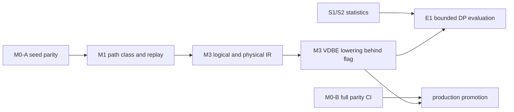

# Migrating From `where.c` To Operator-Based Planning

## Purpose

This document answers the practical migration question:

How can Tarantool add PostgreSQL-like logical and physical operators while it
still executes SQL through a SQLite-like VDBE virtual machine?

For the **scheduling, milestones, status tracking, and worktree
parallelism**, see [`roadmap.md`](roadmap.md). This file is the conceptual
design companion to that roadmap.

For the current SQL/VDBE semantic baseline that each migration stage must
preserve, see
[`current_sql_feature_matrix.md`](current_sql_feature_matrix.md).

For the statistics implementation track, see
[`statistics_implementation_plan.md`](statistics_implementation_plan.md).

A push-based execution engine alternative was considered and rejected. The
selected direction keeps VDBE as the only executor, with the existing CnP and
LLVM MCJIT JIT backends consuming the bytecode that the new planner lowers.
Cross-platform expansion of CnP (arm64) and LLVM is a separate track.

The short answer is:

- first introduce PostgreSQL-like operators as **planner objects**, not runtime
  VM operators;
- keep VDBE as the physical execution backend;
- lower each selected physical operator into existing VDBE bytecode sequences;
- only add new VDBE opcodes or runtime executor nodes after the planner starts
  producing physical alternatives that cannot be expressed efficiently with
  current bytecode.

This gives a gradual migration path. It avoids a flag day rewrite of the VM and
lets the new planner prove itself behind compatibility gates.

## Revised delivery boundary (2026-09-24)

The first implementation boundary is a trustworthy M0-A seed corpus and
capture contract, followed by M1's statement-level `path_class` and replay
envelope. M3 consumes those interfaces. Its first single-table implementation
can plan with the current estimates or a fixed test statistics provider;
S1/S2 can develop concurrently. Production promotion waits for the full
M0-B corpus and dispatcher parity, while the later enumerator evaluation
waits for integrated S2 statistics.



The `path_class` producer is the statement/planner boundary, including
fallbacks; the M0 harness must read it rather than hard-code
`current_where_c`. The descriptor's optional `plan:` snapshot is introduced
only when M3 can emit it. One owner integrates routing through the existing
resolver and `where.c` paths after independently tested IR and lowering
modules are ready.

## The Core Ordering Problem

PostgreSQL has plan nodes such as:

- `SeqScan`
- `IndexScan`
- `NestedLoop`
- `HashJoin`
- `Sort`
- `Aggregate`
- `Limit`

SQLite-style engines usually do not execute a tree of such operators directly.
They compile SQL into a lower-level program:

- open cursors;
- seek indexes;
- loop with `Next`/`Prev`;
- read columns;
- evaluate expressions;
- insert into sorters;
- return rows.

Tarantool SQL currently follows the second model. `where.c` directly chooses
access paths and emits loop-shaped VDBE code. The missing layer is an explicit
physical plan tree between SQL analysis and bytecode generation.

Therefore the ordering should be:

1. introduce logical and physical plan objects;
2. keep using the current VDBE instruction set;
3. write lowering code from physical operators to VDBE bytecode;
4. gradually move decisions out of `where.c` and into the new planner;
5. add new runtime operators/opcodes only for physical algorithms that need
   them.

## Important Distinction

There are three different meanings of "operator":

### Logical operator

Planner-only relational algebra:

- scan relation
- filter
- project
- join
- aggregate
- sort
- limit

These have no storage engine or bytecode shape yet.

### Physical operator

Planner-selected implementation:

- primary-key lookup
- secondary-index range scan
- nested-loop join with index inner
- sorter-backed order
- streaming aggregate
- hash aggregate, later

These include costs and physical properties.

### VDBE opcode

Runtime instruction:

- `OP_OpenRead`
- `OP_SeekGE`
- `OP_Column`
- `OP_Next`
- `OP_SorterInsert`
- `OP_AggStep`
- `OP_ResultRow`

The gradual plan is to add logical and physical operators first, then lower them
to VDBE opcodes.

## Initial Architecture

## New planner layers

Add a small planning subsystem above VDBE code generation:

```text
SQL AST / resolved tree
        |
        v
Logical plan
        |
        v
Access paths + join graph + stats
        |
        v
Physical plan
        |
        v
VDBE lowering
        |
        v
Current VDBE / generated interpreter / CnP JIT / LLVM MCJIT
```

The VDBE remains the only executor.

## New object families

Start with small C structs, not a full class hierarchy:

- `SqlLogicalRel`
- `SqlLogicalExpr`
- `SqlJoinGraph`
- `SqlBaseRel`
- `SqlAccessPath`
- `SqlPhysicalPlan`
- `SqlPlanProperty`
- `SqlPlanCost`

These should initially be internal compile-time objects allocated in the parse
region or another statement-lifetime arena.

The M3.2 prototype in `src/box/sql/sql_logical_plan.{h,c}` maps a resolved
single-relation `Select` to a bottom-up chain of `Scan`, optional `Filter`,
`Project`, optional `Sort`, and optional `Limit`. It borrows resolved
expression lists and LIMIT/OFFSET expressions for the statement lifetime.
This is structural IR only: it does not recognize nondeterministic functions,
perform rewrites, select physical access paths, or route query compilation.
The caller must reject side-effecting/nondeterministic expressions until that
validation is implemented.

## Compatibility rule

Every new planner phase must have an explicit, observable fallback:

- if new planning cannot handle the query, call current `sqlWhereBegin()` path;
- if a physical operator cannot lower cleanly, use the old path;
- if costing confidence is low, allow old planner comparison mode.

Fallback reason must be visible in `EXPLAIN`, counters, and optimizer replay.
Silent permanent fallback is not a migration strategy.

## How Physical Operators Lower To VDBE

## Scan

Physical:

```text
PkPointLookup(table=t, key=?)
```

Lowers to current VDBE pattern:

```text
OpenRead cursor
build key registers
SeekGE / IdxGE / NotFound
Column ...
```

No new runtime VM operator is needed.

## Range scan

Physical:

```text
IndexRangeScan(index=i, lower=?, upper=?, order=ASC)
```

Lowers to:

```text
OpenRead index cursor
evaluate lower bound
SeekGE / SeekGT
loop:
  range end check
  Column / RowData
  Next
```

Again, this can use existing VDBE opcodes.

## Nested-loop join

Physical:

```text
NestedLoop(
  outer = IndexRangeScan(t1),
  inner = IndexLookup(t2, key=t1.x)
)
```

Lowers to nested VDBE loops:

```text
outer open/seek
outer loop:
  read outer join key
  inner seek
  inner loop/body
  outer next
```

This is close to what `wherecode.c` emits today. The difference is that the loop
order and access path are already selected in a physical plan object.

## Sort

Physical:

```text
Sort(input, keys, limit)
```

Lowers to:

```text
SorterOpen
input loop:
  build sort key/payload
  SorterInsert
SorterSort
SorterData
```

This is already where CnP sorter specialization can consume static plan shape.

## Aggregate

Physical:

```text
HashAggregate or StreamingAggregate
```

Initial lowering should only support existing aggregate style:

```text
AggStep
AggFinal
```

Hash aggregate should be a later physical operator because it needs either new
VDBE bytecode patterns or new helper structures.

Existing aggregate generation is not executor-neutral. It directly allocates
VDBE registers for current/previous group values, accumulator reset, output,
and `OP_Gosub`-based group-change subroutines. Before adding a physical
aggregate descriptor, define a lowering-owned register contract:

- immutable aggregate/group expression descriptors come from the physical
  plan;
- VDBE lowering owns register and subroutine allocation;
- the descriptor may request streaming or generic current aggregate lowering,
  but does not contain register numbers;
- hash aggregate is a distinct physical/runtime implementation and must not
  reuse streaming-aggregate cost/lowering assumptions.

## Compatibility Strategy

## Feature flags

Each milestone-bound capability should be independently gated. Illustrative
names:

- `sql_planner_ir=on`
- `sql_planner_new_lowering=on`
- `sql_planner_new_props=on`

The important point is separability — each capability can ship behind its own
flag and be flipped per environment.

## Dual planning

Support dual planning only for a named query class and a time-boxed migration
window:

```text
old where.c plan
new planner plan
compare estimates / shape / optionally execute selected one
```

Modes:

- observe only
- choose old
- choose new for supported shapes
- assert equivalence in debug builds

Each shadow campaign must declare:

- target query class and coverage threshold;
- maximum preparation-time and memory overhead;
- zero-tolerance result/diagnostic mismatch policy;
- plan-quality and execution-latency targets;
- end date and decision: enable, redesign, or delete.

## Fallbacks

Fallback triggers should include:

- unsupported expression semantics;
- unsupported join type;
- missing or low-confidence stats;
- planner budget exceeded;
- lowering unsupported;
- cost model disagreement above a threshold in debug mode.

Fallback is a correctness mechanism, not a success metric. Record a stable
reason code in `EXPLAIN`, metrics, and replay. Broad enablement requires a
declining fallback rate for the target query class.

### Planner summary result contract

`EXPLAIN (planner = 'summary') <statement>` returns a stable three-column
result set:

| Column | Type | Meaning |
| --- | --- | --- |
| `section` | text | Summary group, initially `planner`. |
| `key` | text | Stable field name within the section. |
| `value` | text or NULL | Field value; NULL means unavailable or not applicable. |

Rows are emitted in stable order. The initial implementation emits
`planner.path_class` and `planner.fallback_reason`. A statement that invokes
the legacy WHERE planner reports `current_where_c`; statements that do not
invoke it report a NULL path class. Fallback propagation is not wired yet and
therefore reports NULL. Later M1 fields (counters and replay identifiers)
extend this row set without changing column names or types. Consumers should
look up rows by `(section, key)`, not by ordinal.

### Planner snapshot result contract

`EXPLAIN (planner = 'snapshot') <statement>` returns one `varbinary` column,
`snapshot`, containing one MsgPack map. Version 2 has these keys:

| Key | Type | Meaning |
| --- | --- | --- |
| `format` | string | `tarantool.sql.planner.snapshot` |
| `version` | unsigned integer | Envelope version, currently `2`. |
| `path_class` | string or nil | Path class recorded on the prepared statement. |
| `fallback_reason` | string or nil | Stable structural reject reason when the legacy planner is the fallback route. |
| `replayable` | boolean | `false` until the object includes normalized planner inputs. |
| `planner` | map | Per-statement `candidate_count`, `elapsed_us`, `fallback_count`, and bounded-path `generated`, `dominated`, `truncated`, and `retained` counters. |

This is a versioned diagnostic envelope, not yet a standalone replay input.
Per-statement planner measurements are also copied into the harness run
manifest (`planner_metrics_version: 2`, `planner_metrics`) for analysis; they
are not part of the M0 result/parity gate. The path counters cover candidate
extensions generated; path states pruned by dominance; candidate paths or
incumbents discarded by the global beam; and the sum of retained states after
each join-depth round. Thus generated need not equal the other counters: a
path may be retained at one depth and later dominated or truncated. The legacy planner does not expose
normalized predicates, relation/access-path inputs, or statistics needed to
reconstruct planning without live SQL state. The explicit `replayable` marker
prevents consumers from treating the current diagnostic capture as executable
replay data. M1.5 owns replay tooling; a later envelope version can add the
normalized inputs when they are produced.

#### Replay-input acceptance contract (future envelope)

Do not set `replayable=true` on version 2 or add a replay command that reparses
the original SQL against the current catalog. A replay-capable envelope must
carry a self-contained, canonical `replay_inputs` object (in a new envelope
version) sufficient to call a planner entry point without SQL text, a live
catalog, storage-engine reads, or session-local statistics. At minimum it
must encode:

- a normalized relational expression, including relation instances and
  bindings, predicates/operators/constants, projections, grouping, ordering,
  limits, and all planner-relevant semantic flags;
- the logical relation and index definitions exposed to enumeration (column
  types/collations, key parts, uniqueness, ordering, and capabilities), using
  stable logical identities rather than persistent system-space IDs;
- the exact immutable cardinality/selectivity/statistics values consumed by
  the planner, including their semantics and confidence, or an explicit
  `statistics: absent` value when the planner uses defaults;
- the planner configuration and algorithm/input-format versions required to
  interpret costs and reproduce deterministic tie-breaking.

The envelope must be canonical: equivalent normalized inputs serialize
identically, map/collection ordering is specified, and unsupported values or
features fail capture rather than being silently omitted. This contract does
not select persistent system-space IDs or a storage format for collected
statistics.

A replay implementation must dispatch those embedded inputs directly to a
planner API that has no SQL compiler, catalog, or storage dependency. A test
must capture a fixture, make the source schema/data/statistics unavailable or
change them, replay solely from the captured object, and verify the normalized
selected-plan fingerprint and fallback reason. It must also show that changing
an embedded planner input changes the replay result (or a documented reject
outcome). Replanning the original SQL against live state, or comparing only
the captured diagnostic fields to themselves, is not replay. Until this
entry point and test exist, M1.4/M1.5 remain open and version 2 must continue to
report `replayable=false`.

## Testing Strategy

The roadmap's M0 milestone establishes the **parity corpus** that all
later phases gate against. Layers captured per `(test × engine)`:

- **L1** result rows;
- **L2** diagnostic / error message;
- **L3** path_class (`current_where_c`, `new_planner`, or
  `fallback_<reason>`);
- **L6** forensic static VDBE program listing from `EXPLAIN` (captured on
  request, not gated; does not claim the dynamic opcode dispatch sequence);
- **L7** execution latency (perf trail, not gated).

Dispatcher (generated / CnP / LLVM) is a runtime parity check, not a
stored snapshot dimension. See `roadmap.md` M0 for the harness shape.

Beyond the corpus, milestone-specific test classes are still required:

- IR construction
- access-path enumeration
- cardinality/selectivity estimation
- property/order reasoning
- VDBE lowering
- EXPLAIN shape stability
- deterministic optimizer minidump/replay
- plan-quality and planning-time regression thresholds
- randomized query/schema/statistics fuzzing
- metamorphic result and plan-property checks

## Workloads

Add optimizer-specific workloads alongside the corpus:

- OLTP point/range lookup
- star schema joins
- chain joins
- snowflake joins
- crossproduct-heavy queries
- outer join legality cases
- ORDER BY / LIMIT / GROUP BY combinations
- memtx and vinyl variants

## Validation rule

Early stages should optimize for:

- no semantic regressions;
- inspectable plans;
- stable fallback;
- and clear plan-quality wins on targeted cases.

Do not enable new planning broadly just because it works on simple SELECTs.

Performance gates should report distributions rather than a single average:

- planning p50/p95/p99 and peak memo bytes;
- execution p50/p95 for targeted workloads;
- cardinality-estimation error distribution;
- count and severity of plan regressions;
- fallback rate by reason and query class.

## Current VDBE/JIT coexistence

The target intermediate pipeline:

```text
Physical plan -> VDBE lowering -> generated dispatcher / VDBE CnP / VDBE LLVM
```

The new planner must not select a JIT backend. It supplies static physical-plan
shape to VDBE lowering; the existing VDBE execution policy controls generated,
CnP, or LLVM execution. The JITs continue to consume whatever VDBE bytecode
they are given; they neither know nor care which planner produced it.

## How This Answers The VM Question

The VM does not need to become PostgreSQL's executor.

The first major migration is:

```text
current:
  SQL AST -> where.c chooses loops -> wherecode.c emits VDBE

target intermediate:
  SQL AST -> logical plan -> physical plan -> VDBE lowering -> VDBE
```

That is enough to get:

- better stats;
- better join enumeration;
- cleaner sort/order properties;
- and better integration with CnP specialization.

Only later, when the physical plan contains algorithms the current VM cannot
represent efficiently, should Tarantool add new VDBE opcodes or runtime helper
operators.

## Net Assessment

The gradual path is feasible because PostgreSQL-like operators can be planner
objects before they are executor objects.

The first production program is not "replace VDBE". It is:

- make planning replayable and measurable (roadmap M1);
- improve current-planner estimates through normalized stats (roadmap S1/S2);
- prove physical-plan IR and VDBE lowering on a narrow query class
  (roadmap M3);
- compare join-search alternatives only after properties and stats exist
  (roadmap E1 and GATE);
- time-box coexistence with old `where.c`.

That ordering lets Tarantool keep the strengths of the current VM while
gaining the parts of PostgreSQL/ORCA-style planning that matter most.
