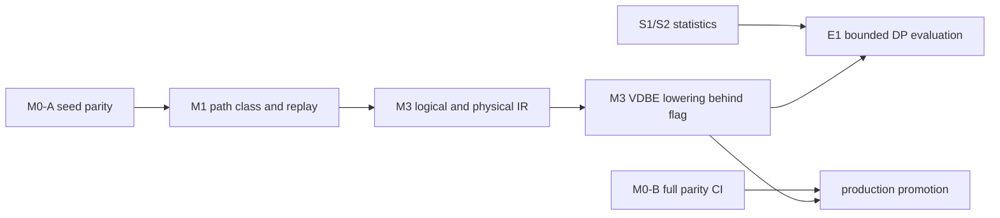
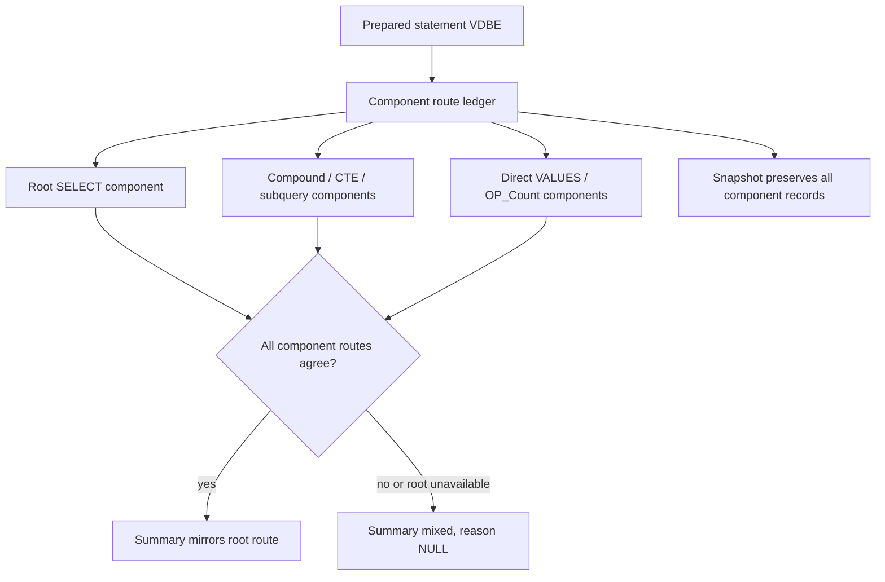
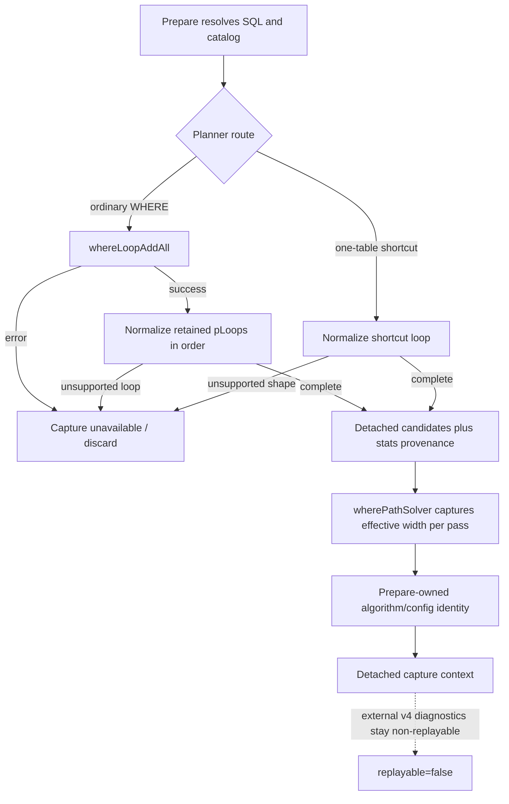

# Migrating From `where.c` To Operator-Based Planning

## Purpose

This document answers the practical migration question:

How can Tarantool add PostgreSQL-like logical and physical operators while it
still executes SQL through a SQLite-like VDBE virtual machine?

For the **scheduling, milestones, status tracking, and worktree
parallelism**, see [`roadmap.md`](roadmap.md). This file is the conceptual
design companion to that roadmap.

For the current SQL/VDBE semantic baseline that each migration stage must
preserve, see
[`current_sql_feature_matrix.md`](current_sql_feature_matrix.md).

For the statistics implementation track, see
[`statistics_implementation_plan.md`](statistics_implementation_plan.md).

A push-based execution engine alternative was considered and rejected. The
selected direction keeps VDBE as the only executor, with the existing CnP and
LLVM MCJIT JIT backends consuming the bytecode that the new planner lowers.
Cross-platform expansion of CnP (arm64) and LLVM is a separate track.

The short answer is:

- first introduce PostgreSQL-like operators as **planner objects**, not runtime
  VM operators;
- keep VDBE as the physical execution backend;
- lower each selected physical operator into existing VDBE bytecode sequences;
- only add new VDBE opcodes or runtime executor nodes after the planner starts
  producing physical alternatives that cannot be expressed efficiently with
  current bytecode.

This gives a gradual migration path. It avoids a flag day rewrite of the VM and
lets the new planner prove itself behind compatibility gates.

## Revised delivery boundary (2026-09-24)

The first implementation boundary is a trustworthy M0-A seed corpus and
capture contract, followed by M1's statement-level `path_class` and replay
envelope. M3 consumes those interfaces. Its first single-table implementation
can plan with the current estimates or a fixed test statistics provider;
S1/S2 can develop concurrently. Production promotion waits for the full
M0-B corpus and dispatcher parity, while the later enumerator evaluation
waits for integrated S2 statistics.



The `path_class` producer is the statement/planner boundary, including
fallbacks; the M0 harness must read it rather than hard-code
`current_where_c`. The descriptor's optional `plan:` snapshot is introduced
only when M3 can emit it. One owner integrates routing through the existing
resolver and `where.c` paths after independently tested IR and lowering
modules are ready.

## The Core Ordering Problem

PostgreSQL has plan nodes such as:

- `SeqScan`
- `IndexScan`
- `NestedLoop`
- `HashJoin`
- `Sort`
- `Aggregate`
- `Limit`

SQLite-style engines usually do not execute a tree of such operators directly.
They compile SQL into a lower-level program:

- open cursors;
- seek indexes;
- loop with `Next`/`Prev`;
- read columns;
- evaluate expressions;
- insert into sorters;
- return rows.

Tarantool SQL currently follows the second model. `where.c` directly chooses
access paths and emits loop-shaped VDBE code. The missing layer is an explicit
physical plan tree between SQL analysis and bytecode generation.

Therefore the ordering should be:

1. introduce logical and physical plan objects;
2. keep using the current VDBE instruction set;
3. write lowering code from physical operators to VDBE bytecode;
4. gradually move decisions out of `where.c` and into the new planner;
5. add new runtime operators/opcodes only for physical algorithms that need
   them.

## Important Distinction

There are three different meanings of "operator":

### Logical operator

Planner-only relational algebra:

- scan relation
- filter
- project
- join
- aggregate
- sort
- limit

These have no storage engine or bytecode shape yet.

### Physical operator

Planner-selected implementation:

- primary-key lookup
- secondary-index range scan
- nested-loop join with index inner
- sorter-backed order
- streaming aggregate
- hash aggregate, later

These include costs and physical properties.

### VDBE opcode

Runtime instruction:

- `OP_OpenRead`
- `OP_SeekGE`
- `OP_Column`
- `OP_Next`
- `OP_SorterInsert`
- `OP_AggStep`
- `OP_ResultRow`

The gradual plan is to add logical and physical operators first, then lower them
to VDBE opcodes.

## Initial Architecture

## New planner layers

Add a small planning subsystem above VDBE code generation:

```text
SQL AST / resolved tree
        |
        v
Logical plan
        |
        v
Access paths + join graph + stats
        |
        v
Physical plan
        |
        v
VDBE lowering
        |
        v
Current VDBE / generated interpreter / CnP JIT / LLVM MCJIT
```

The VDBE remains the only executor.

## New object families

Start with small C structs, not a full class hierarchy:

- `SqlLogicalRel`
- `SqlLogicalExpr`
- `SqlJoinGraph`
- `SqlBaseRel`
- `SqlAccessPath`
- `SqlPhysicalPlan`
- `SqlPlanProperty`
- `SqlPlanCost`

These should initially be internal compile-time objects allocated in the parse
region or another statement-lifetime arena.

The M3.2 prototype in `src/box/sql/sql_logical_plan.{h,c}` maps a resolved
single-relation `Select` to a bottom-up chain of `Scan`, optional `Filter`,
`Project`, optional `Sort`, and optional `Limit`. It borrows resolved
expression lists and LIMIT/OFFSET expressions for the statement lifetime.
This is structural IR only: it does not recognize nondeterministic functions,
perform rewrites, select physical access paths, or route query compilation.
The caller must reject side-effecting/nondeterministic expressions until that
validation is implemented.

## Compatibility rule

Every new planner phase must have an explicit, observable fallback:

- if new planning cannot handle the query, call current `sqlWhereBegin()` path;
- if a physical operator cannot lower cleanly, use the old path;
- if costing confidence is low, allow old planner comparison mode.

Fallback reason must be visible in `EXPLAIN`, counters, and optimizer replay.
Silent permanent fallback is not a migration strategy.

## How Physical Operators Lower To VDBE

## Scan

Physical:

```text
PkPointLookup(table=t, key=?)
```

Lowers to current VDBE pattern:

```text
OpenRead cursor
build key registers
SeekGE / IdxGE / NotFound
Column ...
```

No new runtime VM operator is needed.

## Range scan

Physical:

```text
IndexRangeScan(index=i, lower=?, upper=?, order=ASC)
```

Lowers to:

```text
OpenRead index cursor
evaluate lower bound
SeekGE / SeekGT
loop:
  range end check
  Column / RowData
  Next
```

Again, this can use existing VDBE opcodes.

## Nested-loop join

Physical:

```text
NestedLoop(
  outer = IndexRangeScan(t1),
  inner = IndexLookup(t2, key=t1.x)
)
```

Lowers to nested VDBE loops:

```text
outer open/seek
outer loop:
  read outer join key
  inner seek
  inner loop/body
  outer next
```

This is close to what `wherecode.c` emits today. The difference is that the loop
order and access path are already selected in a physical plan object.

## Sort

Physical:

```text
Sort(input, keys, limit)
```

Lowers to:

```text
SorterOpen
input loop:
  build sort key/payload
  SorterInsert
SorterSort
SorterData
```

This is already where CnP sorter specialization can consume static plan shape.

## Aggregate

Physical:

```text
HashAggregate or StreamingAggregate
```

Initial lowering should only support existing aggregate style:

```text
AggStep
AggFinal
```

Hash aggregate should be a later physical operator because it needs either new
VDBE bytecode patterns or new helper structures.

Existing aggregate generation is not executor-neutral. It directly allocates
VDBE registers for current/previous group values, accumulator reset, output,
and `OP_Gosub`-based group-change subroutines. Before adding a physical
aggregate descriptor, define a lowering-owned register contract:

- immutable aggregate/group expression descriptors come from the physical
  plan;
- VDBE lowering owns register and subroutine allocation;
- the descriptor may request streaming or generic current aggregate lowering,
  but does not contain register numbers;
- hash aggregate is a distinct physical/runtime implementation and must not
  reuse streaming-aggregate cost/lowering assumptions.

## Compatibility Strategy

## Feature flags

Each milestone-bound capability should be independently gated. Illustrative
names:

- `sql_planner_ir=on`
- `sql_planner_new_lowering=on`
- `sql_planner_new_props=on`

The important point is separability — each capability can ship behind its own
flag and be flipped per environment.

## Dual planning

Support dual planning only for a named query class and a time-boxed migration
window:

```text
old where.c plan
new planner plan
compare estimates / shape / optionally execute selected one
```

Modes:

- observe only
- choose old
- choose new for supported shapes
- assert equivalence in debug builds

Each shadow campaign must declare:

- target query class and coverage threshold;
- maximum preparation-time and memory overhead;
- zero-tolerance result/diagnostic mismatch policy;
- plan-quality and execution-latency targets;
- end date and decision: enable, redesign, or delete.

## Fallbacks

Fallback triggers should include:

- unsupported expression semantics;
- unsupported join type;
- missing or low-confidence stats;
- planner budget exceeded;
- lowering unsupported;
- cost model disagreement above a threshold in debug mode.

Fallback is a correctness mechanism, not a success metric. Record a stable
reason code in `EXPLAIN`, metrics, and replay. Broad enablement requires a
declining fallback rate for the target query class.

### Planner summary result contract

`EXPLAIN (planner = 'summary') <statement>` returns a stable three-column
result set:

| Column | Type | Meaning |
| --- | --- | --- |
| `section` | text | Summary group, initially `planner`. |
| `key` | text | Stable field name within the section. |
| `value` | text or NULL | Field value; NULL means unavailable or not applicable. |

Rows are emitted in stable order. The initial implementation emits
`planner.path_class` and `planner.fallback_reason`. A statement that invokes
the legacy WHERE planner reports `current_where_c`; statements that do not
invoke it report a NULL path class. Fallback propagation is not wired yet and
therefore reports NULL. Later M1 fields (counters and replay identifiers)
extend this row set without changing column names or types. Consumers should
look up rows by `(section, key)`, not by ordinal.

### Planner snapshot result contract

`EXPLAIN (planner = 'snapshot') <statement>` returns one `varbinary` column,
`snapshot`, containing one MsgPack map. Version 4 has these keys:

| Key | Type | Meaning |
| --- | --- | --- |
| `format` | string | `tarantool.sql.planner.snapshot` |
| `version` | unsigned integer | Envelope version, currently `4`. |
| `path_class` | string or nil | Path class recorded on the prepared statement. |
| `fallback_reason` | string or nil | Stable structural reject reason when the legacy planner is the fallback route. |
| `replayable` | boolean | True only when a complete selection-replay input is embedded. |
| `replay_inputs` | binary, optional | Canonical internal v5 normalized query/schema/stats/config and final-path input; absent when capture is incomplete or unsupported. |
| `planner` | map | Per-statement counters, final path status/list, and selected final-path fingerprint. |

Each `final_paths` entry contains an opaque stable fingerprint, exact signed
LogEst path/unsorted/output-row costs, the captured ORDER BY satisfaction
count, and reverse-scan mask. `final_path_status` is `complete`, `incomplete`,
or `unavailable`; only `complete` carries a non-empty candidate list. The
producer currently supports ordinary one-relation `wherePathSolver()` calls,
including the final ORDER BY cost pass. Joins and routes without a successful
supported solver capture stay unavailable; overflow, ambiguous fingerprints,
or unsupported capture shapes fail closed as incomplete. For supported
canonical single-relation root SELECTs, the producer combines the path list
with detached SQL/schema/statistics input, actual beam width, selector
identity, and algorithm/config versions; it embeds canonical v5 bytes as
`replay_inputs` and sets `replayable=true`. This is selection replay only:
enumeration, dominance, and beam pruning are not replayed.

Version 4 may be diagnostic-only or selection-replayable. A non-replayable
object must have `replayable: false` and no `replay_inputs` key, including an
empty or partial value. A replayable object must have `replayable: true`, a
valid v5 input, and a complete non-empty final-path capture with matching
ordered fingerprints. Capturers reject violations rather than interpreting
the flag as a promise. The M0 harness validates both forms.
Per-statement planner measurements are also copied into the harness run
manifest (`planner_metrics_version: 2`, `planner_metrics`) for analysis; they
are not part of the M0 result/parity gate. The path counters cover candidate
extensions generated; path states pruned by dominance; candidate paths or
incumbents discarded by the global beam; and the sum of retained states after
each join-depth round. Thus generated need not equal the other counters: a
path may be retained at one depth and later dominated or truncated. The legacy planner does not expose
normalized predicates, relation/access-path inputs, or statistics needed to
reconstruct planning without live SQL state. The explicit `replayable` marker
prevents consumers from treating incomplete captures as executable replay
data. M1.5 selection replay is implemented for the supported canonical
single-relation subset; broader normalized inputs remain future work.

#### M3.5 route-ledger scope decision

The current diagnostic is one record per prepared-statement VDBE, but the
production `sqlSelect()` path is recursive: compound branches, recursive CTE
terms, and subquery producers can each compile into that VDBE. Existing
first-reason-wins metadata therefore describes neither every SELECT component
nor identifies which component produced a statement-level fallback. Direct
`VALUES` and simple `OP_Count` emitters add another boundary: they can produce
rows without entering the WHERE planner or the table-scan attempt. Counting
such a direct route as a planner fallback would be false; silently omitting it
is only valid if the gate explicitly excludes direct producers.

Adopt **per-component scope**. Every SELECT producer, including recursive
compound/CTE/subquery branches, direct multi-row `VALUES`, and direct
`OP_Count`, receives a route record. A component is identified by its
statement-local `iSelectId`; records also carry parent component ID and a
stable role (`root`, `compound`, `subquery`, `cte`, or `direct`). Direct paths
are not fallbacks merely because they bypass `where.c`.

The component list is authoritative. Statement summary remains a compact
compatibility view: it reports the root component's path class/reason when
there is one; if the root is absent or route records disagree across the
statement, it reports `mixed` and a NULL fallback reason. It must never select
an arbitrary first nested reason. Counters count each component's actual
planner attempt once; EXPLAIN serialization does not increment them. This
scope is required by the roadmap's “every unsupported shape” contract and
avoids silently excluding direct or recursive producers. The implementation
can be incremental, but M3.5 stays open until the producer inventory is
covered and mixed/direct/nested runtime cases verify these semantics. A
bounded internal ledger model now encodes component identity, parent, role,
route, and fallback reason; unit tests cover direct-route distinction,
conflicting writes, mixed summaries, incomplete records, and overflow. It is
not yet populated by `sqlSelect()` or exposed in EXPLAIN, so it does not close
the integration gate.



#### Replay-input acceptance contract

Do not set `replayable=true` on version 2 or add a replay command that reparses
the original SQL against the current catalog. Version 4 marks only its
supported canonical single-relation subset replayable. General replay support
must carry a self-contained, canonical `replay_inputs` object sufficient to
call a planner entry point without SQL text, a live catalog, storage-engine
reads, or session-local statistics. At minimum it must encode:

- a normalized relational expression, including relation instances and
  bindings, predicates/operators/constants, projections, grouping, ordering,
  limits, and all planner-relevant semantic flags;
- the logical relation and index definitions exposed to enumeration (column
  types/collations, key parts, uniqueness, ordering, and capabilities), using
  stable logical identities rather than persistent system-space IDs;
- the exact immutable cardinality/selectivity/statistics values consumed by
  the planner, including their semantics and confidence, or an explicit
  `statistics: absent` value when the planner uses defaults;
- the planner configuration and algorithm/input-format versions required to
  interpret costs and reproduce deterministic tie-breaking.

The envelope must be canonical: equivalent normalized inputs serialize
identically, map/collection ordering is specified, and unsupported values or
features fail capture rather than being silently omitted. This contract does
not select persistent system-space IDs or a storage format for collected
statistics.

For the supported selection-only subset, the developer-only `sql_replay`
module dispatches the embedded final-path set directly to the selector with
no SQL compiler, catalog, or storage dependency. Runtime coverage drops the
source table before replay and verifies the selected fingerprint; an
inconsistent candidate-list mutation is rejected. Replanning original SQL
against live state, or comparing only captured diagnostics to themselves, is
not replay. Broader replay classes must also preserve fallback outcomes. M1.4
capture and M1.5 selection replay are implemented; access-path enumeration is
explicitly out of scope.

The `sql_replay_input` unit prototype is intentionally narrower than this
acceptance contract. It owns a single-relation SELECT subset: normalized
predicate/projection/order expressions validated against its narrow canonical
scalar-expression grammar and relation column bounds, limit/offset, logical relation column
types/collations, logical index definitions and part ordinals, relation/index
population and NDV statistics, confidence/freshness metadata, and planner
configuration scalars, plus per-index tuple-count semantics and definition
version. It optionally carries provider-supplied ordered access candidates for
primary-key point, index point/range/full, or table-full access, with logical
index keys, canonical constraints, scan direction, projected logical columns,
produced ordering, access-estimated rows, and separate cost rows/startup/total/
width/confidence. Candidate rank is preserved because provider tie-break order
may be meaningful; stable logical candidate keys must be unique. Missing
provider output differs from a known empty set. All candidate data is supplied
by callers/providers: no active SQL planner producer is wired to this model.
It copies values and stores no live `Expr`, catalog handle, cursor, or storage
ID. It emits an internal version-5 MsgPack representation with fixed map-key
order and logical-index ordering. It still does not validate relation/index
schema-definition syntax or feed a planner.
`sql_replay_input_extract_select()` now accepts a resolved single-relation
`Select`, caller-provided cursor bindings, and detached relation/statistics/
planner metadata. A companion
`sql_replay_input_extract_select_from_catalog()` derives detached relation,
column, and index definitions from the source catalog space using logical
relation ordinal `r0`. Physical space/index IDs are not part of the serialized
model; index IDs remain only in a separate in-memory association. Repeated
index key ordinals are preserved. Views, functional indexes, and multikey
indexes whose identity is not modeled fail closed. The catalog-only entry
point leaves statistics absent. The snapshot-backed variant copies measured
relation/index summaries and their semantics, provenance, confidence, and
freshness from an immutable provider; stale or missing relation statistics
remain explicitly absent, while fractional cardinalities not exactly
representable by replay input v4 fail closed. Average row width is retained
as a finite double. Planner configuration remains caller-supplied. The
extractor canonicalizes predicate, projection, and ordering
expressions, captures sort direction and Tarantool's default NULL ordering,
and extracts nonnegative integer literal LIMIT/OFFSET values. Unsupported
functions/expressions and non-literal bounds fail closed. The output owns no
AST or catalog pointers; callers still provide planner settings and any
measured statistics. Multi-relation expressions, joins, aggregates, and
other planner semantics remain absent. It is not a `replay_inputs` payload
and does not change the external diagnostic envelope version.

#### M1.4 live capture boundary audit

The current `WhereLoop` producer cannot safely publish candidates from
`whereLoopInsert()`: insertion may later replace dominated entries, and the
same hook is used while expanding OR subclauses. The first ordinary completion
boundary is the successful return from `whereLoopAddAll()` in
`src/box/sql/where.c`; at that point `WhereInfo.pLoops` is the retained,
planner-visible loop list, before `wherePathSolver()` chooses a path. A capture
attached to that boundary must be all-or-nothing: normalize each retained loop
in list order, reject the entire list if any loop shape is unsupported, and
publish an empty list only after a successful complete enumeration. The
one-table `where_loop_builder_shortcut()` is a separate planner route and must
either produce an equivalent detached candidate or leave capture unavailable;
it cannot be mistaken for successful empty enumeration. Planner errors likewise
must not publish a prefix.

The values required to identify the algorithm and its configuration are not
currently collected into that context. `sql_replay_input_extract_select_from_*`
accepts caller-provided algorithm/configuration version integers and beam width.
The active `wherePathSolver()` obtains its width from
`sql_path_solver_width(nLoop)`, whose three widths can be environment-configured
and cached; recomputing a default at a later serialization point would not be
authoritative. There is no active planner algorithm-version constant or
prepare-owned detached context carrying those values together with statistics
provenance and candidates. `where.c` may invoke `wherePathSolver()` twice (the
second pass accounts for ORDER BY cost), so a future producer should capture
the effective width for each pass, or the full effective width configuration
plus the relevant loop count. It must use an explicit version maintained with
the planner algorithm, rather than infer identity or width from SQL text,
build metadata, or defaults.



This is a source-backed implementation boundary. The final `WherePath` list
is captured for ordinary root single-relation solver runs and combined with a
detached query input; this does not claim that an access-loop producer exists.
In particular, normalized loop conversion still needs to map
`WhereTerm` constraints, index definitions, projections, ordering and cost
semantics into the detached logical model, while ensuring the `WhereInfo` and
catalog/statistics data remain valid through copying. Until a producer and
completion tests cover ordinary enumeration, shortcut, unsupported loop,
overflow/error, and known-empty cases, do not mark access-loop enumeration
complete. The external v4 envelope is replayable only for a supported
selection-only capture.

#### M1.4 replay-scope contract gate

The replay scope is **selection only**, conditional on a complete ordered
final `WherePath` list captured by the live planner. The detached v5 model
represents these final candidates separately from pre-selection
`access_candidates`, without embedding compiler, catalog, or storage
dependencies. A successful replay verifies only the final reducer's choice
and deterministic tie-breaking for that captured post-beam list; it does not
verify that live enumeration discovered every viable path. Candidate
enumeration, dominance, and beam pruning are inputs to replay, not rerun by it.
The producer must capture final cost after relevant ORDER BY costing and
publish the complete retained list or none. The SQL planner captures this
final-path subset for ordinary root single-relation solver runs; access-loop
enumeration and routes that bypass this solver remain uncaptured. The input
records the effective beam width and selector identity used for this capture.

The selected scope has these boundaries:

| Scope | Replay input | What a passing replay proves |
| --- | --- | --- |
| Selection only (selected) | Complete ordered final-path set with exact `LogEst` final costs plus selector identity | Final path choice and first-retained equal-cost tie-break conditional on that set |
| Enumeration + selection (out of scope) | Normalized expression, logical schema, exact stats, and planner configuration/algorithm identity; no precomputed candidate list | Candidate discovery and selected-plan behavior for the supported planner subset |

For M1.4, v5 `final_path_candidates` are replay input and the detached API
implements the final `wherePathSolver()` reducer under
`SQL_REPLAY_SELECTOR_FINAL_PATH_V1`: strict minimum exact `LogEst` `rCost`,
first retained candidate on ties. The acceptance test varies final-path order
and content and verifies the selected-plan fingerprint. `replayable` means
selection-replayable, not enumeration-replayable. The v4 envelope sets it only
when normalized input, exact final candidates, and selector/config identity
are complete; otherwise it remains diagnostic-only with no `replay_inputs`.
The developer-only `sql_replay` module consumes the artifact without live SQL
state, cross-checks final-path order, and reports whether replay matches the
captured winner.

```mermaid
flowchart LR
    L[Live planner enumeration] --> C[Capture complete ordered candidates]
    C --> S[Offline selection replay]
    S --> F[Selected-plan fingerprint]
    E[Enumeration replay] -. explicitly out of M1.4 scope .-> C
```

#### M1.4/M1.5 detached final-path selector prototype

The exact bounded selector contract is the final reduction in
`wherePathSolver()` (`src/box/sql/where.c`): after all path-generation,
dominance, and beam rounds have produced the retained final `WherePath` array,
scan that array in order and replace the winner only when another path has a
strictly smaller `rCost`. Costs are exact signed 16-bit `LogEst` values. Equal
cost retains the first final-array entry. This consumer does not repeat path
enumeration, dominance, beam pruning, or ORDER BY costing; those operations
must already be reflected in the captured final paths' `rCost`.

The detached internal input now has an ordered `final_path_candidates` field
distinct from pre-selection `access_candidates`. Each final path carries a
stable full-plan fingerprint, exact path/unsorted/output LogEst values,
`isOrdered`, and reverse-scan mask. The selector identity is
`SQL_REPLAY_SELECTOR_FINAL_PATH_V1`; v1 is restricted to the existing
single-relation input model and validates its order/reverse metadata. Missing
final-path data is unavailable/incomplete; a known empty array is complete but
returns `NO_PLAN`. Provider order is preserved because it is the live final
beam order used by the tie-break. The internal MsgPack format advances from
v4 to v5 and serializes these fields canonically; this is internal prototype
data, not an external planner snapshot change.

Focused unit coverage asserts unique-min selection is invariant to candidate
reordering, equal-cost selection follows first-retained order, captured
ORDER BY/reverse metadata stays attached to the selected fingerprint, absent
and known-empty states differ, and unsupported selector versions fail closed.
The active SQL planner captures final retained paths and emits a complete v5
selection input for supported ordinary root single-relation queries. A runtime
test verifies candidate order matches the input, and the live selected
fingerprint is the strict-min result. After dropping the source table, runtime
coverage replays solely from the serialized v4 artifact; an inconsistent
embedded candidate list is rejected. Unsupported shapes remain non-replayable.
M1.4 capture and the M1.5 selection-only artifact consumer are implemented;
enumeration replay remains explicitly outside scope.

## Testing Strategy

The roadmap's M0 milestone establishes the **parity corpus** that all
later phases gate against. Layers captured per `(test × engine)`:

- **L1** result rows;
- **L2** diagnostic / error message;
- **L3** path_class (`current_where_c`, `new_planner`, or
  `fallback_<reason>`);
- **L6** forensic static VDBE program listing from `EXPLAIN` (captured on
  request, not gated; does not claim the dynamic opcode dispatch sequence);
- **L7** execution latency (perf trail, not gated).

Dispatcher (generated / CnP / LLVM) is a runtime parity check, not a
stored snapshot dimension. See `roadmap.md` M0 for the harness shape.

Beyond the corpus, milestone-specific test classes are still required:

- IR construction
- access-path enumeration
- cardinality/selectivity estimation
- property/order reasoning
- VDBE lowering
- EXPLAIN shape stability
- deterministic optimizer minidump/replay
- plan-quality and planning-time regression thresholds
- randomized query/schema/statistics fuzzing
- metamorphic result and plan-property checks

## Workloads

Add optimizer-specific workloads alongside the corpus:

- OLTP point/range lookup
- star schema joins
- chain joins
- snowflake joins
- crossproduct-heavy queries
- outer join legality cases
- ORDER BY / LIMIT / GROUP BY combinations
- memtx and vinyl variants

## Validation rule

Early stages should optimize for:

- no semantic regressions;
- inspectable plans;
- stable fallback;
- and clear plan-quality wins on targeted cases.

Do not enable new planning broadly just because it works on simple SELECTs.

Performance gates should report distributions rather than a single average:

- planning p50/p95/p99 and peak memo bytes;
- execution p50/p95 for targeted workloads;
- cardinality-estimation error distribution;
- count and severity of plan regressions;
- fallback rate by reason and query class.

## Current VDBE/JIT coexistence

The target intermediate pipeline:

```text
Physical plan -> VDBE lowering -> generated dispatcher / VDBE CnP / VDBE LLVM
```

The new planner must not select a JIT backend. It supplies static physical-plan
shape to VDBE lowering; the existing VDBE execution policy controls generated,
CnP, or LLVM execution. The JITs continue to consume whatever VDBE bytecode
they are given; they neither know nor care which planner produced it.

## How This Answers The VM Question

The VM does not need to become PostgreSQL's executor.

The first major migration is:

```text
current:
  SQL AST -> where.c chooses loops -> wherecode.c emits VDBE

target intermediate:
  SQL AST -> logical plan -> physical plan -> VDBE lowering -> VDBE
```

That is enough to get:

- better stats;
- better join enumeration;
- cleaner sort/order properties;
- and better integration with CnP specialization.

Only later, when the physical plan contains algorithms the current VM cannot
represent efficiently, should Tarantool add new VDBE opcodes or runtime helper
operators.

## Net Assessment

The gradual path is feasible because PostgreSQL-like operators can be planner
objects before they are executor objects.

The first production program is not "replace VDBE". It is:

- make planning replayable and measurable (roadmap M1);
- improve current-planner estimates through normalized stats (roadmap S1/S2);
- prove physical-plan IR and VDBE lowering on a narrow query class
  (roadmap M3);
- compare join-search alternatives only after properties and stats exist
  (roadmap E1 and GATE);
- time-box coexistence with old `where.c`.

That ordering lets Tarantool keep the strengths of the current VM while
gaining the parts of PostgreSQL/ORCA-style planning that matter most.
