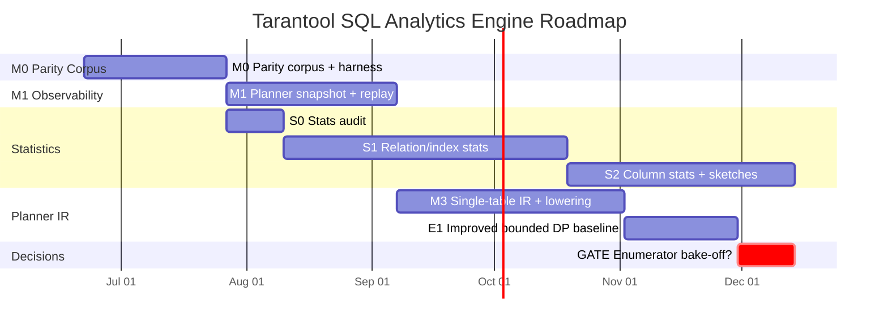

# Tarantool SQL Analytics Engine — Roadmap

## Purpose

This document is the single source of truth for the analytics-focused SQL
engine work on this machine and branch (`tsafin/llvm_jit` and its
descendants).

Scope is deliberately narrow:

- proper SQL statistics, persisted in new system spaces;
- a new planner / lowering path that consumes those statistics and produces
  better plans for analytic workloads;
- a parity corpus that proves the new path never regresses results,
  diagnostics, or supported-class coverage of the current SQL engine.

Out of scope here (tracked elsewhere or rejected):

- push-based execution engine (rejected — VDBE remains the only executor);
- arm64 CnP stencil work (different machine);
- broad SQL feature additions (RIGHT JOIN, LATERAL, windows, UPSERT,
  RETURNING — none are parity requirements).

This file is structured so that it can be lifted directly into a GitHub epic
with linked sub-issues. Top-level milestones (M0, M1, S0, S1, S2, M3, E1, GATE)
each map to a sub-issue; their checklist items map to individual tasks.

## Related documents

- [`current_sql_feature_matrix.md`](current_sql_feature_matrix.md) —
  authoritative parity baseline (frozen subset).
- [`statistics_implementation_plan.md`](statistics_implementation_plan.md) —
  statistics infrastructure design.
- [`planner_vm_migration.md`](planner_vm_migration.md) — staged migration
  of `where.c` to planner-IR + VDBE lowering.
- [`next_gen_sql_planner.md`](next_gen_sql_planner.md) — architecture survey
  (PostgreSQL / DPhyp / ORCA comparisons; memtx and Vinyl applicability).

## Status legend

Each work item carries a richer state than NOT-STARTED / DONE so the
roadmap accurately reflects how far an item has progressed past spec.

| State | Meaning |
|-------|---------|
| `NOT-STARTED` | No work, no spec beyond a paragraph in this file. |
| `SPEC-DRAFTED` | A focused spec doc exists; reviewers have signed off on shape. |
| `PROTOTYPE` | Working code behind a feature flag, but not gated by CI. |
| `FEATURE-GATED` | Default off in production builds; CI runs it on the parity corpus. |
| `PRODUCTION` | Default on; old path removed or scheduled for removal. |

The migration path for any item is:
`NOT-STARTED → SPEC-DRAFTED → PROTOTYPE → FEATURE-GATED → PRODUCTION`.

## Execution model

Single human operator. Multiple LLM sessions allowed in parallel via git
worktrees. Implications:

- The human is the bottleneck for architectural decisions, reviews, and merges.
- LLM sessions are good at: implementing scoped sub-tasks, writing tests,
  mechanical refactors, drafting documentation.
- A sub-task marked `parallel: yes` is a candidate for an isolated worktree
  with its own LLM session. It must touch files that no concurrent task
  modifies, or its merge will fight.
- Sub-tasks marked `parallel: no` need human attention or touch a shared
  contract (descriptor, system-space schema) and should run serially.

## Timeline

Calendar weeks, part-time effort, prototype lower bounds. Not commitments.

Approximate calendar landing for the gate decision: **mid-2027**, assuming
part-time effort and steady LLM-session parallelism. Faster if the human can
batch reviews; slower if statistics validation reveals scope expansion.

## Worktree parallelism plan

These pairs of tracks can run concurrently in separate worktrees. Each row
identifies a worktree branch name suggestion and which other worktrees it
conflicts with.

| Track | Branch suggestion | Conflicts with | Independent of |
|-------|-------------------|----------------|----------------|
| M0 harness/tooling | `m0/harness` | none (new files only) | everything |
| M1 observability | `m1/explain-snapshot` | M3 (snapshot format) | S0, S1, S2 |
| S0 audit | `s0/audit` | none (read-only) | everything |
| S1 system spaces | `s1/stats-spaces` | M1 (sql.c hook points) | M0, S0, M3 |
| S2 column stats | `s2/column-sketches` | S1 (schema sharing) | M0, M1, M3 |
| M3 planner IR | `m3/single-table-ir` | M1 (path_class) | S1, S2 |

LLM sessions are not allowed to merge to `master` themselves; the human
reviews and merges. Long-lived worktrees should rebase on `master` weekly
to avoid drift.

---

## M0 — Parity Corpus & Baseline Harness

**Goal:** establish a queryable parity baseline so every later phase can be
gated on "no result regression, no diagnostic regression, no path-class
regression."

**State:** `PROTOTYPE` — M0.1–M0.7 code landed on staging branch
`tsafin/nextgen_sql` (mine-secret remote) as of 2026-07-11. M0.5/M0.6 CI
workflows are wired but carry `TODO(m0.2-merge)` stubs where the harness
invocation replaces the placeholder echo — one-line-per-stub edit at the
llvm_jit integration point. M0.8 (snapshot bootstrap) is the remaining step
that lifts M0 to `FEATURE-GATED`.

**Scope (B-light):** capture L1 result rows, L2 diagnostic, L3 path_class
per (test × engine). Dispatcher dimension is a runtime parity check, not a
stored dimension. L7 latency goes to a separate perf-trail CSV. L4/L5 (plan
shape) deferred to M3 when the descriptor exists naturally.

**Exit criteria:**

- every `test/sql*` test classified by feature family;
- snapshots exist for all in-corpus tests under (memtx, vinyl);
- CI runs a snapshot diff on planner-touching PRs;
- CI runs the dispatcher parity check (generated / CnP / LLVM agree on L1+L2)
  on every PR.

**Subtasks:**

- [x] **M0.1** Test auto-classifier — `test/sql-baselines/classify.lua`.
  Scans `*.test.lua` across sql / sql-tap / sql-luatest, regex-detects
  feature markers per `docs/vdbe/current_sql_feature_matrix.md`, writes
  `test/sql-baselines/classification.yaml` (381 entries on nextgen_sql
  HEAD). Landed at nextgen_sql `f8ae5a0ddd`, expanded at `02fdfbe2d3`
  (canonical_yaml.lua scalar coverage).
- [x] **M0.2** Snapshot harness — `test/sql-baselines/harness/run.lua`
  monkey-patches `box.execute`, dofiles the test file, writes one snapshot
  per captured query at `test/sql-baselines/snapshots/<suite>/<test>/q%02d.<engine>.yaml`
  per SCHEMA.md v1. Landed at nextgen_sql `4f8dc74e0b`. Verified end-to-end
  on a 7-statement mini SQL test.
- [x] **M0.3** Forensic L6 capture — `test/sql-baselines/harness/forensic.lua`
  writes a marked placeholder to `test/sql-baselines/forensics/`.
  Per-statement VDBE opcode trace requires a Lua-accessible hook in
  `src/box/sql/vdbe.c` that does not yet exist; module header documents three
  C-side implementation options for follow-up work. Landed with M0.2.
- [x] **M0.4** Diff tool — `test/sql-baselines/diff.lua`. Compares two
  snapshot trees, classifies drift as RESULT-REGRESSION / DIAGNOSTIC-CHANGE
  / PATH-CLASS-SHIFT (hard gates) or SOFT-DRIFT (advisory). Emits text /
  yaml / json; exit 1 on any hard-gate. Landed at nextgen_sql `a3c6dbf191`.
  Verified: identical inputs → 0 hard, 0 soft, all-MATCH exit 0; mutated
  row → RESULT-REGRESSION exit 1.
- [x] **M0.5** CI: snapshot diff job — `.github/workflows/parity-corpus.yml`
  builds PR head and merge-base, runs the harness on both, diffs via
  `diff.lua`. Landed with M0.4. Carries `TODO(m0.2-merge)` where the real
  harness invocation replaces the stub echo.
- [x] **M0.6** CI: dispatcher parity job —
  `.github/workflows/dispatcher-parity.yml`. Matrix
  `{memtx, vinyl} × {generated, cnp, llvm}`. Compares CnP and LLVM outputs
  against generated; fails with `JIT-CORRECTNESS-REGRESSION:<dispatcher>` on
  any L1 or L2 divergence. Landed with M0.4. Same `TODO(m0.2-merge)` stub
  pattern as M0.5.
- [x] **M0.7** Perf-trail emitter — `test/sql-baselines/perf/emit.lua`
  records timing via `fiber.clock64()`, writes one CSV per CI run at
  `test/sql-baselines/perf/<YYYY-MM-DD>-<sha>.csv`. Accompanying
  `perf/aggregate.lua` reads a directory of those CSVs and emits a markdown
  trend table. `sample.csv` aligned with SCHEMA.md §L7 exemplar. Landed at
  nextgen_sql `b33719055e` + `1a9c7933b6` (gitignore).
- [ ] **M0.8** Snapshot bootstrap — run the harness against `master`, commit
  initial snapshots as the parity baseline. *parallel: no* (single commit
  ground-truth). This is the merge-point that closes M0.

---

## S0 — Statistics Audit

**Goal:** decide reuse/delete per file for the historical `_sql_stat1` /
`_sql_stat4` scaffolding before designing the new system spaces.

**State:** `SPEC-DRAFTED` — audit landed as `docs/vdbe/s0_audit_report.md`
on `tsafin/llvm_jit` at commit `de57e09edd` (2026-06-21). Report finds the
historical `_sql_stat1` / `_sql_stat4` scaffolding is almost entirely
vestigial text: no `analyze.c`, no ANALYZE grammar in `parse.y`, and
`OP_LoadAnalysis` is a triply-registered no-op. 3 DELETE / 2
KEEP-AS-REFERENCE / 1 EXTRACT-HELPER / 11 REWRITE dispositions recorded.
S1 can start against this baseline.

**Exit criteria:**

- written inventory of disabled tests, no-op opcodes, dead helper functions;
- explicit decision per item (delete / keep-as-reference / extract-helper).

**Subtasks:**

- [x] **S0.1** Inventory disabled analyze tests in `test/sql-tap/suite.ini`
  and the dead bodies of `OP_LoadAnalysis` and friends.
- [x] **S0.2** Inventory `_sql_stat1` / `_sql_stat4` references in
  `src/box/sql/*` and decide per-file reuse/delete.
- [x] **S0.3** Write `docs/vdbe/s0_audit_report.md` summarizing findings,
  with explicit per-item disposition.

---

## M1 — Planner Observability & Replay

**Goal:** make the *current* planner's decisions inspectable, replayable, and
counter-gated before changing the planner.

**State:** `NOT-STARTED`

**Exit criteria:**

- a captured planning decision can be replayed without live storage;
- `box.stat.sql()` exposes planner counters (candidates considered, fallback
  reasons, planning elapsed time);
- `EXPLAIN (planner = 'summary')` returns structured rows.

**Subtasks:**

- [ ] **M1.1** Add planner counters to `box.stat.sql()` —
  `sql_planner_decisions_total`, `sql_planner_fallback_total{reason=...}`,
  `sql_planner_elapsed_us`. *parallel: yes* (only sql.c stat hookup).
- [ ] **M1.2** Wire path_class emission in current `where.c` — every prepare
  emits `path_class: current_where_c` to a per-stmt struct. M0 snapshots
  start consuming it. *parallel: no* (touches the same `where.c` files M3
  will modify; coordinate).
- [ ] **M1.3** `EXPLAIN (planner = 'summary')` grammar + executor returning
  structured rows per the planner_vm_migration.md schema. *parallel: yes*.
- [ ] **M1.4** `EXPLAIN (planner = 'snapshot')` returning a versioned MsgPack
  replay object. *parallel: yes*.
- [ ] **M1.5** Snapshot replay tool (developer-only API). Re-runs planning
  from a snapshot, diffs fingerprint and fallback reason. *parallel: yes*.

---

## S1 — Relation / Index / Cardinality Stats

**Goal:** the current `where.c` stops using `default_tuple_est[]` for ordinary
tables, and instead consumes real per-relation cardinality and average row
width.

**State:** `NOT-STARTED`. Depends on S0.

**Exit criteria:**

- `ANALYZE [table]` accepted by the parser, runs a collection job, persists
  results;
- `index_field_tuple_est()` reads from the new snapshot, not from defaults;
- selectivity/cardinality error on the agreed corpus improves;
- no regression under stale or missing stats (fallback to defaults).

**Subtasks:**

- [ ] **S1.1** Define new system spaces (`_sql_stats_relation`,
  `_sql_stats_index`) with versioned MsgPack payload format. Write a
  short `docs/vdbe/sql_stats_schema.md`. *parallel: no* (system-space
  allocation is a one-way door — needs human sign-off).
- [ ] **S1.2** Re-enable `ANALYZE` grammar; remove the
  `unsupported ANALYZE` rejection path. *parallel: yes*.
- [ ] **S1.3** Collection job — sample tuples, build summaries, persist
  transactionally. Engine-agnostic core. *parallel: yes*.
- [ ] **S1.4** `SqlStatsSnapshot` API — built once per prepare, ref-counted
  at prepared-statement lifetime. *parallel: yes*.
- [ ] **S1.5** memtx sampling interface
  (`engine_sql_stats_sample`). *parallel: yes*.
- [ ] **S1.6** Vinyl sampling interface — avoiding pathological full-LSM
  reads, respect bloom/range structure. *parallel: yes*.
- [ ] **S1.7** Compatibility adapter — `index_field_tuple_est()` and
  `whereRangeScanEst()` consume snapshot, fall back to defaults on absence.
  *parallel: no* (touches `where.c` integration surface).
- [ ] **S1.8** Re-enable disabled `analyze*.test.lua` tests, validate they
  pass. *parallel: yes*.
- [ ] **S1.9** Add synthetic uniform / skewed validation cases to the M0
  corpus, gate q-error improvement. *parallel: yes*.

---

## S2 — Column Stats + Sketches

**Goal:** per-column NDV, null fraction, MCV, equi-depth histograms — the
statistics that turn selectivity estimation from "guess 25%" into
"estimate based on data."

**State:** `NOT-STARTED`. Depends on S1.

**Exit criteria:**

- `_sql_stats_column` populated for analyzed tables;
- selectivity estimation uses MCV / histogram precedence (exact → multivariate
  MCV → FD → histogram → independence fallback);
- analytic workloads in the corpus show measurable plan-quality improvement.

**Subtasks:**

- [ ] **S2.1** `_sql_stats_column` system space + versioned payload. *parallel:
  no* (system-space allocation).
- [ ] **S2.2** HyperLogLog implementation for NDV. Mergeable. *parallel: yes*.
- [ ] **S2.3** SpaceSaving heavy-hitter sketch for MCV. *parallel: yes*.
- [ ] **S2.4** Equi-depth histogram builder from sampled ordered values.
  *parallel: yes*.
- [ ] **S2.5** Selectivity estimator — implements the precedence order from
  `next_gen_sql_planner.md`. Plug into `where.c` selectivity functions.
  *parallel: no* (touches `where.c`).
- [ ] **S2.6** Validation corpus extension — uniform / skewed / correlated /
  anti-correlated synthetic data, with stale-stat variants. *parallel: yes*.
- [ ] **S2.7** Confidence/staleness metadata recording. *parallel: yes*.

---

## M3 — Single-Table Physical IR + VDBE Lowering

**Goal:** prove that a planner-IR + lowering layer can produce VDBE bytecode
equivalent (in result and diagnostic) to current `where.c` for a controlled
single-table query class.

**State:** `NOT-STARTED`. Depends on M1.

**Scope (exact):**

- one base relation;
- point / range / full scan;
- deterministic scalar filters and projections;
- `ORDER BY`, `LIMIT`, `OFFSET`;
- result delivery.

**Explicit exclusions:** all subqueries (scalar, EXISTS, IN), CTEs and
recursive CTEs, compound SELECT, aggregates / GROUP BY / DISTINCT, joins,
DML, triggers, subprograms, non-deterministic functions.

**Exit criteria:**

- supported queries produce identical L1+L2 to current `where.c` across the
  corpus;
- unsupported queries fall back to `where.c` with stable reason code visible
  in the M0 snapshot;
- preparation/execution latency does not regress p95 by more than 5%.

**Subtasks:**

- [ ] **M3.1** Physical-plan descriptor v1 — narrow form, single-table only.
  Written in `docs/vdbe/physical_plan_descriptor.md`. *parallel: no*
  (foundational contract).
- [ ] **M3.2** Logical IR layer — resolved-tree → logical plan for the
  supported scope. *parallel: yes*.
- [ ] **M3.3** Physical IR layer — logical → physical (access path
  selection for single relation). *parallel: yes*.
- [ ] **M3.4** VDBE lowering — `lower_scan`, `lower_filter`, `lower_project`,
  `lower_sort`, `lower_limit`. *parallel: yes*.
- [ ] **M3.5** Fallback gate — every unsupported shape emits stable
  `fallback_reason` and routes to current `where.c`. *parallel: no*.
- [ ] **M3.6** Wire path_class through to M0 snapshot (`new_planner` vs
  `fallback_<reason>`). *parallel: yes*.
- [ ] **M3.7** Feature flag `sql_new_planner_single_table=on/off`.
  *parallel: yes*.

---

## E1 — Improved Bounded DP Baseline

**Goal:** before any DPhyp / LinDP++ bake-off, prove or disprove the
hypothesis that most plan-quality gain comes from statistics + properties,
not from a new enumerator. This is the cheap experiment that may save
quarters of bake-off work.

**State:** `NOT-STARTED`. Depends on M3 + S2.

**Exit criteria:**

- the current bounded DP solver runs with configurable budgets, property-
  aware dominance, and deterministic tie-breaking;
- harness counters (candidates generated / dominated / truncated / retained)
  emitted to M0 corpus;
- A/B comparison against fixed-1/5/10 widths on the corpus.

**Subtasks:**

- [ ] **E1.1** Configurable budget knobs replacing fixed `1/5/10` widths.
  *parallel: no* (touches `wherePathSolver`).
- [ ] **E1.2** Candidate partitioning by relation subset and properties.
  *parallel: no* (same file).
- [ ] **E1.3** Property-aware dominance before beam truncation. *parallel:
  no*.
- [ ] **E1.4** Counters / harness output integrated into M1 EXPLAIN snapshot.
  *parallel: yes*.
- [ ] **E1.5** A/B comparison on the corpus. *parallel: yes*.

---

## GATE — Enumerator Bake-off Decision

**State:** `NOT-STARTED`. Depends on E1.

**Decision input:**

- E1 plan-quality measurements vs fixed-width solver;
- S2 statistics-improvement measurements;
- analytic workload corpus results.

**Possible outcomes:**

1. **Stop.** E1 + S2 closed the analytics gap. Retain bounded DP, declare
   the analytics initiative successful for the current scope.
2. **Continue with DPhyp prototype only.** E1 + S2 helped but a plan-quality
   gap remains on dense / star / snowflake join graphs.
3. **Continue with full bake-off** (DPhyp / LinDP++ / deterministic
   greedy/beam). E1 + S2 helped but the residual gap is unclear in shape.

This gate is intentionally a stopping point. The honest expectation given
Tarantool's current join graph shapes (mostly OLTP-style, low relation
count) is **outcome 1**. The work beyond this point should not be planned
until the gate evaluation runs.

---

## Cross-cutting concerns

### CnP and LLVM MCJIT

Both JIT backends remain in their current state, consuming the VDBE bytecode
that the new planner lowers. **No planner work in this roadmap touches the
JIT path.** Cross-platform expansion of CnP to arm64 happens on a different
machine and is not tracked here.

The dispatcher-parity CI job (M0.6) is the only roadmap item that interacts
with the JITs, and it does so as a black-box correctness check — not as a
modification of either JIT.

### `where.c` retirement

This roadmap does **not** schedule `where.c` removal. Retirement is gated on
all supported query classes showing zero fallback for two consecutive release
cycles, plus a separate written decision. Until that decision, both planners
coexist via the M3.5 fallback path.

### System-space allocation

`_sql_stats_relation`, `_sql_stats_index`, `_sql_stats_column` are
permanent on-disk schema changes. Each requires human review and explicit
allocation of system-space IDs before the corresponding subtask
(`S1.1`, `S2.1`) starts implementation. These are the only one-way doors
in the roadmap.

---

## GitHub epic structure

When converted, this roadmap should produce:

- one top-level epic issue: *"Tarantool SQL Analytics Engine — Statistics +
  Planner Migration"*;
- eight sub-issues, one per milestone (M0, S0, M1, S1, S2, M3, E1, GATE);
- one task issue per subtask checkbox in this file;
- a status label on each sub-issue matching the status legend above.

The mermaid gantt above can be embedded directly in the epic body. Update
the `dateFormat` start dates as work begins; the `after` dependencies will
re-flow automatically.
