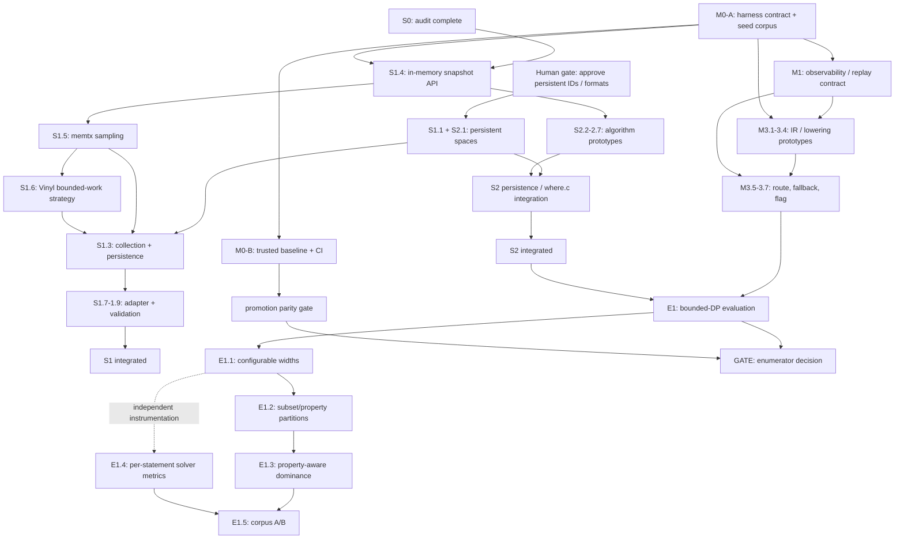

# Tarantool SQL Analytics Engine — Roadmap

## Purpose

This document is the single source of truth for the analytics-focused SQL
engine work on `tsafin/nextgen_sql` and its descendants. Status below was
reconciled with the local tree on 2026-09-26; uncommitted files are evidence
of work in progress, not completed deliverables.

Scope is deliberately narrow:

- proper SQL statistics, persisted in new system spaces;
- a new planner / lowering path that consumes those statistics and produces
  better plans for analytic workloads;
- a parity corpus that proves the new path never regresses results,
  diagnostics, or supported-class coverage of the current SQL engine.

Out of scope here (tracked elsewhere or rejected):

- push-based execution engine (rejected — VDBE remains the only executor);
- arm64 CnP stencil work (different machine);
- broad SQL feature additions (RIGHT JOIN, LATERAL, windows, UPSERT,
  RETURNING — none are parity requirements).

This file is structured so that it can be lifted directly into a GitHub epic
with linked sub-issues. Top-level milestones (M0, M1, S0, S1, S2, M3, E1, GATE)
each map to a sub-issue; their checklist items map to individual tasks.

## Related documents

- [`current_sql_feature_matrix.md`](current_sql_feature_matrix.md) —
  authoritative parity baseline (frozen subset).
- [`statistics_implementation_plan.md`](statistics_implementation_plan.md) —
  statistics infrastructure design.
- [`sql_stats_sampling.md`](sql_stats_sampling.md) — S1 memtx/Vinyl sampling
  contracts and feasibility constraints.
- [`planner_vm_migration.md`](planner_vm_migration.md) — staged migration
  of `where.c` to planner-IR + VDBE lowering.
- [`next_gen_sql_planner.md`](next_gen_sql_planner.md) — architecture survey
  (PostgreSQL / DPhyp / ORCA comparisons; memtx and Vinyl applicability).

## Status legend

Each work item carries a richer state than NOT-STARTED / DONE so the
roadmap accurately reflects how far an item has progressed past spec.

| State | Meaning |
|-------|---------|
| `NOT-STARTED` | No work, no spec beyond a paragraph in this file. |
| `SPEC-DRAFTED` | A focused spec exists; implementation has not started. |
| `PROTOTYPE` | Working code or tooling exists, but acceptance/CI gates are incomplete. |
| `FEATURE-GATED` | Default off in production builds; CI runs it on the parity corpus. |
| `PRODUCTION` | Default on; old path removed or scheduled for removal. |
| `COMPLETE` | A finite audit or decision deliverable is finished and recorded. |

The implementation maturity path is:
`NOT-STARTED → SPEC-DRAFTED → PROTOTYPE → FEATURE-GATED → PRODUCTION`.
Audits and decisions can instead end at `COMPLETE`.

## Execution model

Single human operator. Multiple LLM sessions allowed in parallel via git
worktrees. Implications:

- The human is the bottleneck for architectural decisions, reviews, and merges.
- LLM sessions are good at: implementing scoped sub-tasks, writing tests,
  mechanical refactors, drafting documentation.
- A sub-task marked `parallel: yes` is a candidate for an isolated worktree
  with its own LLM session. It must touch files that no concurrent task
  modifies, or its merge will fight.
- Sub-tasks marked `parallel: no` need human attention or touch a shared
  contract (descriptor, system-space schema) and should run serially.

## Dependency and integration plan

The dates in the earlier Gantt were prototype estimates and are now stale.
Use this dependency graph for scheduling. Arrows mean an accepted interface
or gate. The M0 contract and a small trusted corpus unblock development;
full-corpus coverage is required before production promotion.

```mermaid
flowchart TD
    A["M0-A: harness contract + seed corpus"] --> B["M0-B: trusted baseline + CI"]
    A --> C["M1: observability / replay contract"]
    D["S0: audit complete"] --> E["S1.4: in-memory snapshot API"]
    A --> E
    E --> F["S2.2-2.7: algorithm prototypes"]
    C --> G["M3.1-3.4: IR / lowering prototypes"]
    A --> G
    G --> H["M3.5-3.7: route, fallback, flag"]
    C --> H
    P["Human gate: approve persistent IDs / formats"] --> Q["S1.1 + S2.1: persistent spaces"]
    E --> R["S1.5: memtx sampling"]
    R --> R2["S1.6: Vinyl bounded-work strategy"]
    Q --> S["S1.3: collection + persistence"]
    R --> S
    R2 --> S
    S --> T["S1.7-1.9: adapter + validation"]
    Q --> U["S2 persistence / where.c integration"]
    F --> U
    U --> V["S2 integrated"]
    T --> W["S1 integrated"]
    H --> X["E1: bounded-DP evaluation"]
    V --> X
    X --> X1["E1.1: configurable widths"]
    X1 --> X2["E1.2: subset/property partitions"]
    X2 --> X3["E1.3: property-aware dominance"]
    X1 -. "independent instrumentation" .-> X4["E1.4: per-statement solver metrics"]
    X3 --> X5["E1.5: corpus A/B"]
    X4 --> X5
    B --> Y["promotion parity gate"]
    X --> Z["GATE: enumerator decision"]
    Y --> Z
```

The in-memory S1 snapshot, S2 algorithms, and M3 IR/lowering prototypes are
independent tracks after their stated contracts; they can use isolated
worktrees. Engine samplers are another independent track but must honor a
shared request/sink contract. Persistent-space work, collection, and adapters
stay behind the human IDs/formats gate. M3 can use fixed/current estimates
while statistics are built; E1 waits for integrated M3 and S2.

## Parallel work and integration ownership

Parallelism means separate branches or worktrees with one owner per shared
interface. Each track must define a narrow contract before others consume it;
integration runs serially. No simultaneous test-run.py or performance runs
against shared build directories, ports, or databases.

| Track | Can start after | Independent work | Serial integration point |
|-------|-----------------|------------------|--------------------------|
| M0 harness validity | now | isolated test execution, capture manifest, failure propagation | SCHEMA.md semantics and harness API |
| M0 corpus/CI | M0 harness contract | representative fixtures, coverage report, workflow wiring | CI gate and accepted snapshots |
| M1 observability | M0-A contract | counters, replay serializer, EXPLAIN surface | one owner for `sql.c`, grammar and path-class API |
| S1 statistics | S0 + M0-A contract | storage schema design, sampling adapters, immutable snapshot API | system-space IDs, `sql.c`, `where.c` adapter |
| S2 algorithms | S1 snapshot contract | HLL, MCV, histogram and synthetic data | persistence schema and selectivity adapter |
| M3 planner | M1 path-class and replay contract | logical IR, physical IR, lowering tests using fixed stats | resolver/`where.c` routing and feature flag |
| E1 evaluation | S2 + M3 integrated | benchmark workload design and measurement tooling | `wherePathSolver` and decision report |

Schema IDs and persistent formats need explicit review before implementation.
Keep the owner of `where.c` integration singular at each merge point. Merge
small, testable slices; do not hold a long-lived branch until an entire
milestone finishes. Each track's changes must state the exact interface
version and acceptance evidence in its review.

---

## M0 — Parity Corpus & Baseline Harness

**Goal:** establish a queryable parity baseline so every later phase can be
gated on "no result regression, no diagnostic regression, and reviewed
planner-path changes."

**State:** `COMPLETE` for the M0-A/M0-B parity gate in this branch. Manifest
v1 capture is fail-closed. Policy v2 reviews all 385 tests / 770 engine
pairs: 588 included, 182 excluded with evidence, none pending. The accepted
anchor is `04b63d19ab7deaa233ec2549d467b79d0cf4f5f2`; the CI jobs use
that named full-corpus policy. A clean native build passed the full local
generated/CnP/LLVM matrix (298 memtx tests / 49,535 queries and 290 Vinyl
tests / 39,535 queries per mode), with zero hard or soft parity drift,
identical manifests, and exact generated repeat captures. The post-provenance
capture also matched exactly. The first hosted full-corpus CI result remains
to be observed after publication; local workflow provisioning, including a
detached baseline worktree and pinned test runner, passed. The older
untracked 132,413-snapshot memtx-only tree is not the baseline. The
classifier covers all 385 file identities, but its tags are file-level, not
verified per-query feature coverage.

**Scope (B-light):** capture L1 result rows, L2 diagnostic, L3 path_class
per (test × engine), plus an external run manifest proving coverage and
outcome. Dispatcher dimension is a runtime parity check, not a stored
dimension. L7 latency goes to a separate perf-trail CSV. L4/L5 (plan shape)
are deferred to M3 when the descriptor exists naturally.

**Exit criteria:**

- every in-scope SQL test inventoried, with file-level feature tags and
  explicit query-level coverage only where verified;
- a reviewed inclusion/exclusion manifest identifies every test in the three
  SQL suites and records each suite/engine run outcome;
- accepted snapshots cover every runnable in-corpus test for its supported
  engine(s), with stable query identity and a passing recapture comparison;
- test failures, partial capture, missing snapshots, and unavailable
  dispatchers fail closed rather than producing a success-shaped diff;
- CI runs the real snapshot and dispatcher parity jobs on the defined corpus.

**Subtasks:**

- [x] **M0.1** Test auto-classifier — `test/sql-baselines/classify.lua`.
  Scans `*.test.lua` across sql / sql-tap / sql-luatest, regex-detects
  feature markers per `docs/vdbe/current_sql_feature_matrix.md`, writes
  `test/sql-baselines/classification.yaml` (385 entries on nextgen_sql
  HEAD). Landed at nextgen_sql `f8ae5a0ddd`, expanded at `02fdfbe2d3`
  (canonical_yaml.lua scalar coverage).
- [x] **M0.2** Snapshot harness — `test/sql-baselines/harness/run.lua`
  monkey-patches `box.execute`, dofiles the test file, writes one snapshot
  per captured query at `test/sql-baselines/snapshots/<suite>/<test>/q%02d.<engine>.yaml`
  per SCHEMA.md v1. Landed at nextgen_sql `4f8dc74e0b`. Verified end-to-end
  on a 7-statement mini SQL test.
- [x] **M0.3** Forensic L6 capture — when `--forensic` is enabled, the harness
  runs `EXPLAIN` and records a static VDBE program listing under
  `test/sql-baselines/forensics/`. This captures opcodes and operands without
  claiming the dynamic dispatch path; statements unsupported by `EXPLAIN` get
  an explicit comment-only capture. L6 remains advisory, not a parity gate.
- [x] **M0.4** Diff tool — `test/sql-baselines/diff.lua`. Compares two
  snapshot trees, classifies drift as RESULT-REGRESSION / DIAGNOSTIC-CHANGE
  / PATH-CLASS-SHIFT (currently a hard gate) or SOFT-DRIFT (advisory). Emits text /
  yaml / json; exit 1 on any hard-gate. Landed at nextgen_sql `a3c6dbf191`.
  Verified: identical inputs → 0 hard, 0 soft, all-MATCH exit 0; mutated
  row → RESULT-REGRESSION exit 1. L3 remains a strict gate for baseline
  comparison; M3 planner changes require an explicit reviewed exception.
- [x] **M0.5** CI: snapshot diff job — `.github/workflows/parity-corpus.yml`
  builds PR head and the named full-policy anchor, runs isolated captures on
  both engines, checks manifest coverage, then diffs via `diff.lua`. The
  baseline is a detached worktree from verified PR history, including fork
  PRs. Local workflow provisioning passed; hosted execution awaits publication.
- [x] **M0.6** CI: dispatcher parity job —
  `.github/workflows/dispatcher-parity.yml`. Matrix
  `{memtx, vinyl} × {generated, cnp, llvm}`. Compares CnP and LLVM outputs
  against generated; fails with `JIT-CORRECTNESS-REGRESSION:<dispatcher>` on
  any L1 or L2 divergence. It reads the accepted full policy; the complete
  six-way local matrix passed before promotion.
- [x] **M0.7** Perf-trail emitter — `test/sql-baselines/perf/emit.lua`
  records timing via `fiber.clock64()`, writes one CSV per CI run at
  `test/sql-baselines/perf/<YYYY-MM-DD>-<sha>.csv`. Accompanying
  `perf/aggregate.lua` reads a directory of those CSVs and emits a markdown
  trend table. `sample.csv` aligned with SCHEMA.md §L7 exemplar. Landed at
  nextgen_sql `b33719055e` + `1a9c7933b6` (gitignore).
- [x] **M0.8a / M0-A** Validate capture semantics on a small, representative
  seed corpus: use the normal test runner or reproduce its setup faithfully,
  preserve test failure and exit status, exercise generated/CnP/LLVM
  selection, and reject incomplete captures. Record a manifest with expected
  test/query counts and exclusion reasons. Do not accept the current
  untracked snapshot tree as ground truth. The harness contract and manifest
  format are serial integration points; fixtures and diagnostic probes may
  be built independently. Manifest v1, validator, runner-equivalent shared-
  engine seeds, typed/error result classes, SQL/SQL-TAP/luatest adapters,
  and six-way dispatcher capture are committed and verified.
- [x] **M0.8b** Reconcile SCHEMA.md and the tools: file-level versus
  query-level tags, query identity, result order, diagnostic codes,
  metadata that should not affect parity, and schema versioning. Verify
  round-trip and repeat-capture stability on the seed corpus. The v1
  contract is accepted; future semantic changes require versioning.
- [x] **M0.8c / M0-B** Capture the declared corpus under memtx and Vinyl
  where supported, report coverage and failures, and review snapshot size
  and storage strategy before committing any bulk baseline. Baseline against
  a named integration commit rather than the moving local `master` branch.
  The 770 engine decisions, full local six-mode matrix, exact repeat, and
  measured snapshot storage support the named integration anchor.
- [x] **M0.8d** Expand the real isolated seed CI invocations to the accepted
  corpus. Compare each PR head against the selected baseline with explicit
  coverage equality; run dispatcher parity on both engines where supported.
  Keep CI failing on a missing or empty corpus. Both jobs now read the full
  policy; their first hosted full-corpus run is pending branch publication.

---

## S0 — Statistics Audit

**Goal:** decide reuse/delete per file for the historical `_sql_stat1` /
`_sql_stat4` scaffolding before designing the new system spaces.

**State:** `COMPLETE` — audit landed as `docs/vdbe/s0_audit_report.md`
on `tsafin/llvm_jit` at commit `de57e09edd` (2026-06-21). Report finds the
historical `_sql_stat1` / `_sql_stat4` scaffolding is almost entirely
vestigial text: no `analyze.c`, no ANALYZE grammar in `parse.y`, and
`OP_LoadAnalysis` is a triply-registered no-op. 3 DELETE / 2
KEEP-AS-REFERENCE / 1 EXTRACT-HELPER / 11 REWRITE dispositions recorded.
S1 can start against this baseline.

**Exit criteria:**

- written inventory of disabled tests, no-op opcodes, dead helper functions;
- explicit decision per item (delete / keep-as-reference / extract-helper).

**Subtasks:**

- [x] **S0.1** Inventory disabled analyze tests in `test/sql-tap/suite.ini`
  and the dead bodies of `OP_LoadAnalysis` and friends.
- [x] **S0.2** Inventory `_sql_stat1` / `_sql_stat4` references in
  `src/box/sql/*` and decide per-file reuse/delete.
- [x] **S0.3** Write `docs/vdbe/s0_audit_report.md` summarizing findings,
  with explicit per-item disposition.

---

## M1 — Planner Observability & Replay

**Goal:** make the *current* planner's decisions inspectable, replayable, and
counter-gated before changing the planner.

**State:** `IN-PROGRESS`. M0-A/M0-B are accepted locally. M1.1 has the
preparatory statement-compilation counter (`sql_statement_compiles_total`)
plus WHERE-planner candidate and elapsed aggregates. A fallback aggregate
now increments at the multi-relation fallback route, and M1.2/M3.5 expose
`fallback` plus stable `UNSUPPORTED_RELATION_COUNT` / `UNSUPPORTED_AGGREGATE`
reasons through summary EXPLAIN; snapshot serialization preserves the reason
and its live corpus capture is tested for the multi-relation case. Other
fallback shapes and replay remain open. M1.3's
structured summary surface handles both the legacy `current_where_c` path and
that fallback outcome. Hosted CI publication is pending but does not block
local M1 work.
Freeze the planner event/path-class and replay envelope before M3 consumes
them.

**Exit criteria:**

- a captured planning decision can be replayed without live storage;
- `box.stat.sql()` exposes planner counters (candidates considered, fallback
  reasons, planning elapsed time);
- `EXPLAIN (planner = 'summary')` returns structured rows.

**Subtasks:**

- [x] **M1.1** Add planner counters to `box.stat.sql()` —
  `sql_planner_candidates_total` and `sql_planner_elapsed_us` are hooked to
  WHERE-planner candidate insertion and elapsed-time paths.
  `sql_planner_fallback_total` now increments for the production multi-
  relation and aggregate fallback paths. They publish stable
  `UNSUPPORTED_RELATION_COUNT` and `UNSUPPORTED_AGGREGATE` reasons through
  summary EXPLAIN; snapshot serialization preserves the reason.
  Per-reason counters are exposed as stable
  `sql_planner_fallback_<REASON>_total` fields and tested for both routed
  reasons. Candidate, elapsed, total fallback, and per-reason counter growth
  are validated by the SQL suites. Other fallback shapes are tracked in M3.5;
  `sql_statement_compiles_total` remains preparatory only.
  *parallel: no* (the fallback call site shares `where.c` with M3).
- [x] **M1.2** Wire path_class emission in current `where.c` — statements
  invoking the WHERE planner store `current_where_c` on the per-statement
  VDBE; summary EXPLAIN reads that value, and statements that do not invoke
  the planner report NULL. M0 snapshot capture consumes the versioned
  EXPLAIN snapshot through the M3.6 harness prototype. Multi-relation SELECTs
  now report `fallback` with a stable reason for multi-relation and aggregate
  shapes; remaining new-planner/fallback classes still require M3 dispatch.
  *parallel: no* (touches the same
  `where.c` files M3 will modify; coordinate).
- [x] **M1.3** `EXPLAIN (planner = 'summary')` grammar + executor returning
  structured rows per the planner_vm_migration.md schema. *parallel: yes*.
- [ ] **M1.4** `EXPLAIN (planner = 'snapshot')` returns a versioned MsgPack
  replay object. The v2 capture envelope contains statement `path_class`,
  fallback reason, and per-statement planner measurements, but explicitly
  reports `replayable=false` until normalized planner inputs (predicates,
  relation/access-path data, and statistics) are captured; this subtask
  remains open. The migration spec now defines the minimum canonical,
  self-contained input and validation contract for a future replay envelope;
  it intentionally does not choose persistence IDs or formats. Replay
  execution stays in M1.5. *parallel: yes*.
- [ ] **M1.5** Snapshot replay tool (developer-only API). Re-runs planning
  from a snapshot, diffs fingerprint and fallback reason. The current M1.4
  envelope still has no normalized predicates, relation/access-path inputs,
  or statistics and explicitly sets `replayable=false`; implementing a tool
  against that payload would only relabel live-state planning, not replay.
  The planner currently has no entry point that consumes normalized IR,
  logical access-path metadata, and captured statistics without the SQL
  compiler/catalog/storage dependencies; the replay contract requires that
  API and a test replaying after source state is unavailable. *parallel: yes*.

---

## S1 — Relation / Index / Cardinality Stats

**Goal:** the current `where.c` stops using `default_tuple_est[]` for ordinary
tables, and instead consumes real per-relation cardinality and average row
width.

**State:** `PROTOTYPE`. S1.4 has an immutable, deep-copying, reference-counted
in-memory snapshot API with schema-staleness checks and a bounded allocation
budget; S1.5 has a bounded memtx sampling prototype. Neither is attached to
prepare/ANALYZE or populated by a collection job. `sql.c` now accepts an
optional immutable snapshot and legacy index cardinality estimates consume it
when present, falling back on missing/stale data; `whereRangeScanEst()` still
uses its heuristic reduction over the adapted base estimate. Persistent
collection, prepared-statement snapshot ownership, Vinyl sampling, ANALYZE,
and complete adapter validation remain open. The system-space schema remains
DRAFT pending human review of IDs and formats.

**Exit criteria:**

- `ANALYZE [table]` accepted by the parser, runs a collection job, persists
  results;
- `index_field_tuple_est()` reads from the new snapshot, not from defaults;
- selectivity/cardinality error on the agreed corpus improves;
- no regression under stale or missing stats (fallback to defaults).

**Subtasks:**

- [ ] **S1.1** Define new system spaces (`_sql_stats_relation`,
  `_sql_stats_index`) with versioned MsgPack payload format. Write a
  short `docs/vdbe/sql_stats_schema.md`. The spec remains **DRAFT** by explicit
  direction; no system-space IDs or payload-format choices are approved.
  *parallel: no* (system-space allocation is a one-way door — needs human
  sign-off).
- [ ] **S1.2** Re-enable `ANALYZE` grammar; remove the
  `unsupported ANALYZE` rejection path. *parallel: yes*.
- [ ] **S1.3** Collection job — sample tuples, build summaries, persist
  transactionally. Engine-agnostic core. *parallel: yes*.
- [x] **S1.4 prototype** `SqlStatsSnapshot` API — immutable deep copy,
  reference-counted ownership, catalog/schema versions, relation/index
  cardinalities, confidence and freshness metadata, stale/missing lookup
  states, and a caller-specified memory budget. Unit tests cover deep copy,
  lifetime, schema mismatch, invalid values, and budget rejection. This is
  not yet attached to prepare/prepared-statement lifetime; that integration
  remains part of S1.7. *parallel: yes*.
- [ ] **S1.5 prototype** `engine_sql_stats_sample` dispatch and a bounded,
  seeded memtx sampler exist in `src/box/sql/sql_stats_sample.{h,c}`. It uses
  primary-index random access with replacement in the caller's active
  transaction and reports delivered rows/bytes; focused unit tests validate
  the bounded loop, and the production target compiles. A runtime engine-
  dispatch test now covers memtx transaction visibility, deterministic draws,
  row/byte limits, sink accounting, and unsupported/invalid inputs. It is not
  wired to ANALYZE/collection and does not create an independent read view;
  these gates remain open.
  *parallel: yes*.
- [ ] **S1.6** Vinyl sampling interface — no safe sampler callback can use the
  current public/index APIs: Vinyl `.random` is unsupported, and one normal
  iterator `next()` may inspect many disk sources, so output row/byte limits
  do not bound work. Before adding an engine callback, add operation-local
  source/page accounting and cancellation in the Vinyl iterator path, then
  test work-budget exhaustion with visibility and partial-sample semantics.
  The standalone fail-closed runtime test now verifies `ER_UNSUPPORTED` and
  zero rows/sink deliveries against a real Vinyl space; this does not complete
  the bounded-work interface.
  Iterator review confirms that a source/page cap cannot safely return tuples
  observed so far: an unvisited source may contain a newer visible version or
  tombstone, and first-N output is key-order biased. The next implementation
  slice now propagates an optional caller-owned operation-local source-probe /
  uncached-page budget through both iterator layers and fails closed on
  exhaustion. Focused unit tests cover counter limits/sticky exhaustion, and
  the production server builds. The Vinyl point-lookup unit fixture now also
  attaches zero-source and zero-page budgets to a real read/merge iterator over
  generated runs. It verifies source-budget exhaustion and no returned entry;
  the page-budget case fails closed earlier because this fixture has no
  cancellable reader pool, before consuming a page budget. Each iterator is
  closed after failure. This covers propagation/cleanup constraints, not page-
  cap exhaustion, logical visibility across successful sampling, or partial-
  sample confidence. The budget API treats exhaustion as an error, so callers
  must discard all earlier sink state from that operation. Logical-visible
  candidate selection and partial-sample confidence semantics remain
  undefined, so this instrumentation does not complete the sampler.
  Existing cancellation can surface as `FiberIsCancelled` through the pinned
  slice cleanup path; synchronous recovery reads are not cancellable. This is
  a design constraint, not a completed sampler.
  See `sql_stats_sampling.md`. *parallel: yes, against the S1.5 contract*.
- [ ] **S1.7** Compatibility adapter — `index_field_tuple_est()` and
  `whereRangeScanEst()` consume snapshot, fall back to defaults on absence.
  `sql_set_stats_snapshot()` now installs a retained immutable snapshot in the
  SQL core; `index_field_tuple_est()` and `sql_space_tuple_log_count()` use
  schema-validated relation cardinality and average rows-per-index-prefix
  estimates when available, preserving the legacy estimates on missing/stale
  relation/index data. `whereRangeScanEst()` applies its existing reduction
  to the resulting snapshot-backed input cardinality; S2 histogram range
  integration is not implied. Unit coverage exercises relation/prefix
  estimates, stale schemas, missing indexes, and definition-length mismatch,
  and the production SQL target links the snapshot API. This is only the
  reader/adapter side: no collection or SQL preparation path populates the
  provider, prepared statements do not own their own snapshot references,
  and there is no live SQL A/B estimate test. *parallel: no* (touches
  `where.c` integration surface).
- [ ] **S1.8** Re-enable disabled `analyze*.test.lua` tests, validate they
  pass. *parallel: yes*.
- [ ] **S1.9** Add synthetic uniform / skewed validation cases to the M0
  corpus, gate q-error improvement. *parallel: yes*.

---

## S2 — Column Stats + Sketches

**Goal:** per-column NDV, null fraction, MCV, equi-depth histograms — the
statistics that turn selectivity estimation from "guess 25%" into
"estimate based on data."

**State:** `PROTOTYPE` (S2.2 HLL, S2.3 bounded MCV, S2.4 histogram builder,
and a narrow S2.5 conjunction joint-MCV estimator are implemented as
in-memory APIs with focused unit tests; none is integrated with persistence
or the planner). Sketch algorithms and synthetic validation may start against
a versioned S1 snapshot interface before S1 is end-to-end; persistence and
the `where.c` selectivity adapter wait for that interface.

**Exit criteria:**

- `_sql_stats_column` populated for analyzed tables;
- selectivity estimation uses MCV / histogram precedence (exact → multivariate
  MCV → FD → histogram → independence fallback);
- analytic workloads in the corpus show measurable plan-quality improvement.

**Subtasks:**

- [ ] **S2.1** `_sql_stats_column` system space + versioned payload. *parallel:
  no* (system-space allocation).
- [x] **S2.2** HyperLogLog implementation for NDV. Mergeable. *parallel: yes*.
  In-memory opaque C API at `src/box/sql/sql_stats_hll.{h,c}`; precision
  4–18, deterministic caller-seeded byte hashing, seed/precision-checked
  merges, and documented probabilistic accuracy. A composite tuple entry point
  uses arity, type tags, and length-delimited values so it can sketch joint
  NDV without ambiguous concatenation. Unit tests cover 100k NDV error,
  deterministic estimates, merge compatibility, field boundaries, and type
  tags. Callers still own canonical SQL encodings. No persistence or
  system-space IDs are included; payload integration remains pending S1/schema
  review.
- [x] **S2.3** SpaceSaving heavy-hitter sketch for MCV. *parallel: yes*.
  In-memory opaque API at `src/box/sql/sql_stats_spacesaving.{h,c}` with
  fixed capacity, deterministic lexical tie handling, conservative merge
  intervals, and single-stream `N / capacity` error bound. Unit tests cover
  heavy-hitter bounds, deterministic ties, and merge. Contract is documented
  in `statistics_implementation_plan.md`; no persistence or system-space IDs.
- [x] **S2.4** Equi-depth histogram builder from sampled ordered values.
  *parallel: yes*. In-memory API at
  `src/box/sql/sql_stats_histogram.{h,c}` validates sorted caller-encoded
  values using a caller-supplied SQL-order comparator, deep-copies bounded
  quantile boundaries, and preserves equal-value groups (therefore may return
  fewer than the requested bucket count for duplicate-heavy samples). The
  opaque result reports cumulative sample counts; no SQL value encoding,
  persistence format, or system-space ID is defined. Focused unit tests cover
  quantiles, duplicate handling, deep copy, invalid ordering, and byte budget.
- [ ] **S2.5 prototype** Single-column selectivity API implemented in
  `src/box/sql/sql_stats_selectivity.{h,c}`: unique equality, NULL fraction,
  sampled MCV equality, residual-NDV independence fallback, cumulative
  histogram ranges, and conservative AND confidence. A separate narrow joint-
  MCV API estimates fully specified non-NULL equality conjunctions from an
  exact sampled tuple match and otherwise falls back to the single-column
  independence product. A predicate-conjunction API now also estimates one
  equality or range term per column exactly when distinct joint tuples cover
  the complete non-NULL sample; partial joint samples use the independent
  estimate. Repeated same-column equalities and one-sided range bounds are
  combined using the supplied SQL comparator; contradictions are exact zero
  and a matching equality is estimated once. A non-point two-sided range
  requires an exhaustive joint sample; without one it is rejected because
  the histogram API cannot safely derive interval mass from interpolated
  CDFs. Focused tests cover source precedence, strict/inclusive range
  boundaries, mixed range/equality matching, correlated q-error improvement,
  fallback, and malformed input rejection. HLL has a composite tuple input
  for joint-NDV sketching. A separate equality-conjunction API now consumes
  a compatible same-sample joint-NDV estimate for a tuple absent from the
  joint MCV list:
  it divides residual sample mass by residual joint distinct count, marks the
  result as `JOINT_NDV`, and lowers confidence for the uniform residual-tail
  assumption. Exact MCV matches retain precedence; absent/invalid/incompatible
  sketch metadata preserves the prior independence estimate. This is a narrow
  full-tuple residual estimate, not partial-tuple matching, dependency
  statistics, or a general correlation adjustment. Partial-tuple matching,
  dependencies, general correlation adjustment,
  normalized snapshot inputs, schema/group selection, and `where.c` integration
  remain open; this does not close S2.5. *parallel: yes for the standalone
  API; no for planner integration, which touches `where.c`.
- [ ] **S2.6 prototype** Focused unit q-error probes cover a uniform
  1,000-value distribution, a 90%-hot skewed distribution, correlated joint
  equality, and a negatively correlated rare conjunction where the joint MCV
  corrects independence's q-error from 25 to 1. A complete joint sample also
  corrects a mixed range/equality correlation probe's q-error from 2 to 1.
  These validate the standalone estimator only; the M0 SQL corpus still lacks
  correlated/anti-correlated and stale-stat variants. A synthetic stale-MCV
  probe now demonstrates that a distribution shift can worsen q-error while
  carrying caller-supplied lower confidence; the estimator has no freshness
  policy and this fixture does not establish one. A separate joint-correlation
  drift fixture moves a selected pair's actual frequency from 80% to 1% and
  demonstrates q-error 80 for the stale joint sample versus 1 for the current
  sample, with lower caller-supplied confidence. These remain synthetic
  algorithm probes, not a freshness policy or corpus validation. No production
  q-error gate is active.
  *parallel: yes*.
- [x] **S2.7 prototype** Confidence/staleness metadata representation.
  The S1.4 snapshot records cardinality confidence/semantics, collection time,
  and modification epoch; lookup explicitly reports schema-version mismatch
  as stale. This records evidence, not a refresh/decay policy: thresholding,
  persistence, and planner fallback on age remain open integration work.
  *parallel: yes*.

---

## M3 — Single-Table Physical IR + VDBE Lowering

**Goal:** prove that a planner-IR + lowering layer can produce VDBE bytecode
equivalent (in result and diagnostic) to current `where.c` for a controlled
single-table query class.

**State:** `PROTOTYPE` (M3.1 descriptor, structural M3.2 logical-plan
builder, M3.3 supplied-candidate selector, and M3.4 lowering callback
contract). No executable VDBE generation, production planner routing, parity,
or snapshot integration exists yet. Depends on the M1 path-class/replay
contract and M0-A seed parity gate, not on S2. Use fixed or current estimates
while statistics are under construction; integrate the real snapshot later.

**Scope (exact):**

- one base relation;
- point / range / full scan;
- deterministic scalar filters and projections;
- `ORDER BY`, `LIMIT`, `OFFSET`;
- result delivery.

**Explicit exclusions:** all subqueries (scalar, EXISTS, IN), CTEs and
recursive CTEs, compound SELECT, aggregates / GROUP BY / DISTINCT, joins,
DML, triggers, subprograms, non-deterministic functions.

**Exit criteria:**

- supported queries produce identical L1+L2 to current `where.c` across the
  corpus;
- unsupported queries fall back to `where.c` with stable reason code visible
  in the M0 snapshot;
- preparation/execution latency does not regress p95 by more than 5%.

**Subtasks:**

- [x] **M3.1** Physical-plan descriptor v1 — narrow form, single-table only.
  Written in `docs/vdbe/physical_plan_descriptor.md`. *parallel: no*
  (foundational contract).
- [x] **M3.2** Logical IR layer — resolved `Select` → single-relation
  `Scan` / optional `Filter` / `Project` / optional `Sort` / optional
  `Limit` chain. Expression trees are borrowed for statement lifetime; the
  builder rejects major unsupported SELECT shapes, but deterministic or
  side-effect-free expression validation remains a caller obligation. No
  resolver/VDBE routing is wired. Focused unit test: `sql_logical_plan`.
  *parallel: yes*.
- [x] **M3.3** Physical IR prototype — choose the least-cost supplied access
  candidate for a supported single-table logical chain; emits the immutable
  descriptor for primary/secondary point, range, index full, and table full
  scans. Stable tie-break and reject reasons are unit tested. Estimates are
  fixed/current-provider inputs; no SQL routing or expression normalization
  is wired. *parallel: yes*.
- [x] **M3.4 (contract prototype)** Lowering emitter contract for scan,
  filters, projection, sort, limit, and result with stable callback ordering
  and error propagation. It deliberately does not emit executable VDBE:
  expression bytecode, cursor/engine setup, sort semantics, result delivery,
  parity, and production routing remain open. See
  `docs/vdbe/physical_plan_descriptor.md`. *parallel: yes*.
- [ ] **M3.5** Fallback gate — every unsupported shape emits stable
  `fallback_reason` and routes to current `where.c`. Producer-contract
  prototype now maps logical/physical reject enums to stable reason codes and
  exposes `path_class` plus an optional descriptor (`sql_plan_fallback.*`),
  with focused mapping tests. `sqlWhereBegin()` now records the actual legacy
  route for multi-relation queries as `fallback` /
  `UNSUPPORTED_RELATION_COUNT`; summary/snapshot EXPLAIN and per-reason
  counters are wired and exercised locally. Aggregate SELECTs with a WHERE
  path plus GROUP BY/HAVING, DISTINCT, compound, CTE, and FROM-subquery forms
  now report their stable structural reasons and increment corresponding
  counters; GROUP BY/HAVING has an explicit runtime capture regression.
  Scalar, EXISTS, and IN subqueries embedded in a single-relation projection
  or predicate are also detected before rewrite and report
  `UNSUPPORTED_SUBQUERY`; runtime assertions cover each form and the shared
  per-reason counter delta.
  After name resolution, ordinary scalar calls lacking the deterministic
  function property now report `UNSUPPORTED_NONDETERMINISTIC` before logical
  plan construction/flattening; runtime coverage includes built-in `random()`,
  a user-defined function registered non-deterministic, deterministic `abs()`,
  and per-reason counter deltas. This property detects declared volatility,
  but Tarantool has no separate function side-effect property, so deterministic
  UDF side effects and argument-dependent volatility are not proven excluded.
  Structural
  classification runs before flattening/rewrite can erase the rejected shape;
  simple `COUNT(*)` stays unclassified because its fast path does not enter
  `where.c`. This remains partial: physical rejection reasons and other
  unclassified shapes are not routed/accounted, no new-planner success path
  exists, and M0 baseline recapture/parity review remains open.
  *parallel: no*.
- [ ] **M3.6 prototype** M0 snapshot capture now asks
  `EXPLAIN (planner = 'snapshot')` for SELECT statements and records its
  `path_class` / `fallback_reason`, instead of hardcoding
  `current_where_c`. A multi-relation statement now produces and captures
  `fallback` / `UNSUPPORTED_RELATION_COUNT`; live harness capture now also
  verifies aggregate, compound, DISTINCT, subquery, and CTE reasons. The M0
  normalizer preserves path, reason, and `fallback_to: current_where_c`; live
  harness capture and schema validation exercise the complete route. Other
  new-planner/fallback classes, baseline recapture, and parity validation
  remain open. The capture validator now checks fallback metadata as a
  coherent contract: a fallback requires a recognized stable reason and
  `fallback_to: current_where_c`, while non-fallback paths must not carry
  either field. Negative validation tests cover missing/unknown reasons,
  wrong fallback destinations, and fallback metadata attached to a
  `current_where_c` path. This closes a schema-validation hole, not the
  broader M3.6 capture/parity gate. The live harness now also fails capture if
  planner-snapshot EXPLAIN fails, returns no MsgPack, or violates the v2
  diagnostic envelope / `replayable: false` contract; it no longer silently
  records missing metadata as an ordinary path. It also preserves a nil path
  as `l3_path_class.taken: null` for statements that do not enter the WHERE
  planner, instead of crashing or mislabeling them `current_where_c`; the
  schema, validator, and a DML fixture cover this case.
  A targeted standalone audit now captures and validates all 30,073 statements
  in `select2.test.lua` under both memtx and Vinyl; this is not a baseline
  recapture or full-corpus parity result. When a manifest includes planner
  metrics, validation now checks unique ordered query indexes, valid
  path/reason combinations, and per-query agreement with the snapshot's L3
  path metadata; a capture regression changes a valid metric reason to a
  different valid code and verifies rejection. A v2 metrics manifest must
  also contain an entry for every successful SELECT/WITH snapshot; older
  manifests that omit the extension remain accepted. Expected failed
  SELECT/WITH probes stay gated on L2 but do not require a planner envelope:
  EXPLAIN may reject the same invalid statement, so their path is null. A
  missing-relation SELECT regression exercises this exception while successful
  SELECT metric coverage remains fail-closed. This closes the metrics-coverage
  hole, not baseline recapture or full M3.6 parity.
  *parallel: yes*.
- [ ] **M3.7** Feature flag `sql_new_planner_single_table=on/off`.
  *parallel: yes*.

---

## E1 — Improved Bounded DP Baseline

**Goal:** before any DPhyp / LinDP++ bake-off, prove or disprove the
hypothesis that most plan-quality gain comes from statistics + properties,
not from a new enumerator. This is the cheap experiment that may save
quarters of bake-off work.

**State:** `NOT-STARTED`. Depends on integrated M3 + S2 and an accepted
M0-B corpus for the evaluation workloads.

**Exit criteria:**

- the current bounded DP solver runs with configurable budgets, property-
  aware dominance, and deterministic tie-breaking;
- harness counters (candidates generated / dominated / truncated / retained)
  emitted to M0 corpus;
- A/B comparison against fixed-1/5/10 widths on the corpus.

**Subtasks:**

- [x] **E1.1** `wherePathSolver` beam widths are configurable at process start
  with `SQL_PATH_SOLVER_WIDTH_ONE`, `SQL_PATH_SOLVER_WIDTH_TWO`, and
  `SQL_PATH_SOLVER_WIDTH_MANY`. Defaults preserve `1/5/10`; invalid values
  fall back to defaults and valid values are bounded to `1..64`. Active values
  are exposed in `box.stat.sql()` and covered with a non-default luatest
  server. Time/memory budgets remain open. *parallel: no*.
- [x] **E1.2** Candidate paths are partitioned by relation subset, ORDER BY
  satisfaction, and reverse-scan mask. A global beam cap is retained; when
  full, admission prefers evicting the worst member of a duplicated partition
  before a singleton, falling back to the global worst when all partitions are
  singletons. This is diversity-aware bounded admission, not a guarantee that
  every partition survives. The 112-test SQL suite passes (6 disabled).
  *parallel: no* (same `where.c` solver as E1.1/E1.3).
- [x] **E1.3** Before beam admission, discard a path dominated within the
  same relation-subset/ORDER BY/reverse-scan partition across total cost,
  unsorted cost, and estimated rows. Remove every same-partition path dominated
  by a new candidate; retain incomparable candidates for future loop
  extensions. The global beam cap and E1.2 diversity eviction still apply.
  The 112-test SQL suite passes (6 disabled). *parallel: no*.
- [x] **E1.4** Snapshot v2 and the optional harness manifest now include
  generated/dominated/truncated/retained bounded-path counts alongside legacy
  candidate, elapsed, and fallback counts. Matching process totals are
  available in `box.stat.sql()`. Metrics are diagnostic and non-gating.
  `generated` counts feasible extensions; `dominated` counts path states
  pruned; `truncated` counts candidate/victim paths lost at the beam boundary;
  `retained` sums the beam contents after each join-depth round. *parallel:
  yes* (instrumentation and harness schema are separable from E1.1-E1.3).
- [ ] **E1.5 prototype** Reproducible offline A/B capture exists in
  `test/sql-baselines/planner_ab.py` and `PLANNER_AB.md`. On the reviewed
  join/WHERE subset (join, join2, join3, join5, where3), default 1/5/10 vs
  candidate 2/8/16 completed 687 statements per engine/run with zero snapshot
  drift in both repeats and across widths. Each engine measured 296 planner
  snapshots; 121 query metrics changed. Totals show more generated/retained
  paths and increased beam truncation, with candidate/fallback counts and path
  classes unchanged. `elapsed_us` was zero, so no latency or plan-quality gain
  is established. This is a bounded subset, not full-corpus evidence; the full
  corpus comparison and quality evaluation remain open. An expanded 962-query
  exploratory subset is repeat-stable but has one width-sensitive
  `EXPLAIN QUERY PLAN` output difference (`whereK/q13`) on both engines; it is
  not counted as a full snapshot parity pass, though both configurations pass
  the corresponding whereK SQL result assertions. *parallel: yes*.

---

## GATE — Enumerator Bake-off Decision

**State:** `NOT-STARTED`. Depends on E1.

**Decision input:**

- E1 plan-quality measurements vs fixed-width solver;
- S2 statistics-improvement measurements;
- analytic workload corpus results.

**Possible outcomes:**

1. **Stop.** E1 + S2 closed the analytics gap. Retain bounded DP, declare
   the analytics initiative successful for the current scope.
2. **Continue with DPhyp prototype only.** E1 + S2 helped but a plan-quality
   gap remains on dense / star / snowflake join graphs.
3. **Continue with full bake-off** (DPhyp / LinDP++ / deterministic
   greedy/beam). E1 + S2 helped but the residual gap is unclear in shape.

This gate is intentionally a stopping point. The honest expectation given
Tarantool's current join graph shapes (mostly OLTP-style, low relation
count) is **outcome 1**. The work beyond this point should not be planned
until the gate evaluation runs.

---

## Cross-cutting concerns

### CnP and LLVM MCJIT

Both JIT backends remain in their current state, consuming the VDBE bytecode
that the new planner lowers. **No planner work in this roadmap touches the
JIT path.** Cross-platform expansion of CnP to arm64 happens on a different
machine and is not tracked here.

The dispatcher-parity CI job (M0.6) is the only roadmap item that interacts
with the JITs, and it does so as a black-box correctness check — not as a
modification of either JIT.

### `where.c` retirement

This roadmap does **not** schedule `where.c` removal. Retirement is gated on
all supported query classes showing zero fallback for two consecutive release
cycles, plus a separate written decision. Until that decision, both planners
coexist via the M3.5 fallback path.

### System-space allocation

`_sql_stats_relation`, `_sql_stats_index`, `_sql_stats_column` are
permanent on-disk schema changes. Each requires human review and explicit
allocation of system-space IDs before the corresponding subtask
(`S1.1`, `S2.1`) starts implementation. These are the only one-way doors
in the roadmap.

---

## GitHub epic structure

When converted, this roadmap should produce:

- one top-level epic issue: *"Tarantool SQL Analytics Engine — Statistics +
  Planner Migration"*;
- eight sub-issues, one per milestone (M0, S0, M1, S1, S2, M3, E1, GATE);
- one task issue per subtask checkbox in this file;
- a status label on each sub-issue matching the status legend above.

The Mermaid dependency graph above can be embedded directly in the epic body.
No calendar dates are assigned while architectural approval and integration
gates remain open; use the dependency edges to sequence work.
