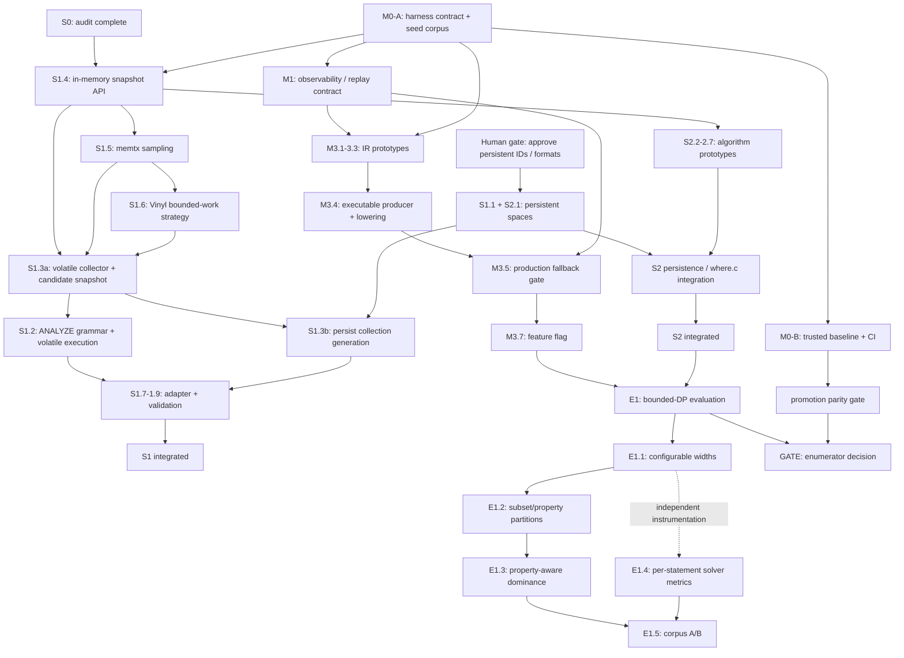

# Tarantool SQL Analytics Engine — Roadmap

## Purpose

This document is the single source of truth for the analytics-focused SQL
engine work on `tsafin/nextgen_sql` and its descendants. Status below was
reconciled with the local tree on 2026-09-27; uncommitted files are evidence
of work in progress, not completed deliverables.

Scope is deliberately narrow:

- proper SQL statistics, persisted in new system spaces;
- a new planner / lowering path that consumes those statistics and produces
  better plans for analytic workloads;
- a parity corpus that proves the new path never regresses results,
  diagnostics, or supported-class coverage of the current SQL engine.

Out of scope here (tracked elsewhere or rejected):

- push-based execution engine (rejected — VDBE remains the only executor);
- arm64 CnP stencil work (different machine);
- broad SQL feature additions (RIGHT JOIN, LATERAL, windows, UPSERT,
  RETURNING — none are parity requirements).

This file is structured so that it can be lifted directly into a GitHub epic
with linked sub-issues. Top-level milestones (M0, M1, S0, S1, S2, M3, E1, GATE)
each map to a sub-issue; their checklist items map to individual tasks.

## Related documents

- [`current_sql_feature_matrix.md`](current_sql_feature_matrix.md) —
  authoritative parity baseline (frozen subset).
- [`statistics_implementation_plan.md`](statistics_implementation_plan.md) —
  statistics infrastructure design.
- [`sql_stats_sampling.md`](sql_stats_sampling.md) — S1 memtx/Vinyl sampling
  contracts and feasibility constraints.
- [`planner_vm_migration.md`](planner_vm_migration.md) — staged migration
  of `where.c` to planner-IR + VDBE lowering.
- [`next_gen_sql_planner.md`](next_gen_sql_planner.md) — architecture survey
  (PostgreSQL / DPhyp / ORCA comparisons; memtx and Vinyl applicability).

## Status legend

Each work item carries a richer state than NOT-STARTED / DONE so the
roadmap accurately reflects how far an item has progressed past spec.

| State | Meaning |
|-------|---------|
| `NOT-STARTED` | No work, no spec beyond a paragraph in this file. |
| `SPEC-DRAFTED` | A focused spec exists; implementation has not started. |
| `PROTOTYPE` | Working code or tooling exists, but acceptance/CI gates are incomplete. |
| `FEATURE-GATED` | Default off in production builds; CI runs it on the parity corpus. |
| `PRODUCTION` | Default on; old path removed or scheduled for removal. |
| `COMPLETE` | A finite audit or decision deliverable is finished and recorded. |

The implementation maturity path is:
`NOT-STARTED → SPEC-DRAFTED → PROTOTYPE → FEATURE-GATED → PRODUCTION`.
Audits and decisions can instead end at `COMPLETE`.

## Execution model

Single human operator. Multiple LLM sessions allowed in parallel via git
worktrees. Implications:

- The human is the bottleneck for architectural decisions, reviews, and merges.
- LLM sessions are good at: implementing scoped sub-tasks, writing tests,
  mechanical refactors, drafting documentation.
- A sub-task marked `parallel: yes` is a candidate for an isolated worktree
  with its own LLM session. It must touch files that no concurrent task
  modifies, or its merge will fight.
- Sub-tasks marked `parallel: no` need human attention or touch a shared
  contract (descriptor, system-space schema) and should run serially.

## Dependency and integration plan

The dates in the earlier Gantt were prototype estimates and are now stale.
Use this dependency graph for scheduling. Arrows mean an accepted interface
or gate. The M0 contract and a small trusted corpus unblock development;
full-corpus coverage is required before production promotion.


```mermaid
flowchart TD
    A["M0-A: harness contract + seed corpus"] --> B["M0-B: trusted baseline + CI"]
    A --> C["M1: observability / replay contract"]
    D["S0: audit complete"] --> E["S1.4: in-memory snapshot API"]
    A --> E
    E --> F["S2.2-2.7: algorithm prototypes"]
    C --> G["M3.1-3.3: IR prototypes"]
    A --> G
    G --> G2["M3.4: executable producer + lowering"]
    G2 --> H["M3.5: production fallback gate"]
    C --> H
    H --> H2["M3.7: feature flag"]
    P["Human gate: approve persistent IDs / formats"] --> Q["S1.1 + S2.1: persistent spaces"]
    E --> R["S1.5: memtx sampling"]
    R --> R2["S1.6: Vinyl bounded-work strategy"]
    E --> S0["S1.3a: volatile collector + candidate snapshot"]
    R --> S0
    R2 --> S0
    S0 --> S1["S1.2: ANALYZE grammar + volatile execution"]
    S0 --> S2["S1.3b: persist collection generation"]
    Q --> S2
    S1 --> T["S1.7-1.9: adapter + validation"]
    S2 --> T
    Q --> U["S2 persistence / where.c integration"]
    F --> U
    U --> V["S2 integrated"]
    T --> W["S1 integrated"]
    H2 --> X["E1: bounded-DP evaluation"]
    V --> X
    X --> X1["E1.1: configurable widths"]
    X1 --> X2["E1.2: subset/property partitions"]
    X2 --> X3["E1.3: property-aware dominance"]
    X1 -. "independent instrumentation" .-> X4["E1.4: per-statement solver metrics"]
    X3 --> X5["E1.5: corpus A/B"]
    X4 --> X5
    B --> Y["promotion parity gate"]
    X --> Z["GATE: enumerator decision"]
    Y --> Z
```

The in-memory S1 snapshot, S2 algorithms, and M3 IR/lowering prototypes are
independent tracks after their stated contracts; they can use isolated
worktrees. Engine samplers and S1.3a's volatile collector are independent of
persistent IDs, but must honor the shared sampler/snapshot contracts.
S1.3b persistence and any persistent ANALYZE behavior stay behind the human
IDs/formats gate. M3 can use fixed/current estimates while statistics are
built; E1 acceptance waits for integrated M3 and S2.

## Parallel work and integration ownership

Parallelism means separate branches or worktrees with one owner per shared
interface. Each track must define a narrow contract before others consume it;
integration runs serially. No simultaneous test-run.py or performance runs
against shared build directories, ports, or databases.

| Track | Can start after | Independent work | Serial integration point |
|-------|-----------------|------------------|--------------------------|
| M0 harness validity | now | isolated test execution, capture manifest, failure propagation | SCHEMA.md semantics and harness API |
| M0 corpus/CI | M0 harness contract | representative fixtures, coverage report, workflow wiring | CI gate and accepted snapshots |
| M1 observability | M0-A contract | counters, replay serializer, EXPLAIN surface | one owner for `sql.c`, grammar and path-class API |
| S1 statistics | S0 + M0-A contract | sampling adapters, immutable snapshot API, volatile collector/candidate builder | approved system-space IDs/formats, persistent publication, `sql.c` / `where.c` adapter |
| S2 algorithms | S1 snapshot contract | HLL, MCV, histogram and synthetic data | persistence schema and selectivity adapter |
| M3 planner | M1 path-class and replay contract | logical IR, physical IR, lowering tests using fixed stats | resolver/`where.c` routing and feature flag |
| E1 evaluation | S2 + M3 integrated | benchmark workload design and measurement tooling | `wherePathSolver` and decision report |

Schema IDs and persistent formats need explicit review before implementation.
Keep the owner of `where.c` integration singular at each merge point. Merge
small, testable slices; do not hold a long-lived branch until an entire
milestone finishes. Each track's changes must state the exact interface
version and acceptance evidence in its review.

---

## M0 — Parity Corpus & Baseline Harness

**Goal:** establish a queryable parity baseline so every later phase can be
gated on "no result regression, no diagnostic regression, and reviewed
planner-path changes."

**State:** `COMPLETE` for the M0-A/M0-B parity gate in this branch. Manifest
v1 capture is fail-closed. Policy v2 reviews all 386 tests / 772 engine
pairs: 588 included, 184 excluded with evidence, none pending. The accepted
anchor is `d8fc1e339b0bb8579c8b08e39d062e20edf66666`; the CI jobs use
that named full-corpus policy. A clean native build passed the full local
generated/CnP/LLVM matrix (298 memtx tests / 49,535 queries and 290 Vinyl
tests / 39,535 queries per mode), with zero hard or soft parity drift,
identical manifests, and exact generated repeat captures. The post-provenance
capture also matched exactly. Local exit criteria are satisfied; the first
hosted full-corpus CI result is an informational post-publication check, not
a reason to hold subsequent implementation work. Local workflow provisioning,
including a detached baseline worktree and pinned test runner, passed. The older
untracked 132,413-snapshot memtx-only tree is not the baseline. The
classifier covers all 386 file identities, but its tags are file-level, not
verified per-query feature coverage.

**Scope (B-light):** capture L1 result rows, L2 diagnostic, L3 path_class
per (test × engine), plus an external run manifest proving coverage and
outcome. Dispatcher dimension is a runtime parity check, not a stored
dimension. L7 latency goes to a separate perf-trail CSV. L4/L5 (plan shape)
are deferred to M3 when the descriptor exists naturally.

**Exit criteria:**

- every in-scope SQL test inventoried, with file-level feature tags and
  explicit query-level coverage only where verified;
- a reviewed inclusion/exclusion manifest identifies every test in the three
  SQL suites and records each suite/engine run outcome;
- accepted snapshots cover every runnable in-corpus test for its supported
  engine(s), with stable query identity and a passing recapture comparison;
- test failures, partial capture, missing snapshots, and unavailable
  dispatchers fail closed rather than producing a success-shaped diff;
- CI runs the real snapshot and dispatcher parity jobs on the defined corpus.

**Subtasks:**

- [x] **M0.1** Test auto-classifier — `test/sql-baselines/classify.lua`.
  Scans `*.test.lua` across sql / sql-tap / sql-luatest, regex-detects
  feature markers per `docs/vdbe/current_sql_feature_matrix.md`, writes
  `test/sql-baselines/classification.yaml` (386 entries on nextgen_sql
  HEAD). Landed at nextgen_sql `f8ae5a0ddd`, expanded at `02fdfbe2d3`
  (canonical_yaml.lua scalar coverage).
- [x] **M0.2** Snapshot harness — `test/sql-baselines/harness/run.lua`
  monkey-patches `box.execute`, dofiles the test file, writes one snapshot
  per captured query at `test/sql-baselines/snapshots/<suite>/<test>/q%02d.<engine>.yaml`
  per SCHEMA.md v1. Landed at nextgen_sql `4f8dc74e0b`. Verified end-to-end
  on a 7-statement mini SQL test.
- [x] **M0.3** Forensic L6 capture — when `--forensic` is enabled, the harness
  runs `EXPLAIN` and records a static VDBE program listing under
  `test/sql-baselines/forensics/`. This captures opcodes and operands without
  claiming the dynamic dispatch path; statements unsupported by `EXPLAIN` get
  an explicit comment-only capture. L6 remains advisory, not a parity gate.
- [x] **M0.4** Diff tool — `test/sql-baselines/diff.lua`. Compares two
  snapshot trees, classifies drift as RESULT-REGRESSION / DIAGNOSTIC-CHANGE
  / PATH-CLASS-SHIFT (currently a hard gate) or SOFT-DRIFT (advisory). Emits text /
  yaml / json; exit 1 on any hard-gate. Landed at nextgen_sql `a3c6dbf191`.
  Verified: identical inputs → 0 hard, 0 soft, all-MATCH exit 0; mutated
  row → RESULT-REGRESSION exit 1. L3 remains a strict gate for baseline
  comparison; M3 planner changes require an explicit reviewed exception.
- [x] **M0.5** CI: snapshot diff job — `.github/workflows/parity-corpus.yml`
  builds PR head and the named full-policy anchor, runs isolated captures on
  both engines, checks manifest coverage, then diffs via `diff.lua`. The
  baseline is a detached worktree from verified PR history, including fork
  PRs. Local workflow provisioning passed; hosted execution awaits publication.
- [x] **M0.6** CI: dispatcher parity job —
  `.github/workflows/dispatcher-parity.yml`. Matrix
  `{memtx, vinyl} × {generated, cnp, llvm}`. Compares CnP and LLVM outputs
  against generated; fails with `JIT-CORRECTNESS-REGRESSION:<dispatcher>` on
  any L1 or L2 divergence. It reads the accepted full policy; the complete
  six-way local matrix passed before promotion.
- [x] **M0.7** Perf-trail emitter — `test/sql-baselines/perf/emit.lua`
  records timing via `fiber.clock64()`, writes one CSV per CI run at
  `test/sql-baselines/perf/<YYYY-MM-DD>-<sha>.csv`. Accompanying
  `perf/aggregate.lua` reads a directory of those CSVs and emits a markdown
  trend table. `sample.csv` aligned with SCHEMA.md §L7 exemplar. Landed at
  nextgen_sql `b33719055e` + `1a9c7933b6` (gitignore).
- [x] **M0.8a / M0-A** Validate capture semantics on a small, representative
  seed corpus: use the normal test runner or reproduce its setup faithfully,
  preserve test failure and exit status, exercise generated/CnP/LLVM
  selection, and reject incomplete captures. Record a manifest with expected
  test/query counts and exclusion reasons. Do not accept the current
  untracked snapshot tree as ground truth. The harness contract and manifest
  format are serial integration points; fixtures and diagnostic probes may
  be built independently. Manifest v1, validator, runner-equivalent shared-
  engine seeds, typed/error result classes, SQL/SQL-TAP/luatest adapters,
  and six-way dispatcher capture are committed and verified.
- [x] **M0.8b** Reconcile SCHEMA.md and the tools: file-level versus
  query-level tags, query identity, result order, diagnostic codes,
  metadata that should not affect parity, and schema versioning. Verify
  round-trip and repeat-capture stability on the seed corpus. The v1
  contract is accepted; future semantic changes require versioning.
- [x] **M0.8c / M0-B** Capture the declared corpus under memtx and Vinyl
  where supported, report coverage and failures, and review snapshot size
  and storage strategy before committing any bulk baseline. Baseline against
  a named integration commit rather than the moving local `master` branch.
  The 770 engine decisions, full local six-mode matrix, exact repeat, and
  measured snapshot storage support the named integration anchor.
- [x] **M0.8d** Expand the real isolated seed CI invocations to the accepted
  corpus. Compare each PR head against the selected baseline with explicit
  coverage equality; run dispatcher parity on both engines where supported.
  Keep CI failing on a missing or empty corpus. Both jobs now read the full
  policy; their first hosted full-corpus run is pending branch publication.

---

## S0 — Statistics Audit

**Goal:** decide reuse/delete per file for the historical `_sql_stat1` /
`_sql_stat4` scaffolding before designing the new system spaces.

**State:** `COMPLETE` — audit landed as `docs/vdbe/s0_audit_report.md`
on `tsafin/llvm_jit` at commit `de57e09edd` (2026-06-21). Report finds the
historical `_sql_stat1` / `_sql_stat4` scaffolding is almost entirely
vestigial text: no `analyze.c`, no ANALYZE grammar in `parse.y`, and
`OP_LoadAnalysis` is a triply-registered no-op. 3 DELETE / 2
KEEP-AS-REFERENCE / 1 EXTRACT-HELPER / 11 REWRITE dispositions recorded.
S1 can start against this baseline.

**Exit criteria:**

- written inventory of disabled tests, no-op opcodes, dead helper functions;
- explicit decision per item (delete / keep-as-reference / extract-helper).

**Subtasks:**

- [x] **S0.1** Inventory disabled analyze tests in `test/sql-tap/suite.ini`
  and the dead bodies of `OP_LoadAnalysis` and friends.
- [x] **S0.2** Inventory `_sql_stat1` / `_sql_stat4` references in
  `src/box/sql/*` and decide per-file reuse/delete.
- [x] **S0.3** Write `docs/vdbe/s0_audit_report.md` summarizing findings,
  with explicit per-item disposition.

---

## M1 — Planner Observability & Replay

**Goal:** make the *current* planner's decisions inspectable, replayable, and
counter-gated before changing the planner.

**State:** `IN-PROGRESS`. M0-A/M0-B are accepted locally. M1.1 has the
preparatory statement-compilation counter (`sql_statement_compiles_total`)
plus WHERE-planner candidate and elapsed aggregates. A fallback aggregate
now increments at the multi-relation fallback route, and M1.2/M3.5 expose
`fallback` plus stable `UNSUPPORTED_RELATION_COUNT` / `UNSUPPORTED_AGGREGATE`
reasons through summary EXPLAIN; snapshot serialization preserves the reason
and its live corpus capture is tested for the multi-relation case. Other
fallback shapes and replay remain open. M1.3's
structured summary surface handles both the legacy `current_where_c` path and
that fallback outcome. Hosted CI publication is pending but does not block
local M1 work.
Freeze the planner event/path-class and replay envelope before M3 consumes
them.

**Exit criteria:**

- a captured planning decision can be replayed without live storage;
- `box.stat.sql()` exposes planner counters (candidates considered, fallback
  reasons, planning elapsed time);
- `EXPLAIN (planner = 'summary')` returns structured rows.

**Subtasks:**

- [x] **M1.1** Add planner counters to `box.stat.sql()` —
  `sql_planner_candidates_total` and `sql_planner_elapsed_us` are hooked to
  WHERE-planner candidate insertion and elapsed-time paths.
  `sql_planner_fallback_total` now increments for the production multi-
  relation and aggregate fallback paths. They publish stable
  `UNSUPPORTED_RELATION_COUNT` and `UNSUPPORTED_AGGREGATE` reasons through
  summary EXPLAIN; snapshot serialization preserves the reason.
  Per-reason counters are exposed as stable
  `sql_planner_fallback_<REASON>_total` fields and tested for both routed
  reasons. Candidate, elapsed, total fallback, and per-reason counter growth
  are validated by the SQL suites. Other fallback shapes are tracked in M3.5;
  `sql_statement_compiles_total` remains preparatory only.
  *parallel: no* (the fallback call site shares `where.c` with M3).
- [x] **M1.2** Wire path_class emission in current `where.c` — statements
  invoking the WHERE planner store `current_where_c` on the per-statement
  VDBE; summary EXPLAIN reads that value, and statements that do not invoke
  the planner report NULL. M0 snapshot capture consumes the versioned
  EXPLAIN snapshot through the M3.6 harness prototype. Multi-relation SELECTs
  now report `fallback` with a stable reason for multi-relation and aggregate
  shapes; remaining new-planner/fallback classes still require M3 dispatch.
  *parallel: no* (touches the same
  `where.c` files M3 will modify; coordinate).
- [x] **M1.3** `EXPLAIN (planner = 'summary')` grammar + executor returning
  structured rows per the planner_vm_migration.md schema. *parallel: yes*.
- [ ] **M1.4** `EXPLAIN (planner = 'snapshot')` returns a versioned MsgPack
  replay object. The v2 capture envelope contains statement `path_class`,
  fallback reason, and per-statement planner measurements, but explicitly
  reports `replayable=false` until normalized planner inputs (predicates,
  relation/access-path data, and statistics) are captured; this subtask
  remains open. The migration spec now defines the minimum canonical,
  self-contained input and validation contract for a future replay envelope;
  it intentionally does not choose persistence IDs or formats. Focused SQL
  checks assert v2 remains non-replayable and has no partial `replay_inputs`
  on both legacy and fallback paths, and the corpus capturer rejects a v2
  object that violates either invariant. An audit of the narrow M3 single-
  relation IR found it is not yet a safe source for a new replay envelope:
  logical nodes borrow resolved `Expr` / `ExprList` trees from the live
  statement and carry the catalog `space_id`; the physical planner receives
  access candidates from a caller-supplied provider, while the IR does not
  capture relation/index definitions or the exact statistics/configuration
  used to form those candidates. Serializing that object would therefore
  retain live compiler/catalog dependencies and omit planner inputs. This
  validates the diagnostic-only boundary, not replay support. The smallest
  prerequisite is a detached canonical normalized-input model plus an
  extraction/validation API that rejects unsupported expressions and records
  logical relation/index metadata, statistics semantics, and planner config;
  only then can a new envelope version be evaluated. Replay execution stays
  in M1.5. The M1.4 owned-value prototype now models a normalized
  single-relation SELECT subset (predicate, projections, ordering, limit and
  offset), logical columns and index parts, and relation/index statistics
  with population, width, NDV, confidence, and freshness semantics, including
  per-index tuple-count semantics and definition version. Validation
  rejects incomplete definitions, invalid index ordinals, inconsistent stats
  absence, and malformed limit/order metadata. A deterministic internal
  MsgPack input format v4 emits fixed lexicographic map-key order, sorts
  logical indexes by key, and preserves semantically ordered columns,
  projections, ordering, and key parts. Reordered equivalent index inputs
  serialize to byte-identical valid MsgPack. Predicate, projection, and
  ordering strings are checked against the prototype's narrow canonical
  scalar-expression grammar, including column bounds; SQL text, unsupported
  calls, and malformed expressions fail closed. Relation/index
  schema-definition strings remain opaque and are not syntax-validated or
  normalized. `sql_replay_input_extract_select()` now connects a resolved
  single-relation `Select` to detached input creation: it canonicalizes the
  predicate/projection/order trees, records sort direction/default NULL order,
  and accepts only nonnegative integer literal LIMIT/OFFSET. A companion
  `sql_replay_input_extract_select_from_catalog()` derives detached
  relation/column/index definitions from the source catalog space using
  logical relation ordinal `r0`; storage index IDs remain only in a separate
  in-memory association. It rejects views, functional indexes, and multikey
  indexes whose identity is not modeled, and preserves repeated key ordinals.
  The catalog-only API keeps statistics absent; a snapshot-backed companion
  copies current-schema relation and index summaries from an immutable
  `SqlStatsSnapshot`, including visible/physical/estimated population
  semantics, population/NDV provenance, width, confidence, and freshness
  fields. Missing or stale relation summaries stay explicitly
  absent; malformed or non-integral cardinalities that replay input v4 cannot
  represent exactly fail closed. Fractional average row widths are retained
  exactly as finite doubles. Planner configuration remains caller-supplied.
  All extractors reject unsupported cursor bindings,
  expressions/functions, limits, and SELECT structure without returning
  partial input; outputs retain no live AST/catalog pointers. The owned model
  also optionally carries a provider-supplied ordered access-
  candidate list distinguishing primary-key point, index point/range/full, and
  table-full access, with logical index keys, canonical constraints, scan
  direction, projected logical columns, produced order, separate access-
  estimated and cost rows, and finite confidence/cost metrics. Rank order is
  preserved because planner tie-breaking may consume it; stable candidate keys
  must be unique. Missing provider output differs from a known empty set; a
  snapshot-backed extraction regression now asserts it remains unavailable,
  not present-empty, when no active planner producer supplied candidates.
  This remains caller/provider supplied: the active SQL planner producer is not
  wired to it. Stats capture from the active planner provider, joins/aggregates,
  and a planner consumer remain absent. M1.4 remains open. The external
  diagnostic envelope remains v2 and `replayable=false`; the internal detached
  input prototype is v4 and is not embedded in that envelope.
  A follow-up live-path audit confirms there is no safe capture-only splice
  yet. `sqlVdbeList()` in `src/box/sql/vdbeaux.c` writes the diagnostic
  envelope directly and has no retained `Select`, cursor map, stats snapshot,
  or candidate-provider result. `sql_replay_input_extract_select_from_snapshot()`
  in `src/box/sql/sql_replay_extract.c` can extract a resolved one-relation
  SELECT and stats, but planner algorithm/config versions and beam width are
  caller arguments; the active prepare/planner path has no corresponding
  replay-input caller or authoritative values to pass. Its access-candidate
  list is not derived from the WHERE planner. The live `whereLoopInsert()`
  hook (`src/box/sql/where.c`) calls `sql_record_planner_candidate()`, whose
  VDBE-facing data is aggregate candidate/path counters, not normalized
  candidate identities, constraints, estimates, ordering, or costs. Therefore
  neither a complete candidate list nor a known-empty list can be asserted
  from that hook. The snapshot extractor initializes candidate metadata as
  missing, not present-empty. The bounded implementation step is to establish
  a planner-owned capture context at preparation with explicit algorithm/config
  identity, immutable stats provenance, and an all-or-nothing ordered candidate
  result; only after that context is complete should the v3 diagnostic envelope
  gain `replay_inputs` and `replayable=true`. Until then, no partial embedding
  or diagnostic behavior change is justified. A focused internal bridge now
  models provider outcomes explicitly as `UNAVAILABLE`, `COMPLETE`, or
  `INCOMPLETE`. It preserves the existing unavailable-vs-known-empty encoding,
  deep-copies only a complete provider list into the owned input, and returns
  `INCOMPLETE` with no result object when a provider reports a partial prefix.
  Unit tests cover all three outcomes and reject payload attached to an
  unavailable state. The configured `sql_replay_input.test` target rebuilds
  and passes, including all 19 candidate-provider checks. This validates
  transport/completeness-state handling
  only: the bridge cannot prove that a caller labeling its list `COMPLETE`
  actually enumerated every viable access candidate, and no active planner
  producer calls it. `WhereLoop` capture therefore remains open; M1.4 stays
  non-replayable, and neither the external v2 envelope nor its `replayable`
  field changes. A bounded staging API now lets a future producer provide
  fixed candidate storage, explicitly mark enumeration start/normal completion,
  append ordered values, or poison the capture on an unsupported shape.
  Capacity overflow and premature completion publish only `INCOMPLETE`; an
  unstarted producer remains `UNAVAILABLE`, distinct from a started,
  completed empty enumeration. Tests verify that no partial prefix escapes.
  This is transport-side all-or-nothing enforcement, not a `WhereLoop`
  producer: source audit finds `whereLoopInsert()` (where.c:1500) called before
  dominance replacement and for OR-subclause loops as well as ordinary
  candidates; it receives no relation-completion signal. Although the final
  `WhereInfo.pLoops` list is pruned, converting it requires per-loop
  `aLTerm`/`index_def` normalization, stable logical index mapping, projected
  columns and produced order, plus the exact statistics/configuration used by
  planning. The existing resolved-SELECT canonicalizer is not a `WhereLoop`
  constraint adapter, and preparation does not retain authoritative planner
  config or immutable statistics provenance alongside that list. Until those
  inputs and a post-enumeration completion boundary exist, the active planner
  cannot safely label a candidate list complete.
  *parallel: yes*.
- [ ] **M1.5** Snapshot replay tool (developer-only API). Re-runs planning
  from a snapshot, diffs fingerprint and fallback reason. The current v2
  diagnostic envelope still has no normalized predicates, relation/access-path
  inputs, or statistics and explicitly sets `replayable=false`; the detached
  M1.4 value prototype is not embedded in it. Implementing a tool against v2
  would only relabel live-state planning, not replay.
  The planner currently has no entry point that consumes normalized IR,
  logical access-path metadata, and captured statistics without the SQL
  compiler/catalog/storage dependencies; the replay contract requires that
  API and a test replaying after source state is unavailable. The v4 input
  prototype now exposes a capture-completeness gate: missing candidate-provider
  output is `INCOMPLETE`, while a known empty list is complete and permits a
  future replay implementation to report no access path. This is only a
  prerequisite check; it does not
  dispatch a planner, establish supported algorithm/config versions, or change
  the external envelope's `replayable=false` status. M1.5 remains open.
  *parallel: yes*.

---

## S1 — Relation / Index / Cardinality Stats

**Goal:** the current `where.c` stops using `default_tuple_est[]` for ordinary
tables, and instead consumes real per-relation cardinality and average row
width.

**State:** `PROTOTYPE`. S1.4 has an immutable, deep-copying, reference-counted
in-memory snapshot API with schema-staleness checks and a bounded allocation
budget; S1.5 has a bounded memtx sampling prototype; S1.6 now has a bounded,
fail-closed Vinyl sampler prototype. None is attached to prepare/ANALYZE or
populated by a collection job. `sql.c` accepts an optional immutable snapshot
and legacy index cardinality estimates consume it when present, falling back
on missing/stale data; `whereRangeScanEst()` still uses its heuristic
reduction over the adapted base estimate. Persistent collection,
prepared-statement snapshot ownership, ANALYZE, and complete adapter
validation remain open. The system-space schema remains DRAFT pending human
review of IDs and formats.

**Exit criteria:**

- `ANALYZE [table]` accepted by the parser, runs a collection job, persists
  results;
- `index_field_tuple_est()` reads from the new snapshot, not from defaults;
- selectivity/cardinality error on the agreed corpus improves;
- no regression under stale or missing stats (fallback to defaults).

**Subtasks:**

- [ ] **S1.1** Define new system spaces (`_sql_stats_relation`,
  `_sql_stats_index`) with versioned MsgPack payload format. Write a
  short `docs/vdbe/sql_stats_schema.md`. The spec remains **DRAFT** by explicit
  direction; no system-space IDs or payload-format choices are approved.
  *parallel: no* (system-space allocation is a one-way door — needs human
  sign-off).
- [ ] **S1.2** Re-enable `ANALYZE` grammar and execute the volatile collection
  path without persistence. Remove the `unsupported ANALYZE` rejection only
  after S1.3a defines complete candidate-snapshot publication semantics.
  *parallel: yes, after S1.3a*.
- [ ] **S1.3a** Volatile collection core — consume sampled tuples, build and
  validate relation/index summaries, then atomically publish one immutable
  candidate snapshot. No persistence or grammar dependency; test rollback on
  any incomplete/invalid relation or index summary. *parallel: yes*.
  **Status note:** partial prototype only. A normalized volatile result and
  pure completeness validator now build a detached, deep-copied snapshot
  candidate. Caller-defined width/population/confidence provenance tokens
  plus the width denominator count are retained without selecting estimator
  policy; relation/index/prefix completeness (including duplicate result-ID
  rejection) and catalog/schema/visibility/index-definition generations are
  checked. A narrow bridge now converts a known engine-sampler population
  into exact relation cardinality without mistaking delivered draws for the
  population; a second bridge exposes fractional sample-average serialized
  tuple width with its row denominator, without truncating the mean or
  inventing width for an empty sample. It does not yet derive a complete
  collection or publish globally; therefore this subtask remains open and
  `ANALYZE` stays disabled. A new `sql_stats_index_summary` unit API now
  computes sampled prefix-NDV values through HLL from a caller-provided
  canonical SQL-value extractor. It counts delivered rows/bytes, bounds
  accumulator memory, and suppresses output on extractor failure; it
  deliberately does not hash raw MessagePack. A separate bounded helper now
  inverts the uniform-occupancy model for both memtx independent draws and
  Vinyl reservoir samples, returning rounded population-prefix NDVs plus a
  confidence evidence score that accounts for sample coverage, HLL precision,
  and native 32-bit hash collision risk. Unknown/inconsistent populations fail
  closed without partial outputs; empty populations produce zero NDVs and a
  census returns observed HLL NDV without extrapolation. The estimator's
  equal-frequency assumption and confidence semantics are documented in
  `sql_stats_sampling.md`; ten focused tests exercise both sampling designs,
  a complete census, a low-coverage skew probe, provenance rejection, and the
  temporary-memory and work bounds. `sql_stats_collection_index_from_sample()`
  now converts one bounded index summary plus its engine sample into a detached
  collection record with caller-supplied visibility and definition tokens;
  `sql_stats_collection_samples.test` carries that record together with the
  exact population/width bridges through candidate-snapshot construction;
  all four assertions pass locally.
  The helper does not independently verify the sample/summary-to-index
  association, and multi-index orchestration remains caller-owned. It is not
  wired to ANALYZE or global publication. There is no agreed corpus validation for
  the distributional assumption. The native index-hash
  adapter supports
  verified STRING, DOUBLE, BOOLEAN, UNSIGNED, and signed INTEGER parts for
  TREE/HASH definitions. INTEGER uses canonical MessagePack values (negative
  values as MP_INT, nonnegative as MP_UINT), matching its numeric comparator;
  the native test verifies duplicate negative values deduplicate and positive
  values remain distinct. A dedicated
  `sql_stats_index_summary_native.test` target checks unsigned acceptance,
  duplicate deduplication, distinct-value recognition, and signed INTEGER
  hashing; all five checks pass locally. The native adapter
  now deletes its unreferenced runtime tuple returned by `tuple_new()` rather
  than decrementing a reference it does not own. The existing `key_def.test`
  native-adapter checks now delete their locally owned fixture tuples
  directly. A focused runtime luatest also exercises the
  owned READ_CONFIRMED context against real memtx and Vinyl primary and
  secondary indexes; `sql_stats_test` passes locally. Neither slice provides
  a common cross-index visibility boundary or a complete candidate. In the
  current Clang-19 CnP build, that luatest cannot load its helper modules due
  to unresolved `space_cache_version` / `mp_type_hint` symbols, so this build
  contributes no new runtime confirmation. The
  collection unit now sweeps the snapshot byte budget from immediate rejection
  through the first complete deep copy, releasing candidates and checking that
  every incomplete budget fails closed. Snapshot unit tests also inject a
  one-shot failure at every deep-copy allocation point and verify fail-closed
  cleanup until complete construction succeeds; the hook is compiled only
  into that unit target. The collection unit separately injects failures at
  both staging-array allocations and verifies no candidate is returned before
  a complete build succeeds. These tests close only detached builder
  coverage; S1.3a remains open. The remaining integration must derive complete
  stats from canonical sampled values and capture/revalidate catalog, data,
  and index-definition generations under one common cross-engine visibility
  boundary before atomically installing the candidate; failure must preserve
  the prior snapshot. Neither core `read_view` nor READ_CONFIRMED currently
  supplies that common boundary across the supported engines. The engine
  samplers can now be called
  over multiple requested indexes using the same caller transaction/read view;
  Vinyl runtime coverage verifies an uncommitted tuple appears in both primary
  and secondary samples. A new reusable context now owns a core `read_view`,
  records its engine-assigned ID and schema version, validates requested
  indexes, and scans pinned indexes into a bounded reservoir. Its unit tests
  cover ownership and fail-closed open cases; `sql_stats_collection.test`
  passed locally, including pinned scan, tuple-budget, and schema-drift
  rejection cases. This context is not yet wired to
  candidate construction; core read-view allocation has no resource budget,
  and Vinyl's generic index read view rejects consistent reads. It therefore
  cannot replace the tested transaction sampler across both engines. Where
  supported it pins data to the core view, but does not supply per-relation
  modification epochs or catalog/index-definition versions needed for
  complete candidate validation/publication. Current nonzero visibility
  tokens outside the context remain caller-supplied claims. A separate
  `sql_stats_tx_context` now owns a box transaction, sets READ_CONFIRMED before
  sampling, validates transaction ID/isolation/schema/index definitions, and
  bounds/stages each requested index sample before delivery. Its finish commits
  only after every requested target succeeds; otherwise it rolls back. The
  focused `sql_stats_collection.test` target builds and passes locally,
  including all 32 transaction-context checks. The production `tarantool`
  target links with the API. A prior runtime luatest exercised live memtx/Vinyl
  primary- and secondary-index samples, but the current configured CnP run
  cannot load its helper modules because of unresolved `space_cache_version`
  and `mp_type_hint`; it provides no new runtime confirmation. The unit test
  still uses engine stubs for lifecycle/error injection.
  The context now captures the local commit-vclock signature and rejects
  sampling/finish if it changes, with unit coverage for drift during engine
  sampling and again at finish. It now also captures and revalidates the local
  catalog generation (`box_catalog_version()`) alongside schema version and
  per-index unique IDs; tests inject catalog-cache drift both during sampling
  and at finish, and the catalog token is exposed to the volatile collector.
  These are local volatile generation guards, not durable/cross-node snapshot
  identities. `READ_CONFIRMED` excludes prepared/unconfirmed writes but does
  not itself freeze confirmed commits. A completed earlier sample
  can reach the caller's off-side staging sink if a later target fails, so the
  caller must discard all staging unless the full collection validates. This
  owned transaction context now exposes
  `sql_stats_tx_context_finish_and_publish()`: it requires the expected
  relation/index set to match every sampled target and captured runtime index
  identity, builds the complete detached candidate, commits only a complete
  sample set, revalidates schema/catalog/vclock generation after commit, then
  synchronously installs through `sql_set_stats_snapshot()`. Any build,
  validation, commit, or generation failure leaves the previously installed
  snapshot untouched. Focused unit tests cover target-definition mismatch,
  commit failure, commit-time generation drift, stale-generation preservation,
  and successful publication. This closes the local publication step, not
  complete summary derivation or live reader/engine integration. The immutable
  snapshot validator now accepts zero distinct-prefix counts only for an
  index with zero tuples, matching the schema draft's empty-index encoding;
  nonempty indexes still reject zero NDV. Focused snapshot tests cover both
  sides, and collection now builds a complete empty-relation candidate with
  exact zero rows and prefixes while leaving average width explicitly absent.
  The collection unit test verifies that no width denominator is fabricated.
  The collection unit target passes the new publication/old-snapshot-preserve
  checks. The production target plus replay-input unit target pass. Full
  relation/index summary derivation from sampled values and live collection
  wiring remain open; `ANALYZE` stays disabled. See
  `sql_stats_sampling.md` for the exact contract and local unit evidence.
- [ ] **S1.3b** Persist collection generation transactionally after S1.1 review.
  This is the persistence half of S1.3 and must not start before human approval
  of system-space IDs and tuple/payload formats. *parallel: no*.
  The sampler boundaries are implemented, but engine population semantics
  are not interchangeable: memtx `index_size()` subtracts active-transaction
  invisible tuples, whereas
  Vinyl `index_size()` is an approximate LSM-statement count that may include
  obsolete versions/tombstones. Vinyl visible population requires successful
  exhaustive EOF, so budget exhaustion must fail collection closed. See
  `sql_stats_sampling.md` for the volatile candidate-builder contract; see
  `sql_stats_schema.md` for the explicitly unapproved persistence proposal.
- [x] **S1.4 prototype** `SqlStatsSnapshot` API — immutable deep copy,
  reference-counted ownership, catalog/schema versions, relation/index
  cardinalities, confidence and freshness metadata, stale/missing lookup
  states, and a caller-specified memory budget. Unit tests cover deep copy,
  lifetime, schema mismatch, invalid values, and budget rejection. This is
  not yet attached to prepare/prepared-statement lifetime; that integration
  remains part of S1.7. *parallel: yes*.
- [x] **S1.5 prototype** `engine_sql_stats_sample` dispatch and a bounded,
  seeded memtx sampler exist in `src/box/sql/sql_stats_sample.{h,c}`. It uses
  requested-index random access with replacement in the caller's active
  transaction and reports delivered rows/bytes; focused unit tests validate
  the bounded loop, and the production target compiles. A runtime engine-
  dispatch test now covers memtx transaction visibility, deterministic draws,
  row/byte limits, sink accounting, and unsupported/invalid inputs. The result
  also reports the transaction-visible requested-index population from memtx
  `index_size()`, including uncommitted writes; runtime checks cover nonempty
  and empty transaction states. It is not
  wired to ANALYZE/collection and does not create an independent read view;
  these gates remain open.
  *parallel: yes*.
- [x] **S1.6 prototype** Vinyl now has a bounded exhaustive requested-index
  sampler using the caller's transaction/read view when active (including
  own writes), or a short-lived autocommit view otherwise, and seeded
  Algorithm R reservoir selection without replacement. Standard Vinyl
  iterator read tracking applies in active transactions and may affect later
  conflict outcomes. The sampler publishes no callbacks before successful EOF and
  fails closed on tuple, buffer, disk-source, uncached-page, key-advance, or
  iterator failure. Separate `max_bytes` (payload) and `max_buffer_bytes`
  (metadata + slots + copies) limits bound retained memory. The tuple cap must
  leave room to observe EOF; key steps include tombstone skips and terminal
  EOF. Focused unit/runtime tests cover deterministic no-replacement output,
  fixed-fixture frequency smoke checks, visibility after update/delete/
  compaction, and exhaustion paths. The production `tarantool` target and
  test module compile locally; `sql_stats_sample.test`,
  `vy_iterator_budget.test`, `vy_point_lookup.test`, and the standalone Vinyl
  runtime guard pass. Both storage samplers accept a requested index ID;
  runtime tests cover memtx secondary-index random draws and Vinyl secondary
  iteration with visible-primary-tuple resolution under the shared work
  budget, including fail-closed key-, source-, and page-budget exhaustion.
  Vinyl runtime coverage also samples a secondary index in the caller's
  active transaction and observes its uncommitted insert, matching the primary
  index sample's visible population.
  The test module reads
  its optional failure argument
  before constructing the result table, and the runtime fixture uses the
  nested update-operation shape required by Vinyl. This does not yet integrate
  ANALYZE or a collection job, calibrate confidence, or establish workload-
  level latency / read-amplification limits; therefore it is a prototype, not a completed
  statistics sampler. See `sql_stats_sampling.md`. *parallel: yes, against
  the S1.5 contract*.
- [x] **S1.7** Compatibility adapter — `index_field_tuple_est()` and
  `whereRangeScanEst()` consume snapshot, fall back to defaults on absence.
  `sql_set_stats_snapshot()` now installs a retained immutable snapshot in the
  SQL core; `index_field_tuple_est()` and `sql_space_tuple_log_count()` use
  schema-validated relation cardinality and average rows-per-index-prefix
  (index tuple count divided by matching prefix NDV, for sparse-index safety)
  estimates when available, preserving the legacy estimates on missing/stale
  relation/index data. `whereRangeScanEst()` applies its existing reduction
  to the resulting snapshot-backed input cardinality; S2 histogram range
  integration is not implied. Unit coverage exercises relation/prefix
  estimates, distinct relation/index tuple populations, stale schemas and
  missing indexes (both leave caller output untouched for legacy fallback),
  and definition-length mismatch,
  and the production SQL target links the snapshot API. A test-only C module
  now installs an immutable fixture through `sql_set_stats_snapshot()` and a
  live SQL luatest compares relation and index-prefix estimates before/after
  install, after clear, for a missing prefix, and for a stale schema. The SQL
  result is checked unchanged. Separate EXPLAIN statements compiled with a
  hot-key versus unique-key fixture also report the corresponding higher vs
  lower estimated row counts through the live `where.c` path; a range EXPLAIN
  confirms `whereRangeScanEst()` scales down when snapshot relation
  cardinality replaces the legacy default. On a near-uniform three-key SQL
  fixture, the measured equality estimate also lowers q-error against the
  actual returned-row count relative to the legacy estimate. Replacing the
  snapshot also expires cached VDBEs so the same SQL text is recompiled using
  the new estimates. This closes
  planner-consumption validation only: no collection or SQL preparation path
  populates the provider, prepared statements do not own their own snapshot
  references, and estimates are not yet measured against actual SQL-corpus
  cardinalities. *parallel: no* (touches
  `where.c` integration surface).
- [ ] **S1.8** Re-enable disabled `analyze*.test.lua` tests, validate they
  pass. Audit of the 12 disabled suites found no safe file-level subset yet:
  they exercise ANALYZE execution and/or legacy `_sql_stat1` / `_sql_stat4`
  contents, rather than behavior supplied by the in-memory snapshot prototype.
  A probe run of `analyze1.test.lua` fails immediately because ANALYZE grammar
  is still unsupported and later because `_sql_stat4` is absent. Keep these
  suites disabled until S1.2/S1.3 provide an execution/collection contract;
  do not map them onto the draft persistent schema. *parallel: yes*.
- [ ] **S1.9** Add synthetic uniform / skewed validation cases to the M0
  corpus, gate q-error improvement. The lower-level estimator already has
  passing synthetic unit probes for uniform equality/median-range and
  duplicate-heavy skewed MCV/residual/range q-error (`test_uniform_and_skewed_qerror`
  in `test/unit/sql_stats_selectivity.c`). These validate estimator behavior
  with supplied summaries, but do not collect statistics from the M0 SQL
  corpus or establish planner q-error improvement; S1.9 remains open pending
  corpus integration and a reviewed q-error acceptance criterion. The M0
  snapshot contract captures executed SQL results and planner path diagnostics;
  it has no field for estimated cardinalities or actual-vs-estimated rows, and
  the standalone estimator has no SQL collection/provider path. Writing its
  synthetic values as ordinary M0 snapshots would falsely imply execution and
  planner evidence. As a bounded validation improvement, the uniform unit
  fixture now checks q-error at all 20 histogram bucket edges (<= 1.05), while
  the separate skewed workload fixture checks each distinct CDF boundary
  (<= 1.06). Both remain algorithm-only probes. Closing S1.9 still requires a
  corpus workload integration through a real stats provider and an accepted
  q-error gate. The stage-matched estimate/actual JSONL sidecar and analyzer
  contract are now specified in `test/sql-baselines/E1_WORKLOAD.md`; they
  remain separate from M0 snapshot v1 and await an integrated producer. The
  S1.7 test now also
  supplies a narrow live SQL estimate/actual probe against a test-only stats
  provider; it is not an M0 capture, workload corpus, or skewed MCV planner
  integration. *parallel: yes*.

---

## S2 — Column Stats + Sketches

**Goal:** per-column NDV, null fraction, MCV, equi-depth histograms — the
statistics that turn selectivity estimation from "guess 25%" into
"estimate based on data."

**State:** `PROTOTYPE` (S2.2 HLL, S2.3 bounded MCV, S2.4 histogram builder,
and a narrow S2.5 conjunction joint-MCV estimator are implemented as
in-memory APIs with focused unit tests; none is integrated with persistence
or the planner). Sketch algorithms and synthetic validation may start against
a versioned S1 snapshot interface before S1 is end-to-end; persistence and
the `where.c` selectivity adapter wait for that interface.

**Exit criteria:**

- `_sql_stats_column` populated for analyzed tables;
- selectivity estimation uses MCV / histogram precedence (exact → multivariate
  MCV → FD → histogram → independence fallback);
- analytic workloads in the corpus show measurable plan-quality improvement.

**Subtasks:**

- [ ] **S2.1** `_sql_stats_column` system space + versioned payload. *parallel:
  no* (system-space allocation).
- [x] **S2.2** HyperLogLog implementation for NDV. Mergeable. *parallel: yes*.
  In-memory opaque C API at `src/box/sql/sql_stats_hll.{h,c}`; precision
  4–18, deterministic caller-seeded byte hashing, seed/precision-checked
  merges, and documented probabilistic accuracy. A composite tuple entry point
  uses arity, type tags, and length-delimited values so it can sketch joint
  NDV without ambiguous concatenation. Unit tests cover 100k NDV error,
  deterministic estimates, merge compatibility, field boundaries, and type
  tags. Callers still own canonical SQL encodings. No persistence or
  system-space IDs are included; payload integration remains pending S1/schema
  review.
- [x] **S2.3** SpaceSaving heavy-hitter sketch for MCV. *parallel: yes*.
  In-memory opaque API at `src/box/sql/sql_stats_spacesaving.{h,c}` with
  fixed capacity, deterministic lexical tie handling, conservative merge
  intervals, and single-stream `N / capacity` error bound. Unit tests cover
  heavy-hitter bounds, deterministic ties, and merge. Contract is documented
  in `statistics_implementation_plan.md`; no persistence or system-space IDs.
- [x] **S2.4** Equi-depth histogram builder from sampled ordered values.
  *parallel: yes*. In-memory API at
  `src/box/sql/sql_stats_histogram.{h,c}` validates sorted caller-encoded
  values using a caller-supplied SQL-order comparator, deep-copies bounded
  quantile boundaries, and preserves equal-value groups (therefore may return
  fewer than the requested bucket count for duplicate-heavy samples). The
  opaque result reports cumulative sample counts; no SQL value encoding,
  persistence format, or system-space ID is defined. Focused unit tests cover
  quantiles, duplicate handling, deep copy, invalid ordering, and byte budget.
- [x] **S2.5 prototype** Single-column selectivity API implemented in
  `src/box/sql/sql_stats_selectivity.{h,c}`: unique equality, NULL fraction,
  sampled MCV equality, residual-NDV independence fallback, cumulative
  histogram ranges, and conservative AND confidence. A separate narrow joint-
  MCV API estimates fully specified non-NULL equality conjunctions from an
  exact sampled tuple match and otherwise falls back to the single-column
  independence product. A predicate-conjunction API now also estimates one
  equality or range term per column exactly when distinct joint tuples cover
  the complete non-NULL sample; partial joint samples use the independent
  estimate. Repeated same-column equalities and one-sided range bounds are
  combined using the supplied SQL comparator; contradictions are exact zero
  and a matching equality is estimated once. A non-point two-sided range
  requires an exhaustive joint sample; without one it is rejected because
  the histogram API cannot safely derive interval mass from interpolated
  CDFs. Focused tests cover source precedence, strict/inclusive range
  boundaries, mixed range/equality matching, correlated q-error improvement,
  fallback, and malformed input rejection. HLL has a composite tuple input
  for joint-NDV sketching. A separate equality-conjunction API now consumes
  a compatible same-sample joint-NDV estimate for a tuple absent from the
  joint MCV list:
  it divides residual sample mass by residual joint distinct count, marks the
  result as `JOINT_NDV`, and lowers confidence for the uniform residual-tail
  assumption. Exact MCV matches retain precedence; absent/invalid/incompatible
  sketch metadata preserves the prior independence estimate. This is a narrow
  standalone estimator prototype with focused unit coverage; it is not wired
  to snapshot collection, persistence, `where.c`, or the M0 workload corpus.
  This is a narrow full-tuple residual estimate, not partial-tuple matching,
  dependency statistics, or a general correlation adjustment. Partial-tuple matching
  beyond an exhaustive joint sample remains unavailable: matching MCV rows in
  a truncated joint sample gives only a lower bound, while the scalar
  joint-NDV input describes the full group and cannot recover marginal tail
  NDV. The existing predicate API is verified to sum partial-tuple matches
  exactly when the joint sample is exhaustive and to retain independence when
  it is partial. Dependencies, general correlation adjustment,
  normalized snapshot inputs, schema/group selection, and `where.c` integration
  remain open; this does not close S2.5. *parallel: yes for the standalone
  API; no for planner integration, which touches `where.c`.
- [x] **S2.6 prototype** Focused unit q-error probes cover a uniform
  1,000-value distribution, a 90%-hot skewed distribution, correlated joint
  equality, and a negatively correlated rare conjunction where the joint MCV
  corrects independence's q-error from 25 to 1. A complete joint sample also
  corrects a mixed range/equality correlation probe's q-error from 2 to 1.
  Uniform range estimates now also have a q-error matrix at every bucket edge
  (maximum 1.05), complementing the existing skewed CDF boundary matrix.
  A NULL-heavy (90%) fixture checks `IS NULL`, MCV, and residual equality
  estimates against their known frequencies, each at q-error 1.
  These validate the standalone estimator only; the M0 SQL corpus still lacks
  correlated/anti-correlated and stale-stat variants. A synthetic stale-MCV
  probe now demonstrates that a distribution shift can worsen q-error while
  carrying caller-supplied lower confidence; the estimator has no freshness
  policy and this fixture does not establish one. A separate joint-correlation
  drift fixture moves a selected pair's actual frequency from 80% to 1% and
  demonstrates q-error 80 for the stale joint sample versus 1 for the current
  sample, with lower caller-supplied confidence. These remain synthetic
  algorithm probes, not a freshness policy or corpus validation. A generated
  100-row, four-value head/tail fixture now checks cumulative range q-error at
  every distinct boundary (maximum 1.06) in
  `test_synthetic_workload_range_matrix`; this remains a unit-level workload
  probe, not an M0 SQL-corpus test or acceptance gate. No production q-error
  gate is active.
  *parallel: yes*.
- [x] **S2.7 prototype** Confidence/staleness metadata representation.
  The S1.4 snapshot records cardinality confidence/semantics, collection time,
  and modification epoch; lookup explicitly reports schema-version mismatch
  as stale. This records evidence, not a refresh/decay policy: thresholding,
  persistence, and planner fallback on age remain open integration work.
  *parallel: yes*.

---

## M3 — Single-Table Physical IR + VDBE Lowering

**Goal:** prove that a planner-IR + lowering layer can produce VDBE bytecode
equivalent (in result and diagnostic) to current `where.c` for a controlled
single-table query class.

**State:** `PROTOTYPE`. A default-off, session-gated executable route now
lowers direct-column scans, INTEGER/UNSIGNED primary-key point lookups, and
one-sided primary-key literal ranges through the physical descriptor and VDBE
emitter, plus bounded two-sided literal ranges on a single INTEGER/UNSIGNED
primary-key part. Focused memtx/Vinyl parity and fallback tests cover this
narrow slice;
emitter unit checks pin all four range seek opcodes and signed/unsigned key
encoding. M3.5 has broad structural fallback classification but remains open
for route/reason closure; M3.6 capture/parity tooling is prototyped and M3.7's
feature flag gates only the current narrow route. Secondary indexes,
broader range shapes, broader expression parity, corpus-wide new-planner
coverage, and acceptance latency evidence remain open. M3 consumes M1 diagnostic
path-class/fallback reporting and the M0-A seed parity gate, but does not wait
for replay or S2; use fixed/current estimates until real statistics are
integrated.

**Scope (exact):**

- one base relation;
- point / range / full scan;
- deterministic scalar filters and projections;
- `ORDER BY`, `LIMIT`, `OFFSET`;
- result delivery.

**Explicit exclusions:** all subqueries (scalar, EXISTS, IN), CTEs and
recursive CTEs, compound SELECT, aggregates / GROUP BY / DISTINCT, joins,
DML, triggers, subprograms, non-deterministic functions.

**Exit criteria:**

- supported queries produce identical L1+L2 to current `where.c` across the
  corpus;
- unsupported queries fall back to `where.c` with stable reason code visible
  in the M0 snapshot;
- preparation/execution latency does not regress p95 by more than 5%.

**Subtasks:**

- [x] **M3.1** Physical-plan descriptor v1 — narrow form, single-table only.
  Written in `docs/vdbe/physical_plan_descriptor.md`. *parallel: no*
  (foundational contract).
- [x] **M3.2** Logical IR layer — resolved `Select` → single-relation
  `Scan` / optional `Filter` / `Project` / optional `Sort` / optional
  `Limit` chain. Expression trees are borrowed for statement lifetime; the
  builder rejects major unsupported SELECT shapes, but deterministic or
  side-effect-free expression validation remains a caller obligation. No
  resolver/VDBE routing is wired. A separate expression canonicalizer now
  handles a conservative resolved scalar subset with caller-supplied logical
  relation bindings; it is not yet wired into descriptor expression refs and
  rejects function calls because stable identity/effect proof is absent.
  Focused unit tests: `sql_logical_plan`, `sql_expr_canonical`.
  *parallel: yes*.
- [x] **M3.3** Physical IR prototype — choose the least-cost supplied access
  candidate for a supported single-table logical chain; emits the immutable
  descriptor for primary/secondary point, range, index full, and table full
  scans. Stable tie-break and reject reasons are unit tested. Estimates are
  fixed/current-provider inputs; no SQL routing or expression normalization
  is wired. *parallel: yes*.
- [x] **M3.4 (contract prototype)** Lowering emitter contract for scan,
  filters, projection, sort, limit, and result with stable callback ordering
  and error propagation. It deliberately does not emit executable VDBE:
  expression bytecode, cursor/engine setup, sort semantics, result delivery,
  parity, and production routing remain open. See
  `docs/vdbe/physical_plan_descriptor.md`. *parallel: yes*.
- [ ] **M3.4 executable lowering** — partial: a narrow production route now
  connects the producer, physical descriptor, VDBE loop emitter, and
  `SelectDest` result registers. It accepts only a resolved direct-column
  projection from one base table and requires a TREE primary index. The
  no-filter route supports optional primary-key ordering by scanning in the
  requested direction. A second route supports equality between the sole
  INTEGER/UNSIGNED primary-key part and a matching signed-64-bit/unsigned-64-bit
  integer literal; it emits a
  primary cursor NotFound seek and returns at most one row. The equality
  route supports ORDER BY only on that one primary-key column; ordering is
  redundant for a point result. Literal LIMIT/OFFSET are accepted because
  equality can return at most one row (zero limit and positive offset emit no
  result). Nonnegative signed-64-bit integer-literal
  `LIMIT` and optional `OFFSET` are retained in the descriptor; counters
  above `INT_MAX` use unsigned `OP_Int64` constants, and offset rows are
  skipped before projection and a result counter handles the limit. `LIMIT 0`
  skips scan execution. Other LIMIT/OFFSET expressions remain on legacy codegen.
  The producer uses `index_size()` for a coarse row
  estimate; successful lowering emits cursor open, ascending
  `Rewind`/`Next` (or descending `Last`/`Prev`), `Column`, `ResultRow`, and
  cursor close inside a codegen checkpoint. Physical candidate or recoverable
  lowering rejection records a stable physical fallback reason and resumes
  legacy codegen; hard diagnostics propagate. The session flag is default-off.
  Focused SQL parity passes on memtx and Vinyl for one-/two-column projection,
  NULL and empty-table results, literal `LIMIT 0`/`LIMIT 1`/`LIMIT 1 OFFSET 1`,
  descending primary-key order with LIMIT, primary-key point hit/miss with
  LIMIT 1 / LIMIT 0 / OFFSET 1 semantics, signed-64-bit point keys through
  INT64_MIN/MAX, UNSIGNED point keys through UINT64_MAX, and INTEGER/UNSIGNED
  one- and two-sided primary-key literal ranges (`>`, `>=`, `<`, `<=`) with
  reversed operands, ascending/descending ordering, and LIMIT/OFFSET. A
  two-sided route accepts one lower and one upper literal on the same key and
  terminates at the opposite endpoint; mixed filters and duplicate-side bounds
  remain on legacy codegen. UNSIGNED range seek
  constants retain uint64 values through UINT64_MAX; negative UNSIGNED values
  fail closed to legacy codegen, while literals above UINT64_MAX are rejected
  by SQL parsing before planner dispatch. Unsupported predicates still fall
  back. Thirty-one emitter checks now pin all four range opcodes (`SeekGT`,
  `SeekGE`, `SeekLT`, `SeekLE`), ascending/descending step opcodes, signed
  range key encoding, and full-width unsigned `P4_UINT64` preservation, alongside
  unbounded, limited, offset, zero-limit, descending, signed-64-bit counter
  initialization, register overflow, and checkpoint rollback after late
  point-projection rejection. SQL regressions
  verify `LIMIT 2147483648` and paired wide LIMIT / OFFSET
  execute on the new route with unchanged row semantics; a point lookup at
  `INT64_MAX` also exercises wide key-register encoding on both engines.
  Descriptor values
  above the signed-64-bit counter range are rejected before VDBE mutation.
  This does not cover all descriptor operators, secondary-index access,
  additional/multibound ranges, all storage edge cases, or corpus-wide parity;
  checkpoint rollback does not include
  arbitrary parser/AST/schema mutation. Keep M3.4 open pending broader producer,
  injected-opcode-failure, parity, and capture coverage. Details:
  `docs/vdbe/physical_plan_descriptor.md`. *parallel: no* (shares
  `SELECT`/VDBE integration).
- [ ] **M3.5** Fallback gate — every unsupported shape emits stable
  `fallback_reason` and routes to current `where.c`. Producer-contract
  prototype now maps logical/physical reject enums to stable reason codes and
  exposes `path_class` plus an optional descriptor (`sql_plan_fallback.*`),
  with focused mapping tests. `sqlWhereBegin()` now records the actual legacy
  route for multi-relation queries as `fallback` /
  `UNSUPPORTED_RELATION_COUNT`; summary/snapshot EXPLAIN and per-reason
  counters are wired and exercised locally. Aggregate SELECTs with a WHERE
  path plus GROUP BY/HAVING, DISTINCT, compound, CTE, and FROM-subquery forms
  now report their stable structural reasons and increment corresponding
  counters; GROUP BY/HAVING has an explicit runtime capture regression.
  Scalar, EXISTS, and IN subqueries embedded in a single-relation projection
  or predicate are also detected before rewrite and report
  `UNSUPPORTED_SUBQUERY`; runtime assertions cover each form and the shared
  per-reason counter delta.
  Explicit `INDEXED BY` and `NOT INDEXED` constraints now fail the logical
  plan prototype closed and report `UNSUPPORTED_ACCESS_HINT`; the planner IR
  does not yet represent those access-path requirements. Builder and reason-
  mapping unit tests cover both forms, with SQL runtime/counter coverage in
  `planner_fallback_access_hint.test.lua`.
  After name resolution, ordinary scalar calls lacking the deterministic
  function property now report `UNSUPPORTED_NONDETERMINISTIC` before logical
  plan construction/flattening; runtime coverage includes built-in `random()`,
  a user-defined function registered non-deterministic, deterministic `abs()`,
  and per-reason counter deltas. This property detects declared volatility,
  but Tarantool has no separate function side-effect property, so deterministic
  UDF side effects and argument-dependent volatility are not proven excluded.
  Deterministic scalar calls are now also classified as
  `UNSUPPORTED_FUNCTION`: the canonical expression contract does not yet
  carry function identity/evaluation semantics, so they remain on `where.c`.
  Runtime `abs(v)` coverage asserts this reason in projection, predicate, and
  ordering expressions; `SUM(abs(v))` retains the higher-priority aggregate
  reason. Stable reason mapping is unit tested. No executor routing has
  changed. Explicit `COLLATE` expressions now report
  `UNSUPPORTED_COLLATION`, since the canonical expression contract does not
  carry collation semantics; inherited/default column collations are not
  treated as explicit hints. A focused live summary/counter test covers the
  reject path. Otherwise-supported SELECTs now also consult the resolved
  scalar expression canonicalizer and report `UNSUPPORTED_EXPRESSION` when
  CAST or another scalar operator falls outside its grammar; LIKE is
  represented as a function operator and reports `UNSUPPORTED_FUNCTION`.
  Structural rejects retain precedence; LIMIT/OFFSET are restricted to nonnegative integer
  literals as required by the replay/descriptor model. Focused runtime and
  counter tests cover CAST, LIKE, arithmetic and negative LIMIT, and
  parameterized LIMIT and OFFSET; LIKE is correctly classified as an
  unsupported function because the parser represents it through the function
  operator. Bind parameters remain on the legacy route
  because their value is not part of the immutable descriptor at prepare time.
  The per-reason SQL counter array and exported stat fields now use an
  exclusive reason-count sentinel, so appended function/collation/expression
  codes are counted instead of silently disappearing after access-hint code
  12. A focused unit assertion pins the sentinel after the last stable code.
  Zero-source constant SELECTs also enter `sqlWhereBegin()` but are outside the
  single-relation logical-plan contract. They now report
  `UNSUPPORTED_RELATION_COUNT`; a focused
  `EXPLAIN (planner = 'summary') SELECT 1` regression asserts the route and
  per-reason counter. This classifies only this legacy route; it does not claim
  that constant SELECT execution is implemented by the new planner.
  Structural
  classification runs before flattening/rewrite can erase the rejected shape;
  simple `COUNT(*)` stays unclassified because its fast path does not enter
  `where.c`. A bounded audit against every current reject in
  `sql_logical_plan_from_select()` found the structural cases covered by
  pre-/post-resolution classification; the remaining direct `COUNT(*)` path
  emits `OP_Count`, so assigning it a fallback-to-`current_where_c` reason
  would misstate the execution route. The existing SQL regression keeps that
  path unclassified; its runtime regression now pairs the null planner
  classification with an `EXPLAIN` opcode assertion for `OP_Count`, proving
  this query bypasses `sqlWhereBegin()` rather than falling back through it.
  When the experimental table-scan route is enabled, simple predicate queries
  that the executable slice cannot lower now report stable
  `UNSUPPORTED_FILTER` and increment its per-reason counter; earlier, they
  were indistinguishable from ordinary `current_where_c` execution. The point
  lookup boundary now has focused fallback coverage for a bind parameter,
  equality on a non-primary column, NULL/computed values, unsupported ranges
  (including non-primary-key ranges), OR, and negative literals against
  UNSIGNED primary keys, with matching legacy results and stable fallback
  reasons on both engines. Literals above `UINT64_MAX` are rejected by SQL
  parsing before planner fallback classification. More specific
  expression/function rejection reasons retain precedence.
  M3.5 remains partial: the narrow table-scan route now records physical
  rejection reasons at the attempted producer/lowering boundary, but the
  remaining legacy planner rejects are not all classified and routed through
  one complete producer gate. Physical candidate selection from the general
  logical-plan API still has unit-test-only callers; this direct scan slice
  uses its dedicated table-scan producer. Unsupported shapes continue to use
  existing structural/expression classifications or the legacy route. This is
  an incremental integration, not complete fallback coverage. The focused
  `planner_fallback_*` SQL tests
  pass locally on both memtx and Vinyl (10 cases), as do
  `sql_plan_fallback.test` (34 Lua assertions and 9 TAP checks); refreshed
  result baselines no longer preserve earlier assertion-error output.
  Full-corpus
  capture/parity review is complete under M3.6; it does not imply the missing
  physical-reject accounting or new-planner route is implemented.

  A bounded live route audit distinguishes the direct multi-row VALUES and
  simple `COUNT(*)` emitters from SELECTs that enter `sqlWhereBegin()`. The
  latter are `current_where_c` when no earlier reject has been recorded, or
  `fallback` with the structural/physical reject when one has; `OP_Count` is
  deliberately left unclassified because it does not fall back through
  `where.c`. The runtime regression now asserts that one attempted unsupported
  filter reports `UNSUPPORTED_FILTER` and increments both the total and
  per-reason counters exactly once. This test runs alongside the existing
  memtx/Vinyl filter-result parity checks and does not alter route selection.

  ```mermaid
  flowchart TD
    S[SELECT code generation] --> V{Plain multi-row VALUES?}
    V -- yes --> VE[Direct VALUES emitter]
    V -- no --> X{Compound or other dedicated branch?}
    X -- yes --> SX[Dedicated/recursive SELECT path]
    X -- no --> C{Simple COUNT(*)?}
    C -- yes --> CO[Direct OP_Count; unclassified]
    C -- no --> N{Feature-gated table-scan lowering succeeds?}
    N -- yes --> NP[new_planner]
    N -- no --> W[Continue through sqlWhereBegin]
    W --> R{Earlier reject recorded?}
    R -- no --> CW[current_where_c]
    R -- yes --> FB[fallback + stable reason]
  ```

  *parallel: no*.
- [x] **M3.6 prototype** M0 snapshot capture now asks
  `EXPLAIN (planner = 'snapshot')` for SELECT statements and records its
  `path_class` / `fallback_reason`, instead of hardcoding
  `current_where_c`. A multi-relation statement now produces and captures
  `fallback` / `UNSUPPORTED_RELATION_COUNT`; live harness capture now also
  verifies aggregate, compound, DISTINCT, subquery, and CTE reasons. Constant
  zero-source SELECTs now use the same relation-count reason; this changes L3
  from their prior unclassified `current_where_c` value, so baseline recapture
  and review of that path shift are still pending. The M0
  normalizer preserves path, reason, and `fallback_to: current_where_c`; live
  harness capture and schema validation exercise the complete route. Other
  new-planner/fallback classes, baseline recapture, and parity validation
  remain open. The capture validator now checks fallback metadata as a
  coherent contract: a fallback requires a recognized stable reason and
  `fallback_to: current_where_c`, while non-fallback paths must not carry
  either field. Negative validation tests cover missing/unknown reasons,
  wrong fallback destinations, and fallback metadata attached to a
  `current_where_c` path. This closes a schema-validation hole, not the
  broader M3.6 capture/parity gate. The live harness now also fails capture if
  planner-snapshot EXPLAIN fails, returns no MsgPack, or violates the v2
  diagnostic envelope / `replayable: false` contract; it no longer silently
  records missing metadata as an ordinary path. It also preserves a nil path
  as `l3_path_class.taken: null` for statements that do not enter the WHERE
  planner, instead of crashing or mislabeling them `current_where_c`; the
  schema, validator, and a DML fixture cover this case.
  A targeted standalone audit now captures and validates all 30,073 statements
  in `select2.test.lua` under both memtx and Vinyl; this is not a baseline
  recapture or full-corpus parity result. When a manifest includes planner
  metrics, validation now checks unique ordered query indexes, valid
  path/reason combinations, and per-query agreement with the snapshot's L3
  path metadata; a capture regression changes a valid metric reason to a
  different valid code and verifies rejection. A v2 metrics manifest must
  also contain an entry for every successful SELECT/WITH snapshot; older
  manifests that omit the extension remain accepted. Expected failed
  SELECT/WITH probes stay gated on L2 but do not require a planner envelope:
  EXPLAIN may reject the same invalid statement, so their path is null. A
  missing-relation SELECT regression exercises this exception while successful
  SELECT metric coverage remains fail-closed. This closes the metrics-coverage
  hole, not baseline recapture or full M3.6 parity. The old `04b63d19` anchor
  cannot be recaptured because its server predates the v2 diagnostic envelope
  required by `EXPLAIN (planner = 'snapshot')`. L3 transitions were reviewed
  against snapshot-capable captures, then the reproducible anchor was promoted
  to `d8fc1e339b0bb8579c8b08e39d062e20edf66666`. Recaptures from that anchor
  have matching coverage (298 memtx tests / 49,535 statements; 290 Vinyl
  tests / 39,535 statements) and exact zero-diff results on both engines.
  The exploratory comparison against `2bae9591` had no L1, L2, column
  metadata, or other field drift; its 13,258 memtx / 11,225 Vinyl L3 changes
  across 11 transition classes were reviewed as intended classification
  refinements. `planner_fallback_no_from` remains an evidence-backed
  diagnostic-only exclusion; baseline capture permits its absence only when
  the selected immutable anchor lacks the fixture, while candidate inventory
  always requires it. M3.6 capture/parity prototype is complete; new planner
  implementation, M3.5 classification closure, and M3.7 remain open.
  *parallel: yes*.
- [ ] **M3.7** Feature flag `sql_new_planner_single_table=on/off` — partial.
  A default-off session setting now gates the narrow direct-column table scan,
  sole INTEGER/UNSIGNED primary-key point lookups, one-sided primary-key
  literal ranges, and a single lower-plus-upper bound on the same primary key
  in `sqlSelect()`. When enabled, only the supported
  single-table shape with a TREE primary index can report `new_planner`: direct
  projections, primary-key ordering compatible with the range direction, and
  literal LIMIT/OFFSET. This happens only after
  physical descriptor creation and VDBE lowering succeed; tested physical
  rejection (including non-primary ordering) and recoverable codegen rejection
  retain legacy codegen with a reason. The
  setting does not yet govern general physical candidate selection or other
  supported query classes. Default-off behavior and off/on/off summary route
  checks for scan and point routes pass in the focused memtx/Vinyl
  regression. The newly added two-sided range shape has result/emitter tests;
  explicit flag on/off route coverage for that exact shape is not yet recorded.
  Complete fallback
  classification, wider parity/corpus validation, runtime observability, and
  feature acceptance remain open. Scope is explicitly session-local for this
  prototype, not an unresolved instance/session decision. *parallel: no*.

---

## E1 — Improved Bounded DP Baseline

**Goal:** before any DPhyp / LinDP++ bake-off, prove or disprove the
hypothesis that most plan-quality gain comes from statistics + properties,
not from a new enumerator. This is the cheap experiment that may save
quarters of bake-off work.

**State:** `PROTOTYPE`. E1.1–E1.5 have configurable bounded-DP controls,
per-statement metrics, and a reproducible full reviewed SQL-TAP width
comparison. The wider candidate is repeat-stable but differs in three
EXPLAIN outputs and costs about 2–2.6× aggregate planner time in these runs;
plan quality has not been measured. Offline A/B tooling now supports reviewed
SQL-luatest and normal SQL-suite subsets and reports EXPLAIN-output drift
separately from captured non-EXPLAIN result/diagnostic drift. Full reviewed
adapter-compatible SQL-luatest (32 memtx / 31 Vinyl tests; 499 / 447
statements) and SQL `.test.lua` scope (32 / 33 tests; 1,078 / 1,086 statements)
both passed all strict default/candidate and repeat comparisons with zero
diffs. The two reviewed raw `.test.sql` policy cases are now captured by the
strict SQL-file harness: full SQL coverage is 34 files / 1,090 statements on
memtx and 35 files / 1,098 statements on Vinyl, with exact repeat and
cross-width comparisons. Full reviewed SQL-suite and SQL-luatest captures in
CnP and LLVM also pass exact repeats and cross-width comparisons on both
engines. Full reviewed SQL-TAP captures in CnP and LLVM modes show the same
three cross-width EXPLAIN-only differences and exact within-width repeats;
the generated/CnP/LLVM SQL-TAP diffs are explicitly dispositioned as
compile-time EXPLAIN diagnostics, not executed-result evidence. This confirms
native-mode width sensitivity but does not measure query quality or execution
latency. E1 acceptance and the GATE decision still depend on integrated M3 +
S2 and an accepted evaluation workload with plan-quality and end-to-end latency
data. A standalone `test/sql-baselines/e1_measure.py` consumer and
`E1_WORKLOAD.md` contract now define stage-matched estimate/actual JSONL and
end-to-end execution timing, including zero-cardinality and provenance rules.
Its six unit tests pass; no integrated M3/S2 producer currently supplies these
observations, and the contract intentionally selects no acceptance thresholds.

**Exit criteria:**

- the current bounded DP solver runs with configurable budgets, property-
  aware dominance, and deterministic tie-breaking;
- harness counters (candidates generated / dominated / truncated / retained)
  emitted to M0 corpus;
- A/B comparison against fixed-1/5/10 widths on the corpus.

**Acceptance decision (2026-09-26):** retain the production defaults at
1/5/10. The 2/8/16 configuration remains experimental; the full reviewed
SQL-TAP comparison is evidence of repeatability and width sensitivity, not an
acceptance of wider defaults. Its three cross-width differences are confined
to explicit EXPLAIN captures and the SQL-TAP runs pass, but strict snapshot
parity is false. More importantly, summed planner time is 2.58× (memtx) and
2.52× (Vinyl) for the candidate, while the run measures neither end-to-end
query latency nor plan quality. The full-width SQL-TAP capture is not hosted
CI. Full CnP and LLVM SQL-TAP captures reproduce the same three EXPLAIN-only
cross-width differences and exact within-width repeats; candidate planner time
is roughly 2–2.6× default across modes and engines. Separate full reviewed
SQL-luatest and adapter-compatible SQL `.test.lua`
captures now have zero strict diffs; the two raw `.test.sql` cases also pass
strict SQL-file A/B capture after extending the harness to dispatch their
adapter. Full SQL-suite and SQL-luatest width A/B is now repeat-stable and
strictly identical in both CnP and LLVM modes on both engines. The SQL-TAP
differences have a documented disposition, but strict SQL-TAP cross-width
snapshot parity remains false. Of 24,263 memtx and 22,135 Vinyl
successful planner snapshots, only 6,314 and 6,237 respectively used
`current_where_c`; the rest were fallback or null path classes. This therefore
does not establish the value of wider bounds for an integrated M3/S2 planner.

Before E1 can be accepted or the defaults reconsidered, record all of the
following in a reviewed decision report:

- explain and disposition the three width-sensitive EXPLAIN captures
  (`select6/q96`, `where2/q128`, `whereK/q13`) without treating expected plan
  text differences as semantic regressions or silently excluding them;
- run candidate-vs-default parity over the accepted M0 SQL and SQL-luatest
  scope, on both engines and supported dispatchers, with semantic result
  parity reported separately from plan/diagnostic output;
- evaluate the integrated M3/S2 path on an agreed analytical workload, with
  executed-result correctness and a reviewed plan-quality measure (for
  example, cardinality q-error against actual rows), not EXPLAIN shape alone;
- measure end-to-end query latency as well as planner cost on that workload,
  with repeated runs and a documented acceptance threshold that justifies any
  wider-budget cost.

Until those gates pass and are reviewed, do not change the 1/5/10 defaults or
claim a production plan-quality improvement. The detailed capture, counts,
timings, and reproducible command are in `test/sql-baselines/PLANNER_AB.md`;
the raw run remains local at `/tmp/tarantool-e15-full-corpus-monotonic`.

**Subtasks:**

- [x] **E1.1** `wherePathSolver` beam widths are configurable at process start
  with `SQL_PATH_SOLVER_WIDTH_ONE`, `SQL_PATH_SOLVER_WIDTH_TWO`, and
  `SQL_PATH_SOLVER_WIDTH_MANY`. Defaults preserve `1/5/10`; invalid values
  fall back to defaults and valid values are bounded to `1..64`. Active values
  are exposed in `box.stat.sql()` and covered with a non-default luatest
  server. Time/memory budgets remain open. *parallel: no*.
- [x] **E1.2** Candidate paths are partitioned by relation subset, ORDER BY
  satisfaction, and reverse-scan mask. A global beam cap is retained; when
  full, admission prefers evicting the worst member of a duplicated partition
  before a singleton, falling back to the global worst when all partitions are
  singletons. This is diversity-aware bounded admission, not a guarantee that
  every partition survives. The 112-test SQL suite passes (6 disabled).
  *parallel: no* (same `where.c` solver as E1.1/E1.3).
- [x] **E1.3** Before beam admission, discard a path dominated within the
  same relation-subset/ORDER BY/reverse-scan partition across total cost,
  unsorted cost, and estimated rows. Remove every same-partition path dominated
  by a new candidate; retain incomparable candidates for future loop
  extensions. The global beam cap and E1.2 diversity eviction still apply.
  The 112-test SQL suite passes (6 disabled). *parallel: no*.
- [x] **E1.4** Snapshot v2 and the optional harness manifest now include
  generated/dominated/truncated/retained bounded-path counts alongside legacy
  candidate, elapsed, and fallback counts. Matching process totals are
  available in `box.stat.sql()`. Metrics are diagnostic and non-gating.
  `generated` counts feasible extensions; `dominated` counts path states
  pruned; `truncated` counts candidate/victim paths lost at the beam boundary;
  `retained` sums the beam contents after each join-depth round. *parallel:
  yes* (instrumentation and harness schema are separable from E1.1-E1.3).
- [x] **E1.5 prototype** Reproducible offline A/B capture exists in
  `test/sql-baselines/planner_ab.py` and `PLANNER_AB.md`. On the reviewed
  join/WHERE subset (join, join2, join3, join5, where3), default 1/5/10 vs
  candidate 2/8/16 completed 687 statements per engine/run with zero snapshot
  drift in both repeats and across widths. A repeat after zero-source fallback
  classification at source commit `4d5ca37e` also had zero drift and
  repeat-stable planner structure, with
  294 successful planner snapshots per engine (failed SQL probes are now
  correctly excluded from planner metrics). Widths changed generated,
  retained, and truncated path totals; candidate/fallback counts and path
  classes remained unchanged. `elapsed_us` was zero, so no latency or plan-
  quality gain is established. A full-corpus generated-mode comparison against
  the accepted snapshot-capable anchor `d8fc1e339b` passes coverage equality
  and exact snapshot comparison on both engines. This is not an A/B comparison
  across width settings and does not measure plan quality.
  An expanded 962-query
  exploratory subset is repeat-stable but has one width-sensitive
  `EXPLAIN QUERY PLAN` output difference (`whereK/q13`) on both engines; it is
  not counted as a full snapshot parity pass, though both configurations pass
  the corresponding whereK SQL result assertions. A new reproducible
  `--full-corpus` mode completed default and candidate captures plus repeats
  across all reviewed SQL-TAP tests: 47,946 memtx and 37,990 Vinyl query
  snapshots per capture. Within-width repeats are exact and planner metrics
  are repeat-stable; strict cross-width snapshot parity is false with exactly
  three identical explicit EXPLAIN / EXPLAIN QUERY PLAN differences per
  engine (`select6/q96`, `where2/q128`, `whereK/q13`). All SQL-TAP runs passed;
  no accepted snapshots changed. The last two are plan/estimate diagnostic
  changes, and all three source statements are EXPLAIN captures. Aggregate
  planner metrics changed as widths changed. A rerun with the direct monotonic
  planner timer records nonzero summed `elapsed_us`: memtx 53,882 µs default
  versus 139,211 µs candidate (repeat 55,614 / 141,950 µs); Vinyl 55,871 µs
  versus 140,882 µs (repeat 52,376 / 149,423 µs). These are planner-time sums
  over successful SELECT/WITH snapshots, not end-to-end query latency or a
  plan-quality measurement. The comparison covers the reviewed SQL-TAP
  planner corpus, not the SQL suite. SQL-luatest reviewed-subset capture is
  supported through the normal child-server adapter; the full reviewed subset
  (32 memtx / 31 Vinyl tests, 499 / 447 statements) passed repeats and strict
  cross-width parity with zero diffs. SQL-vs-EXPLAIN classification is
  included; no differences occurred in the full run. Reviewed normal SQL
  `.test.lua` scope (32 / 33 tests, 1,078 / 1,086 statements) passed all
  repeats and cross-width comparisons exactly. The subsequent full SQL-suite
  run includes both reviewed `.test.sql` policy entries: 34 / 35 files and
  1,090 / 1,098 statements, with exact repeats and cross-width matches. The
  child-server adapter still requires Lua files; raw SQL files use the strict
  SQL-file harness. Full SQL-suite and SQL-luatest runs in CnP and LLVM also
  passed every within-width repeat and cross-width comparison, including the
  SQL-only files. All differences under SQL-TAP have been separately
  dispositioned; one represents a compile-only EXPLAIN listing and two are
  EXPLAIN QUERY PLAN diagnostics. No accepted workload has supplied plan
  quality or end-to-end latency evidence, so E1 is not accepted and defaults
  remain unchanged. The A/B harness now
  accepts `--mode generated|cnp|llvm` across SQL-TAP, SQL-luatest, and SQL-suite
  adapters; each mode is held constant through both width configurations and
  repeats and recorded in the report. This is not cross-mode parity evidence.
  Bounded CnP and LLVM runs on five reviewed join/range files, both engines,
  each captured 687 statements with zero strict diffs across default/candidate
  and repeats; generated paths increased from 949,450 to 1,512,106, showing a
  width effect. Full reviewed SQL-TAP runs in both native modes now complete:
  each mode has exact within-width repeats and the same three explicit EXPLAIN
  cross-width differences per engine as generated mode. SQL assertions pass,
  but strict snapshot parity is false; planner-time sums rise roughly 2–2.6×,
  with no query-latency or plan-quality result. Native-mode evidence therefore
  does not accept E1 or justify changing defaults. Exact diffs and reproduction
  instructions are in `test/sql-baselines/PLANNER_AB.md`. The capture/evaluation prototype
  is complete; strict SQL-TAP cross-width parity and
  full-width plan-quality evaluation remain open.
  *parallel: yes*.

---

## GATE — Enumerator Bake-off Decision

**State:** `NOT-STARTED`. Depends on E1.

**Decision input:**

- E1 plan-quality measurements vs fixed-width solver;
- S2 statistics-improvement measurements;
- analytic workload corpus results.

**Possible outcomes:**

1. **Stop.** E1 + S2 closed the analytics gap. Retain bounded DP, declare
   the analytics initiative successful for the current scope.
2. **Continue with DPhyp prototype only.** E1 + S2 helped but a plan-quality
   gap remains on dense / star / snowflake join graphs.
3. **Continue with full bake-off** (DPhyp / LinDP++ / deterministic
   greedy/beam). E1 + S2 helped but the residual gap is unclear in shape.

This gate is intentionally a stopping point. The honest expectation given
Tarantool's current join graph shapes (mostly OLTP-style, low relation
count) is **outcome 1**. The work beyond this point should not be planned
until the gate evaluation runs.

---

## Cross-cutting concerns

### CnP and LLVM MCJIT

Both JIT backends remain in their current state, consuming the VDBE bytecode
that the new planner lowers. **No planner work in this roadmap touches the
JIT path.** Cross-platform expansion of CnP to arm64 happens on a different
machine and is not tracked here.

The dispatcher-parity CI job (M0.6) is the only roadmap item that interacts
with the JITs, and it does so as a black-box correctness check — not as a
modification of either JIT.

### `where.c` retirement

This roadmap does **not** schedule `where.c` removal. Retirement is gated on
all supported query classes showing zero fallback for two consecutive release
cycles, plus a separate written decision. Until that decision, both planners
coexist via the M3.5 fallback path.

### System-space allocation

`_sql_stats_relation`, `_sql_stats_index`, `_sql_stats_column` are
permanent on-disk schema changes. Each requires human review and explicit
allocation of system-space IDs before the corresponding subtask
(`S1.1`, `S2.1`) starts implementation. These are the only one-way doors
in the roadmap.

---

## GitHub epic structure

When converted, this roadmap should produce:

- one top-level epic issue: *"Tarantool SQL Analytics Engine — Statistics +
  Planner Migration"*;
- eight sub-issues, one per milestone (M0, S0, M1, S1, S2, M3, E1, GATE);
- one task issue per subtask checkbox in this file;
- a status label on each sub-issue matching the status legend above.

The Mermaid dependency graph above can be embedded directly in the epic body.
No calendar dates are assigned while architectural approval and integration
gates remain open; use the dependency edges to sequence work.
