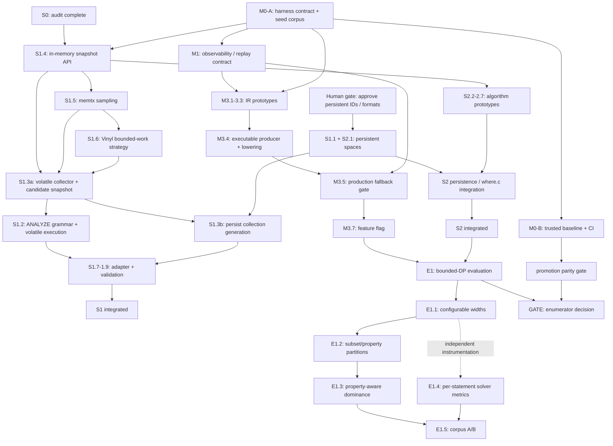

# Tarantool SQL Analytics Engine — Roadmap

## Purpose

This document is the single source of truth for the analytics-focused SQL
engine work on `tsafin/nextgen_sql` and its descendants. Status below was
reconciled with the local tree on 2026-09-27; uncommitted files are evidence
of work in progress, not completed deliverables.

Scope is deliberately narrow:

- proper SQL statistics, persisted in new system spaces;
- a new planner / lowering path that consumes those statistics and produces
  better plans for analytic workloads;
- a parity corpus that proves the new path never regresses results,
  diagnostics, or supported-class coverage of the current SQL engine.

Out of scope here (tracked elsewhere or rejected):

- push-based execution engine (rejected — VDBE remains the only executor);
- arm64 CnP stencil work (different machine);
- broad SQL feature additions (RIGHT JOIN, LATERAL, windows, UPSERT,
  RETURNING — none are parity requirements).

This file is structured so that it can be lifted directly into a GitHub epic
with linked sub-issues. Top-level milestones (M0, M1, S0, S1, S2, M3, E1, GATE)
each map to a sub-issue; their checklist items map to individual tasks.

## Related documents

- [`current_sql_feature_matrix.md`](current_sql_feature_matrix.md) —
  authoritative parity baseline (frozen subset).
- [`statistics_implementation_plan.md`](statistics_implementation_plan.md) —
  statistics infrastructure design.
- [`sql_stats_sampling.md`](sql_stats_sampling.md) — S1 memtx/Vinyl sampling
  contracts and feasibility constraints.
- [`planner_vm_migration.md`](planner_vm_migration.md) — staged migration
  of `where.c` to planner-IR + VDBE lowering.
- [`next_gen_sql_planner.md`](next_gen_sql_planner.md) — architecture survey
  (PostgreSQL / DPhyp / ORCA comparisons; memtx and Vinyl applicability).

## Status legend

Each work item carries a richer state than NOT-STARTED / DONE so the
roadmap accurately reflects how far an item has progressed past spec.

| State | Meaning |
|-------|---------|
| `NOT-STARTED` | No work, no spec beyond a paragraph in this file. |
| `SPEC-DRAFTED` | A focused spec exists; implementation has not started. |
| `PROTOTYPE` | Working code or tooling exists, but acceptance/CI gates are incomplete. |
| `FEATURE-GATED` | Default off in production builds; CI runs it on the parity corpus. |
| `PRODUCTION` | Default on; old path removed or scheduled for removal. |
| `COMPLETE` | A finite audit or decision deliverable is finished and recorded. |

The implementation maturity path is:
`NOT-STARTED → SPEC-DRAFTED → PROTOTYPE → FEATURE-GATED → PRODUCTION`.
Audits and decisions can instead end at `COMPLETE`.

## Execution model

Single human operator. Multiple LLM sessions allowed in parallel via git
worktrees. Implications:

- The human is the bottleneck for architectural decisions, reviews, and merges.
- LLM sessions are good at: implementing scoped sub-tasks, writing tests,
  mechanical refactors, drafting documentation.
- A sub-task marked `parallel: yes` is a candidate for an isolated worktree
  with its own LLM session. It must touch files that no concurrent task
  modifies, or its merge will fight.
- Sub-tasks marked `parallel: no` need human attention or touch a shared
  contract (descriptor, system-space schema) and should run serially.

## Dependency and integration plan

The dates in the earlier Gantt were prototype estimates and are now stale.
Use this dependency graph for scheduling. Arrows mean an accepted interface
or gate. The M0 contract and a small trusted corpus unblock development;
full-corpus coverage is required before production promotion.


```mermaid
flowchart TD
    A["M0-A: harness contract + seed corpus"] --> B["M0-B: trusted baseline + CI"]
    A --> C["M1: observability / replay contract"]
    D["S0: audit complete"] --> E["S1.4: in-memory snapshot API"]
    A --> E
    E --> F["S2.2-2.7: algorithm prototypes"]
    C --> G["M3.1-3.3: IR prototypes"]
    A --> G
    G --> G2["M3.4: executable producer + lowering"]
    G2 --> H["M3.5: production fallback gate"]
    C --> H
    H --> H2["M3.7: feature flag"]
    P["Human gate: approve persistent IDs / formats"] --> Q["S1.1 + S2.1: persistent spaces"]
    E --> R["S1.5: memtx sampling"]
    R --> R2["S1.6: Vinyl bounded-work strategy"]
    E --> S0["S1.3a: volatile collector + candidate snapshot"]
    R --> S0
    R2 --> S0
    S0 --> S1["S1.2: ANALYZE grammar + volatile execution"]
    S0 --> S2["S1.3b: persist collection generation"]
    Q --> S2
    S1 --> T["S1.7-1.9: adapter + validation"]
    S2 --> T
    Q --> U["S2 persistence / where.c integration"]
    F --> U
    U --> V["S2 integrated"]
    T --> W["S1 integrated"]
    H2 --> X["E1: bounded-DP evaluation"]
    V --> X
    X --> X1["E1.1: configurable widths"]
    X1 --> X2["E1.2: subset/property partitions"]
    X2 --> X3["E1.3: property-aware dominance"]
    X1 -. "independent instrumentation" .-> X4["E1.4: per-statement solver metrics"]
    X3 --> X5["E1.5: corpus A/B"]
    X4 --> X5
    B --> Y["promotion parity gate"]
    X --> Z["GATE: enumerator decision"]
    Y --> Z
```

The in-memory S1 snapshot, S2 algorithms, and M3 IR/lowering prototypes are
independent tracks after their stated contracts; they can use isolated
worktrees. Engine samplers and S1.3a's volatile collector are independent of
persistent IDs, but must honor the shared sampler/snapshot contracts.
S1.3b persistence and any persistent ANALYZE behavior stay behind the human
IDs/formats gate. M3 can use fixed/current estimates while statistics are
built; E1 acceptance waits for integrated M3 and S2.

## Parallel work and integration ownership

Parallelism means separate branches or worktrees with one owner per shared
interface. Each track must define a narrow contract before others consume it;
integration runs serially. No simultaneous test-run.py or performance runs
against shared build directories, ports, or databases.

| Track | Can start after | Independent work | Serial integration point |
|-------|-----------------|------------------|--------------------------|
| M0 harness validity | now | isolated test execution, capture manifest, failure propagation | SCHEMA.md semantics and harness API |
| M0 corpus/CI | M0 harness contract | representative fixtures, coverage report, workflow wiring | CI gate and accepted snapshots |
| M1 observability | M0-A contract | counters, replay serializer, EXPLAIN surface | one owner for `sql.c`, grammar and path-class API |
| S1 statistics | S0 + M0-A contract | sampling adapters, immutable snapshot API, volatile collector/candidate builder | approved system-space IDs/formats, persistent publication, `sql.c` / `where.c` adapter |
| S2 algorithms | S1 snapshot contract | HLL, MCV, histogram and synthetic data | persistence schema and selectivity adapter |
| M3 planner | M1 path-class and replay contract | logical IR, physical IR, lowering tests using fixed stats | resolver/`where.c` routing and feature flag |
| E1 evaluation | S2 + M3 integrated | benchmark workload design and measurement tooling | `wherePathSolver` and decision report |

Schema IDs and persistent formats need explicit review before implementation.
Keep the owner of `where.c` integration singular at each merge point. Merge
small, testable slices; do not hold a long-lived branch until an entire
milestone finishes. Each track's changes must state the exact interface
version and acceptance evidence in its review.

---

## M0 — Parity Corpus & Baseline Harness

**Goal:** establish a queryable parity baseline so every later phase can be
gated on "no result regression, no diagnostic regression, and reviewed
planner-path changes."

**State:** `COMPLETE` for the M0-A/M0-B parity gate in this branch. Manifest
v1 capture is fail-closed. Policy v2 reviews all 386 tests / 772 engine
pairs: 588 included, 184 excluded with evidence, none pending. The accepted
anchor is `d8fc1e339b0bb8579c8b08e39d062e20edf66666`; the CI jobs use
that named full-corpus policy. A clean native build passed the full local
generated/CnP/LLVM matrix (298 memtx tests / 49,535 queries and 290 Vinyl
tests / 39,535 queries per mode), with zero hard or soft parity drift,
identical manifests, and exact generated repeat captures. The post-provenance
capture also matched exactly. Local exit criteria are satisfied; the first
hosted full-corpus CI result is an informational post-publication check, not
a reason to hold subsequent implementation work. Local workflow provisioning,
including a detached baseline worktree and pinned test runner, passed. The older
untracked 132,413-snapshot memtx-only tree is not the baseline. The
classifier covers all 386 file identities, but its tags are file-level, not
verified per-query feature coverage.

**Scope (B-light):** capture L1 result rows, L2 diagnostic, L3 path_class
per (test × engine), plus an external run manifest proving coverage and
outcome. Dispatcher dimension is a runtime parity check, not a stored
dimension. L7 latency goes to a separate perf-trail CSV. L4/L5 (plan shape)
are deferred to M3 when the descriptor exists naturally.

**Exit criteria:**

- every in-scope SQL test inventoried, with file-level feature tags and
  explicit query-level coverage only where verified;
- a reviewed inclusion/exclusion manifest identifies every test in the three
  SQL suites and records each suite/engine run outcome;
- accepted snapshots cover every runnable in-corpus test for its supported
  engine(s), with stable query identity and a passing recapture comparison;
- test failures, partial capture, missing snapshots, and unavailable
  dispatchers fail closed rather than producing a success-shaped diff;
- CI runs the real snapshot and dispatcher parity jobs on the defined corpus.

**Subtasks:**

- [x] **M0.1** Test auto-classifier — `test/sql-baselines/classify.lua`.
  Scans `*.test.lua` across sql / sql-tap / sql-luatest, regex-detects
  feature markers per `docs/vdbe/current_sql_feature_matrix.md`, writes
  `test/sql-baselines/classification.yaml` (386 entries on nextgen_sql
  HEAD). Landed at nextgen_sql `f8ae5a0ddd`, expanded at `02fdfbe2d3`
  (canonical_yaml.lua scalar coverage).
- [x] **M0.2** Snapshot harness — `test/sql-baselines/harness/run.lua`
  monkey-patches `box.execute`, dofiles the test file, writes one snapshot
  per captured query at `test/sql-baselines/snapshots/<suite>/<test>/q%02d.<engine>.yaml`
  per SCHEMA.md v1. Landed at nextgen_sql `4f8dc74e0b`. Verified end-to-end
  on a 7-statement mini SQL test.
- [x] **M0.3** Forensic L6 capture — when `--forensic` is enabled, the harness
  runs `EXPLAIN` and records a static VDBE program listing under
  `test/sql-baselines/forensics/`. This captures opcodes and operands without
  claiming the dynamic dispatch path; statements unsupported by `EXPLAIN` get
  an explicit comment-only capture. L6 remains advisory, not a parity gate.
- [x] **M0.4** Diff tool — `test/sql-baselines/diff.lua`. Compares two
  snapshot trees, classifies drift as RESULT-REGRESSION / DIAGNOSTIC-CHANGE
  / PATH-CLASS-SHIFT (currently a hard gate) or SOFT-DRIFT (advisory). Emits text /
  yaml / json; exit 1 on any hard-gate. Landed at nextgen_sql `a3c6dbf191`.
  Verified: identical inputs → 0 hard, 0 soft, all-MATCH exit 0; mutated
  row → RESULT-REGRESSION exit 1. L3 remains a strict gate for baseline
  comparison; M3 planner changes require an explicit reviewed exception.
- [x] **M0.5** CI: snapshot diff job — `.github/workflows/parity-corpus.yml`
  builds PR head and the named full-policy anchor, runs isolated captures on
  both engines, checks manifest coverage, then diffs via `diff.lua`. The
  baseline is a detached worktree from verified PR history, including fork
  PRs. Local workflow provisioning passed; hosted execution awaits publication.
- [x] **M0.6** CI: dispatcher parity job —
  `.github/workflows/dispatcher-parity.yml`. Matrix
  `{memtx, vinyl} × {generated, cnp, llvm}`. Compares CnP and LLVM outputs
  against generated; fails with `JIT-CORRECTNESS-REGRESSION:<dispatcher>` on
  any L1 or L2 divergence. It reads the accepted full policy; the complete
  six-way local matrix passed before promotion.
- [x] **M0.7** Perf-trail emitter — `test/sql-baselines/perf/emit.lua`
  records timing via `fiber.clock64()`, writes one CSV per CI run at
  `test/sql-baselines/perf/<YYYY-MM-DD>-<sha>.csv`. Accompanying
  `perf/aggregate.lua` reads a directory of those CSVs and emits a markdown
  trend table. `sample.csv` aligned with SCHEMA.md §L7 exemplar. Landed at
  nextgen_sql `b33719055e` + `1a9c7933b6` (gitignore).
- [x] **M0.8a / M0-A** Validate capture semantics on a small, representative
  seed corpus: use the normal test runner or reproduce its setup faithfully,
  preserve test failure and exit status, exercise generated/CnP/LLVM
  selection, and reject incomplete captures. Record a manifest with expected
  test/query counts and exclusion reasons. Do not accept the current
  untracked snapshot tree as ground truth. The harness contract and manifest
  format are serial integration points; fixtures and diagnostic probes may
  be built independently. Manifest v1, validator, runner-equivalent shared-
  engine seeds, typed/error result classes, SQL/SQL-TAP/luatest adapters,
  and six-way dispatcher capture are committed and verified.
- [x] **M0.8b** Reconcile SCHEMA.md and the tools: file-level versus
  query-level tags, query identity, result order, diagnostic codes,
  metadata that should not affect parity, and schema versioning. Verify
  round-trip and repeat-capture stability on the seed corpus. The v1
  contract is accepted; future semantic changes require versioning.
- [x] **M0.8c / M0-B** Capture the declared corpus under memtx and Vinyl
  where supported, report coverage and failures, and review snapshot size
  and storage strategy before committing any bulk baseline. Baseline against
  a named integration commit rather than the moving local `master` branch.
  The 770 engine decisions, full local six-mode matrix, exact repeat, and
  measured snapshot storage support the named integration anchor.
- [x] **M0.8d** Expand the real isolated seed CI invocations to the accepted
  corpus. Compare each PR head against the selected baseline with explicit
  coverage equality; run dispatcher parity on both engines where supported.
  Keep CI failing on a missing or empty corpus. Both jobs now read the full
  policy; their first hosted full-corpus run is pending branch publication.

---

## S0 — Statistics Audit

**Goal:** decide reuse/delete per file for the historical `_sql_stat1` /
`_sql_stat4` scaffolding before designing the new system spaces.

**State:** `COMPLETE` — audit landed as `docs/vdbe/s0_audit_report.md`
on `tsafin/llvm_jit` at commit `de57e09edd` (2026-06-21). Report finds the
historical `_sql_stat1` / `_sql_stat4` scaffolding is almost entirely
vestigial text: no `analyze.c`, no ANALYZE grammar in `parse.y`, and
`OP_LoadAnalysis` is a triply-registered no-op. 3 DELETE / 2
KEEP-AS-REFERENCE / 1 EXTRACT-HELPER / 11 REWRITE dispositions recorded.
S1 can start against this baseline.

**Exit criteria:**

- written inventory of disabled tests, no-op opcodes, dead helper functions;
- explicit decision per item (delete / keep-as-reference / extract-helper).

**Subtasks:**

- [x] **S0.1** Inventory disabled analyze tests in `test/sql-tap/suite.ini`
  and the dead bodies of `OP_LoadAnalysis` and friends.
- [x] **S0.2** Inventory `_sql_stat1` / `_sql_stat4` references in
  `src/box/sql/*` and decide per-file reuse/delete.
- [x] **S0.3** Write `docs/vdbe/s0_audit_report.md` summarizing findings,
  with explicit per-item disposition.

---

## M1 — Planner Observability & Replay

**Goal:** make the *current* planner's decisions inspectable, replayable, and
counter-gated before changing the planner.

**State:** `IN-PROGRESS`. M0-A/M0-B are accepted locally. M1.1 has the
preparatory statement-compilation counter (`sql_statement_compiles_total`)
plus WHERE-planner candidate and elapsed aggregates. A fallback aggregate
now increments at the multi-relation fallback route, and M1.2/M3.5 expose
`fallback` plus stable `UNSUPPORTED_RELATION_COUNT` / `UNSUPPORTED_AGGREGATE`
reasons through summary EXPLAIN; snapshot serialization preserves the reason
and its live corpus capture is tested for the multi-relation case. Other
fallback shapes and replay remain open. M1.3's
structured summary surface handles both the legacy `current_where_c` path and
that fallback outcome. Hosted CI publication is pending but does not block
local M1 work.
Freeze the planner event/path-class and replay envelope before M3 consumes
them.

**Exit criteria:**

- a captured planning decision can be replayed without live storage;
- `box.stat.sql()` exposes planner counters (candidates considered, fallback
  reasons, planning elapsed time);
- `EXPLAIN (planner = 'summary')` returns structured rows.

**Subtasks:**

- [x] **M1.1** Add planner counters to `box.stat.sql()` —
  `sql_planner_candidates_total` and `sql_planner_elapsed_us` are hooked to
  WHERE-planner candidate insertion and elapsed-time paths.
  `sql_planner_fallback_total` now increments for the production multi-
  relation and aggregate fallback paths. They publish stable
  `UNSUPPORTED_RELATION_COUNT` and `UNSUPPORTED_AGGREGATE` reasons through
  summary EXPLAIN; snapshot serialization preserves the reason.
  Per-reason counters are exposed as stable
  `sql_planner_fallback_<REASON>_total` fields and tested for both routed
  reasons. Candidate, elapsed, total fallback, and per-reason counter growth
  are validated by the SQL suites. Other fallback shapes are tracked in M3.5;
  `sql_statement_compiles_total` remains preparatory only.
  *parallel: no* (the fallback call site shares `where.c` with M3).
- [x] **M1.2** Wire path_class emission in current `where.c` — statements
  invoking the WHERE planner store `current_where_c` on the per-statement
  VDBE; summary EXPLAIN reads that value, and statements that do not invoke
  the planner report NULL. M0 snapshot capture consumes the versioned
  EXPLAIN snapshot through the M3.6 harness prototype. Multi-relation SELECTs
  now report `fallback` with a stable reason for multi-relation and aggregate
  shapes; remaining new-planner/fallback classes still require M3 dispatch.
  *parallel: no* (touches the same
  `where.c` files M3 will modify; coordinate).
- [x] **M1.3** `EXPLAIN (planner = 'summary')` grammar + executor returning
  structured rows per the planner_vm_migration.md schema. *parallel: yes*.
- [x] **M1.4** `EXPLAIN (planner = 'snapshot')` returns a versioned MsgPack
  selection-replay object for a supported canonical single-relation subset.
  The v5 envelope carries component-ledger-derived `path_class`/reason,
  per-statement measurements, ordered final-path diagnostics, and per-SELECT
  route records. When normalized
  query/schema/statistics, actual beam width, selector identity, and final
  paths all validate, it embeds internal v5 input and sets `replayable=true`;
  otherwise it remains diagnostic-only with no `replay_inputs`. The migration
  spec defines the minimum canonical, self-contained input and validation
  contract; it intentionally does not choose persistence IDs or formats.
  Focused SQL
  checks assert non-replayable legacy/fallback captures have no partial
  `replay_inputs`, and the corpus capturer rejects malformed v5 objects or
  incomplete route ledgers. An
  audit of the narrow M3 single-
  relation IR found it is not yet a safe source for a new replay envelope:
  logical nodes borrow resolved `Expr` / `ExprList` trees from the live
  statement and carry the catalog `space_id`; the physical planner receives
  access candidates from a caller-supplied provider, while the IR does not
  capture relation/index definitions or the exact statistics/configuration
  used to form those candidates. Serializing that object would therefore
  retain live compiler/catalog dependencies and omit planner inputs. The
  detached canonical model and extraction API now provide the supported
  single-relation subset; unsupported shapes still fail closed. Replay
  execution stays in M1.5. The M1.4 owned-value prototype models a normalized
  single-relation SELECT subset (predicate, projections, ordering, limit and
  offset), logical columns and index parts, and relation/index statistics
  with population, width, NDV, confidence, and freshness semantics, including
  per-index tuple-count semantics and definition version. Validation
  rejects incomplete definitions, invalid index ordinals, inconsistent stats
  absence, and malformed limit/order metadata. A deterministic internal
  MsgPack input format v5 emits fixed lexicographic map-key order, sorts
  logical indexes by key, and preserves semantically ordered columns,
  projections, ordering, and key parts. Reordered equivalent index inputs
  serialize to byte-identical valid MsgPack. Predicate, projection, and
  ordering strings are checked against the prototype's narrow canonical
  scalar-expression grammar, including column bounds; SQL text, unsupported
  calls, and malformed expressions fail closed. Relation/index
  schema-definition strings remain opaque and are not syntax-validated or
  normalized. `sql_replay_input_extract_select()` now connects a resolved
  single-relation `Select` to detached input creation: it canonicalizes the
  predicate/projection/order trees, records sort direction/default NULL order,
  and accepts only nonnegative integer literal LIMIT/OFFSET. A companion
  `sql_replay_input_extract_select_from_catalog()` derives detached
  relation/column/index definitions from the source catalog space using
  logical relation ordinal `r0`; storage index IDs remain only in a separate
  in-memory association. It rejects views, functional indexes, and multikey
  indexes whose identity is not modeled, and preserves repeated key ordinals.
  The catalog-only API keeps statistics absent; a snapshot-backed companion
  copies current-schema relation and index summaries from an immutable
  `SqlStatsSnapshot`, including visible/physical/estimated population
  semantics, population/NDV provenance, width, confidence, and freshness
  fields. Missing or stale relation summaries stay explicitly
  absent; malformed or non-integral cardinalities that replay input v5 cannot
  represent exactly fail closed. Fractional average row widths are retained
  exactly as finite doubles. Planner configuration remains caller-supplied.
  All extractors reject unsupported cursor bindings,
  expressions/functions, limits, and SELECT structure without returning
  partial input; outputs retain no live AST/catalog pointers. The owned model
  also optionally carries a provider-supplied ordered access-
  candidate list distinguishing primary-key point, index point/range/full, and
  table-full access, with logical index keys, canonical constraints, scan
  direction, projected logical columns, produced order, separate access-
  estimated and cost rows, and finite confidence/cost metrics. Rank order is
  preserved because planner tie-breaking may consume it; stable candidate keys
  must be unique. Missing provider output differs from a known empty set; a
  snapshot-backed extraction regression now asserts it remains unavailable,
  not present-empty, when no active planner producer supplied candidates.
  Access-loop candidate lists remain caller/provider supplied. The active SQL
  planner captures final retained one-relation `WherePath` lists and combines
  them with detached normalized SQL/schema/stats input, selector identity, and
  effective beam width. Supported snapshots are v5 selection-replayable with
  embedded v5 input; unsupported shapes, joins, and malformed/stale stats
  remain diagnostic-only. The live `whereLoopInsert()`
  hook (`src/box/sql/where.c`) calls `sql_record_planner_candidate()`, whose
  VDBE-facing data is aggregate candidate/path counters, not normalized
  candidate identities, constraints, estimates, ordering, or costs. Therefore
  neither a complete access-loop candidate list nor a known-empty list can be
  asserted from that hook. This does not limit the separate selection-only
  final-path capture. A focused internal bridge now
  models provider outcomes explicitly as `UNAVAILABLE`, `COMPLETE`, or
  `INCOMPLETE`. It preserves the existing unavailable-vs-known-empty encoding,
  deep-copies only a complete provider list into the owned input, and returns
  `INCOMPLETE` with no result object when a provider reports a partial prefix.
  Unit tests cover all three outcomes and reject payload attached to an
  unavailable state. The configured `sql_replay_input.test` target rebuilds
  and passes, including all 19 candidate-provider checks. This validates
  transport/completeness-state handling
  only: the bridge cannot prove that a caller labeling its list `COMPLETE`
  actually enumerated every viable access candidate, and no active planner
  producer calls that access-loop bridge. A separate live final-path producer
  now captures ordinary one-relation post-beam `WherePath` alternatives, but
  does not claim the access-loop list is complete. Selection replayability is
  determined by the final-path/input capture, not that out-of-scope list. A
  bounded staging API remains available for a future enumeration experiment.
  fixed candidate storage, explicitly mark enumeration start/normal completion,
  append ordered values, or poison the capture on an unsupported shape.
  Capacity overflow and premature completion publish only `INCOMPLETE`; an
  unstarted producer remains `UNAVAILABLE`, distinct from a started,
  completed empty enumeration. Tests verify that no partial prefix escapes.
  This is transport-side all-or-nothing enforcement, not a `WhereLoop`
  producer: source audit finds `whereLoopInsert()` (where.c:1500) called before
  dominance replacement and for OR-subclause loops as well as ordinary
  candidates; it receives no relation-completion signal. Although the final
  `WhereInfo.pLoops` list is pruned, converting it requires per-loop
  `aLTerm`/`index_def` normalization, stable logical index mapping, projected
  columns and produced order, plus the exact statistics/configuration used by
  planning. The existing resolved-SELECT canonicalizer is not a `WhereLoop`
  constraint adapter, and preparation does not retain authoritative planner
  config or immutable statistics provenance alongside that list. Until those
  inputs and a post-enumeration completion boundary exist, the active planner
  cannot safely label a candidate list complete. The follow-up boundary audit
  in `planner_vm_migration.md` identifies successful `whereLoopAddAll()` return
  as the ordinary enumeration boundary (the retained `WhereInfo.pLoops`, before
  path selection); the one-table shortcut is a separate route and planner
  errors must discard capture. It also confirms that `wherePathSolver()` reads
  the actual, environment-configurable width at runtime, while replay
  extractors still accept algorithm/config versions as caller arguments. A
  future prepare-owned capture must record that actual width and a maintained
  algorithm identity alongside detached candidates and immutable stats
  provenance. Replay scope is now fixed to **selection only**, conditional on
  a complete, ordered final-path set captured by the live planner; M1.4 does
  not claim to rerun or validate enumeration. Access-loop enumeration remains
  outside scope. The v5 envelope embeds the canonical v5 selection input when
  its captured selector identity/configuration and path list validate.
  `planner_vm_migration.md` records the scope boundary and Mermaid flow.
  *parallel: yes*.
- [x] **M1.4/M1.5 final-path selector prototype.** A versioned detached
  selector now reproduces the final reduction in `wherePathSolver()` over an
  explicitly captured, post-beam final-path list: compare exact signed
  16-bit `LogEst` `rCost`, replace only on strict improvement, and therefore
  retain the first path on equal cost. It is deliberately not a min-cost
  selector over access loops and does not rerun enumeration, dominance, or
  beam pruning. Internal replay input now serializes ordered final-path
  fingerprints, exact path/unsorted/output LogEst values, `isOrdered`, and the
  one-relation reverse-scan mask, plus selector identity; the internal format
  advances to v5. Tests cover unique-min reorder stability, first-on-tie input
  order, captured ORDER BY/reverse metadata, unavailable versus known-empty
  final paths, and selector identity. Access-loop candidates alone no longer
  pass replay readiness. A live producer now captures the final retained
  `aFrom` paths after `wherePathSolver()` completes, including replacing the
  preliminary capture with the final ORDER BY cost pass. It preserves list
  order and emits all paths or none, with stable fingerprints, exact `LogEst`
  values, ordering, and reverse-scan metadata. The v5 envelope exposes
  `final_path_status`, `final_paths`, and the live selected fingerprint; joins and any route
  without a successful supported solver capture remain unavailable, while
  overflow and ambiguous fingerprints fail closed. Supported single-relation
  inputs now combine canonical SQL/schema/stats metadata with the exact ordered
  candidates, selector/config identity, and beam width. Runtime coverage
  verifies the embedded v5 input matches live candidates and the selected
  fingerprint equals strict-min selection. The M0 harness validates replayable
  and diagnostic-only v5 forms. The detached selector plus live capture slice
  is complete; the standalone selection replay consumer is tracked in M1.5.
  *parallel: yes; selector prototype is independent of live producer capture.*
- [x] **M1.5** Developer-only `sql_replay` API consumes a v5 snapshot artifact
  (and retains v4 read compatibility),
  validates its embedded v5 selector/version and final-path order against the
  external diagnostics, applies the strict-min / first-on-tie selector, and
  reports both the replayed fingerprint and whether it matches the captured
  winner. The API does not inspect live schema, data, catalog, or statistics;
  enumeration, dominance, and beam pruning remain explicitly out of scope per
  the selection-only replay decision. Runtime coverage captures a snapshot,
  drops the source table, replays from the saved artifact, and verifies the
  captured winner; an internally inconsistent candidate list is rejected.
  Internal selector tests cover input-cost changes and tie behavior.
  Diagnostic-only v5 envelopes remain non-replayable. This closes the M1.5
  selection-replay consumer slice, not full enumeration replay.
  *parallel: yes*.

---

## S1 — Relation / Index / Cardinality Stats

**Goal:** the current `where.c` stops using `default_tuple_est[]` for ordinary
tables, and instead consumes real per-relation cardinality and average row
width.

**State:** `PROTOTYPE`. S1.4 has an immutable, deep-copying, reference-counted
in-memory snapshot API with schema-staleness checks and a bounded allocation
budget; S1.5 has a bounded memtx sampling prototype; S1.6 now has a bounded,
fail-closed Vinyl sampler prototype. None is attached to prepare/ANALYZE or
populated by a collection job. `sql.c` accepts an optional immutable snapshot
and legacy index cardinality estimates consume it when present, falling back
on missing/stale data; `whereRangeScanEst()` still uses its heuristic
reduction over the adapted base estimate. Persistent collection,
prepared-statement snapshot ownership, ANALYZE, and complete adapter
validation remain open. The system-space schema remains DRAFT pending human
review of IDs and formats. On 2026-09-27 the user reconfirmed that the schema
stays DRAFT and that work should continue on independent tracks; no ID or
format approval is implied.

**Exit criteria:**

- `ANALYZE [table]` accepted by the parser, runs a collection job, persists
  results;
- `index_field_tuple_est()` reads from the new snapshot, not from defaults;
- selectivity/cardinality error on the agreed corpus improves;
- no regression under stale or missing stats (fallback to defaults).

**Subtasks:**

- [ ] **S1.1** Define new system spaces (`_sql_stats_relation`,
  `_sql_stats_index`) with versioned MsgPack payload format. Write a
  short `docs/vdbe/sql_stats_schema.md`. The spec remains **DRAFT** by explicit
  direction; no system-space IDs or payload-format choices are approved.
  *parallel: no* (system-space allocation is a one-way door — needs human
  sign-off).
- [x] **S1.2** Re-enable `ANALYZE` grammar and execute the volatile collection
  path without persistence. Remove the `unsupported ANALYZE` rejection only
  after S1.3a defines complete candidate-snapshot publication semantics.
  *parallel: yes, after S1.3a*.
  **Implementation status (2026-09):** the shared-view context now has a
  batch candidate assembler for complete relation/index spec sets. It checks
  exact flattened target coverage, duplicate relation/index ownership, and
  aggregate request, staging, temporary-memory, and scan/estimator work limits
  before sampling. Relation scans are sequential; summaries and reservoir
  memory are bounded in aggregate, with the largest reservoir charged because
  it is destroyed before the next relation. Detached relation parts remain
  private to the batch and are combined once; the existing publisher accepts
  only that final candidate. A later relation failure exposes no candidate and
  cannot replace the installed snapshot. The focused collection unit target
  passes, including work-budget rejection before extractor invocation and the
  prior repeated-assembly rejection/preservation case. A TEST_BUILD memtx-then-
  Vinyl runtime test now verifies a two-relation candidate, one publication,
  later-relation extractor failure, and installed pointer/content preservation;
  it passes locally. The shared-view batch can also opt into the native index
  hash adapter where no canonical extractor is supplied; unsupported key
  definitions remain fail-closed. Native output is labeled as 32-bit hash
  equivalence-class NDV (with collision-risk confidence discount), not exact
  SQL NDV. The TEST_BUILD memtx/Vinyl test checks this provenance; candidate
  validation separately requires index and relation population bases to match,
  while allowing the NDV basis to identify the hash domain. Both focused
  collection unit and SQL runtime targets pass locally. The shared
  view and candidate API are volatile only.
  **S1.2 status (2026-09):** SQL discovery, grammar, and the VDBE execution
  operation are now wired to the volatile batch builder. Bare `ANALYZE`
  discovers all eligible targets and publishes one complete candidate;
  named `ANALYZE table` builds one relation and replaces only that relation in
  a same-generation snapshot. Both forms retain the exact installed snapshot
  on failure. The focused TEST_BUILD runtime test covers bare memtx+Vinyl
  collection, named relation replacement, system-space no-op, missing/view
  errors, unsupported-index atomic failure, and row counts. The focused test
  and `sql_replay_input.test` pass locally. No persistence has been added.
  This does not authorize persistence choices;
  S1.1's schema remains DRAFT. The compatibility baseline from the historical
  `sqlAnalyze` implementation is now source-audited: bare form visits
  non-system, non-view spaces and all indexes; named missing-space and view
  targets error. The volatile contract now explicitly preserves named
  system-space no-collection behavior; excludes data-temporary spaces from
  bare enumeration and rejects them when named; and fails the complete batch
  for unsupported engine/index targets rather than silently omitting them.
  These choices and their limitations are recorded in
  `sql_stats_sampling.md`. This closes volatile SQL discovery/execution and
  rollback coverage only; persistence remains unimplemented. Bare `ANALYZE`
  with no eligible targets is a successful
  no-op with no publication. Per the user decision (2026-09-27), the first
  implementation uses fixed conservative compile-time sample/work/memory
  ceilings and fails atomically on exhaustion; no session-configurable limits
  are introduced. The exact ceilings are enumerated in
  `sql_stats_analyze_budget.h` and `sql_stats_sampling.md`; the production
  analyzer consumes these per-index and aggregate ceilings. The focused
  `analyze_volatile_test.lua` runtime suite and `sql_stats_collection.test`
  unit target pass against the current build. The volatile SQL integration
  test injects an
  unsupported R-tree index into both named and bare collection requests and
  verifies each failure leaves the installed snapshot unchanged; the TEST_BUILD
  runtime suite passes locally.

  ```mermaid
  flowchart TD
    A[ANALYZE statement] --> B{Bare or named?}
    B -- Bare --> C[Enumerate persistent non-system, non-view spaces]
    C --> Z{Any eligible targets?}
    Z -- No --> Z1[Successful no-op / no publication]
    Z -- Yes --> D[Include all indexes]
    B -- Named --> E[Resolve space name]
    E --> F{Missing or view?}
    F -- Yes --> X[Return SQL error]
    F -- No --> G{Named target category?}
    G -- System --> H[No collection / no publication]
    G -- Data-temporary --> X2[Fail closed / no publication]
    G -- Persistent --> I[Include all indexes]
    D --> J[Open one shared read view]
    I --> J
    J --> K[Build one complete detached candidate]
    K --> Q{Any target or index unsupported?}
    Q -- Yes --> R[Fail whole request; preserve installed snapshot]
    Q -- No --> L{Bare or named?}
    L -- Bare --> M[Use complete batch candidate]
    L -- Named --> N[Replace one relation in prior snapshot]
    M --> O[Publish once]
    N --> O
    K -- Any failure --> P[Keep exact installed snapshot]
    O -- Revalidation failure --> P
  ```
- [x] **S1.3a prototype** Volatile collection core — consume sampled tuples, build and
  validate relation/index summaries, then atomically publish one immutable
  candidate snapshot. No persistence or grammar dependency; test rollback on
  any incomplete/invalid relation or index summary. *parallel: yes*.
  **Status note:** complete as a volatile one-relation prototype. A normalized
  result and pure completeness validator build a detached, deep-copied snapshot
  candidate. Caller-defined width/population/confidence provenance tokens
  plus the width denominator count are retained without selecting estimator
  policy; relation/index/prefix completeness (including duplicate result-ID
  rejection) and catalog/schema/visibility/index-definition generations are
  checked. A narrow bridge now converts a known engine-sampler population
  into exact relation cardinality without mistaking delivered draws for the
  population; a second bridge exposes fractional sample-average serialized
  tuple width with its row denominator, without truncating the mean or
  inventing width for an empty sample. The standalone helpers are now composed
  by the shared-view candidate builder and publisher described below. A new
  `sql_stats_index_summary` unit API now
  computes sampled prefix-NDV values through HLL from a caller-provided
  canonical SQL-value extractor. It counts delivered rows/bytes, bounds
  accumulator memory, and suppresses output on extractor failure; it
  deliberately does not hash raw MessagePack. A separate bounded helper now
  inverts the uniform-occupancy model for both memtx independent draws and
  Vinyl reservoir samples, returning rounded population-prefix NDVs plus a
  confidence evidence score that accounts for sample coverage, HLL precision,
  and native 32-bit hash collision risk. Unknown/inconsistent populations fail
  closed without partial outputs; empty populations produce zero NDVs and a
  census returns observed HLL NDV without extrapolation. The estimator's
  equal-frequency assumption and confidence semantics are documented in
  `sql_stats_sampling.md`; ten focused tests exercise both sampling designs,
  a complete census, a low-coverage skew probe, provenance rejection, and the
  temporary-memory and work bounds. `sql_stats_collection_index_from_sample()`
  now converts one bounded index summary plus its engine sample into a detached
  collection record with caller-supplied visibility and definition tokens.
  `sql_stats_collection_build_sample_candidate()` assembles all expected index
  summaries for one relation into a detached candidate atomically. It requires
  exact common population counts, caller-supplied relation confidence and
  provenance, and only returns per-index confidence outputs after full
  candidate validation. Two-index success, empty-population exact-zero/no-width,
  and population-mismatch no-partial-output cases pass in the six-check
  `sql_stats_collection_samples.test` target. The helper does not independently
  verify each summary's index association or establish that caller-supplied
  visibility tokens represent one shared engine snapshot. The separate
  shared-view context now validates that association and publishes the exact
  candidate; ANALYZE/job wiring is tracked under S1.2. There is no agreed
  corpus validation for the
  distributional assumption. The native index-hash
  adapter supports
  verified STRING, DOUBLE, BOOLEAN, UNSIGNED, and signed INTEGER parts for
  TREE/HASH definitions. INTEGER uses canonical MessagePack values (negative
  values as MP_INT, nonnegative as MP_UINT), matching its numeric comparator;
  the native test verifies duplicate negative values deduplicate and positive
  values remain distinct. A dedicated
  `sql_stats_index_summary_native.test` target checks unsigned acceptance,
  duplicate deduplication, distinct-value recognition, and signed INTEGER
  hashing; all five checks pass locally. The native adapter
  now deletes its unreferenced runtime tuple returned by `tuple_new()` rather
  than decrementing a reference it does not own. The existing `key_def.test`
  native-adapter checks now delete their locally owned fixture tuples
  directly. A focused runtime luatest also exercises the
  owned READ_CONFIRMED context against real memtx and Vinyl primary and
  secondary indexes; `sql_stats_test` passes locally. Neither slice provides
  a common cross-index visibility boundary or a complete candidate. An
  earlier attempt to load these helpers as a separate DSO failed on private
  engine symbols (`space_cache_version` / `mp_type_hint`); that attempt is
  superseded by the TEST_BUILD in-process wrapper described below, which
  provides live sampler confirmation without adding production exports. The
  collection unit now sweeps the snapshot byte budget from immediate rejection
  through the first complete deep copy, releasing candidates and checking that
  every incomplete budget fails closed. Snapshot unit tests also inject a
  one-shot failure at every deep-copy allocation point and verify fail-closed
  cleanup until complete construction succeeds; the hook is compiled only
  into that unit target. The collection unit separately injects failures at
  both staging-array allocations and verifies no candidate is returned before
  a complete build succeeds. These tests close detached builder coverage. The
  shared-view builder and publisher below now derive complete one-relation
  stats from canonical sampled values and capture/revalidate catalog/schema/
  index identity plus the data-view generation before one atomic install;
  failure preserves the prior snapshot. The new opt-in core `read_view` supplies
  a volatile memtx/Vinyl visibility cut for selected indexes. Candidate
  assembly/publication now uses the shared-view context; the older
  READ_CONFIRMED transaction context remains a separate prototype. The engine
  samplers can now be called
  over multiple requested indexes using the same caller transaction/read view;
  Vinyl runtime coverage verifies an uncommitted tuple appears in both primary
  and secondary samples. A new reusable context now owns a core `read_view`,
  records its engine-assigned ID and schema version, validates requested
  indexes, and scans pinned indexes into a bounded reservoir. Its unit tests
  cover ownership and fail-closed open cases; `sql_stats_collection.test`
  passed locally, including pinned scan, tuple-budget, and schema-drift
  rejection cases. The core context pins data through memtx and Vinyl
  primary/secondary full-scan views. Its new single-relation candidate builder
  derives all index summaries from that view, validates captured
  catalog/schema/index generations, and publishes only the exact assembled
  candidate while the commit-vclock signature remains unchanged. A held
  candidate is rejected after a committed write without replacing the
  installed snapshot; an undersized aggregate staging budget also returns no
  candidate and preserves installed state. This closes the
  shared-view-to-candidate prototype slice, not production ANALYZE. Core
  read-view allocation has no explicit
  resource budget, and modification epoch/confidence/extractor policy remain
  caller supplied. A separate
  `sql_stats_tx_context` now owns a box transaction, sets READ_CONFIRMED before
  sampling, validates transaction ID/isolation/schema/index definitions, and
  bounds/stages each requested index sample before delivery. Its finish commits
  only after every requested target succeeds; otherwise it rolls back. The
  focused `sql_stats_collection.test` target builds and passes locally,
  including all 32 transaction-context checks. The production `tarantool`
  target links with the API. A prior runtime luatest exercised live memtx/Vinyl
  primary- and secondary-index samples. A test-only wrapper now compiles into
  the server process under `TEST_BUILD`, registers its Lua modules at startup,
  and calls the private context against the live engine registry without adding
  exported symbols. The wrapper was corrected to decode positive MessagePack
  integer keys as unsigned values. The full focused `sql_stats_test.lua` suite
  passes in a TEST_BUILD Clang-19 binary; with `TEST_BUILD=OFF`, the suite also
  passes while marking its two wrapper-dependent live checks skipped. `nm`
  confirms that the ordinary server binary does not contain either test entry
  point. The earlier DSO loader failure is therefore avoided without exporting
  engine internals or linking a second box archive. The unit test still uses
  engine stubs for lifecycle/error injection; live wrapper coverage currently
  verifies sampling only, not complete candidate publication or shared
  cross-engine visibility.
  The context now captures the local commit-vclock signature and rejects
  sampling/finish if it changes, with unit coverage for drift during engine
  sampling and again at finish. It now also captures and revalidates the local
  catalog generation (`box_catalog_version()`) alongside schema version and
  per-index unique IDs; tests inject catalog-cache drift both during sampling
  and at finish, and the catalog token is exposed to the volatile collector.
  These are local volatile generation guards, not durable/cross-node snapshot
  identities. `READ_CONFIRMED` excludes prepared/unconfirmed writes but does
  not itself freeze confirmed commits. A completed earlier sample
  can reach the caller's off-side staging sink if a later target fails, so the
  caller must discard all staging unless the full collection validates. This
  owned transaction context now exposes
  `sql_stats_tx_context_finish_and_publish()`: it requires the expected
  relation/index set to match every sampled target and captured runtime index
  identity, builds the complete detached candidate, commits only a complete
  sample set, revalidates schema/catalog/vclock generation after commit, then
  synchronously installs through `sql_set_stats_snapshot()`. Any build,
  validation, commit, or generation failure leaves the previously installed
  snapshot untouched. Focused unit tests cover target-definition mismatch,
  commit failure, commit-time generation drift, stale-generation preservation,
  and successful publication. This closes the local publication step, not
  complete summary derivation or live reader/engine integration. The immutable
  snapshot validator now accepts zero distinct-prefix counts only for an
  index with zero tuples, matching the schema draft's empty-index encoding;
  nonempty indexes still reject zero NDV. Focused snapshot tests cover both
  sides, and collection now builds a complete empty-relation candidate with
  exact zero rows and prefixes while leaving average width explicitly absent.
  The collection unit test verifies that no width denominator is fabricated.
  The collection unit target passes the new publication/old-snapshot-preserve
  checks. The production target plus replay-input unit target pass. Full
  relation/index summary derivation from sampled values and live collection
  wiring remain open; `ANALYZE` stays disabled. See
  `sql_stats_sampling.md` for the exact contract and local unit evidence. A new
  `sql_stats_tx_context_build_sample_candidate()` binds every requested target
  to an expected index, request, and canonical extractor; owns per-index
  summaries; derives relation population/width from a designated sampled index;
  and returns a detached candidate only after all samples and conversions
  succeed. Its focused transaction-context checks cover reordered,
  missing, duplicate, and later-extractor-failure cases, while asserting that
  the installed snapshot is unchanged. A dedicated
  `sql_stats_tx_context_finish_sample_candidate_and_publish()` now accepts
  only the exact candidate retained by this context, commits its owned
  transaction, revalidates local schema/catalog/vclock generations after
  commit, and installs that same immutable candidate. The context and caller
  retain separate snapshot references. Candidate mismatch, repeated assembly,
  commit failure, and post-commit visibility drift preserve the old installed
  snapshot. The 10-check `sql_stats_collection.test` target passes in the root
  Clang-19 build. Live engine-sampler runtime coverage now runs through
  test-only wrappers linked into the server under `TEST_BUILD`; the focused
  `sql_stats_test.lua` suite passes and samples primary and secondary indexes
  on memtx and Vinyl. `TEST_BUILD=OFF` also passes the suite while explicitly
  skipping its two wrapper-dependent live cases, and symbol inspection confirms
  that the production-configured server has no linked wrapper entry points.
  A TEST_BUILD-only live assembler now drives the complete candidate path with
  canonical UNSIGNED extraction and both memtx and Vinyl primary/secondary
  indexes. Direct server-runtime checks build and publish the candidate for
  each engine, then confirm relation/index populations of 8 and a width
  denominator of 4 from four delivered sample rows; snapshot cleanup follows
  each case. The runtime regression also asserts four canonical extractor
  calls per index and zero extraction errors. This verifies the older
  transaction-based candidate path, not a common cross-engine visibility
  boundary. Local READ_CONFIRMED and vclock/catalog/schema checks
  are not durable or cross-node snapshot claims. A source audit committed as
  `a68268c9a4` records the pre-implementation gap: neither core `read_view`
  nor READ_CONFIRMED then pinned one shared memtx/Vinyl cut. That gap is now
  closed for the volatile core read-view boundary, full-scan index adapter,
  and one-relation candidate assembly/publication. Production ANALYZE remains
  open.
  **Update (2026-09):** the core read-view API now passes each engine's pinned
  view to selected index views; Vinyl is opt-in and pins one committed VLSN
  for full-scan iterators. A TEST_BUILD held-view commit regression opens one view over
  memtx and Vinyl relations with primary/secondary indexes, commits delete
  and insert changes, and confirms all four scans remain `{1..8}` until that
  view closes; reopening yields `{3..10}`. The Clang-19 TEST_BUILD target and
  direct runtime invocation pass. The integrated focused `sql_stats_test.lua`
  and `read_view_test.lua` luatests plus the `sql_stats_collection.test` and
  `sql_stats_collection_samples.test` unit binaries pass in the root build.
  These passed via focused test-run or direct unit-binary invocation in the
  root Clang-19 build; an earlier isolated-worktree startup failure with a
  Fiber GC leak report and no backtrace frames did not
  reproduce here. The shared-view candidate builder now runs against memtx and
  Vinyl and stale-after-commit publication fails closed; production ANALYZE
  wiring and target discovery remain open. Fixed budget policy is decided;
  runtime wiring must still enforce it atomically.
  The persistence schema remains
  DRAFT; no IDs or formats changed. See `sql_stats_sampling.md` for runtime
  details.
- [ ] **S1.3b** Persist collection generation transactionally after S1.1 review.
  This is the persistence half of S1.3 and must not start before human approval
  of system-space IDs and tuple/payload formats. *parallel: no*.
  The sampler boundaries are implemented, but engine population semantics
  are not interchangeable: memtx `index_size()` subtracts active-transaction
  invisible tuples, whereas
  Vinyl `index_size()` is an approximate LSM-statement count that may include
  obsolete versions/tombstones. Vinyl visible population requires successful
  exhaustive EOF, so budget exhaustion must fail collection closed. See
  `sql_stats_sampling.md` for the volatile candidate-builder contract; see
  `sql_stats_schema.md` for the explicitly unapproved persistence proposal.
- [x] **S1.4 prototype** `SqlStatsSnapshot` API — immutable deep copy,
  reference-counted ownership, catalog/schema versions, relation/index
  cardinalities, confidence and freshness metadata, stale/missing lookup
  states, and a caller-specified memory budget. Unit tests cover deep copy,
  lifetime, schema mismatch, invalid values, and budget rejection. This is
  not yet attached to prepare/prepared-statement lifetime; that integration
  remains part of S1.7. *parallel: yes*.
- [x] **S1.5 prototype** `engine_sql_stats_sample` dispatch and a bounded,
  seeded memtx sampler exist in `src/box/sql/sql_stats_sample.{h,c}`. It uses
  requested-index random access with replacement in the caller's active
  transaction and reports delivered rows/bytes; focused unit tests validate
  the bounded loop, and the production target compiles. A runtime engine-
  dispatch test now covers memtx transaction visibility, deterministic draws,
  row/byte limits, sink accounting, and unsupported/invalid inputs. The result
  also reports the transaction-visible requested-index population from memtx
  `index_size()`, including uncommitted writes; runtime checks cover nonempty
  and empty transaction states. It is not
  wired to ANALYZE/collection and does not create an independent read view;
  these gates remain open.
  *parallel: yes*.
- [x] **S1.6 prototype** Vinyl now has a bounded exhaustive requested-index
  sampler using the caller's transaction/read view when active (including
  own writes), or a short-lived autocommit view otherwise, and seeded
  Algorithm R reservoir selection without replacement. Standard Vinyl
  iterator read tracking applies in active transactions and may affect later
  conflict outcomes. The sampler publishes no callbacks before successful EOF and
  fails closed on tuple, buffer, disk-source, uncached-page, key-advance, or
  iterator failure. Separate `max_bytes` (payload) and `max_buffer_bytes`
  (metadata + slots + copies) limits bound retained memory. The tuple cap must
  leave room to observe EOF; key steps include tombstone skips and terminal
  EOF. Focused unit/runtime tests cover deterministic no-replacement output,
  fixed-fixture frequency smoke checks, visibility after update/delete/
  compaction, and exhaustion paths. The production `tarantool` target and
  test module compile locally; `sql_stats_sample.test`,
  `vy_iterator_budget.test`, `vy_point_lookup.test`, and the standalone Vinyl
  runtime guard pass. Both storage samplers accept a requested index ID;
  runtime tests cover memtx secondary-index random draws and Vinyl secondary
  iteration with visible-primary-tuple resolution under the shared work
  budget, including fail-closed key-, source-, and page-budget exhaustion.
  Vinyl runtime coverage also samples a secondary index in the caller's
  active transaction and observes its uncommitted insert, matching the primary
  index sample's visible population.
  The test module reads
  its optional failure argument
  before constructing the result table, and the runtime fixture uses the
  nested update-operation shape required by Vinyl. This does not yet integrate
  ANALYZE or a collection job, calibrate confidence, or establish workload-
  level latency / read-amplification limits; therefore it is a prototype, not a completed
  statistics sampler. See `sql_stats_sampling.md`. *parallel: yes, against
  the S1.5 contract*.
- [x] **S1.7** Compatibility adapter — `index_field_tuple_est()` and
  `whereRangeScanEst()` consume snapshot, fall back to defaults on absence.
  `sql_set_stats_snapshot()` now installs a retained immutable snapshot in the
  SQL core; `index_field_tuple_est()` and `sql_space_tuple_log_count()` use
  schema-validated relation cardinality and average rows-per-index-prefix
  (index tuple count divided by matching prefix NDV, for sparse-index safety)
  estimates when available, preserving the legacy estimates on missing/stale
  relation/index data. `whereRangeScanEst()` applies its existing reduction
  to the resulting snapshot-backed input cardinality; S2 histogram range
  integration is not implied. Unit coverage exercises relation/prefix
  estimates, distinct relation/index tuple populations, stale schemas and
  missing indexes (both leave caller output untouched for legacy fallback),
  and definition-length mismatch,
  and the production SQL target links the snapshot API. A test-only C module
  now installs an immutable fixture through `sql_set_stats_snapshot()` and a
  live SQL luatest compares relation and index-prefix estimates before/after
  install, after clear, for a missing prefix, and for a stale schema. The SQL
  result is checked unchanged. Separate EXPLAIN statements compiled with a
  hot-key versus unique-key fixture also report the corresponding higher vs
  lower estimated row counts through the live `where.c` path; a range EXPLAIN
  confirms `whereRangeScanEst()` scales down when snapshot relation
  cardinality replaces the legacy default. On a near-uniform three-key SQL
  fixture, the measured equality estimate also lowers q-error against the
  actual returned-row count relative to the legacy estimate. Replacing the
  snapshot also expires cached VDBEs so the same SQL text is recompiled using
  the new estimates. This closes
  planner-consumption validation only: no collection or SQL preparation path
  populates the provider, prepared statements do not own their own snapshot
  references, and estimates are not yet measured against actual SQL-corpus
  cardinalities. *parallel: no* (touches
  `where.c` integration surface).
- [ ] **S1.8** Re-enable disabled `analyze*.test.lua` tests, validate they
  pass. The volatile execution contract is now implemented under S1.2, but
  these compatibility suites also assert legacy `_sql_stat1` / `_sql_stat4`
  contents and historical diagnostics. Re-probing `analyze1.test.lua` with
  only that suite entry temporarily enabled confirms parsing now succeeds,
  while the test still fails on legacy case-sensitive error text and queries
  `_sql_stat4`, which intentionally does not exist under the current draft
  persistence gate. The suite config was restored after the probe. No safe
  file-level subset has yet been demonstrated; keep the suites disabled until
  the persistent format is approved and implemented, then adapt only where
  the approved contract preserves behavior. Do not map these tests onto the
  draft persistent schema. *parallel: yes*.
- [ ] **S1.9** Add synthetic uniform / skewed validation cases to the M0
  corpus, gate q-error improvement. The lower-level estimator already has
  passing synthetic unit probes for uniform equality/median-range and
  duplicate-heavy skewed MCV/residual/range q-error (`test_uniform_and_skewed_qerror`
  in `test/unit/sql_stats_selectivity.c`). These validate estimator behavior
  with supplied summaries, but do not collect statistics from the M0 SQL
  corpus or establish planner q-error improvement; S1.9 remains open pending
  corpus integration and a reviewed q-error acceptance criterion. The M0
  snapshot contract captures executed SQL results and planner path diagnostics;
  it has no field for estimated cardinalities or actual-vs-estimated rows, and
  the standalone estimator has no SQL collection/provider path. Writing its
  synthetic values as ordinary M0 snapshots would falsely imply execution and
  planner evidence. As a bounded validation improvement, the uniform unit
  fixture now checks q-error at all 20 histogram bucket edges (<= 1.05), while
  the separate skewed workload fixture checks each distinct CDF boundary
  (<= 1.06). Both remain algorithm-only probes. Closing S1.9 still requires a
  corpus workload integration through a real stats provider and an accepted
  q-error gate. The stage-matched estimate/actual JSONL sidecar and analyzer
  contract are now specified in `test/sql-baselines/E1_WORKLOAD.md`; they
  remain separate from M0 snapshot v1 and await an integrated producer. The
  S1.7 test now also
  supplies a narrow live SQL estimate/actual probe against a test-only stats
  provider; it is not an M0 capture, workload corpus, or skewed MCV planner
  integration. *parallel: yes*.

---

## S2 — Column Stats + Sketches

**Goal:** per-column NDV, null fraction, MCV, equi-depth histograms — the
statistics that turn selectivity estimation from "guess 25%" into
"estimate based on data."

**State:** `PROTOTYPE` (S2.2 HLL, S2.3 bounded MCV, S2.4 histogram builder,
and a narrow S2.5 conjunction joint-MCV estimator are implemented as
in-memory APIs with focused unit tests; none is integrated with persistence
or the planner). Sketch algorithms and synthetic validation may start against
a versioned S1 snapshot interface before S1 is end-to-end; persistence and
the `where.c` selectivity adapter wait for that interface.

**Exit criteria:**

- `_sql_stats_column` populated for analyzed tables;
- selectivity estimation uses MCV / histogram precedence (exact → multivariate
  MCV → FD → histogram → independence fallback);
- analytic workloads in the corpus show measurable plan-quality improvement.

**Subtasks:**

- [ ] **S2.1** `_sql_stats_column` system space + versioned payload. *parallel:
  no* (system-space allocation).
- [x] **S2.2** HyperLogLog implementation for NDV. Mergeable. *parallel: yes*.
  In-memory opaque C API at `src/box/sql/sql_stats_hll.{h,c}`; precision
  4–18, deterministic caller-seeded byte hashing, seed/precision-checked
  merges, and documented probabilistic accuracy. A composite tuple entry point
  uses arity, type tags, and length-delimited values so it can sketch joint
  NDV without ambiguous concatenation. Unit tests cover 100k NDV error,
  deterministic estimates, merge compatibility, field boundaries, and type
  tags. Callers still own canonical SQL encodings. No persistence or
  system-space IDs are included; payload integration remains pending S1/schema
  review.
- [x] **S2.3** SpaceSaving heavy-hitter sketch for MCV. *parallel: yes*.
  In-memory opaque API at `src/box/sql/sql_stats_spacesaving.{h,c}` with
  fixed capacity, deterministic lexical tie handling, conservative merge
  intervals, and single-stream `N / capacity` error bound. Unit tests cover
  heavy-hitter bounds, deterministic ties, and merge. Contract is documented
  in `statistics_implementation_plan.md`; no persistence or system-space IDs.
- [x] **S2.4** Equi-depth histogram builder from sampled ordered values.
  *parallel: yes*. In-memory API at
  `src/box/sql/sql_stats_histogram.{h,c}` validates sorted caller-encoded
  values using a caller-supplied SQL-order comparator, deep-copies bounded
  quantile boundaries, and preserves equal-value groups (therefore may return
  fewer than the requested bucket count for duplicate-heavy samples). The
  opaque result reports cumulative sample counts; no SQL value encoding,
  persistence format, or system-space ID is defined. Focused unit tests cover
  quantiles, duplicate handling, deep copy, invalid ordering, and byte budget.
- [x] **S2.5 prototype** Single-column selectivity API implemented in
  `src/box/sql/sql_stats_selectivity.{h,c}`: unique equality, NULL fraction,
  sampled MCV equality, residual-NDV independence fallback, cumulative
  histogram ranges, and conservative AND confidence. A separate narrow joint-
  MCV API estimates fully specified non-NULL equality conjunctions from an
  exact sampled tuple match and otherwise falls back to the single-column
  independence product. A predicate-conjunction API now also estimates one
  equality or range term per column exactly when distinct joint tuples cover
  the complete non-NULL sample; partial joint samples use the independent
  estimate. Repeated same-column equalities and one-sided range bounds are
  combined using the supplied SQL comparator; contradictions are exact zero
  and a matching equality is estimated once. A non-point two-sided range
  requires an exhaustive joint sample; without one it is rejected because
  the histogram API cannot safely derive interval mass from interpolated
  CDFs. Focused tests cover source precedence, strict/inclusive range
  boundaries, mixed range/equality matching, correlated q-error improvement,
  fallback, and malformed input rejection. HLL has a composite tuple input
  for joint-NDV sketching. A separate equality-conjunction API now consumes
  a compatible same-sample joint-NDV estimate for a tuple absent from the
  joint MCV list:
  it divides residual sample mass by residual joint distinct count, marks the
  result as `JOINT_NDV`, and lowers confidence for the uniform residual-tail
  assumption. Exact MCV matches retain precedence; absent/invalid/incompatible
  sketch metadata preserves the prior independence estimate. This is a narrow
  standalone estimator prototype with focused unit coverage; it is not wired
  to snapshot collection, persistence, `where.c`, or the M0 workload corpus.
  This is a narrow full-tuple residual estimate, not partial-tuple matching,
  dependency statistics, or a general correlation adjustment. Partial-tuple matching
  beyond an exhaustive joint sample remains unavailable: matching MCV rows in
  a truncated joint sample gives only a lower bound, while the scalar
  joint-NDV input describes the full group and cannot recover marginal tail
  NDV. The existing predicate API is verified to sum partial-tuple matches
  exactly when the joint sample is exhaustive and to retain independence when
  it is partial. Dependencies, general correlation adjustment,
  normalized snapshot inputs, schema/group selection, and `where.c` integration
  remain open; this does not close S2.5. *parallel: yes for the standalone
  API; no for planner integration, which touches `where.c`.
- [x] **S2.6 prototype** Focused unit q-error probes cover a uniform
  1,000-value distribution, a 90%-hot skewed distribution, correlated joint
  equality, and a negatively correlated rare conjunction where the joint MCV
  corrects independence's q-error from 25 to 1. A complete joint sample also
  corrects a mixed range/equality correlation probe's q-error from 2 to 1.
  Uniform range estimates now also have a q-error matrix at every bucket edge
  (maximum 1.05), complementing the existing skewed CDF boundary matrix.
  A NULL-heavy (90%) fixture checks `IS NULL`, MCV, and residual equality
  estimates against their known frequencies, each at q-error 1.
  These validate the standalone estimator only; the M0 SQL corpus still lacks
  correlated/anti-correlated and stale-stat variants. A synthetic stale-MCV
  probe now demonstrates that a distribution shift can worsen q-error while
  carrying caller-supplied lower confidence; the estimator has no freshness
  policy and this fixture does not establish one. A separate joint-correlation
  drift fixture moves a selected pair's actual frequency from 80% to 1% and
  demonstrates q-error 80 for the stale joint sample versus 1 for the current
  sample, with lower caller-supplied confidence. These remain synthetic
  algorithm probes, not a freshness policy or corpus validation. A generated
  100-row, four-value head/tail fixture now checks cumulative range q-error at
  every distinct boundary (maximum 1.06) in
  `test_synthetic_workload_range_matrix`; this remains a unit-level workload
  probe, not an M0 SQL-corpus test or acceptance gate. No production q-error
  gate is active.
  *parallel: yes*.
- [x] **S2.7 prototype** Confidence/staleness metadata representation.
  The S1.4 snapshot records cardinality confidence/semantics, collection time,
  and modification epoch; lookup explicitly reports schema-version mismatch
  as stale. This records evidence, not a refresh/decay policy: thresholding,
  persistence, and planner fallback on age remain open integration work.
  *parallel: yes*.

---

## M3 — Single-Table Physical IR + VDBE Lowering

**Goal:** prove that a planner-IR + lowering layer can produce VDBE bytecode
equivalent (in result and diagnostic) to current `where.c` for a controlled
single-table query class.

**State:** `PROTOTYPE`. A default-off, session-gated executable route now
lowers direct-column scans, INTEGER/UNSIGNED primary-key point lookups, and
one-sided primary-key literal ranges through the physical descriptor and VDBE
emitter, plus bounded two-sided literal ranges on a single INTEGER/UNSIGNED
primary-key part. Focused memtx/Vinyl parity and fallback tests cover this
narrow slice;
emitter unit checks pin all four range seek opcodes and signed/unsigned key
encoding. M3.5 has broad structural fallback classification but remains open
for route/reason closure; M3.6 capture/parity tooling is prototyped and M3.7's
feature flag gates only the current narrow route. Secondary indexes,
broader range shapes, broader expression parity, corpus-wide new-planner
coverage, and acceptance latency evidence remain open. M3 consumes M1 diagnostic
path-class/fallback reporting and the M0-A seed parity gate, but does not wait
for replay or S2; use fixed/current estimates until real statistics are
integrated.

**Scope (exact):**

- one base relation;
- point / range / full scan;
- deterministic scalar filters and projections;
- `ORDER BY`, `LIMIT`, `OFFSET`;
- result delivery.

**Explicit exclusions:** all subqueries (scalar, EXISTS, IN), CTEs and
recursive CTEs, compound SELECT, aggregates / GROUP BY / DISTINCT, joins,
DML, triggers, subprograms, non-deterministic functions.

**Exit criteria:**

- supported queries produce identical L1+L2 to current `where.c` across the
  corpus;
- unsupported queries fall back to `where.c` with stable reason code visible
  in the M0 snapshot;
- preparation/execution latency does not regress p95 by more than 5%.

**Subtasks:**

- [x] **M3.1** Physical-plan descriptor v1 — narrow form, single-table only.
  Written in `docs/vdbe/physical_plan_descriptor.md`. *parallel: no*
  (foundational contract).
- [x] **M3.2** Logical IR layer — resolved `Select` → single-relation
  `Scan` / optional `Filter` / `Project` / optional `Sort` / optional
  `Limit` chain. Expression trees are borrowed for statement lifetime; the
  builder rejects major unsupported SELECT shapes, but deterministic or
  side-effect-free expression validation remains a caller obligation. No
  resolver/VDBE routing is wired. A separate expression canonicalizer now
  handles a conservative resolved scalar subset with caller-supplied logical
  relation bindings; it is not yet wired into descriptor expression refs and
  treats resolved-column `EP_Lookup2` and `EP_NoReduce` as semantically inert,
  while still rejecting those flags on other operators. It rejects function
  calls because stable identity/effect proof is absent.
  Focused unit tests: `sql_logical_plan`, `sql_expr_canonical`.
  *parallel: yes*.
- [x] **M3.3** Physical IR prototype — choose the least-cost supplied access
  candidate for a supported single-table logical chain; emits the immutable
  descriptor for primary/secondary point, range, index full, and table full
  scans. Stable tie-break and reject reasons are unit tested. Estimates are
  fixed/current-provider inputs; no SQL routing or expression normalization
  is wired. *parallel: yes*.
- [x] **M3.4 (contract prototype)** Lowering emitter contract for scan,
  filters, projection, sort, limit, and result with stable callback ordering
  and error propagation. It deliberately does not emit executable VDBE:
  expression bytecode, cursor/engine setup, sort semantics, result delivery,
  parity, and production routing remain open. See
  `docs/vdbe/physical_plan_descriptor.md`. *parallel: yes*.
- [ ] **M3.4 executable lowering** — partial: a narrow production route now
  connects the producer, physical descriptor, VDBE loop emitter, and
  `SelectDest` result registers. It accepts only a resolved direct-column
  projection from one base table and requires a TREE primary index. The
  no-filter route supports optional primary-key ordering by scanning in the
  requested direction. Composite primary indexes now support ORDER BY on a
  leading key prefix with uniform ASC or DESC direction; mixed directions and
  non-prefix terms remain on legacy codegen with stable
  `UNSUPPORTED_EXPRESSION` fallback metadata. Memtx/Vinyl off/on result parity
  covers ascending prefix order and complete ascending/descending composite
  key order, while preflight unit tests reject mixed and non-prefix shapes. It
  now recognizes complete equality predicates over composite INTEGER/UNSIGNED
  primary keys through the supported 255-part key bound, independent of
  predicate order, as a true point lookup. Preflight and producer flatten
  bounded AND trees, and lowering emits one key register per part plus a
  `NotFound` seek with the composite arity. Memtx/Vinyl off/on/off parity
  covers two- and three-part keys, including a `UINT64_MAX` component, reversed
  predicates, and a miss; unit coverage checks signed/unsigned register
  ordering and three-part seek arity. Partial composite equality remains a
  leading-prefix range only when the existing supported form applies; other
  incomplete/mixed composite predicates remain on the fallback path.
  A separate prefix-scan path handles equality on a proper multi-part leading
  prefix of a longer composite key: it seeks with full prefix arity and
  terminates when any prefix column changes. Memtx/Vinyl off/on/off parity
  covers reversed two-part prefixes, misses, and UINT64_MAX in an UNSIGNED
  prefix component. Literal LIMIT/OFFSET (including zero LIMIT and positive
  OFFSET) retain `new_planner` and off/on result parity; ascending ordering on
  either the unfixed contiguous suffix or a leading key prefix (including
  equality-fixed parts) uses that same walk, while descending and unrelated
  orderings remain stable fallbacks. The VDBE unit pins the
  multi-part seek, mismatch checks, and limit/offset placement.
  *parallel: no (extends the existing producer/descriptor/lowering chain)*.
  The route also lowers `primary_key_part IS NOT NULL` as a full
  scan, relying on the primary-key non-null invariant, and `primary_key_part
  IS NULL` as an empty result using the same invariant, including secondary
  parts of a composite primary key. A typed scalar-filter descriptor and the
  table-scan lowerer now support direct non-primary-column `IS NULL` and
  `IS NOT NULL` predicates on full scans and primary-key ranges; rejected rows
  branch to the cursor's next-row opcode, after any range-end check. The
  conjunction scope is one direct non-primary NULL test plus one or two bounds
  on a single-part INTEGER/UNSIGNED primary key. A dedicated SQL regression
  checks exact rows and off/on/off parity on memtx and Vinyl, and descriptor,
  preflight, and VDBE unit tests pin filter validation and branch ordering.
  Literal LIMIT/OFFSET counts only rows surviving both the key range and NULL
  filter. The isolated fixture has exact generated/CnP parity on both engines
  (85/85 snapshots each, zero capture errors or diffs); generated-repeat also
  matches both engines exactly. A duplicate residual NULL-filter conjunction
  is explicitly retained as `fallback / UNSUPPORTED_FILTER`.
  Point-lookup residual lowering now accepts up to eight direct non-primary
  `IS NULL`/`IS NOT NULL` checks on a single-part INTEGER/UNSIGNED primary-key
  equality, and complete composite INTEGER/UNSIGNED primary-key equality.
  All checks execute before projection and share the reject/result exit;
  overflow and other access shapes remain fail-closed. The VDBE unit target
  passes all 47 assertions, and the rebuilt Debug runtime passes
  `planner_scalar_filter_test.lua` across its memtx/Vinyl matrix under generated
  and CnP dispatch. This remains a bounded M3.4 extension, not general
  predicate lowering.
  Compound/general boolean predicates, filtered composite-prefix ranges, and
  other scalar operators remain outside this route. Direct-column full
  scans and primary-key ordering also pass
  off/on/off parity for a TEXT primary key on both engines; the enabled route
  preserves descending order and LIMIT. A second
  route supports equality between the sole INTEGER/UNSIGNED primary-key part
  and a matching signed-64-bit/unsigned-64-bit
  integer literal; it emits a
  primary cursor NotFound seek and returns at most one row. The equality
  route supports ORDER BY only on that one primary-key column; ordering is
  redundant for a point result. Literal LIMIT/OFFSET are accepted because
  equality can return at most one row (zero limit and positive offset emit no
  result). Nonnegative signed-64-bit integer-literal
  `LIMIT` and optional `OFFSET` are retained in the descriptor; counters
  above `INT_MAX` use unsigned `OP_Int64` constants, and offset rows are
  skipped before projection and a result counter handles the limit. `LIMIT 0`
  skips scan execution. Other LIMIT/OFFSET expressions remain on legacy codegen.
  The producer uses `index_size()` for a coarse row
  estimate; successful lowering emits cursor open, ascending
  `Rewind`/`Next` (or descending `Last`/`Prev`), `Column`, `ResultRow`, and
  cursor close inside a codegen checkpoint. Physical candidate or recoverable
  lowering rejection records a stable physical fallback reason and resumes
  legacy codegen; hard diagnostics propagate. The session flag is default-off.
  Focused SQL parity passes on memtx and Vinyl for one-/two-column projection,
  NULL and empty-table results, literal `LIMIT 0`/`LIMIT 1`/`LIMIT 1 OFFSET 1`,
  descending primary-key order with LIMIT, primary-key point hit/miss with
  LIMIT 1 / LIMIT 0 / OFFSET 1 semantics, signed-64-bit point keys through
  INT64_MIN/MAX, UNSIGNED point keys through UINT64_MAX, and INTEGER/UNSIGNED
  one- and two-sided primary-key literal ranges (`>`, `>=`, `<`, `<=`) with
  reversed operands, ascending/descending ordering, and LIMIT/OFFSET. A
  two-sided route accepts one lower and one upper literal on the same key and
  terminates at the opposite endpoint; mixed filters and duplicate-side bounds
  remain on legacy codegen. Additional memtx/Vinyl SQL assertions pin a
  singleton inclusive interval, an empty interval sharing an exclusive
  endpoint, and an inverted interval; all three preserve flag-off/on results.
  UNSIGNED range seek
  constants retain uint64 values through UINT64_MAX; negative UNSIGNED values
  fail closed to legacy codegen, while literals above UINT64_MAX are rejected
  by SQL parsing before planner dispatch. Unsupported predicates still fall
  back. One-sided bounds now also reject a scan direction that cannot
  terminate correctly (lower-bound scans must ascend; upper-bound scans must
  descend) before VDBE mutation; the focused unit target passes all 32 checks.
  A SQL-luatest exercises unsafe opposite directions on memtx and Vinyl:
  `id > 1 ORDER BY id DESC` and `id < 3 ORDER BY id ASC` preserve ordered
  legacy results with the feature enabled, report
  `fallback / UNSUPPORTED_FILTER` on that attempted route, and retain the
  existing `fallback / UNSUPPORTED_EXPRESSION` classification when disabled.
  The focused planner-flag parity test passes all five cases.
  Those emitter checks pin all four range opcodes (`SeekGT`,
  `SeekGE`, `SeekLT`, `SeekLE`), ascending/descending step opcodes, signed
  negative range key encoding, and full-width unsigned `P4_UINT64` preservation, alongside
  unbounded, limited, offset, zero-limit, descending, signed-64-bit counter
  initialization, register overflow, and checkpoint rollback after late
  point-projection rejection. SQL regressions
  verify `LIMIT 2147483648` and paired wide LIMIT / OFFSET
  execute on the new route with unchanged row semantics; a point lookup at
  `INT64_MAX` also exercises wide key-register encoding on both engines.
  Boundary regressions now cover the full signed INTEGER domain, inclusive
  `INT64_MIN` and `INT64_MAX` singleton ranges, and the empty `id > INT64_MAX`
  range on memtx and Vinyl. They exposed a lowering defect: positive wide
  signed range bounds were emitted as `P4_INT64`, causing invalid signed
  MsgPack key encoding (and an assertion for the max-exclusive seek). Both
  bounded-end and seek-key registers now encode nonnegative wide values as
  `P4_UINT64`, matching the existing point-key path; negative wide bounds
  remain `P4_INT64`. The VDBE lowering unit and focused SQL regression pass.
  Leading INTEGER/UNSIGNED parts of composite TREE primary keys now support
  equality-prefix scans (returning every row with that prefix), one-sided and
  two-sided literal ranges, and compatible ASC/DESC key-prefix ordering. The
  producer represents prefix equality as a bounded range rather than an
  incorrect one-row point lookup. Memtx/Vinyl off/on/off coverage checks row
  parity for equality, both one-sided directions, a two-sided range, and
  descending equality-prefix order; all enabled cases report `new_planner`,
  and generated plus CnP focused runs pass. Equality over all composite parts,
  non-leading-only predicates, and mixed/non-prefix ordering remain outside
  this route.
  The executable producer and prefix-scan lowerer now also support a contiguous
  equality prefix followed by lower-only, upper-only, or bounded integer-range
  predicates on the next primary-key part. The lower bound participates in a
  composite `SeekGT`/`SeekGE`; upper bounds terminate the ascending walk after
  the prefix guard. The route preserves signed/unsigned key encodings and only
  accepts ascending compatible key order. The isolated
  `planner_composite_prefix_range_test.lua` checks exact rows and off/on/off
  parity for all three range shapes on memtx and Vinyl, including
  an UNSIGNED suffix above `INT64_MAX` and a literal-left bound whose resolved
  comparison expression is commuted by the parser. The earlier three-part point fixture
  now confirms equality on the first two parts plus a range on the third uses
  `new_planner`. Generated, CnP, and repeated-generated captures each record
  72 snapshots per engine with zero capture errors; CnP and repeated-generated
  comparisons each have exact 72/72 parity. LLVM was not observed because this
  build has JIT disabled. Descriptor and VDBE lowering unit targets pass.
  Other range predicates, gaps in the equality prefix, duplicate bounds, and
  descending suffix ranges remain fail-closed.
  Descriptor values
  above the signed-64-bit counter range are rejected before VDBE mutation.
  Rollback coverage is specifically post-emission validation rejection, not
  an allocation failure inside the opcode emitter: `late_invalid_point_desc` in
  `test/unit/sql_plan_vdbe_lowering.c` emits the wide-key opcode and then
  rejects the projection. Its strengthened assertion now pins unchanged
  opcode count and pre-existing opcode contents, cleared speculative opcode
  slots/P4 ownership, and restored register, cursor, label, expression-cache,
  temporary-register, abort, and column-cache state. Meanwhile
  `sql_vdbe_codegen_checkpoint.test` checks checkpoint cleanup with manually
  emitted P4/comment state. A broad production failure hook to force allocator
  failure inside `sqlVdbeAddOp*()` would distort the API and is not planned.
  An additional storage route now supports unordered `ITER_ALL` scans over a
  HASH primary index when the experimental flag is on. The regular cursor
  opener still rejects non-TREE indexes; the planner-specific opener is
  limited to unordered full scans (including primary-key IS NULL/IS NOT NULL
  identity predicates), and `Rewind` selects HASH's
  supported `ITER_ALL` rather than TREE's ordered `ITER_GE`. A memtx SQL
  regression checks the existing flag-off rejection and flag-on result/path;
  it passes under generated and CnP dispatch. HASH point/range/order routes
  remain unsupported and retain the legacy non-TREE error. This is a narrow
  extension, not general secondary-index support.
  Do not infer rollback of AST, parser, or schema state.
  This does not cover all descriptor operators, secondary-index access,
  additional/multibound ranges, all storage edge cases, or corpus-wide parity;
  checkpoint rollback does not include
  arbitrary parser/AST/schema mutation. Keep M3.4 open pending broader producer,
  parity, and capture coverage. Details:
  `docs/vdbe/physical_plan_descriptor.md`. *parallel: no* (shares
  `SELECT`/VDBE integration).
- [ ] **M3.5** Fallback gate — every unsupported shape emits stable
  `fallback_reason` and routes to current `where.c`. Producer-contract
  prototype now maps logical/physical reject enums to stable reason codes and
  exposes `path_class` plus an optional descriptor (`sql_plan_fallback.*`),
  with focused mapping tests. `sqlWhereBegin()` now records the actual legacy
  route for multi-relation queries as `fallback` /
  `UNSUPPORTED_RELATION_COUNT`; summary/snapshot EXPLAIN and per-reason
  counters are wired and exercised locally. Aggregate SELECTs with a WHERE
  path plus GROUP BY/HAVING, DISTINCT, compound, CTE, and FROM-subquery forms
  now report their stable structural reasons and increment corresponding
  counters; GROUP BY/HAVING has an explicit runtime capture regression.
  Scalar, EXISTS, and IN subqueries embedded in a single-relation projection
  or predicate are also detected before rewrite and report
  `UNSUPPORTED_SUBQUERY`; runtime assertions cover each form and the shared
  per-reason counter delta.
  Explicit `INDEXED BY` and `NOT INDEXED` constraints now fail the logical
  plan prototype closed and report `UNSUPPORTED_ACCESS_HINT`; the planner IR
  does not yet represent those access-path requirements. Builder and reason-
  mapping unit tests cover both forms, with SQL runtime/counter coverage in
  `planner_fallback_access_hint.test.lua`.
  After name resolution, ordinary scalar calls lacking the deterministic
  function property now report `UNSUPPORTED_NONDETERMINISTIC` before logical
  plan construction/flattening; runtime coverage includes built-in `random()`,
  a user-defined function registered non-deterministic, deterministic `abs()`,
  and per-reason counter deltas. This property detects declared volatility,
  but Tarantool has no separate function side-effect property, so deterministic
  UDF side effects and argument-dependent volatility are not proven excluded.
  Deterministic scalar calls are now also classified as
  `UNSUPPORTED_FUNCTION`: the canonical expression contract does not yet
  carry function identity/evaluation semantics, so they remain on `where.c`.
  Runtime `abs(v)` coverage asserts this reason in projection, predicate, and
  ordering expressions; `SUM(abs(v))` retains the higher-priority aggregate
  reason. Stable reason mapping is unit tested. No executor routing has
  changed. Explicit `COLLATE` expressions now report
  `UNSUPPORTED_COLLATION`, since the canonical expression contract does not
  carry collation semantics; inherited/default column collations are not
  treated as explicit hints. A focused live summary/counter test covers the
  reject path. Otherwise-supported SELECTs now also consult the resolved
  scalar expression canonicalizer and report `UNSUPPORTED_EXPRESSION` when
  CAST or another scalar operator falls outside its grammar; LIKE is
  represented as a function operator and reports `UNSUPPORTED_FUNCTION`.
  Structural rejects retain precedence; LIMIT/OFFSET are restricted to nonnegative integer
  literals as required by the replay/descriptor model. Focused runtime and
  counter tests cover CAST, LIKE, arithmetic and negative LIMIT, and
  parameterized LIMIT and OFFSET; LIKE is correctly classified as an
  unsupported function because the parser represents it through the function
  operator. Bind parameters remain on the legacy route
  because their value is not part of the immutable descriptor at prepare time.
  For shapes that pass the feature-gated table-scan preflight, this expression
  classification is deferred until the physical attempt: a successful TEXT
  primary-key ordered scan reports `new_planner` without a stale fallback
  reason or counter, while the disabled legacy route retains the stable
  `UNSUPPORTED_EXPRESSION` diagnostic. Focused memtx/Vinyl route and result
  parity passes.
  The new-planner producer now refuses to attempt lowering after a structural
  fallback has already been recorded, preventing flattening from erasing a
  rejected subquery shape and the later physical route from overwriting its
  statement-level `fallback` classification. `misc.test.lua` verifies the
  FROM-subquery and scalar/EXISTS/IN subquery reasons with the feature enabled;
  memtx and Vinyl pass. This protects the current first-reason statement
  contract but does not provide per-SELECT route records for shared VDBEs.
  The per-reason SQL counter array and exported stat fields now use an
  exclusive reason-count sentinel, so appended function/collation/expression
  codes are counted instead of silently disappearing after access-hint code
  12. A focused unit assertion pins the sentinel after the last stable code.
  Zero-source constant SELECTs also enter `sqlWhereBegin()` but are outside the
  single-relation logical-plan contract. They now report
  `UNSUPPORTED_RELATION_COUNT`; a focused
  `EXPLAIN (planner = 'summary') SELECT 1` regression asserts the route and
  per-reason counter. This classifies only this legacy route; it does not claim
  that constant SELECT execution is implemented by the new planner.
  Structural
  classification runs before flattening/rewrite can erase the rejected shape;
  simple `COUNT(*)` stays unclassified because its fast path does not enter
  `where.c`. A bounded audit against every current reject in
  `sql_logical_plan_from_select()` found the structural cases covered by
  pre-/post-resolution classification; the remaining direct `COUNT(*)` path
  emits `OP_Count`, so assigning it a fallback-to-`current_where_c` reason
  would misstate the execution route. The existing SQL regression keeps that
  path unclassified; its runtime regression now pairs the null planner
  classification with an `EXPLAIN` opcode assertion for `OP_Count`, proving
  this query bypasses `sqlWhereBegin()` rather than falling back through it.
  When the experimental table-scan route is enabled, simple predicate queries
  that the executable slice cannot lower now report stable
  `UNSUPPORTED_FILTER` and increment its per-reason counter; earlier, they
  were indistinguishable from ordinary `current_where_c` execution. The new
  primary-key `IS NOT NULL` scan route has a paired non-primary-key regression
  that asserts `fallback / UNSUPPORTED_FILTER` and identical flag-on/off rows
  on memtx and Vinyl. The complementary primary-key `IS NULL` predicate
  lowers to a zero-row result and reports `new_planner`; non-primary `IS NULL`
  remains `fallback / UNSUPPORTED_FILTER`, with row parity covered on both
  engines. The same null-predicate lowering now recognizes a non-leading part
  of a composite primary key on both engines, with off/on result parity and
  empty-result assertions. A text-primary-key descending scan is accepted by
  the new planner;
  when disabled, it reports `fallback / UNSUPPORTED_EXPRESSION`. The enabled
  route carries no fallback reason, and its attempt adds no total or
  per-reason fallback count; the disabled EXPLAIN and execution each increment
  the fallback counters once. The point
  lookup boundary now has focused fallback coverage for a bind parameter,
  equality on a non-primary column, NULL/computed values, unsupported ranges
  (including non-primary-key ranges), OR, and negative literals against
  UNSIGNED primary keys, with matching legacy results and stable fallback
  reasons on both engines. Literals above `UINT64_MAX` are rejected by SQL
  parsing before planner fallback classification. More specific
  expression/function rejection reasons retain precedence.
  M3.5 remains partial: the narrow table-scan route now records physical
  rejection reasons at the attempted producer/lowering boundary, but the
  remaining legacy planner rejects are not all classified and routed through
  one complete producer gate. Physical candidate selection from the general
  logical-plan API still has unit-test-only callers; this direct scan slice
  uses its dedicated table-scan producer. Unsupported shapes continue to use
  existing structural/expression classifications or the legacy route. This is
  an incremental integration, not complete fallback coverage. A focused
  fallback SQL matrix (six `planner_fallback_*` tests, `planner_preflight`,
  and `misc`) passes locally on both memtx and Vinyl (16 cases). The snapshot
  assertion in `misc` now pins the disabled ORDER BY's
  `fallback / UNSUPPORTED_EXPRESSION` classification and non-replayable
  disposition instead of the stale `current_where_c` expectation. Also passing
  `sql_plan_fallback.test` (34 Lua assertions and 9 TAP checks); refreshed
  result baselines no longer preserve earlier assertion-error output.
  Full-corpus
  capture/parity review is complete under M3.6; it does not imply the missing
  physical-reject accounting or new-planner route is implemented.

  A bounded live route audit distinguishes the direct multi-row VALUES and
  simple `COUNT(*)` emitters from SELECTs that enter `sqlWhereBegin()`. The
  latter are `current_where_c` when no earlier reject has been recorded, or
  `fallback` with the structural/physical reject when one has; `OP_Count` is
  deliberately left unclassified because it does not fall back through
  `where.c`. The runtime regression now asserts that one attempted unsupported
  filter reports `UNSUPPORTED_FILTER` and increments both the total and
  per-reason counters exactly once. This test runs alongside the existing
  memtx/Vinyl filter-result parity checks and does not alter route selection.
  A focused rerun against the rebuilt current source shows that the no-predicate
  `ORDER BY` on a non-primary column reports `fallback` with the existing stable
  `UNSUPPORTED_EXPRESSION` reason and increments total/per-reason counters
  exactly once. This is the conservative canonical-expression rejection, not a
  distinct order-specific reason. The memtx/Vinyl `planner_preflight` regression
  now checks the reason and counter delta around a single EXPLAIN execution;
  both engines pass. An earlier double execution of the same EXPLAIN obscured
  this behavior through statement reuse, and its intermediate test failure was
  not evidence about the route. No new reason code is needed for this shape.
  A focused canonicalization correction also accepts the resolved-column
  `EP_NoReduce` marker, which name resolution may set alongside `EP_Lookup2`.
  This removes false `UNSUPPORTED_EXPRESSION` rejection for otherwise-supported
  direct column expressions. The legacy planner now correctly reports
  `current_where_c` for ordinary projections and primary-key predicates when
  the feature flag is off; targeted `misc`, `planner_preflight`, and all five
  fallback SQL suites pass on memtx and Vinyl against the rebuilt executable.
  M3.5 remains open for the other legacy/producer rejection routes.

  A follow-up audit of the production `SELECT` path found no additional
  unclassified ordinary rejection that can safely be closed by adding a reason
  enum alone. Classification is split across source-shape preservation before
  rewrite, post-resolution logical/expression checks, the experimental
  table-scan preflight/lowering attempt, and the actual legacy
  `sqlWhereBegin()` route. In particular, the non-primary-key `ORDER BY v`
  preflight case is already recorded as `fallback` / `UNSUPPORTED_EXPRESSION`
  by the resolved canonical-expression check before physical preflight; the
  existing memtx/Vinyl regression asserts that reason and its exact counter
  delta. A separate `UNSUPPORTED_ORDER` code would duplicate and misstate that
  producer rejection. Simple `COUNT(*)` remains a deliberate direct `OP_Count`
  route, not a legacy-WHERE fallback. The remaining M3.5 blocker is
  architectural completeness: dedicated SELECT emitters and recursive SELECT
  branches do not pass through one producer gate, while the general
  logical-to-physical API is still not the production producer for all SELECT
  routes. The scope decision is now per-component: root, recursive
  compound/CTE/subquery, direct VALUES, and direct OP_Count components all get
  records; statement summary mirrors a uniform root route, otherwise reports
  `mixed` with no reason. Component records, not the summary, are authoritative.
  Close M3.5 only after the producer inventory and mixed/direct/nested runtime
  cases verify this contract. See `planner_vm_migration.md` for the Mermaid
  flow. Do not infer closure from the current reason-mapping table.

  ```mermaid
  flowchart TD
    S[SELECT entry] --> V{Plain multi-row VALUES?}
    V -- yes --> VE[Direct VALUES emitter]
    V -- no --> P[Preserve structural rejects before rewrite]
    P --> E[Resolve; classify logical and expression rejects]
    E --> C{Simple COUNT(*) fast path?}
    C -- yes --> CO[Direct OP_Count; unclassified]
    C -- no --> N{Feature-gated table-scan lowering succeeds?}
    N -- yes --> NP[new_planner]
    N -- no --> W[Continue through sqlWhereBegin]
    W --> R{Earlier reject recorded?}
    R -- no --> CW[current_where_c]
    R -- yes --> FB[fallback + stable reason]
  ```

  **Route-integration audit (2026-09-27, source inspection at M3.5 tip).**
  This inventory confirms M3.5 is not yet a complete SELECT producer gate:

  The component-route regression now includes an actual recursive CTE in its
  producer matrix and asserts complete ancestry plus the `values` anchor and
  `recursive_term` component roles. It also pins the anchor as `direct_values`
  and the recursive branch as `fallback / UNSUPPORTED_COMPOUND`. This records
  each generated branch individually; the outer statement remains a structural
  fallback, so this improves route evidence without claiming a unified
  producer gate. The recorder no longer stops classifying components after
  the first statement-level fallback reason is set: a mixed nested-query test
  pins the root as `fallback / UNSUPPORTED_SUBQUERY` and its child as
  `fallback / UNSUPPORTED_FUNCTION`, while the statement summary retains the
  root's first reason. The focused component-route and fallback SQL matrices
  pass on the rebuilt binary.

  The same component ledger now allows a nested table-scan attempt after the
  root has already fallen back, while preventing a component already classified
  as fallback from being overwritten. Preflight distinguishes an unsupported
  destination only after validating the SELECT shape, so an invalid filter or
  projection retains its more specific rejection. The regression enables the
  feature flag for a scalar subquery compiled to a non-output destination and
  asserts root `UNSUPPORTED_SUBQUERY`, child `UNSUPPORTED_DESTINATION`, and a
  statement summary that retains the root reason with two component fallbacks.
  This improves nested route evidence but does not close M3.5's universal
  producer-gate requirement.

  | Producer / branch | Current boundary | M3.5 implication |
  | --- | --- | --- |
  | Plain multi-row `VALUES` | `sqlSelect()` returns through `multiSelectValues()` before VDBE creation and pre-opt fallback classification. | Direct emitter; not a `where.c` fallback. Keep out of the single-table SELECT gate or define an explicit direct path class. |
  | Compound SELECT / recursive CTE | `sqlSelect()` dispatches `pPrior` to `multiSelect()`; that invokes `sqlSelect()` again for component SELECTs. Recursive generation separately calls it for setup and recursive terms, and directly emits queue/current-row loops. | Classification and route evidence must be per SELECT component, not inferred from the outer compound route. Recursive components may share a VDBE. |
  | FROM-subquery | `sqlSelect()` prepares/compiles subqueries or coroutine producers before attempting the outer table-scan lowering; flattening may also rewrite the outer tree. | The outer attempt is not a statement-wide producer gate. Preserve pre-rewrite rejects and account for nested producers independently. |
  | Simple `COUNT(*)` | Aggregate branch opens a cursor and emits `OP_Count`, returning without `sqlWhereBegin()`. | Deliberate direct route, not fallback. It needs its own explicit path class if the contract requires every SELECT to be classified. |
  | Feature-gated table scan | `sql_select_try_lower_table_scan()` is called once for an eligible non-compound SELECT after preparation/subquery work. It builds its own table-scan descriptor and lowers it; it does not call the general logical-to-physical selector. | This is the only production new-planner SELECT producer today. Its rejects are useful for this attempt, not a universal classification of every path. |
  | Ordinary scan / aggregates except simple count | Reaches one of several `sqlWhereBegin()` call sites (ordinary row loop, grouped aggregate, aggregate-without-group). `where.c` only adds a multi-relation reason if no earlier reason exists. | `current_where_c` vs `fallback` currently describes the shared VDBE's recorded metadata, not a complete per-producer route ledger. |
  | Scalar / expression subquery | Expression codegen can recursively compile a SELECT into the same statement VDBE; source-tree walker may mark the containing SELECT unsupported first. | A statement-global reason can mask which nested component rejected, and a component-level `new_planner` assignment is not automatically a truthful statement-level classification. |

  **Required integration before closure:** define a route-result record with an
  explicit scope (SELECT component versus whole statement) and direct-route
  classes; establish a common entry/exit gate around each `sqlSelect()` producer
  before it mutates shared VDBE state; preserve source-shape evidence before
  flattening; and ensure each legacy dispatch attaches the reason from the
  producer that actually rejected the candidate. Then add runtime tests that
  combine nested/recursive components with different route outcomes and assert
  that neither a direct emitter nor a nested `new_planner` attempt silently
  overwrites or inherits another component's classification. Only after that
  integration should the production path build logical inputs/candidates and
  call the general physical selector. This is a design/coverage prerequisite,
  not a proposed routing change; no additional enum alone closes it.

  **Access-hint producer regression (2026-09-27).** The existing
  `planner_fallback_access_hint` SQL test checked `INDEXED BY` and `NOT INDEXED`
  only with the feature disabled. It now repeats both `EXPLAIN (planner =
  'summary')` cases with `sql_new_planner_single_table` enabled and asserts the
  pre-normalization `UNSUPPORTED_ACCESS_HINT` reason plus exact total and
  reason-counter deltas. This covers the ordering contract at the attempted
  table-scan producer boundary: the structural rejection must survive rather
  than be replaced by a later lowering result. It does not address nested
  producer ownership, direct emitters, or the missing statement/component
  route ledger; M3.5 remains open. The focused `planner_fallback_access_hint`
  test-run passed on both memtx and Vinyl in the root Clang-19 build.

  **Recursive CTE producer regression (2026-09-27).** The prior CTE check used
  only a non-recursive CTE and ran with the feature disabled. A focused SQL
  regression now enables the new planner for a recursive CTE whose anchor is a
  direct `VALUES` emitter and whose recursive term is a SELECT. It asserts the
  enclosing statement remains `fallback` / `UNSUPPORTED_CTE` and increments
  exactly one total and CTE-specific fallback counter. This proves stable
  statement-level preflight classification across this mixed recursive shape;
  it does not supply per-component route evidence or close the shared-VDBE
  ownership gap in the inventory above.

  **Plain multi-row VALUES classification audit (2026-09-27).** The direct
  `VALUES (1),(2)` producer is not truthfully testable as a fallback using the
  current summary/counter contract. Source inspection shows `sqlSelect()`
  dispatches a plain multi-row VALUES statement to `multiSelectValues()` before
  the outer VDBE/preflight fallback gate; the helper invokes `sqlSelect()` for
  each single-row value. A runtime probe with
  `sql_new_planner_single_table` both disabled and enabled nevertheless reports
  `fallback` / `UNSUPPORTED_RELATION_COUNT` and increments the total and
  relation-count counters once in each case. Those statement-global values do
  not describe the direct emitter's route, so a regression asserting them
  would codify a misleading classification. Accurate coverage requires an
  explicit decision about direct-route classification and its scope (whole
  statement versus per SELECT component); until then, do not add fallback
  assertions or infer a route class for VALUES.

  **Route-ledger scope decision (2026-09-27): resolved.** M3.5 uses every
  SELECT component as its coverage unit: root, recursive compound/CTE/subquery,
  direct multi-row VALUES, and direct OP_Count components. Each component
  needs an identity, parent and producer role, and route result. Direct
  emitters are explicit route classes, not fallback errors. Statement summary
  mirrors a uniform root route; if component routes are mixed it reports
  `mixed` with no fallback reason. Component records are authoritative. The
  current statement-level `path_class` / `fallback_reason` fields and
  first-reason-wins behavior do not satisfy this contract. Remaining work is
  the reviewed producer inventory and broad mixed/direct/nested runtime
  evidence. The v5 snapshot ledger is authoritative when complete; legacy
  statement fields remain a compatibility view. No additional route enum
  alone closes the remaining producer-coverage gate.

  **Component-ledger integration (2026-09-27).** The bounded internal model
  now records unique SELECT component IDs, parents, producer roles, and route /
  reason results, with explicit direct VALUES / OP_Count and compound-dispatch
  classes. `sqlSelect()` and `where.c` populate it at root, nested, structural
  fallback, legacy WHERE, new-planner, direct-values, direct-count, and
  compound producer boundaries. Snapshot envelope v5 exposes complete records
  and derives the statement summary as uniform root route or `mixed` with no
  reason. The M0 harness rejects incomplete successful SELECT ledgers. Focused
  runtime cases cover scan, join fallback, VALUES rows, OP_Count, compound,
  recursive CTE, FROM-subquery, and scalar-subquery; these all pass locally.
  M3.5 remains open pending reviewed-corpus producer coverage and wider route
  matrix evidence. A second focused producer matrix now also covers constant
  SELECT, DISTINCT, grouped aggregation, MIN/MAX, EXISTS, UNION, INTERSECT,
  and SELECT without FROM. Every successful snapshot is required to have a
  complete non-empty component ledger with no pending routes and valid parent
  references; the expanded luatest passes against the v5 build. It now also
  asserts a mixed shared-VDBE case exactly: the scalar-subquery root is
  `fallback`, while its child is `subquery` / `direct_op_count` with the root
  as parent; the statement summary is `mixed` with no fallback reason. This
  strengthens focused branch coverage but is not a
  reviewed-corpus inventory. The M0
  focused producer matrix now additionally covers direct non-primary NULL
  filters both on full scans and conjoined with primary-key bounds; both emit
  complete single-component `new_planner` ledgers when enabled. The expanded
  planner-final-path luatest passes locally; generated/CnP and generated-repeat
  captures match exactly (43/43 snapshots each, zero errors or diffs on both
  engines). This extends
  component-level route evidence to both accepted new-planner and rejected
  filter candidates without changing the reviewed-corpus gate.
  Component producer roles now distinguish FROM-subqueries at the two
  recursive code-generation call sites (coroutine and materialized) and scalar
  expression subqueries via `SF_SingleRow`. The component matrix asserts the
  FROM label on a DISTINCT FROM-subquery that cannot be flattened, and the
  scalar label on a `count(*)` component. The rebuilt Debug binary and regular
  test-runner pass `planner_final_paths_test.lua` with both role assertions
  under generated and CnP dispatch.
  `sqlCodeSubselect()` now assigns the shared `expression_subquery` role to
  EXISTS and IN-with-SELECT producers; AST/codegen does not justify separate
  role claims for these paths. Runtime matrix assertions pin both roles while
  scalar SELECT retains `scalar_subquery`. The snapshot validator accepts the
  appended role. M3.5's reviewed-corpus producer gate remains open.
  CTE-expanded FROM sources now retain their `cte` identity instead of being
  mislabeled as ordinary `from_subquery` producers at coroutine/materialized
  codegen. The runtime component matrix asserts the recursive CTE role and
  passes under generated and CnP dispatch; syntax and diff checks passed before
  integration, and the integrated Debug build passed.
  The capture extension now preserves component records in manifest
  `component_ledger_version: 1`; its validator checks parent ordering and
  references, unique identities, stable routes/reasons, and summary agreement.
  `VALUES` is now included in successful planner snapshot capture. The typed
  capture fixture exercises fallback, current-WHERE, new-planner, mixed,
  direct-VALUES, and direct-OP_Count paths; corruption probes verify rejection
  of missing parents and mismatched summaries. The end-to-end typed capture,
  M0 corpus/policy tests, and focused component runtime matrix all pass. A
  validator registry mismatch for the producer's `UNSUPPORTED_FILTER` and
  `UNSUPPORTED_DESTINATION` reasons was corrected in the M0 schema/validator;
  the scalar-filter generated/CnP captures now validate rather than being
  rejected as an inconsistent run outcome.
  A
  generated-mode standalone SQL-TAP audit then covered all 275 files on each
  engine (reports under `/dev/shm/m35-sqltap-{memtx,vinyl}.json`): memtx
  captured 66,055 statements / 53,592 component records; Vinyl captured
  66,051 / 53,584. Every emitted successful-SELECT manifest used component
  ledger v1, every ledger validated, and there were zero incomplete component
  ledgers. Of those files, 235 memtx and 234 Vinyl standalone captures passed
  TAP plus snapshot validation; seven timed out on each engine. Among the 234
  files accepted on both engines, per-file component role and route histograms
  matched exactly. The single acceptance difference was the known
  concurrency-attribution test (`gh-2723-concurrency.test.lua`); rejected
  ANALYZE/system-stat cases still depend on the unapproved persistence gate.
  This is complete SQL-TAP producer coverage evidence, but the audit is not a
  normal-runner parity decision and does not cover SQL or SQL-luatest corpus
  entries. M3.5 remains open until those reviewed-corpus producers and route
  changes are dispositioned.

  **Extended timeout triage (2026-09-28).** A fresh standalone retry with a
  60-second per-file limit accepted `in2`, `select2`, and `select9` on both
  engines, with 6,001 / 30,073 / 21,313 captured statements respectively and
  complete component ledgers. `sort.test.lua` still exceeded the cap on both
  engines (61.3s memtx / 61.8s Vinyl); `autoindex1` and two tuple-memory stress
  cases were not retried. This changes the outstanding SQL-TAP timeout count
  from seven to four per engine, but remains standalone capture evidence, not
  normal-runner parity or final M3.5 closure.

  **Remaining timeout follow-up (2026-09-28).** Extending the retry to the
  other timeout cases accepted `autoindex1.test.lua` (20,496 statements) and
  `gh-3083-ephemeral-unref-tuples.test.lua` (11,001 statements) on both
  engines, again with complete ledgers. `sort.test.lua` and
  `gh-3332-tuple-format-leak.test.lua` still exceeded 60 seconds on both.
  Thus two known standalone SQL-TAP files remain uncollected per engine; this
  does not disposition normal-runner parity or the persistence-dependent
  ANALYZE rejections.

  **Normal-runner spot check (2026-09-28).** Using the project Debug build and
  the regular test-run harness, `in2`, `select2`, `select9`, and `autoindex1`
  passed on all configured engine variants (7 runs: `in2` memtx; the other
  three on memtx and Vinyl). This resolves the previously missing ordinary
  runner evidence for these four timeout-triage files only. It does not cover
  the then-still-uncollected two standalone files, the full SQL-TAP corpus,
  SQL/SQL-luatest reviewed corpus, or the remaining M3.5 route/reason
  dispositions.

  The same regular-runner check passes `sort.test.lua` and
  `gh-3332-tuple-format-leak.test.lua` on their explicitly configured memtx
  variants (5.8 seconds each, with the latter run under `--long`). These
  ordinary test passes did not by themselves change the separate
  baseline-capture timeout known at that point: both exceeded the 60-second
  standalone capture budget, and Vinyl was not configured for these two
  ordinary runs. The following extended capture follow-up supersedes that
  timeout status.

  **Extended standalone capture follow-up (2026-09-28).** Re-running those
  two files without the 60-second subprocess cap accepted both engines:
  `sort` wrote 100,119 snapshots per engine and
  `gh-3332-tuple-format-leak` wrote 100,014 per engine, with zero skipped or
  errored records and accepted manifests. The TAP cases passed in each run.
  This clears the two previously outstanding standalone SQL-TAP captures;
  their long capture duration is a resource/runtime concern, not missing
  baseline evidence. The broader M3.5 corpus and route/reason gates remain.

  **SQL-luatest capture extension (2026-09-27).** The child capture adapter
  now records planner metrics and component routes for successful
  SELECT/WITH-SELECT/VALUES executions, alongside each SQL snapshot's
  `path_class` and `fallback_reason`; the manifest identifies ledger v1 and
  metrics v2. `planner_final_paths_test.lua` now executes direct scan,
  new-planner scan, VALUES, OP_Count, and mixed compound routes in addition
  to EXPLAIN assertions. Generated memtx capture passed (27 snapshots, 5
  route-bearing statements, 9 component records); generated Vinyl capture
  passed with the same counts. The CnP crash was an ABI mismatch: stencils
  called `SQL_PRESERVE_NONE` handlers using SysV argument registers. A typed
  bridge now performs the calling-convention transition; the expanded
  `planner_final_paths_test.lua` and `planner_flag_parity_test.lua` both pass
  under CnP and generated dispatchers. The flag matrix exposed a second
  correctness bug in fast MessagePack string extraction: argument evaluation
  could store the encoded string marker instead of its payload. Both string
  decoders now advance to the payload before constructing the ephemeral Mem;
  a direct multirow string VALUES assertion guards the path. The component
  cap is now 4,096 records (the previous cap of 128 truncated the reviewed
  1,000-row VALUES/MAP query); `map_test.lua` now captures successfully.
  The full single-child generated audit passed 41 memtx files (912 SQL
  statements / 1,357 component records); 12 files were explicitly not run
  because they use multiple/restarted children, prepared/net.box bypasses, or
  are long-run. The Vinyl audit captured 39 files (494 statements / 1,163
  records); two existing engine-specific tests fail when the adapter forces
  Vinyl and remain dispositioned, and the same 12 were not run. Every captured
  SELECT ledger was complete. On both engines, the targeted `ANALYZE`, 1,000-
  row MAP/VALUES, and planner fixtures passed CnP vs generated parity and a
  repeated generated capture. Explicit planner-snapshot results now normalize
  only `planner.elapsed_us`; route and all other fields remain compared, while
  raw elapsed values remain in manifest metrics. The current build has
  `ENABLE_SQL_JIT=OFF`, so LLVM execution is not observed here. These are
  broad but adapter-limited SQL-luatest results; the remaining unsupported
  topologies and SQL-suite audit keep M3.5 open.

  **CnP arithmetic fallback follow-up (2026-09-27).** The first full audit
  exposed an additional calling-convention hole: arithmetic selectors that
  rejected integer specialization resolved to raw preserve-none handlers
  instead of the SysV bridges. `cnp_resolve_handler_by_opcode()` now returns
  the bridge for Add/Subtract/Multiply/Divide/Remainder. The four reproducing
  tests (`defaults_test.lua`, `seq_scan_test.lua`,
  `gh_6773_arithmetic_operands_test.lua`, and
  `gh_8460_wrong_int_to_dec_test.lua`) pass under CnP, and the rerun full
  adapter audit has no CnP capture failures: 33 memtx and 32 Vinyl files pass
  exact native-vs-generated parity. One additional memtx datetime capture
  differs only at the nondeterministic current-time query. Seven files per
  engine have CnP not observed; 12 are explicitly not run for unsupported
  topology/long-run reasons, and two additional Vinyl CnP runs are gated by
  forced-Vinyl generated-capture failures. Generated-repeat comparisons pass
  except the datetime current-time query (one result differs by timestamp) and
  `explain_modifiers` disassembly (unstable address-dependent bytes); datetime's
  Vinyl forced-engine capture and `show_create_table`'s forced-Vinyl capture
  remain engine-specific failures. LLVM remains not observed because this
  build has JIT disabled. This improves CnP coverage but does not close M3.5's
  unsupported-topology or SQL-suite gates.

  **Full SQL-luatest recapture (2026-09-28).** A resumable normal-runner audit
  generated and validated 991 memtx snapshots across 42 files and 573 Vinyl
  snapshots across 40 files. Generated-repeat and CnP comparisons produced
  146 exact file-mode parities in the full sweep, including the isolated
  prefix-range fixture. A focused rerun after fixing the fallback capture
  assertion adds four exact CnP/repeat comparisons across the two engines.
  The fallback-parity test initially failed only because its exact global
  counter assertion observed the capture adapter's internal snapshot EXPLAIN;
  the assertion now accounts for that observer-only increment when capture is
  active, and the standalone test plus its generated/CnP/repeat audit pass on
  both engines. Remaining sweep findings are two forced-Vinyl generated
  capture failures (`datetime_test.lua`, `show_create_table_test.lua`), one
  nondeterministic current-time datetime result in CnP and repeat comparisons,
  and address-dependent `explain_modifiers` disassembly in repeat comparisons
  on both engines. LLVM is not observed with JIT disabled, and unsupported
  multi-child/restarted/prepared/net.box topologies and long tests remain
  explicitly unrun. This is expanded review evidence, not a clean full-suite
  parity decision; M3.5 remains open pending these dispositions and the SQL
  suite/corpus gate.

  ```mermaid
  flowchart TD
    R[Root SELECT component] --> C[Child SELECT components]
    R --> RR[Route + optional fallback reason]
    C --> CR[Route + optional fallback reason]
    RR --> S{All routes uniform?}
    CR --> S
    S -- yes --> U[Summary mirrors root route]
    S -- no --> M[mixed; no statement fallback reason]
  ```

  *parallel: no*.
- [x] **M3.6 prototype** M0 snapshot capture now asks
  `EXPLAIN (planner = 'snapshot')` for SELECT statements and records its
  `path_class` / `fallback_reason`, instead of hardcoding
  `current_where_c`. A multi-relation statement now produces and captures
  `fallback` / `UNSUPPORTED_RELATION_COUNT`; live harness capture now also
  verifies aggregate, compound, DISTINCT, subquery, and CTE reasons. Constant
  zero-source SELECTs now use the same relation-count reason; this changes L3
  from their prior unclassified `current_where_c` value, so baseline recapture
  and review of that path shift are still pending. The M0
  normalizer preserves path, reason, and `fallback_to: current_where_c`; live
  harness capture and schema validation exercise the complete route. Other
  new-planner/fallback classes, baseline recapture, and parity validation
  remain open. The capture validator now checks fallback metadata as a
  coherent contract: a fallback requires a recognized stable reason and
  `fallback_to: current_where_c`, while non-fallback paths must not carry
  either field. Negative validation tests cover missing/unknown reasons,
  wrong fallback destinations, and fallback metadata attached to a
  `current_where_c` path. This closes a schema-validation hole, not the
  broader M3.6 capture/parity gate. The live harness now also fails capture if
  planner-snapshot EXPLAIN fails, returns no MsgPack, or violates the v5
  envelope's replayable/input consistency contract; it no longer silently
  records missing metadata as an ordinary path. It also preserves a nil path
  as `l3_path_class.taken: null` for statements that do not enter the WHERE
  planner, instead of crashing or mislabeling them `current_where_c`; the
  schema, validator, and a DML fixture cover this case.
  A targeted standalone audit now captures and validates all 30,073 statements
  in `select2.test.lua` under both memtx and Vinyl; this is not a baseline
  recapture or full-corpus parity result. When a manifest includes planner
  metrics, validation now checks unique ordered query indexes, valid
  path/reason combinations, and per-query agreement with the snapshot's L3
  path metadata; a capture regression changes a valid metric reason to a
  different valid code and verifies rejection. A v2 metrics manifest must
  also contain an entry for every successful SELECT/WITH snapshot; older
  manifests that omit the extension remain accepted. Expected failed
  SELECT/WITH probes stay gated on L2 but do not require a planner envelope:
  EXPLAIN may reject the same invalid statement, so their path is null. A
  missing-relation SELECT regression exercises this exception while successful
  SELECT metric coverage remains fail-closed. This closes the metrics-coverage
  hole, not baseline recapture or full M3.6 parity. The old `04b63d19` anchor
  cannot be recaptured because its server predates the planner snapshot envelope
  required by `EXPLAIN (planner = 'snapshot')`. L3 transitions were reviewed
  against snapshot-capable captures, then the reproducible anchor was promoted
  to `d8fc1e339b0bb8579c8b08e39d062e20edf66666`. Recaptures from that anchor
  have matching coverage (298 memtx tests / 49,535 statements; 290 Vinyl
  tests / 39,535 statements) and exact zero-diff results on both engines.
  The exploratory comparison against `2bae9591` had no L1, L2, column
  metadata, or other field drift; its 13,258 memtx / 11,225 Vinyl L3 changes
  across 11 transition classes were reviewed as intended classification
  refinements. `planner_fallback_no_from` remains an evidence-backed
  diagnostic-only exclusion; baseline capture permits its absence only when
  the selected immutable anchor lacks the fixture, while candidate inventory
  always requires it. M3.6 capture/parity prototype is complete; new planner
  implementation, M3.5 classification closure, and M3.7 remain open.
  *parallel: yes*.
- [ ] **M3.7** Feature flag `sql_new_planner_single_table=on/off` — partial.
  A default-off session setting now gates the narrow direct-column table scan,
  sole INTEGER/UNSIGNED primary-key point lookups, one-sided primary-key
  literal ranges, a single lower-plus-upper bound on one primary-key part, and
  ranges on the next key part after a contiguous equality prefix in
  `sqlSelect()`. When enabled, only the supported
  single-table shape with a TREE primary index can report `new_planner`: direct
  projections, primary-key ordering compatible with the range direction, and
  literal LIMIT/OFFSET. This happens only after
  physical descriptor creation and VDBE lowering succeed; tested physical
  rejection (including non-primary ordering) and recoverable codegen rejection
  retain legacy codegen with a reason. The
  setting does not yet govern general physical candidate selection or other
  supported query classes. Default-off behavior and off/on/off summary route
  checks for scan and point routes pass in the focused memtx/Vinyl
  regression. A two-sided INTEGER primary-key range now also has explicit
  flag-on `new_planner` and flag-off `fallback` route assertions plus result
  parity on both memtx and Vinyl. `planner_preflight.test.lua` now adds a
  seven-query off/on/off row-parity matrix spanning table scan, LIMIT/OFFSET,
  ordered scan, point lookup, one-sided bounds, and a two-sided range; it also
  asserts `new_planner` while enabled and `current_where_c` while disabled.
  The focused test passes on memtx and Vinyl. This is representative route
  coverage, not yet the wider supported-shape/corpus acceptance gate. A
  separate `sql-luatest/planner_flag_parity_test.lua` now extends off/on/off
  row parity to eight supported UNSIGNED-primary-key queries across memtx and
  Vinyl, including signed-boundary/UINT64_MAX points, one- and two-sided
  ranges, compatible ordering, LIMIT, and OFFSET. All enabled queries assert
  `new_planner`; disabled queries assert `current_where_c`, except the
  high-half UNSIGNED literals, which report
  `fallback / UNSUPPORTED_EXPRESSION` while retaining result parity. The local
  focused luatest passes against a binary rebuilt from current HEAD. This
  broadens typed/boundary coverage, but remains a focused sample rather than
  corpus-wide feature acceptance. The same matrix now also checks a fresh
  session before any explicit setting change, pinning default-off route and
  result behavior against explicit-off on both engines; the focused luatest
  passes locally. The same test now covers unordered and ordered TEXT primary-
  key scans in off/on/off phases, verifies descending LIMIT results, and checks
  fallback-reason absence plus exact counter deltas; it passes on memtx and
  Vinyl. The signed INTEGER range-boundary regression also checks the full
  domain and strict/inclusive minimum/maximum bounds. All supported enabled
  cases report `new_planner`; all flag-off cases report `current_where_c`.
  The canonical expression grammar now recognizes the parser's unary-minus
  representation of `INT64_MIN`, avoiding a false unsupported-expression
  fallback. The test asserts unchanged total and per-reason fallback counters
  across EXPLAIN plus execution and confirms row parity; memtx and Vinyl pass.
  A new `planner_composite_pk_order.test.lua` acceptance case confirms the
  prefix and full-key routes report `new_planner`, preserves ASC/DESC row order
  on both engines, and leaves mixed-direction or non-prefix ordering on the
  legacy route with stable fallback reasons and exact flag-off/on result
  parity. The SQL-luatest off/on/off matrix now covers composite-key prefix,
  full ascending/descending order, prefix/full-key LIMIT/OFFSET, zero LIMIT,
  and mixed-direction rejection on memtx and Vinyl. It asserts enabled output
  order, row parity, stable disabled
  `UNSUPPORTED_EXPRESSION` classification for ordering outside the resolved
  expression contract, and exact total/per-reason fallback deltas (14 for
  seven disabled EXPLAIN+execution pairs, two for the single rejected enabled
  pair). Opposite-direction one-sided ranges now also pin flag-on
  `UNSUPPORTED_FILTER` versus flag-off `UNSUPPORTED_EXPRESSION` with ordered
  result parity. The focused luatest passes locally. A separate two-connection case
  also verifies session isolation: enabling or disabling
  `sql_new_planner_single_table` changes only that net.box session's route,
  while another connection retains its prior/default route. This focused
  runtime check passes; broad parity/corpus validation and feature acceptance
  remain open. After the v5 per-component snapshot integration, the complete
  `planner_flag_parity_test.lua` SQL-luatest was rerun against the rebuilt
  binary and still passes on memtx and Vinyl, confirming the new ledger does
  not disturb default-off, off/on/off, or session-isolation behavior.
  The matrix also covers opt-in unordered HASH-primary full scan on memtx:
  flag-off preserves the existing non-TREE rejection, while flag-on reports
  `new_planner` and returns all rows; generated and CnP dispatch pass. This
  does not change the default-off session contract.
  A focused fallback-parity luatest now runs deterministic-function and
  `NOT INDEXED` queries through off/on/off phases on both memtx and Vinyl. It
  asserts stable `UNSUPPORTED_FUNCTION` / `UNSUPPORTED_ACCESS_HINT` routes,
  identical executed rows, and exact total-reason counter deltas for enabled
  and disabled EXPLAIN plus execution. This extends feature-flag evidence to
  unsupported shapes without claiming corpus-wide acceptance. A fresh
  generated/CnP capture on both engines matches exactly (47/47 snapshots per
  engine, zero errors or diffs), including the capture observer's counter
  contribution.
  Composite-primary-key prefix predicates now also participate in the same
  off/on/off feature gate: equality scans, one-sided bounds, a two-sided bound,
  and descending equality-prefix order return identical rows on memtx and
  Vinyl. Every enabled case reports `new_planner`; disabled cases preserve
  legacy execution with either `current_where_c` or a stable fallback reason.
  Generated and CnP focused runs pass. This remains targeted route evidence,
  not corpus-wide feature acceptance. The same off/on/off matrix now covers
  exact equality over two- and three-part INTEGER/UNSIGNED primary keys,
  including reversed predicate order, UINT64_MAX, and a miss. Enabled queries
  assert `new_planner`; disabled `fallback` outcomes must include a reason.
  Three-part point cases also verify LIMIT and OFFSET result parity and retain
  `new_planner` when enabled. Generated and CnP runs pass on memtx and Vinyl.
  Prefix-scan cases verify ascending ORDER BY over single- and multi-column
  unfixed contiguous primary-key suffixes, plus a key-order prefix including
  equality-fixed columns; descending order remains a stable fallback. The
  focused memtx/Vinyl luatest and local executable smoke checks pass.
  Equality-prefix-plus-next-part suffix ranges now also report
  `new_planner` for lower-only, upper-only, bounded, high-UNSIGNED, and
  literal-left forms. Their isolated off/on/off fixture has 72 snapshots per
  engine and exact generated-repeat/CnP parity; descriptor and VDBE lowering
  unit coverage pins accepted/rejected metadata and seek/termination opcodes.
  The scalar non-primary `IS NULL` / `IS NOT NULL` scan route also has exact
  off/on/off result assertions, plus exact generated/CnP parity on memtx and
  Vinyl (85/85 snapshots per engine); generated-repeat also matches exactly.
  Single-part primary-key points admit up to eight such residual filters.
  Complete composite INTEGER/UNSIGNED primary-key equality now also accepts
  the bounded residual list. The memtx/Vinyl off/on/off matrix verifies mixed
  NULL/NOT NULL predicates, reversed order, hit/reject/miss behavior, and
  `new_planner` on enabled execution. Incomplete composite equality with
  multiple residuals and multiple-filter ranges remain fail-closed; a single
  residual on leading-part equality remains the existing bounded-range route.
  A material lowering extension admits up to eight direct non-primary `IS NULL`
  or `IS NOT NULL` predicates alongside a single-part INTEGER/UNSIGNED
  primary-key equality. The point lowerer evaluates all residuals after
  `NotFound` and before projection, with each miss/filter branch joining after
  `ResultRow`. SQL off/on/off parity cases cover both predicates together,
  reversed predicate order, a matching row, residual rejection, and a missing
  key on memtx and Vinyl; the VDBE unit pins both opcodes and the shared branch
  target. Multiple residuals remain rejected on range and scan-only shapes;
  incomplete composite equality remains fail-closed, and the descriptor
  rejects filter lists above the fixed bound of eight. The integrated Debug
  build passed; the VDBE unit passes all 47 assertions and the focused
  memtx/Vinyl luatest passes under generated and CnP dispatch. The earlier
  single-filter route's incremental Debug build and 45-assertion VDBE unit plus
  memtx/Vinyl luatest also passed. The broader M3.4 operator
  and producer coverage remains open.
  Complete fallback
  classification, wider parity/corpus validation, runtime observability, and
  feature acceptance remain open. Scope is explicitly session-local for this
  prototype, not an unresolved instance/session decision. *parallel: no*.

---

## E1 — Improved Bounded DP Baseline

**Goal:** before any DPhyp / LinDP++ bake-off, prove or disprove the
hypothesis that most plan-quality gain comes from statistics + properties,
not from a new enumerator. This is the cheap experiment that may save
quarters of bake-off work.

**State:** `PROTOTYPE`. E1.1–E1.5 have configurable bounded-DP controls,
per-statement metrics, and a reproducible full reviewed SQL-TAP width
comparison. The wider candidate is repeat-stable but differs in three
EXPLAIN outputs and costs about 2–2.6× aggregate planner time in these runs;
plan quality has not been measured. Offline A/B tooling now supports reviewed
SQL-luatest and normal SQL-suite subsets and reports EXPLAIN-output drift
separately from captured non-EXPLAIN result/diagnostic drift. Full reviewed
adapter-compatible SQL-luatest (32 memtx / 31 Vinyl tests; 499 / 447
statements) and SQL `.test.lua` scope (32 / 33 tests; 1,078 / 1,086 statements)
both passed all strict default/candidate and repeat comparisons with zero
diffs. The two reviewed raw `.test.sql` policy cases are now captured by the
strict SQL-file harness: full SQL coverage is 34 files / 1,090 statements on
memtx and 35 files / 1,098 statements on Vinyl, with exact repeat and
cross-width comparisons. Full reviewed SQL-suite and SQL-luatest captures in
CnP and LLVM also pass exact repeats and cross-width comparisons on both
engines. Full reviewed SQL-TAP captures in CnP and LLVM modes show the same
three cross-width EXPLAIN-only differences and exact within-width repeats;
the generated/CnP/LLVM SQL-TAP diffs are explicitly dispositioned as
compile-time EXPLAIN diagnostics, not executed-result evidence. This confirms
native-mode width sensitivity but does not measure query quality or execution
latency. E1 acceptance and the GATE decision still depend on integrated M3 +
S2 and an accepted evaluation workload with plan-quality and end-to-end latency
data. A standalone `test/sql-baselines/e1_measure.py` consumer and
`E1_WORKLOAD.md` contract now define stage-matched estimate/actual JSONL and
end-to-end execution timing, including zero-cardinality and provenance rules.
Its six unit tests pass; no integrated M3/S2 producer currently supplies these
observations, and the contract intentionally selects no acceptance thresholds.

**Exit criteria:**

- the current bounded DP solver runs with configurable budgets, property-
  aware dominance, and deterministic tie-breaking;
- harness counters (candidates generated / dominated / truncated / retained)
  emitted to M0 corpus;
- A/B comparison against fixed-1/5/10 widths on the corpus.

**Acceptance decision (2026-09-26):** retain the production defaults at
1/5/10. The 2/8/16 configuration remains experimental; the full reviewed
SQL-TAP comparison is evidence of repeatability and width sensitivity, not an
acceptance of wider defaults. Its three cross-width differences are confined
to explicit EXPLAIN captures and the SQL-TAP runs pass, but strict snapshot
parity is false. More importantly, summed planner time is 2.58× (memtx) and
2.52× (Vinyl) for the candidate, while the run measures neither end-to-end
query latency nor plan quality. The full-width SQL-TAP capture is not hosted
CI. Full CnP and LLVM SQL-TAP captures reproduce the same three EXPLAIN-only
cross-width differences and exact within-width repeats; candidate planner time
is roughly 2–2.6× default across modes and engines. Separate full reviewed
SQL-luatest and adapter-compatible SQL `.test.lua`
captures now have zero strict diffs; the two raw `.test.sql` cases also pass
strict SQL-file A/B capture after extending the harness to dispatch their
adapter. Full SQL-suite and SQL-luatest width A/B is now repeat-stable and
strictly identical in both CnP and LLVM modes on both engines. The SQL-TAP
differences have a documented disposition, but strict SQL-TAP cross-width
snapshot parity remains false. Of 24,263 memtx and 22,135 Vinyl
successful planner snapshots, only 6,314 and 6,237 respectively used
`current_where_c`; the rest were fallback or null path classes. This therefore
does not establish the value of wider bounds for an integrated M3/S2 planner.

Before E1 can be accepted or the defaults reconsidered, record all of the
following in a reviewed decision report:

- explain and disposition the three width-sensitive EXPLAIN captures
  (`select6/q96`, `where2/q128`, `whereK/q13`) without treating expected plan
  text differences as semantic regressions or silently excluding them;
- run candidate-vs-default parity over the accepted M0 SQL and SQL-luatest
  scope, on both engines and supported dispatchers, with semantic result
  parity reported separately from plan/diagnostic output;
- evaluate the integrated M3/S2 path on an agreed analytical workload, with
  executed-result correctness and a reviewed plan-quality measure (for
  example, cardinality q-error against actual rows), not EXPLAIN shape alone;
- measure end-to-end query latency as well as planner cost on that workload,
  with repeated runs and a documented acceptance threshold that justifies any
  wider-budget cost.

Until those gates pass and are reviewed, do not change the 1/5/10 defaults or
claim a production plan-quality improvement. The detailed capture, counts,
timings, and reproducible command are in `test/sql-baselines/PLANNER_AB.md`;
the raw run remains local at `/tmp/tarantool-e15-full-corpus-monotonic`.

**Subtasks:**

- [x] **E1.1** `wherePathSolver` beam widths are configurable at process start
  with `SQL_PATH_SOLVER_WIDTH_ONE`, `SQL_PATH_SOLVER_WIDTH_TWO`, and
  `SQL_PATH_SOLVER_WIDTH_MANY`. Defaults preserve `1/5/10`; invalid values
  fall back to defaults and valid values are bounded to `1..64`. Active values
  are exposed in `box.stat.sql()` and covered with a non-default luatest
  server. Time/memory budgets remain open. *parallel: no*.
- [x] **E1.2** Candidate paths are partitioned by relation subset, ORDER BY
  satisfaction, and reverse-scan mask. A global beam cap is retained; when
  full, admission prefers evicting the worst member of a duplicated partition
  before a singleton, falling back to the global worst when all partitions are
  singletons. This is diversity-aware bounded admission, not a guarantee that
  every partition survives. The 112-test SQL suite passes (6 disabled).
  *parallel: no* (same `where.c` solver as E1.1/E1.3).
- [x] **E1.3** Before beam admission, discard a path dominated within the
  same relation-subset/ORDER BY/reverse-scan partition across total cost,
  unsorted cost, and estimated rows. Remove every same-partition path dominated
  by a new candidate; retain incomparable candidates for future loop
  extensions. The global beam cap and E1.2 diversity eviction still apply.
  The 112-test SQL suite passes (6 disabled). *parallel: no*.
- [x] **E1.4** Snapshot envelope v4 (superseded by v5 route-ledger fields)
  and the optional harness manifest now include
  generated/dominated/truncated/retained bounded-path counts alongside legacy
  candidate, elapsed, and fallback counts. Matching process totals are
  available in `box.stat.sql()`. Metrics are diagnostic and non-gating.
  `generated` counts feasible extensions; `dominated` counts path states
  pruned; `truncated` counts candidate/victim paths lost at the beam boundary;
  `retained` sums the beam contents after each join-depth round. *parallel:
  yes* (instrumentation and harness schema are separable from E1.1-E1.3).
- [x] **E1.5 prototype** Reproducible offline A/B capture exists in
  `test/sql-baselines/planner_ab.py` and `PLANNER_AB.md`. On the reviewed
  join/WHERE subset (join, join2, join3, join5, where3), default 1/5/10 vs
  candidate 2/8/16 completed 687 statements per engine/run with zero snapshot
  drift in both repeats and across widths. A repeat after zero-source fallback
  classification at source commit `4d5ca37e` also had zero drift and
  repeat-stable planner structure, with
  294 successful planner snapshots per engine (failed SQL probes are now
  correctly excluded from planner metrics). Widths changed generated,
  retained, and truncated path totals; candidate/fallback counts and path
  classes remained unchanged. `elapsed_us` was zero, so no latency or plan-
  quality gain is established. A full-corpus generated-mode comparison against
  the accepted snapshot-capable anchor `d8fc1e339b` passes coverage equality
  and exact snapshot comparison on both engines. This is not an A/B comparison
  across width settings and does not measure plan quality.
  An expanded 962-query
  exploratory subset is repeat-stable but has one width-sensitive
  `EXPLAIN QUERY PLAN` output difference (`whereK/q13`) on both engines; it is
  not counted as a full snapshot parity pass, though both configurations pass
  the corresponding whereK SQL result assertions. A new reproducible
  `--full-corpus` mode completed default and candidate captures plus repeats
  across all reviewed SQL-TAP tests: 47,946 memtx and 37,990 Vinyl query
  snapshots per capture. Within-width repeats are exact and planner metrics
  are repeat-stable; strict cross-width snapshot parity is false with exactly
  three identical explicit EXPLAIN / EXPLAIN QUERY PLAN differences per
  engine (`select6/q96`, `where2/q128`, `whereK/q13`). All SQL-TAP runs passed;
  no accepted snapshots changed. The last two are plan/estimate diagnostic
  changes, and all three source statements are EXPLAIN captures. Aggregate
  planner metrics changed as widths changed. A rerun with the direct monotonic
  planner timer records nonzero summed `elapsed_us`: memtx 53,882 µs default
  versus 139,211 µs candidate (repeat 55,614 / 141,950 µs); Vinyl 55,871 µs
  versus 140,882 µs (repeat 52,376 / 149,423 µs). These are planner-time sums
  over successful SELECT/WITH snapshots, not end-to-end query latency or a
  plan-quality measurement. The comparison covers the reviewed SQL-TAP
  planner corpus, not the SQL suite. SQL-luatest reviewed-subset capture is
  supported through the normal child-server adapter; the full reviewed subset
  (32 memtx / 31 Vinyl tests, 499 / 447 statements) passed repeats and strict
  cross-width parity with zero diffs. SQL-vs-EXPLAIN classification is
  included; no differences occurred in the full run. Reviewed normal SQL
  `.test.lua` scope (32 / 33 tests, 1,078 / 1,086 statements) passed all
  repeats and cross-width comparisons exactly. The subsequent full SQL-suite
  run includes both reviewed `.test.sql` policy entries: 34 / 35 files and
  1,090 / 1,098 statements, with exact repeats and cross-width matches. The
  child-server adapter still requires Lua files; raw SQL files use the strict
  SQL-file harness. Full SQL-suite and SQL-luatest runs in CnP and LLVM also
  passed every within-width repeat and cross-width comparison, including the
  SQL-only files. All differences under SQL-TAP have been separately
  dispositioned; one represents a compile-only EXPLAIN listing and two are
  EXPLAIN QUERY PLAN diagnostics. No accepted workload has supplied plan
  quality or end-to-end latency evidence, so E1 is not accepted and defaults
  remain unchanged. The A/B harness now
  accepts `--mode generated|cnp|llvm` across SQL-TAP, SQL-luatest, and SQL-suite
  adapters; each mode is held constant through both width configurations and
  repeats and recorded in the report. This is not cross-mode parity evidence.
  Bounded CnP and LLVM runs on five reviewed join/range files, both engines,
  each captured 687 statements with zero strict diffs across default/candidate
  and repeats; generated paths increased from 949,450 to 1,512,106, showing a
  width effect. Full reviewed SQL-TAP runs in both native modes now complete:
  each mode has exact within-width repeats and the same three explicit EXPLAIN
  cross-width differences per engine as generated mode. SQL assertions pass,
  but strict snapshot parity is false; planner-time sums rise roughly 2–2.6×,
  with no query-latency or plan-quality result. Native-mode evidence therefore
  does not accept E1 or justify changing defaults. Exact diffs and reproduction
  instructions are in `test/sql-baselines/PLANNER_AB.md`. The capture/evaluation prototype
  is complete; strict SQL-TAP cross-width parity and
  full-width plan-quality evaluation remain open.
  *parallel: yes*.

---

## GATE — Enumerator Bake-off Decision

**State:** `NOT-STARTED`. Depends on E1.

**Decision input:**

- E1 plan-quality measurements vs fixed-width solver;
- S2 statistics-improvement measurements;
- analytic workload corpus results.

**Possible outcomes:**

1. **Stop.** E1 + S2 closed the analytics gap. Retain bounded DP, declare
   the analytics initiative successful for the current scope.
2. **Continue with DPhyp prototype only.** E1 + S2 helped but a plan-quality
   gap remains on dense / star / snowflake join graphs.
3. **Continue with full bake-off** (DPhyp / LinDP++ / deterministic
   greedy/beam). E1 + S2 helped but the residual gap is unclear in shape.

This gate is intentionally a stopping point. The honest expectation given
Tarantool's current join graph shapes (mostly OLTP-style, low relation
count) is **outcome 1**. The work beyond this point should not be planned
until the gate evaluation runs.

---

## Cross-cutting concerns

### CnP and LLVM MCJIT

Both JIT backends remain in their current state, consuming the VDBE bytecode
that the new planner lowers. **No planner work in this roadmap touches the
JIT path.** Cross-platform expansion of CnP to arm64 happens on a different
machine and is not tracked here.

The dispatcher-parity CI job (M0.6) is the only roadmap item that interacts
with the JITs, and it does so as a black-box correctness check — not as a
modification of either JIT.

### `where.c` retirement

This roadmap does **not** schedule `where.c` removal. Retirement is gated on
all supported query classes showing zero fallback for two consecutive release
cycles, plus a separate written decision. Until that decision, both planners
coexist via the M3.5 fallback path.

### System-space allocation

`_sql_stats_relation`, `_sql_stats_index`, `_sql_stats_column` are
permanent on-disk schema changes. Each requires human review and explicit
allocation of system-space IDs before the corresponding subtask
(`S1.1`, `S2.1`) starts implementation. These are the only one-way doors
in the roadmap.

---

## GitHub epic structure

When converted, this roadmap should produce:

- one top-level epic issue: *"Tarantool SQL Analytics Engine — Statistics +
  Planner Migration"*;
- eight sub-issues, one per milestone (M0, S0, M1, S1, S2, M3, E1, GATE);
- one task issue per subtask checkbox in this file;
- a status label on each sub-issue matching the status legend above.

The Mermaid dependency graph above can be embedded directly in the epic body.
No calendar dates are assigned while architectural approval and integration
gates remain open; use the dependency edges to sequence work.
