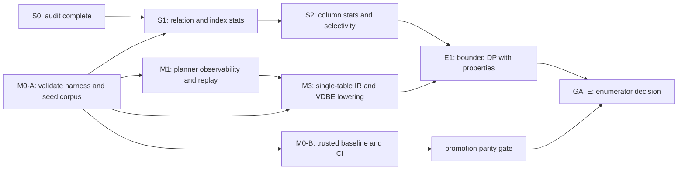

# Tarantool SQL Analytics Engine — Roadmap

## Purpose

This document is the single source of truth for the analytics-focused SQL
engine work on `tsafin/nextgen_sql` and its descendants. Status below was
reconciled with the local tree on 2026-09-25; uncommitted files are evidence
of work in progress, not completed deliverables.

Scope is deliberately narrow:

- proper SQL statistics, persisted in new system spaces;
- a new planner / lowering path that consumes those statistics and produces
  better plans for analytic workloads;
- a parity corpus that proves the new path never regresses results,
  diagnostics, or supported-class coverage of the current SQL engine.

Out of scope here (tracked elsewhere or rejected):

- push-based execution engine (rejected — VDBE remains the only executor);
- arm64 CnP stencil work (different machine);
- broad SQL feature additions (RIGHT JOIN, LATERAL, windows, UPSERT,
  RETURNING — none are parity requirements).

This file is structured so that it can be lifted directly into a GitHub epic
with linked sub-issues. Top-level milestones (M0, M1, S0, S1, S2, M3, E1, GATE)
each map to a sub-issue; their checklist items map to individual tasks.

## Related documents

- [`current_sql_feature_matrix.md`](current_sql_feature_matrix.md) —
  authoritative parity baseline (frozen subset).
- [`statistics_implementation_plan.md`](statistics_implementation_plan.md) —
  statistics infrastructure design.
- [`planner_vm_migration.md`](planner_vm_migration.md) — staged migration
  of `where.c` to planner-IR + VDBE lowering.
- [`next_gen_sql_planner.md`](next_gen_sql_planner.md) — architecture survey
  (PostgreSQL / DPhyp / ORCA comparisons; memtx and Vinyl applicability).

## Status legend

Each work item carries a richer state than NOT-STARTED / DONE so the
roadmap accurately reflects how far an item has progressed past spec.

| State | Meaning |
|-------|---------|
| `NOT-STARTED` | No work, no spec beyond a paragraph in this file. |
| `SPEC-DRAFTED` | A focused spec exists; implementation has not started. |
| `PROTOTYPE` | Working code or tooling exists, but acceptance/CI gates are incomplete. |
| `FEATURE-GATED` | Default off in production builds; CI runs it on the parity corpus. |
| `PRODUCTION` | Default on; old path removed or scheduled for removal. |
| `COMPLETE` | A finite audit or decision deliverable is finished and recorded. |

The implementation maturity path is:
`NOT-STARTED → SPEC-DRAFTED → PROTOTYPE → FEATURE-GATED → PRODUCTION`.
Audits and decisions can instead end at `COMPLETE`.

## Execution model

Single human operator. Multiple LLM sessions allowed in parallel via git
worktrees. Implications:

- The human is the bottleneck for architectural decisions, reviews, and merges.
- LLM sessions are good at: implementing scoped sub-tasks, writing tests,
  mechanical refactors, drafting documentation.
- A sub-task marked `parallel: yes` is a candidate for an isolated worktree
  with its own LLM session. It must touch files that no concurrent task
  modifies, or its merge will fight.
- Sub-tasks marked `parallel: no` need human attention or touch a shared
  contract (descriptor, system-space schema) and should run serially.

## Dependency and integration plan

The dates in the earlier Gantt were prototype estimates and are now stale.
Use this dependency graph for scheduling. Arrows mean an accepted interface
or gate. The M0 contract and a small trusted corpus unblock development;
full-corpus coverage is required before production promotion.

```mermaid
flowchart LR
    A["M0-A: validate harness and seed corpus"] --> B["M0-B: trusted baseline and CI"]
    A --> C["M1: planner observability and replay"]
    D["S0: audit complete"] --> E["S1: relation and index stats"]
    A --> E
    E --> F["S2: column stats and selectivity"]
    C --> G["M3: single-table IR and VDBE lowering"]
    A --> G
    B --> H["promotion parity gate"]
    F --> I["E1: bounded DP with properties"]
    G --> I
    I --> J["GATE: enumerator decision"]
    H --> J
```

S1 and M1 can progress concurrently after the M0-A contract is stable.
M3 may use the current estimates or a fixed test provider while S1/S2 are
built. M3's first parity gate therefore does not depend on completed column
statistics. E1 and the final decision require the real statistics path.

## Parallel work and integration ownership

Parallelism means separate branches or worktrees with one owner per shared
interface. Each track must define a narrow contract before others consume it;
integration runs serially. No simultaneous test-run.py or performance runs
against shared build directories, ports, or databases.

| Track | Can start after | Independent work | Serial integration point |
|-------|-----------------|------------------|--------------------------|
| M0 harness validity | now | isolated test execution, capture manifest, failure propagation | SCHEMA.md semantics and harness API |
| M0 corpus/CI | M0 harness contract | representative fixtures, coverage report, workflow wiring | CI gate and accepted snapshots |
| M1 observability | M0-A contract | counters, replay serializer, EXPLAIN surface | one owner for `sql.c`, grammar and path-class API |
| S1 statistics | S0 + M0-A contract | storage schema design, sampling adapters, immutable snapshot API | system-space IDs, `sql.c`, `where.c` adapter |
| S2 algorithms | S1 snapshot contract | HLL, MCV, histogram and synthetic data | persistence schema and selectivity adapter |
| M3 planner | M1 path-class and replay contract | logical IR, physical IR, lowering tests using fixed stats | resolver/`where.c` routing and feature flag |
| E1 evaluation | S2 + M3 integrated | benchmark workload design and measurement tooling | `wherePathSolver` and decision report |

Schema IDs and persistent formats need explicit review before implementation.
Keep the owner of `where.c` integration singular at each merge point. Merge
small, testable slices; do not hold a long-lived branch until an entire
milestone finishes. Each track's changes must state the exact interface
version and acceptance evidence in its review.

---

## M0 — Parity Corpus & Baseline Harness

**Goal:** establish a queryable parity baseline so every later phase can be
gated on "no result regression, no diagnostic regression, and reviewed
planner-path changes."

**State:** `COMPLETE` for the M0-A/M0-B parity gate in this branch. Manifest
v1 capture is fail-closed. Policy v2 reviews all 385 tests / 770 engine
pairs: 588 included, 182 excluded with evidence, none pending. The accepted
anchor is `04b63d19ab7deaa233ec2549d467b79d0cf4f5f2`; the CI jobs use
that named full-corpus policy. A clean native build passed the full local
generated/CnP/LLVM matrix (298 memtx tests / 49,535 queries and 290 Vinyl
tests / 39,535 queries per mode), with zero hard or soft parity drift,
identical manifests, and exact generated repeat captures. The post-provenance
capture also matched exactly. The first hosted full-corpus CI result remains
to be observed after publication; local workflow provisioning, including a
detached baseline worktree and pinned test runner, passed. The older
untracked 132,413-snapshot memtx-only tree is not the baseline. The
classifier covers all 385 file identities, but its tags are file-level, not
verified per-query feature coverage.

**Scope (B-light):** capture L1 result rows, L2 diagnostic, L3 path_class
per (test × engine), plus an external run manifest proving coverage and
outcome. Dispatcher dimension is a runtime parity check, not a stored
dimension. L7 latency goes to a separate perf-trail CSV. L4/L5 (plan shape)
are deferred to M3 when the descriptor exists naturally.

**Exit criteria:**

- every in-scope SQL test inventoried, with file-level feature tags and
  explicit query-level coverage only where verified;
- a reviewed inclusion/exclusion manifest identifies every test in the three
  SQL suites and records each suite/engine run outcome;
- accepted snapshots cover every runnable in-corpus test for its supported
  engine(s), with stable query identity and a passing recapture comparison;
- test failures, partial capture, missing snapshots, and unavailable
  dispatchers fail closed rather than producing a success-shaped diff;
- CI runs the real snapshot and dispatcher parity jobs on the defined corpus.

**Subtasks:**

- [x] **M0.1** Test auto-classifier — `test/sql-baselines/classify.lua`.
  Scans `*.test.lua` across sql / sql-tap / sql-luatest, regex-detects
  feature markers per `docs/vdbe/current_sql_feature_matrix.md`, writes
  `test/sql-baselines/classification.yaml` (385 entries on nextgen_sql
  HEAD). Landed at nextgen_sql `f8ae5a0ddd`, expanded at `02fdfbe2d3`
  (canonical_yaml.lua scalar coverage).
- [x] **M0.2** Snapshot harness — `test/sql-baselines/harness/run.lua`
  monkey-patches `box.execute`, dofiles the test file, writes one snapshot
  per captured query at `test/sql-baselines/snapshots/<suite>/<test>/q%02d.<engine>.yaml`
  per SCHEMA.md v1. Landed at nextgen_sql `4f8dc74e0b`. Verified end-to-end
  on a 7-statement mini SQL test.
- [x] **M0.3** Forensic L6 capture — when `--forensic` is enabled, the harness
  runs `EXPLAIN` and records a static VDBE program listing under
  `test/sql-baselines/forensics/`. This captures opcodes and operands without
  claiming the dynamic dispatch path; statements unsupported by `EXPLAIN` get
  an explicit comment-only capture. L6 remains advisory, not a parity gate.
- [x] **M0.4** Diff tool — `test/sql-baselines/diff.lua`. Compares two
  snapshot trees, classifies drift as RESULT-REGRESSION / DIAGNOSTIC-CHANGE
  / PATH-CLASS-SHIFT (currently a hard gate) or SOFT-DRIFT (advisory). Emits text /
  yaml / json; exit 1 on any hard-gate. Landed at nextgen_sql `a3c6dbf191`.
  Verified: identical inputs → 0 hard, 0 soft, all-MATCH exit 0; mutated
  row → RESULT-REGRESSION exit 1. L3 remains a strict gate for baseline
  comparison; M3 planner changes require an explicit reviewed exception.
- [x] **M0.5** CI: snapshot diff job — `.github/workflows/parity-corpus.yml`
  builds PR head and the named full-policy anchor, runs isolated captures on
  both engines, checks manifest coverage, then diffs via `diff.lua`. The
  baseline is a detached worktree from verified PR history, including fork
  PRs. Local workflow provisioning passed; hosted execution awaits publication.
- [x] **M0.6** CI: dispatcher parity job —
  `.github/workflows/dispatcher-parity.yml`. Matrix
  `{memtx, vinyl} × {generated, cnp, llvm}`. Compares CnP and LLVM outputs
  against generated; fails with `JIT-CORRECTNESS-REGRESSION:<dispatcher>` on
  any L1 or L2 divergence. It reads the accepted full policy; the complete
  six-way local matrix passed before promotion.
- [x] **M0.7** Perf-trail emitter — `test/sql-baselines/perf/emit.lua`
  records timing via `fiber.clock64()`, writes one CSV per CI run at
  `test/sql-baselines/perf/<YYYY-MM-DD>-<sha>.csv`. Accompanying
  `perf/aggregate.lua` reads a directory of those CSVs and emits a markdown
  trend table. `sample.csv` aligned with SCHEMA.md §L7 exemplar. Landed at
  nextgen_sql `b33719055e` + `1a9c7933b6` (gitignore).
- [x] **M0.8a / M0-A** Validate capture semantics on a small, representative
  seed corpus: use the normal test runner or reproduce its setup faithfully,
  preserve test failure and exit status, exercise generated/CnP/LLVM
  selection, and reject incomplete captures. Record a manifest with expected
  test/query counts and exclusion reasons. Do not accept the current
  untracked snapshot tree as ground truth. The harness contract and manifest
  format are serial integration points; fixtures and diagnostic probes may
  be built independently. Manifest v1, validator, runner-equivalent shared-
  engine seeds, typed/error result classes, SQL/SQL-TAP/luatest adapters,
  and six-way dispatcher capture are committed and verified.
- [x] **M0.8b** Reconcile SCHEMA.md and the tools: file-level versus
  query-level tags, query identity, result order, diagnostic codes,
  metadata that should not affect parity, and schema versioning. Verify
  round-trip and repeat-capture stability on the seed corpus. The v1
  contract is accepted; future semantic changes require versioning.
- [x] **M0.8c / M0-B** Capture the declared corpus under memtx and Vinyl
  where supported, report coverage and failures, and review snapshot size
  and storage strategy before committing any bulk baseline. Baseline against
  a named integration commit rather than the moving local `master` branch.
  The 770 engine decisions, full local six-mode matrix, exact repeat, and
  measured snapshot storage support the named integration anchor.
- [x] **M0.8d** Expand the real isolated seed CI invocations to the accepted
  corpus. Compare each PR head against the selected baseline with explicit
  coverage equality; run dispatcher parity on both engines where supported.
  Keep CI failing on a missing or empty corpus. Both jobs now read the full
  policy; their first hosted full-corpus run is pending branch publication.

---

## S0 — Statistics Audit

**Goal:** decide reuse/delete per file for the historical `_sql_stat1` /
`_sql_stat4` scaffolding before designing the new system spaces.

**State:** `COMPLETE` — audit landed as `docs/vdbe/s0_audit_report.md`
on `tsafin/llvm_jit` at commit `de57e09edd` (2026-06-21). Report finds the
historical `_sql_stat1` / `_sql_stat4` scaffolding is almost entirely
vestigial text: no `analyze.c`, no ANALYZE grammar in `parse.y`, and
`OP_LoadAnalysis` is a triply-registered no-op. 3 DELETE / 2
KEEP-AS-REFERENCE / 1 EXTRACT-HELPER / 11 REWRITE dispositions recorded.
S1 can start against this baseline.

**Exit criteria:**

- written inventory of disabled tests, no-op opcodes, dead helper functions;
- explicit decision per item (delete / keep-as-reference / extract-helper).

**Subtasks:**

- [x] **S0.1** Inventory disabled analyze tests in `test/sql-tap/suite.ini`
  and the dead bodies of `OP_LoadAnalysis` and friends.
- [x] **S0.2** Inventory `_sql_stat1` / `_sql_stat4` references in
  `src/box/sql/*` and decide per-file reuse/delete.
- [x] **S0.3** Write `docs/vdbe/s0_audit_report.md` summarizing findings,
  with explicit per-item disposition.

---

## M1 — Planner Observability & Replay

**Goal:** make the *current* planner's decisions inspectable, replayable, and
counter-gated before changing the planner.

**State:** `IN-PROGRESS`. M0-A/M0-B are accepted locally. M1.1 has the
preparatory statement-compilation counter (`sql_statement_compiles_total`)
plus WHERE-planner candidate and elapsed aggregates. Reason-coded fallback
accounting and full M1.1 validation remain open.
M1.3's structured summary surface is implemented with the current planner's
`current_where_c` classification; fallback propagation and replay remain
open. Hosted CI publication is pending but does not block local M1 work.
Freeze the planner event/path-class and replay envelope before M3 consumes
them.

**Exit criteria:**

- a captured planning decision can be replayed without live storage;
- `box.stat.sql()` exposes planner counters (candidates considered, fallback
  reasons, planning elapsed time);
- `EXPLAIN (planner = 'summary')` returns structured rows.

**Subtasks:**

- [ ] **M1.1** Add planner counters to `box.stat.sql()` —
  `sql_planner_candidates_total`, reasoned
  `sql_planner_fallback_total`, and `sql_planner_elapsed_us`. Preparatory
  `sql_statement_compiles_total` is implemented, but does not satisfy this
  subtask. *parallel: yes* (only sql.c stat hookup).
- [x] **M1.2** Wire path_class emission in current `where.c` — statements
  invoking the WHERE planner store `current_where_c` on the per-statement
  VDBE; summary EXPLAIN reads that value, and statements that do not invoke
  the planner report NULL. Wiring it into M0 snapshots remains follow-up
  integration. *parallel: no* (touches the same `where.c` files M3 will
  modify; coordinate).
- [x] **M1.3** `EXPLAIN (planner = 'summary')` grammar + executor returning
  structured rows per the planner_vm_migration.md schema. *parallel: yes*.
- [ ] **M1.4** `EXPLAIN (planner = 'snapshot')` returns a versioned MsgPack
  replay object. The v1 capture-envelope foundation and statement
  `path_class` are implemented, but it explicitly reports `replayable=false`
  until normalized planner inputs are captured; this subtask remains open.
  Replay execution stays in M1.5. *parallel: yes*.
- [ ] **M1.5** Snapshot replay tool (developer-only API). Re-runs planning
  from a snapshot, diffs fingerprint and fallback reason. *parallel: yes*.

---

## S1 — Relation / Index / Cardinality Stats

**Goal:** the current `where.c` stops using `default_tuple_est[]` for ordinary
tables, and instead consumes real per-relation cardinality and average row
width.

**State:** `PROTOTYPE`. S1.4 now has an immutable, deep-copying,
reference-counted in-memory snapshot API with schema-staleness checks and a
bounded allocation budget. It is not yet created per prepare or consumed by
`where.c`; persistence, sampling, ANALYZE, and adapter work remain open. The
system-space schema remains DRAFT pending human review of IDs and formats.

**Exit criteria:**

- `ANALYZE [table]` accepted by the parser, runs a collection job, persists
  results;
- `index_field_tuple_est()` reads from the new snapshot, not from defaults;
- selectivity/cardinality error on the agreed corpus improves;
- no regression under stale or missing stats (fallback to defaults).

**Subtasks:**

- [ ] **S1.1** Define new system spaces (`_sql_stats_relation`,
  `_sql_stats_index`) with versioned MsgPack payload format. Write a
  short `docs/vdbe/sql_stats_schema.md`. *parallel: no* (system-space
  allocation is a one-way door — needs human sign-off).
- [ ] **S1.2** Re-enable `ANALYZE` grammar; remove the
  `unsupported ANALYZE` rejection path. *parallel: yes*.
- [ ] **S1.3** Collection job — sample tuples, build summaries, persist
  transactionally. Engine-agnostic core. *parallel: yes*.
- [x] **S1.4 prototype** `SqlStatsSnapshot` API — immutable deep copy,
  reference-counted ownership, catalog/schema versions, relation/index
  cardinalities, confidence and freshness metadata, stale/missing lookup
  states, and a caller-specified memory budget. Unit tests cover deep copy,
  lifetime, schema mismatch, invalid values, and budget rejection. This is
  not yet attached to prepare/prepared-statement lifetime; that integration
  remains part of S1.7. *parallel: yes*.
- [ ] **S1.5** memtx sampling interface
  (`engine_sql_stats_sample`). *parallel: yes*.
- [ ] **S1.6** Vinyl sampling interface — avoiding pathological full-LSM
  reads, respect bloom/range structure. *parallel: yes*.
- [ ] **S1.7** Compatibility adapter — `index_field_tuple_est()` and
  `whereRangeScanEst()` consume snapshot, fall back to defaults on absence.
  *parallel: no* (touches `where.c` integration surface).
- [ ] **S1.8** Re-enable disabled `analyze*.test.lua` tests, validate they
  pass. *parallel: yes*.
- [ ] **S1.9** Add synthetic uniform / skewed validation cases to the M0
  corpus, gate q-error improvement. *parallel: yes*.

---

## S2 — Column Stats + Sketches

**Goal:** per-column NDV, null fraction, MCV, equi-depth histograms — the
statistics that turn selectivity estimation from "guess 25%" into
"estimate based on data."

**State:** `PROTOTYPE` (S2.2 HLL, S2.3 bounded MCV, and S2.4 histogram
builder are implemented as in-memory APIs with focused unit tests; remaining
S2 work is not integrated). Sketch algorithms and synthetic validation may
start against a versioned S1 snapshot interface before S1 is end-to-end;
persistence and the `where.c` selectivity adapter wait for that interface.

**Exit criteria:**

- `_sql_stats_column` populated for analyzed tables;
- selectivity estimation uses MCV / histogram precedence (exact → multivariate
  MCV → FD → histogram → independence fallback);
- analytic workloads in the corpus show measurable plan-quality improvement.

**Subtasks:**

- [ ] **S2.1** `_sql_stats_column` system space + versioned payload. *parallel:
  no* (system-space allocation).
- [x] **S2.2** HyperLogLog implementation for NDV. Mergeable. *parallel: yes*.
  In-memory opaque C API at `src/box/sql/sql_stats_hll.{h,c}`; precision
  4–18, deterministic caller-seeded byte hashing, seed/precision-checked
  merges, and documented probabilistic accuracy. Unit tests cover 100k NDV
  error, deterministic estimates, and merge compatibility. No persistence or
  system-space IDs are included; payload integration remains pending S1/schema
  review.
- [x] **S2.3** SpaceSaving heavy-hitter sketch for MCV. *parallel: yes*.
  In-memory opaque API at `src/box/sql/sql_stats_spacesaving.{h,c}` with
  fixed capacity, deterministic lexical tie handling, conservative merge
  intervals, and single-stream `N / capacity` error bound. Unit tests cover
  heavy-hitter bounds, deterministic ties, and merge. Contract is documented
  in `statistics_implementation_plan.md`; no persistence or system-space IDs.
- [x] **S2.4** Equi-depth histogram builder from sampled ordered values.
  *parallel: yes*. In-memory API at
  `src/box/sql/sql_stats_histogram.{h,c}` validates sorted caller-encoded
  values using a caller-supplied SQL-order comparator, deep-copies bounded
  quantile boundaries, and preserves equal-value groups (therefore may return
  fewer than the requested bucket count for duplicate-heavy samples). The
  opaque result reports cumulative sample counts; no SQL value encoding,
  persistence format, or system-space ID is defined. Focused unit tests cover
  quantiles, duplicate handling, deep copy, invalid ordering, and byte budget.
- [ ] **S2.5** Selectivity estimator — implements the precedence order from
  `next_gen_sql_planner.md`. Plug into `where.c` selectivity functions.
  *parallel: no* (touches `where.c`).
- [ ] **S2.6** Validation corpus extension — uniform / skewed / correlated /
  anti-correlated synthetic data, with stale-stat variants. *parallel: yes*.
- [ ] **S2.7** Confidence/staleness metadata recording. *parallel: yes*.

---

## M3 — Single-Table Physical IR + VDBE Lowering

**Goal:** prove that a planner-IR + lowering layer can produce VDBE bytecode
equivalent (in result and diagnostic) to current `where.c` for a controlled
single-table query class.

**State:** `NOT-STARTED`. Depends on the M1 path-class/replay contract and
M0-A seed parity gate, not on S2. Use fixed or current estimates while the
statistics track is under construction; integrate the real snapshot later.

**Scope (exact):**

- one base relation;
- point / range / full scan;
- deterministic scalar filters and projections;
- `ORDER BY`, `LIMIT`, `OFFSET`;
- result delivery.

**Explicit exclusions:** all subqueries (scalar, EXISTS, IN), CTEs and
recursive CTEs, compound SELECT, aggregates / GROUP BY / DISTINCT, joins,
DML, triggers, subprograms, non-deterministic functions.

**Exit criteria:**

- supported queries produce identical L1+L2 to current `where.c` across the
  corpus;
- unsupported queries fall back to `where.c` with stable reason code visible
  in the M0 snapshot;
- preparation/execution latency does not regress p95 by more than 5%.

**Subtasks:**

- [ ] **M3.1** Physical-plan descriptor v1 — narrow form, single-table only.
  Written in `docs/vdbe/physical_plan_descriptor.md`. *parallel: no*
  (foundational contract).
- [ ] **M3.2** Logical IR layer — resolved-tree → logical plan for the
  supported scope. *parallel: yes*.
- [ ] **M3.3** Physical IR layer — logical → physical (access path
  selection for single relation). *parallel: yes*.
- [ ] **M3.4** VDBE lowering — `lower_scan`, `lower_filter`, `lower_project`,
  `lower_sort`, `lower_limit`. *parallel: yes*.
- [ ] **M3.5** Fallback gate — every unsupported shape emits stable
  `fallback_reason` and routes to current `where.c`. *parallel: no*.
- [ ] **M3.6** Wire path_class through to M0 snapshot (`new_planner` vs
  `fallback_<reason>`). *parallel: yes*.
- [ ] **M3.7** Feature flag `sql_new_planner_single_table=on/off`.
  *parallel: yes*.

---

## E1 — Improved Bounded DP Baseline

**Goal:** before any DPhyp / LinDP++ bake-off, prove or disprove the
hypothesis that most plan-quality gain comes from statistics + properties,
not from a new enumerator. This is the cheap experiment that may save
quarters of bake-off work.

**State:** `NOT-STARTED`. Depends on integrated M3 + S2 and an accepted
M0-B corpus for the evaluation workloads.

**Exit criteria:**

- the current bounded DP solver runs with configurable budgets, property-
  aware dominance, and deterministic tie-breaking;
- harness counters (candidates generated / dominated / truncated / retained)
  emitted to M0 corpus;
- A/B comparison against fixed-1/5/10 widths on the corpus.

**Subtasks:**

- [ ] **E1.1** Configurable budget knobs replacing fixed `1/5/10` widths.
  *parallel: no* (touches `wherePathSolver`).
- [ ] **E1.2** Candidate partitioning by relation subset and properties.
  *parallel: no* (same file).
- [ ] **E1.3** Property-aware dominance before beam truncation. *parallel:
  no*.
- [ ] **E1.4** Counters / harness output integrated into M1 EXPLAIN snapshot.
  *parallel: yes*.
- [ ] **E1.5** A/B comparison on the corpus. *parallel: yes*.

---

## GATE — Enumerator Bake-off Decision

**State:** `NOT-STARTED`. Depends on E1.

**Decision input:**

- E1 plan-quality measurements vs fixed-width solver;
- S2 statistics-improvement measurements;
- analytic workload corpus results.

**Possible outcomes:**

1. **Stop.** E1 + S2 closed the analytics gap. Retain bounded DP, declare
   the analytics initiative successful for the current scope.
2. **Continue with DPhyp prototype only.** E1 + S2 helped but a plan-quality
   gap remains on dense / star / snowflake join graphs.
3. **Continue with full bake-off** (DPhyp / LinDP++ / deterministic
   greedy/beam). E1 + S2 helped but the residual gap is unclear in shape.

This gate is intentionally a stopping point. The honest expectation given
Tarantool's current join graph shapes (mostly OLTP-style, low relation
count) is **outcome 1**. The work beyond this point should not be planned
until the gate evaluation runs.

---

## Cross-cutting concerns

### CnP and LLVM MCJIT

Both JIT backends remain in their current state, consuming the VDBE bytecode
that the new planner lowers. **No planner work in this roadmap touches the
JIT path.** Cross-platform expansion of CnP to arm64 happens on a different
machine and is not tracked here.

The dispatcher-parity CI job (M0.6) is the only roadmap item that interacts
with the JITs, and it does so as a black-box correctness check — not as a
modification of either JIT.

### `where.c` retirement

This roadmap does **not** schedule `where.c` removal. Retirement is gated on
all supported query classes showing zero fallback for two consecutive release
cycles, plus a separate written decision. Until that decision, both planners
coexist via the M3.5 fallback path.

### System-space allocation

`_sql_stats_relation`, `_sql_stats_index`, `_sql_stats_column` are
permanent on-disk schema changes. Each requires human review and explicit
allocation of system-space IDs before the corresponding subtask
(`S1.1`, `S2.1`) starts implementation. These are the only one-way doors
in the roadmap.

---

## GitHub epic structure

When converted, this roadmap should produce:

- one top-level epic issue: *"Tarantool SQL Analytics Engine — Statistics +
  Planner Migration"*;
- eight sub-issues, one per milestone (M0, S0, M1, S1, S2, M3, E1, GATE);
- one task issue per subtask checkbox in this file;
- a status label on each sub-issue matching the status legend above.

The mermaid gantt above can be embedded directly in the epic body. Update
the `dateFormat` start dates as work begins; the `after` dependencies will
re-flow automatically.
