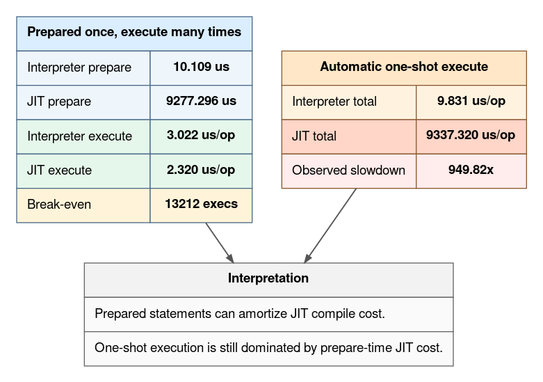

# SQL LLVM MCJIT benchmark

This note describes the current **LLVM MCJIT vs interpreter** benchmark
methodology, what is being measured, and why **prepare cost** is the deciding
factor for one-shot SQL.

The benchmark harness used for these measurements lives at:

- `tools/jit_bench/sql_llvm_mcjit_benchmark.lua`

## What is being benchmarked

The current benchmark matrix uses three SQL workload shapes and measures them in
three execution modes.

| Workload | SQL shape | Purpose |
| --- | --- | --- |
| `tiny_const` | `SELECT 1 + 2;` | Small constant expression, almost pure overhead |
| `hot_expr` | `SELECT 1 + 2 + 3 + 4 + 5;` | Small arithmetic expression that is LLVM MCJIT-friendly when reused |
| `point_lookup` | indexed `SELECT ... FROM bench_arith WHERE id = ?` | Lookup with realistic table access plus arithmetic work |

| Case | What it measures | Why it matters |
| --- | --- | --- |
| `prepare_only` | repeated `box.prepare()` / `box.unprepare()` | Isolates prepare-time LLVM MCJIT compile cost |
| `prepared_execute` | prepare once, execute many times by `stmt_id` | Best-case reuse path for LLVM MCJIT |
| `automatic_execute` | repeated `box.execute(sql, args)` | One-shot path: prepare + optional LLVM MCJIT compile + execute every call |

## How it is benchmarked

The current numbers were taken from a narrowed **RelWithDebInfo** matrix with:

- build: `build-jit-relwithdebinfo`
- dispatcher: `VDBE_DISPATCHER=generated`
- interpreter baseline: `SQL_JIT_ENABLE=0`
- LLVM MCJIT run: `SQL_JIT_ENABLE=1`
- `BENCH_RUNS=3`

The benchmark harness records wall-clock time and `box.stat.sql()` deltas for
each run:

- `sql_jit_compile_count`
- `sql_jit_compile_success_count`
- `sql_jit_exec_count`
- `sql_jit_fallback_count`
- `sql_jit_resume_skip_count`
- `sql_interpreter_step_count`
- `sql_jit_step_count`

### Iteration counts

The narrowed matrix intentionally keeps `automatic_execute` small for the
pathological LLVM MCJIT cases so the run completes in bounded time.

| Workload | `prepare_only` | `prepared_execute` | `automatic_execute` |
| --- | ---: | ---: | ---: |
| `tiny_const` | 500 | 200000 | 5000 |
| `hot_expr` | 500 | 200000 | 100 |
| `point_lookup` | 250 | 100000 | 100 |

## Execution model

### Prepared statement path


### Automatic one-shot path


The second path is exactly why prepare cost matters: if compilation happens for
every call, LLVM MCJIT must win back that cost from a **single execution**.

## Current measured results

### Prepared execute

These numbers measure the path where the statement is prepared once and reused.

| Workload | Interpreter | LLVM MCJIT | Result |
| --- | ---: | ---: | --- |
| `tiny_const` | `1.412 us/op` | `0.891 us/op` | **LLVM MCJIT 1.58x faster** |
| `hot_expr` | `1.344 us/op` | `1.076 us/op` | **LLVM MCJIT 1.25x faster** |
| `point_lookup` | `3.022 us/op` | `2.320 us/op` | **LLVM MCJIT 1.30x faster** |

This is the only place where the current LLVM MCJIT story is clearly favorable.

### Prepare only

These numbers isolate prepare-time cost.

| Workload | Interpreter | LLVM MCJIT | Slowdown |
| --- | ---: | ---: | ---: |
| `tiny_const` | `2.783 us/op` | `7378.718 us/op` | `2650.3x` |
| `hot_expr` | `3.877 us/op` | `8313.965 us/op` | `2144.2x` |
| `point_lookup` | `10.109 us/op` | `9277.296 us/op` | `917.7x` |

Prepare-time LLVM MCJIT cost is still in the **7.4-9.3 ms per statement**
range.

### Automatic execute

These numbers are sampled one-shot runs, not a reused prepared statement path.

| Workload | Interpreter | LLVM MCJIT | Result |
| --- | ---: | ---: | --- |
| `tiny_const` | `3.224 us/op` | `1.932 us/op` | sample faster, but **no native exec** |
| `hot_expr` | `4.402 us/op` | `4.969 us/op` | **LLVM MCJIT 1.13x slower** |
| `point_lookup` | `9.831 us/op` | `9337.320 us/op` | **LLVM MCJIT 949.82x slower** |

Important counter evidence behind those rows:

- `tiny_const` automatic sample:
  - `jit_compile_count = 5000`
  - `jit_compile_success_count = 0`
  - `jit_exec_count = 0`
- `hot_expr` automatic sample:
  - `jit_compile_count = 0`
  - `jit_exec_count = 0`
- `point_lookup` automatic sample:
  - `jit_compile_success_count = 100`
  - `jit_exec_count = 100`
  - `jit_resume_skip_count = 100`

So the worst automatic case is not hypothetical. It is a real measured
**prepare-and-compile per query** cliff.

## Why prepare matters

Total runtime is not just execution speed. It is:

```text
total_cost = prepare_cost + execution_count * execute_cost
```

LLVM MCJIT wins on `execute_cost`, but loses heavily on `prepare_cost`.
That means it only becomes profitable after enough reuses of the same prepared
statement.

### Break-even point

The table below answers: **how many executions are needed to amortize LLVM MCJIT
prepare cost?**

| Workload | Extra LLVM MCJIT prepare cost | Per-exec LLVM MCJIT gain | Break-even |
| --- | ---: | ---: | ---: |
| `tiny_const` | `7375.935 us` | `0.521 us` | `14162` executions |
| `hot_expr` | `8310.088 us` | `0.269 us` | `30922` executions |
| `point_lookup` | `9267.187 us` | `0.701 us` | `13212` executions |

This is the key benchmark result.

For one-shot SQL, or for short-lived statements executed only a handful of
times, the current LLVM MCJIT compile cost dominates the total wall time. For
heavily reused prepared statements, LLVM MCJIT can still produce a real
execution win.

## Cost picture for `point_lookup`

`point_lookup` is the clearest example because it has both a real prepared-path
win and a catastrophic one-shot path.



Interpretation:

- if the statement is **reused thousands of times**, the LLVM MCJIT path can win;
- if the statement is **prepared and executed once**, the LLVM MCJIT path is currently
  far worse.

## Practical reading of the numbers

1. **Prepared statement benchmarking is the meaningful LLVM MCJIT benchmark
   today.** That is where LLVM MCJIT has a measurable upside.
2. **One-shot `box.execute()` is still prepare-dominated.**
   This is why SQL TAP cases with many distinct statements are poor LLVM MCJIT
   candidates unless they are gated or opted out.
3. **Benchmark reports should always separate prepare from execute.**
   Reporting only execution throughput hides the dominant cost in one-shot
   workloads.

## Current conclusion

The benchmark data supports a narrow claim:

- **LLVM MCJIT is modestly faster for reused prepared statements.**

It does **not** yet support a broad claim that LLVM MCJIT speeds up general SQL
execution, because prepare-time compile cost still dominates one-shot execution,
especially for `point_lookup`-style statements.
